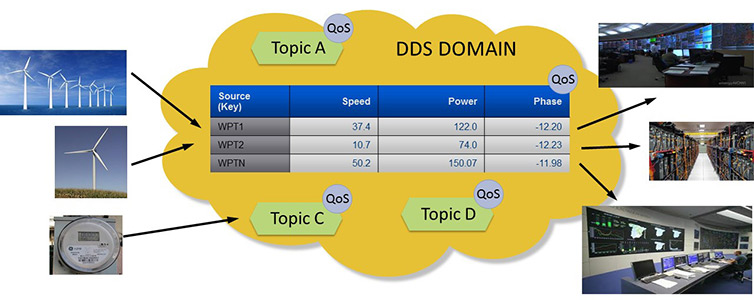
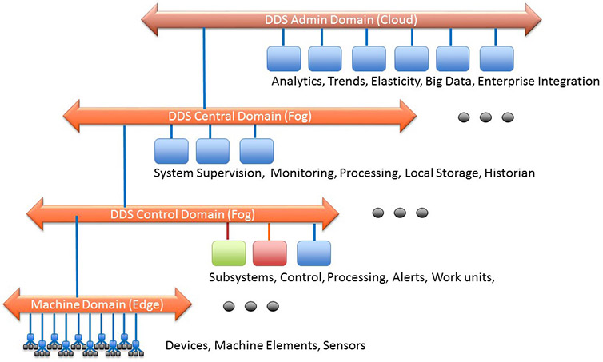
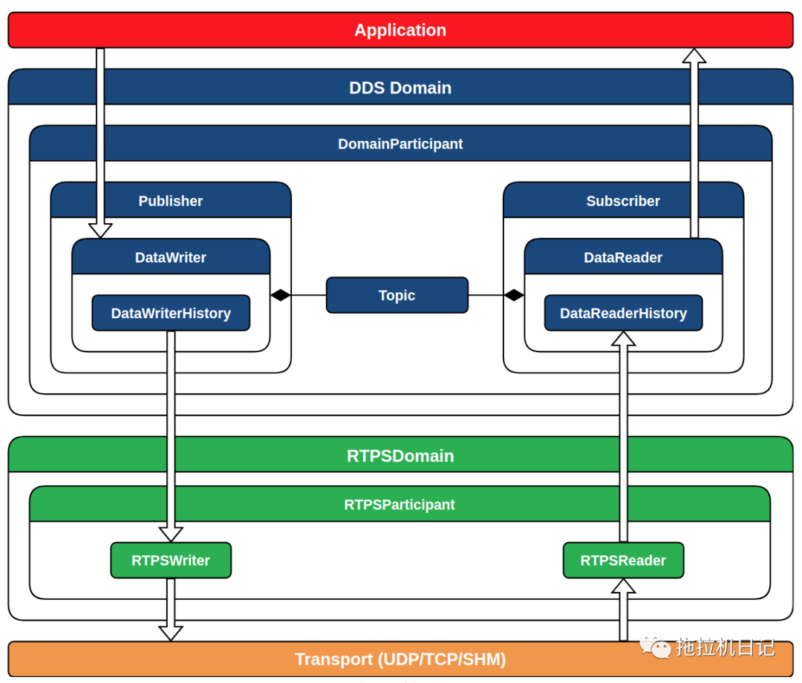
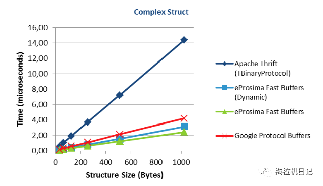
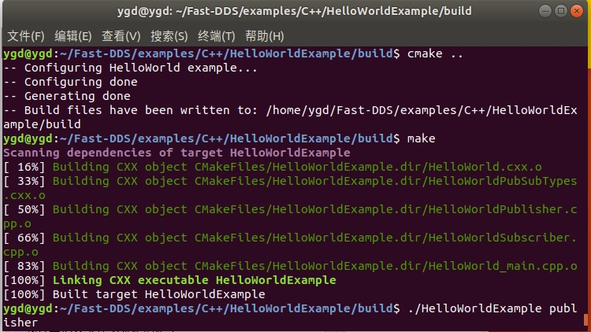
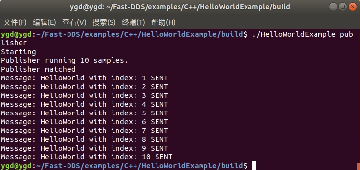

# DDS学习

## 一、DDS概念

### 1.What is DDS?

OMG 数据分发服务 (DDS™) 是来自[Object Management Group® (OMG®) 的](https://www.omg.org/)用于以数据为中心的连接的中间件协议和 API 标准。它将系统的组件集成在一起，提供低延迟的数据连接、极高的可靠性以及业务和关键任务物联网 (IoT) 应用程序所需的可扩展架构。

在分布式系统中，中间件是位于操作系统和应用程序之间的软件层。它使系统的各个组件能够更轻松地通信和共享数据。它通过让软件开发人员专注于其应用程序的特定目的而不是在应用程序和系统之间传递信息的机制来简化分布式系统的开发。

DDS标准中的核心规范包括：

DDS v1.4 - 描述了用于分布式应用程序通信和集成的以数据为中心的发布-订阅(DCPS)模型；

DDSI-RTPS v2.3 - 定义了实时发布-订阅交互通信协议(RTPS)；

IDL v4.2 - 定义了IDL，一种用于以独立于编程语言的方式定义数据类型和接口的语言。这不属于DDS标准，但DDS依赖于它。


DDS 中间件是一个软件层，它将应用程序从操作系统、网络传输和低级数据格式的细节中抽象出来。相同的概念和 API 以不同的编程语言提供，允许应用程序跨操作系统、语言和处理器架构交换信息。数据线格式、发现、连接、可靠性、协议、传输选择、QoS、安全性等低级细节由中间件管理。

#### 1）数据中心性


**Domain**：代表一个通信平面，由Domain ID唯一标识，只有在同一个域内的通信实体才可以通信；可以只划分1个Domain，也可以按照交互规则或其他规则，定义多个Domain；

**Topic**：是数据的抽象概念，由TopicName标识，关联相应数据的数据类型(DataType)，把所涉及的所有Topic集合在一起，这样就形成一个虚拟的全局数据空间“Global Data Space”，这里弱化了节点的概念；

**DataWriter**：数据写入者，类似缓存，把需要发布的Topic数据从应用层写入到DataWriter中；

**DataReader**：数据读取者，同样可以理解为一种缓存，从订阅者得到Topic数据，随之传给应用层；

**QoS**：服务质量(Quality of Service)，这是DDS的亮点，通过定义灵活的QoS规则，包括可靠性、系统健康(活跃度)甚至安全性，也可以共享数据。DDS在发送它所需要的信息方面很聪明。如果消息不能总是到达它们预期的目的地，那么中间件将在需要的地方实现可靠性。当系统发生变化时，中间件动态地计算出向何处发送哪些数据，并智能地通知参与者这些变化。如果总数据量很大，DDS会智能地过滤并只发送每个端点真正需要的数据。当更新需要快速时，DDS发送多播消息来一次更新许多远程应用程序。随着数据格式的发展，DDS跟踪系统各个部分使用的版本，并自动转换。对于安全性至关重要的应用程序，DDS控制访问、强制数据流路径并实时加密数据。

DDS 提供 QoS 控制的数据共享。应用程序通过发布和订阅由其主题名称标识的主题进行通信。订阅可以指定时间和内容过滤器，并仅获取在主题上发布的数据的子集。**不同的 DDS 域彼此完全独立。DDS 域之间没有数据共享。**

有许多通信中间件标准和产品。DDS 以独特的**数据为中心**，非常适合工业物联网。大多数中间件通过在应用程序和系统之间发送信息来工作。数据中心性确保所有消息都包含应用程序理解其接收数据所需的上下文信息。

以数据为中心的本质是 DDS 知道它存储了什么数据并控制如何共享这些数据。使用传统的以消息为中心的中间件的程序员必须编写发送消息的代码。使用以数据为中心的中间件的程序员编写代码，指定如何以及何时共享数据，然后直接共享数据值。DDS 不是在应用程序（您的）代码中管理所有这些复杂性，而是直接为您实现受控、托管、安全的数据共享。

#### 2）全局数据空间

从概念上讲，DDS 将本地数据存储区称为“全局数据空间”。对于应用程序来说，全局数据空间就像通过 API 访问的本地内存。您写入看起来像本地存储的内容。实际上，DDS 会发送消息来更新远程节点上的适当存储。您从看起来像本地商店的地方阅读。



在 DDS 域内，信息共享单元是主题内的数据对象。主题由其名称标识，数据对象由一些“键”属性标识。这类似于如何使用关键属性来标识数据库中的记录。这是数字是概念性的。DDS 进行点对点通信，不需要通过服务器或云来代理数据。

总之，本地存储给应用程序一种可以访问整个全局数据空间的错觉。这只是一种错觉；没有一个全球性的地方可以存放所有数据。每个应用程序只在本地存储它需要的东西，并且只存储它需要的时间。DDS 处理动态数据；全局数据空间是一个虚拟概念，实际上只是本地存储的集合。每个应用程序，几乎任何语言，在任何系统上运行，都以最佳的本机格式查看本地内存。全球数据空间跨任何传输方式在嵌入式、移动和云应用程序之间共享数据，无论语言或系统如何，并且具有极低的延迟。

服务质量

数据还可以通过灵活的服务质量 (QoS) 规范共享，包括可靠性、系统健康（活跃度）甚至安全性。在真实系统中，并非所有其他端点都需要本地商店中的每件商品。DDS 很聪明地发送它需要的东西。如果消息并不总是到达其预定目的地，则中间件会在需要的地方实现可靠性。当系统发生变化时，中间件会动态确定将哪些数据发送到哪里，并智能地将变化通知参与者。如果总数据量很大，DDS 会智能过滤并仅发送每个端点真正需要的数据。当需要快速更新时，DDS 会发送多播消息以一次更新许多远程应用程序。随着数据格式的发展，DDS 会跟踪系统各个部分使用的版本并自动进行翻译。对于安全关键型应用程序，DDS 控制访问、强制执行数据流路径并即时加密数据。

当您同时指定所有这些内容时，DDS 的真正力量就会显现出来，以极高的速度，并在一个非常动态、苛刻和不可预测的环境中。

#### 3）动态发现

DDS 提供发布者和订阅者的动态发现。动态发现使您的 DDS 应用程序可扩展。这意味着应用程序不必知道或配置用于通信的端点，因为它们会被 DDS 自动发现。这可以在运行时完成，而不必在设计或编译时完成，从而为 DDS 应用程序实现真正的“即插即用”。

这种动态发现比发现端点更进一步。DDS 将发现端点是在发布数据、订阅数据还是两者兼而有之。它将发现正在发布或订阅的数据类型。它还将发现发布者提供的通信特性和订阅者请求的通信特性。在 DDS 参与者的动态发现和匹配过程中，所有这些属性都被考虑在内。

DDS 参与者可以在同一台机器上或跨网络：应用程序使用相同的 DDS API 进行通信。由于无需了解或配置 IP 地址，也无需考虑机器架构的差异，因此在任何操作系统或硬件平台上添加额外的通信参与者都变得简单、几乎是微不足道的任务。

可扩展架构



DDS 系统可以跨越从边缘到雾再到云。在边缘，它们可用于高速实时机器对机器通信。在中间系统内，它们可以提供强大、可靠的 QoS 和内容感知信息流。集成这些系统 DDS 提供可扩展的信息访问和分发，一直到云中和云内。

OMG DDS 架构旨在从小型设备扩展到云以及非常大的系统。DDS 通过跨越数千或数百万参与者进行扩展，以超高速交付数据，管理数以千计的数据对象来实现物联网，并提供极高的可用性和安全性。DDS 通过在单个标准通信层中吸收大部分复杂性来简化分布式系统开发。

#### 4）安全性

保护关键任务工业物联网环境需要从边缘扩展到云、跨系统和供应商的安全性。

DDS 包括为信息分发提供身份验证、访问控制、机密性和完整性的安全机制。DDS Security 使用分散的对等架构，可在不牺牲实时性能的情况下提供安全性。 

有关 DDS 标准的更多信息，请访问[规格页面](https://www.dds-foundation.org/omg-dds-standard/)。

**注意：** *DDS DomainParticipant 表示应用程序在域中的本地成员资格。域是一个分布式概念，它将所有能够相互通信的应用程序联系起来。它代表一个通信平面：只有连接到同一域的发布者和订阅者可以交互。此外，它充当 DDS 发布者、订阅者、主题、多主题和 ContentFilteredTopics 的工厂。*

### 2.DDS优点

#### 1）DDS 主要优点

OMG DDS 中间件标准可帮助用户可靠、安全地利用不断增加的设备生成的数据量，同时实时处理数据，并在事件发生时尽快采取行动。因此，它可以实现更明智的决策、新服务、额外收入流和降低成本。OMG DDS 中间件标准还可以简化 IoT 应用程序的开发、部署和管理，加快上市时间。它提供：

- **易于集成：** DDS 使用的以数据为中心的方法允许定义通用和可扩展的数据模型，以实现无缝的信息技术 (IT) / 运营技术 (OT) 互操作性。其松散和匿名的数据共享抽象完全隐藏了应用程序的连接性和拓扑细节。
- **性能效率和可扩展性：** DDS 实施可以实现低至 30 微秒的点对点延迟。和每秒数百万条消息的吞吐量。它使用非常高效的有线协议、基于内容和时间的过滤。如果架构得当，基于 DDS 的系统可以实现接近线性的可扩展性。
- **高级安全性：** OMG DDS 安全规范为兼容的 DDS 实现定义了一个全面的安全模型和服务插件接口 (SPI) 架构。DDS 提供标准化的身份验证、加密、访问控制和日志记录功能，以在物联网系统中实现端到端的安全数据连接。
- **开放标准：** OMG DDS 中间件规范是一个成熟的、经过验证的标准，可供供应商和用户参与。它通过完全开放、面向未来的 API 实现端到端供应商互操作性并简化物联网系统开发和集成，无需供应商锁定 -n。
- **QoS-Enabled**：丰富的 QoS 策略集使 DDS 能够控制数据分发的各个方面，例如时效性、流量优先级、可靠性和资源使用情况。
- **可扩展发现：**对于大型动态系统，DDS 提供自动发现，提供即插即用功能以简化系统集成和编排。
- **适用性：** DDS 可以透明地解决点对点、设备到设备、设备到云和云到云的通信。实现可用于嵌入式、移动、Web、企业和云应用程序。


#### 2）DDS 技术优点

- 独立于编程语言、操作系统、传输和硬件
- 可配置的冗余实现极其可靠的运行
- 对可扩展数据交付的多播支持
- 用于无缝多供应商应用互操作性的标准线路协议
- 数据选择和过滤，确保有效利用网络和 CPU 资源
- 用于实际长期架构生命周期的可扩展数据类型演变
- 用于关键任务系统构建的经过验证的操作
- 一项面向未来的国际标准，可消除专有烟管

#### 3）DDS的主要特点

- 两层API：提供上层DDS和下层RTPS；



- 实时性：提供可配置的实时功能，保证在指定的时间限制内响应；

- 服务发现：内置基于对现有发布者和订阅者的动态发现，并且不需要联系或设置任何服务器就可以持续执行此任务，同时也支持配置其他发现机制；

- 支持同步和异步数据发布模式；

- 传输层：实现了可插拔的体系结构，当前版本支持五种传输：UDPv4, UDPv6, TCPv4, TCPv6和SHM(共享内存)；

- 安全性：提供可配置的安全通信，实现了可插拔的安全配置，包括：远程参与者的身份验证、实体的访问控制和数据加密；

- 流量控制：支持可配置的吞吐量控制，可限制在特定条件下发送的数据量；

- 即插即用连接：新的应用程序和服务能够自动发现，可以在任何时候加入或离开网络，而不需要重新配置；

- 可伸缩性和灵活性：DDS建立在全局数据空间的概念之上，中间件负责在发布者和订阅者之间传播信息，这使得分布式网络可以适应重新配置，并可扩展大量实体；

- 可移植性：DDS规范包括到IDL的特定平台映射，允许使用DDS的应用程序只需重新编译就可以在DDS实现之间切换；

- 可扩展性：允许使用新的服务扩展和增强协议，不会破坏向后兼容性和互操作性；

- 可配置性和模块化：提供了一种通过代码或XML配置文件进行配置的直观方式。模块化允许简单设备实现协议的子集，同时仍然参与网络

- 高性能序列化：基于eProsima的Fast Buffers序列化，官网说其性能要高于Protocol Buffers和Thrift：



- 低资源的消耗：允许预分配资源，减少动态资源分配，避免无限制使用资源，最小化数据复制的需要；

- 多平台：默认情况下，该项目可以在Linux、Windows和MacOS上运行；

- 免费和开源：Fast DDS库、Fast RTPS库、Fast DDS-Gen、内部依赖项(如Fast CDR)和外部依赖项(如foonathan库)都是免费和开源的。


### 3.DDS 工作方式

DDS 的主要目标是在正确的时间在正确的地点共享正确的数据，即使在时间分离的发布者和消费者之间也是如此。DDS 通过仔细复制逻辑共享数据空间的相关部分来实现全局数据空间。

#### 1）The Right Data

并非所有数据都需要无处不在。中间件应该只提供消费者真正需要的数据。基于兴趣的过滤可应用于内容和数据速率。通过正确实施，DDS 可以节省带宽和处理能力，并最大限度地降低整体应用程序的复杂性。

作为以数据为中心的解决方案，DDS 可以理解共享数据的模式。这允许它过滤内容、年龄和/或生命周期，以仅向应用程序提供他们需要的数据。例如，您只能发送超过 300 的锅炉温度（内容过滤器），每秒最多更新 10 次（速率）。在许多系统中，这种高效的方法通常可以节省 90% 的数据通信开销。

#### 2）The Right Place

数据必须在需要的地方可用，以促进自形成系统。DDS 分发和维护数据，使其随时可用。

DDS 动态发现发布者和订阅者、他们想要共享的数据类型以及相关的服务质量 (QoS)。成功匹配后，DDS 会根据 QoS 强制执行及时分发。它为每个发布者-订阅者对之间的每个数据流实现了一个 QoS 强制逻辑通道。DDS 订阅者可以确定其对等发布者实际上是活跃的，并且生成的任何数据都将被交付。这极大地简化了应用程序开发和错误处理。

#### 3）The Right Time

实时系统与现实世界交互。数据必须准时可用——正确的数据太晚是失败的。数据在优先级、可靠性、时间和其他非功能属性方面有所不同。DDS 平衡了稀缺资源的利用以在正确的时间分发数据。

DDS 中间件使用由应用程序在运行时设置的逻辑 QoS 策略来平衡效率和确定性。QoS 合同确保这些时间关系。例如，如果订阅者需要每 10 毫秒更新一次，而其匹配的发布者未交付，则系统会声明错误，从而启用补救措施。QoS 策略涵盖了许多特性，包括紧急性、重要性、可靠性、持久性和活跃性。

#### 4）基础技术概念

- **关系数据建模**：DDS 以类似于关系数据库的方式处理数据。它可以通过与结构相关的主题（使用关键字段）来管理数据，并允许对内容和时间进行临时查询和过滤，以便应用程序可以根据需要提取特定数据。
- 发布-订阅**消息：** DDS 使用发布/订阅范式来动态发现和主要管理相关 DDS 实体之间的数据流，包括发布者、订阅者、持久性服务、记录和重播服务以及连接的数据库。请求-回复和其他模式建立在这个强大的基础之上。
- **可靠的多播：** DDS 标准有线协议通过普通 UDP 套接字实现可靠的多播，使系统能够有效地从现代网络基础设施中受益。
- **生命周期感知**：与以消息为中心的产品不同，DDS 为信息生命周期感知提供明确的应用程序支持。例如，它检测、通信并通知应用程序有关数据（主题实例）更新的第一次和最后一次出现。这有助于及时响应新的和过时的信息。
- **触发模式**：DDS 提供了多种触发模式，这些模式跟随订阅信息的更新。示例包括轮询、回调（GUI 的典型特征）和 WaitSet（类似于 Unix 'select'，为选择性触发事件的优先处理提供完整的应用程序控制）。

有关其他详细信息和技术图表，请参阅[“什么是 DDS”](https://www.dds-foundation.org/what-is-dds-3/)部分。

### 4.SomeIP与DDS

| 特性     | SomeIP             | DDS                                                   |
| -------- | ------------------ | ----------------------------------------------------- |
| 通信模式 | 请求/响应+订阅发布 | 订阅发布                                              |
| 架构风格 | 面向服务           | 以数据为中心                                          |
| 传输协议 | TCP/UDP            | 默认为UDP，也支持TCP、共享内存                        |
| 动态发现 | 是                 | 是                                                    |
| Qos策略  | 依赖于TCP/UDP      | 提供丰富的Qos策略                                     |
| AUTOSAR  | 支持CP、AP         | CP 占用较大资源，支持AP                               |
| 云端     | 不支持             | 需要DDS Web转换                                       |
| 安全性   | TLS                | DDS Security安全规范，支持细粒度的安全规则，也支持TLS |
| 应用领域 | 汽车               | 工业、航空、汽车等                                    |


## 二、安装eprosima fast  dds

github还有其他安装方法，采用命名行较为清晰

https://github.com/eProsima/Fast-DDS

### 1.手动安装

在手动编译 Fast DDS 之前，您需要克隆以下依赖项并使用[CMake](https://cmake.org/)编译它们 。

**注意**：在cmake时可能会出现**recipe for target 'install-binPROGRAMS' failed**

原因：权限不足，使用**sudo su** 赋予权限后再次执行

- [Fast CDR](https://github.com/eProsima/Fast-CDR.git)

  ```bash
  $ git clone https://github.com/eProsima/Fast-CDR.git
  $ mkdir Fast-CDR/build &&  cd Fast-CDR/build
  $ cmake ..
  $ cmake --build . --target install
  ```

- [Foonathan memory](https://github.com/foonathan/memory)

  ```bash
  $ git clone https://github.com/eProsima/foonathan_memory_vendor.git
  $ cd foonathan_memory_vendor
  $ mkdir build &&  cd build
  $ cmake ..
  $ cmake --build . --target install
  ```

安装所有依赖项后，您将能够编译和安装 Fast DDS。

```bash
$ git clone https://github.com/eProsima/Fast-DDS.git
$ mkdir Fast-DDS/build &&  cd Fast-DDS/build
$ cmake ..
$ cmake --build . --target install
```

### 2.测试实例

1）打开终端进入HelloWorldExample文件夹;

```bash
cd ~/Fast-DDS/examples/C++/HelloWorldExample
```

2）创建build文件夹并进入

```bash
mkdir build

cd build
```

3）编译HelloWorldExamplel文件

```bash
cmake ..

make
```

4)打开两个新终端，进入build文件夹

```bash
cd ~/Fast-DDS/examples/C++/HelloWorldExample/build
```

5）分别运行HelloWorldExample publisher   HelloWorldExample subscriber

```bash
 ./HelloWorldExample publisher

 ./HelloWorldExample subscriber
```

6）运行结果




## 六、DDS Resources

**用例**

- [数字农业中的 DDS](https://www.dds-foundation.org/wp-content/uploads/2020/08/DDS-Foundation-Digital-Agriculture-Use-Case.pdf)
- [维护传感器网络中的 DDS](https://www.dds-foundation.org/wp-content/uploads/2020/04/DDS_use_case_in_maintenance_sensor_network.pdf)
- [患者监护中的 DDS](https://www.dds-foundation.org/wp-content/uploads/2020/03/Application_Example-DDS_in_Patient_Monitoring_JB76285XX1_DDS-Foundation.pdf)

**DDS营销**

- [DDS 手册（需要 Adobe Flash）](https://joom.ag/01GQ)
- [行业信息图](https://www.dds-foundation.org/wp-content/uploads/2018/02/DDS-Portal-Simulation.png)

**网络研讨会**

- [DDS 基金会学生演讲：多平台 Kubernetes 中的 DDS](https://www.brighttalk.com/webcast/12231/493865)
- [DDS 用例：通用车辆架构 (GVA)](https://www.brighttalk.com/webcast/12231/443332)
- [DDS 的未来可能性：询问专家小组](https://www.brighttalk.com/webcast/12231/402845)
- [DDS 用例：战术网格标准 (TMS)](https://www.brighttalk.com/webcast/12231/401676)
- [DDS 用例 – 互联医疗](https://www.brighttalk.com/webcast/12231/397992)
- [DDS 基金会公开会员电话会议](https://www.youtube.com/watch?v=4_Nfr5a9XQI&feature=youtu.be)– 2019 年 7 月 25 日
- [DDS 介绍和关键抽象](https://www.brighttalk.com/webcast/12231/252365)——DDS 技术概述第一部分
- [应用 DDS QoS 解决现实世界问题](https://www.brighttalk.com/webcast/12231/252387)——DDS 技术概述第二部分
- [使用 DDS 保护数据通信](https://www.brighttalk.com/webcast/12231/252391)——DDS 技术概述第三部分
- [什么是您的 IIoT 系统的最佳连接解决方案](https://www.brighttalk.com/webcast/12231/242097?utm_source=The+Object+Management+Group&utm_medium=brighttalk&utm_campaign=242097)
- https://objectcomputing.com/resources/events/webinars/opendds-security
- https://www.brighttalk.com/webcast/12231/281491

**白皮书**

- [分层数据总线架构](https://www.rti.com/whitepapers/layered-databus-architecture)
- http://www.rti.com/resources/whitepapers.html
- https://community.rti.com/dds_papers
- https://www.adlinktech.com/en/data-distribution-service.aspx 
- http://www.twinoakscomputing.com/coredx/documentation#wp
- http://www.kongsberggallium.com/docs/intermaphics_datasheet.pdf

**开发者资源和** **下载**

- - http://www.twinoakscomputing.com/coredx/download
  - https://www.adlinktech.com/en/vortex-data-distribution-service-dds-software-trial.aspx
  - http://community.rti.com/downloads
  - https://www.adlinktech.com/en/dds-community-software-evaluation.aspx
  - http://www.rti.com/downloads/index.html
  - http://www.opendds.org/downloads.html
  - https://github.com/eclipse-cyclonedds/

**教程、示例和演示**

- [DDS-安全互操作性演示 – 2018 年 3 月](https://www.dds-foundation.org/dds-18-03-01/)
- http://go.adlinktech.com/VortexDDS_LP.html
- [http://demo.rti.com](http://demo.rti.com/)
- http://www.twinoakscomputing.com/coredx/dds_tour
- http://www.rti.com/resources/usecases/index.html
- https://github.com/rticommunity/rticonnextdds-examples
- http://www.twinoakscomputing.com/coredx/shapes_demo
- http://www.prismtech.com/vortex/resources/presentations
- https://community.rti.com/presentations
- http://www.prismtech.com/vortex/resources/webcast-archive
- http://www.twinoakscomputing.com/coredx/examples
- http://opendds.org/about/articles/mnb.html
- https://objectcomputing.com/products/opendds/getting-started-with-opendds
- https://objectcomputing.com/resources/publications/case-studies/open-dds-case-study-armored-vehicles-military
- https://objectcomputing.com/products/opendds/security

**API 文档**

- [RTI Connext DDS 文档（C、C++、C#、Java）](https://community.rti.com/documentation)
- [CoreDX DDS 文档（C、C++、C#、Java、Python）](http://www.twinoakscomputing.com/coredx/documentation)
- [OpenSplice DDS 文档 (C++)](http://download.prismtech.com/docs/Vortex/apis/ospl/isocpp2/html/index.html)
- [OpenDDS 文档 (C++)](http://www.opendds.org/documentation.html)
- [Vortex Cafe 文档 (Java)](http://download.prismtech.com/docs/Vortex/html/cafe/user-guide/index.html)
- [Eclipse Cyclone DDS 文档 (C++)](https://github.com/ThijsSassen/cdds-cxx)

**视频和演示**

- [将电力公用事业从设备转移到以数据为中心](https://www.rti.com/resources/webinars/moving-electric-utilities-from-device-to-data-centricity)
- http://www.prismtech.com/vortex/resources/presentations
- http://www.slideshare.net/RealTimeInnovations
- http://www.rti.com/resources/videos.html
- https://community.rti.com/presentations
- http://www.prismtech.com/vortex/resources/webcast-archive
- http://www.rti.com/mk/webinars.html
- [Eclipse Cyclone DDS 使 ROS 2 更容易、更小、更快](https://www.youtube.com/watch?v=XSW8yyoAOsc)

**社交媒体**

推特

- RemedyIT：[https](https://twitter.com/RemedyIT) ://twitter.com/RemedyIT
- RTI：[https](https://twitter.com/realtimeinnov) : [//twitter.com/realtimeinnov](https://twitter.com/realtimeinnov)
- 凌华科技：[https](https://twitter.com/adlink_iot) : [//twitter.com/adlink_iot](https://twitter.com/adlink_iot)
- TwinOaks：[https](https://twitter.com/CoreDX_DDS) ://twitter.com/CoreDX_DDS 
- Eclipse Cyclone DDS：[https](https://twitter.com/eclipsecyclone) : [//twitter.com/eclipsecyclone](https://twitter.com/eclipsecyclone)

幻灯片共享

- RemedyIT：[https](https://www.slideshare.net/RemedyIT) ://www.slideshare.net/RemedyIT
- RTI：[http](http://www.slideshare.net/RealTimeInnovations) : [//www.slideshare.net/RealTimeInnovations](http://www.slideshare.net/RealTimeInnovations)
- 凌华科技：[http](http://www.slideshare.net/PrismTech1) : [//www.slideshare.net/PrismTech1](http://www.slideshare.net/PrismTech1)
- Eclipse Cyclone DDS：[https](https://www.slideshare.net/Angelo.Corsaro/cyclone-dds-sharing-data-in-the-iot-age) : [//www.slideshare.net/Angelo.Corsaro/cyclone-dds-sharing-data-in-the-iot-age](https://www.slideshare.net/Angelo.Corsaro/cyclone-dds-sharing-data-in-the-iot-age)

领英

- RemedyIT：[https](https://www.linkedin.com/company/remedy-it) ://www.linkedin.com/company/remedy-it
- TwinOaks：[https](https://www.linkedin.com/company/twin-oaks-computing-inc-) ://www.linkedin.com/company/twin-oaks-computing-inc-
- 凌华科技：[https](https://www.linkedin.com/company/adlink-technology/) : [//www.linkedin.com/company/adlink-technology/](https://www.linkedin.com/company/adlink-technology/)
- RTI：[https](https://www.linkedin.com/company/rti) : [//www.linkedin.com/company/rti](https://www.linkedin.com/company/rti)
- Eclipse IoT – Eclipse Cyclone DDS：[https](https://linkedin.com/company/eclipse-foundation) : [//linkedin.com/company/eclipse-foundation](https://linkedin.com/company/eclipse-foundation)
- 康士伯镓：[https](https://www.linkedin.com/company/63578) : [//www.linkedin.com/company/63578](https://www.linkedin.com/company/63578)

Facebook

- RemedyIT：[https](https://www.facebook.com/remedy.it) : [//www.facebook.com/remedy.it](https://www.facebook.com/remedy.it)
- RTI：[https](https://www.facebook.com/RTISoftware) : [//www.facebook.com/RTISoftware](https://www.facebook.com/RTISoftware)
- 凌华科技：[https](https://www.facebook.com/ADLINKTechIoT/) : [//www.facebook.com/ADLINKTechIoT/](https://www.facebook.com/ADLINKTechIoT/)
- Eclipse IoT – Eclipse Cyclone DDS：[https](https://facebook.com/eclipseiot) : [//facebook.com/eclipseiot](https://facebook.com/eclipseiot)
- 双橡树：[https](https://www.facebook.com/TwinOaksComputing) : [//www.facebook.com/TwinOaksComputing](https://www.facebook.com/TwinOaksComputing)

博客

- 凌华科技：[https](https://www.adlinktech.com/en/Blog.aspx) : [//www.adlinktech.com/en/Blog.aspx](https://www.adlinktech.com/en/Blog.aspx)
- RTI：[http](http://blogs.rti.com/) : [//blogs.rti.com](http://blogs.rti.com/)

 