# ROS学习

视频参考教程：https://www.lanqiao.cn/courses/854

ROS (Robot Operating System, 机器人操作系统)是一个适用于机器人的开源操作系统。本课程以 ROS 官网的安装、入门以及初级教程为模版制作，包括安装 ROS、学习并理解相关概念以及技术要点等。结合初级教程，提供每一步详细操作命令，边学边练。此课程已经配置Kinetic和Ardent版本机器人操作系统。

ROS网站链接：http://wiki.ros.org/cn/ROS/Tutorials

ROS问题查询：https://answers.ros.org/questions/scope:all/sort:activity-desc/tags:razor_imu_9dof/page:1/


## 一、 ROS安装

### (一) 版本说明

Ubuntu版本：Ubuntu18.04 LTS

Ros版本：Melodic

**注意：终端“无法找到软件包”一般为ROS与Ubuntu系统版本不一致，更换即可**


### (二) 配置系统软件源
打开“软件和更新”，进入到“Ubuntu软件”界面，允许universe、restricted、multiverse三项，即勾选这三项，如下图所示。安装完Ubuntu系统后这三项是默认勾选的，但还是检查一下为好，同时将源改为清华源或阿里源（下载速度快）。


### (三) 添加Ros软件源

* 在终端输入如下指令，设置sources.list
>sudo sh -c 'echo "deb http://packages.ros.org/ros/ubuntu $(lsb_release -sc) main" > /etc/apt/sources.list.d/ros-latest.list'


### (四) 添加密钥

* 在终端输入如下指令，添加Ros密钥
>sudo apt-key adv --keyserver 'hkp://keyserver.ubuntu.com:80' --recv-key C1CF6E31E6BADE8868B172B4F42ED6FBAB17C654


### (五) 安装ROS

* 在终端输入如下指令，确保软件索引是最新的
>sudo apt update

* 在终端输入如下指令，安装桌面完整版Ros
>sudo apt install ros-melodic-desktop-full


### (六) 设置环境变量

* 在终端输入如下指令，对环境变量进行配置
>echo "source /opt/ros/melodic/setup.bash" >> ~/.bashrc
>source ~/.bashrc


### (七) 初始化rosdep

* 在终端输入如下指令，对rosdep进行初始化
>sudo rosdep init

 >rosdep update

注意：在初始化的时候可能会发生一些无法下载或者连接失败的错误，原因是https://raw.githubusercontent.com 这个网站被DSN污染，国内无法访问。(不会影响ROS运行，只是依赖不容易查看)

解决方案：https://zhuanlan.zhihu.com/p/370785600


### (八) 安装rosinstall

* 在终端输入如下指令，安装rosinstall
>sudo apt install python-rosdep python-rosinstall python-rosinstall-generator python-wstool build-essential


### (九) 运行Ros

* 在终端输入如下指令，运行Ros，查看安装好的ROS的发行版名称为melodic和版本号1.14.11
>roscore


## 二、 PyCharm 安装

### (一) PyCharm 
* 版本选择

  PyCharm 官方下载地址：http://www.jetbrains.com/pycharm/download/
  
  选择Linux版本，目前有Professional和Community两个Linux版本，前者是付费版，30天免费试用期限，后者是免费版
  
* Wget方式下载，建立下载目录tools，下载并安装
>mkdir ~/tools

 >cd ~/tools

 >wget https://download.jetbrains.com/python/pycharm-professional-2016.2.3.tar.gz

* 或使用其他工具下载后，在上传到tools目录
* 安装,在tools目录下

 >cd ~/tools
 >tar xfz pycharm-professional-2016.2.3.tar.gz  #解压
 >cd pycharm-professional-2016.2.3
 >./pycharm.sh                       #按提示安装即可


### (二) PyCharm调试Python工程

* 新建catkin工作空间
>mkdir -p ~/catkin_ws/src   #建立源目录

 >cd ~/catkin_ws/src

 >catkin_init_workspace      #初始化空间

 >cd ~/catkin_ws/

 >catkin_make                #首次编译

 >echo "source ~/catkin_ws/devel/setup.bash" >> ~/.bashrc   #使用工作空间

* 需要重新打开终端，环境配置才能生效
* 添加测试代码

 >cd ~/catkin_ws/src

 > git clone https://github.com/ros/ros_tutorials.git

 >ls

* 或使用其他工具下载后，在上传到tools目录
* 安装,在tools目录下

 >cd ~/tools
 >tar xfz pycharm-professional-2016.2.3.tar.gz  #解压
 >cd pycharm-professional-2016.2.3
 >./pycharm.sh                       #按提示安装即可


### (三) PyCharm里添加工程

* 导入 rospy_tutorials 包，使之成为PyCharm的python工程。点击 Open Directory 按钮，在弹出的对话框中选择 ~/catkin_ws/src/ros_tutorials/rospy_tutorials/ 路径


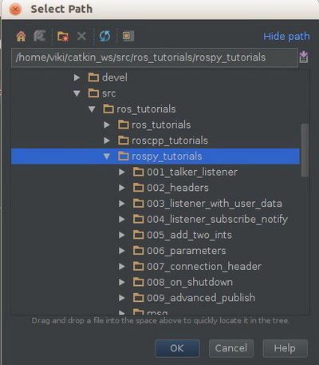

* 点击 OK，工程将被创建

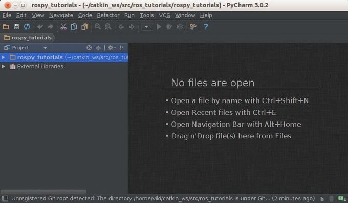

* 设置python2.7为PyCharm工程的Interpreter

 * PyCharm默认将Python 3.2设置为工程的interpreter，而ROS使用的是Python 2.7，这里需要设置一下，使用Python 2.7，否则无法运行ROS相关的Python库。如果默认是Python 2.7则不用修改

 * File 菜单 -> Settings 项，打开设置对话框，选择 Project Interpreter -> Python Interpreters 

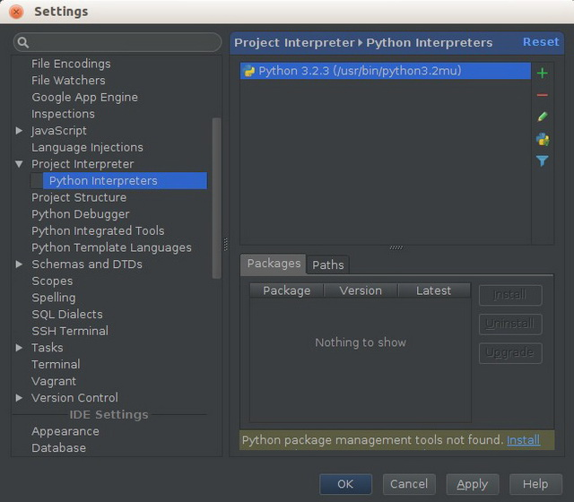

 * 点击右边选框的加号，增加 Python 2.7 Interpreter，并将其设置为工程默认

  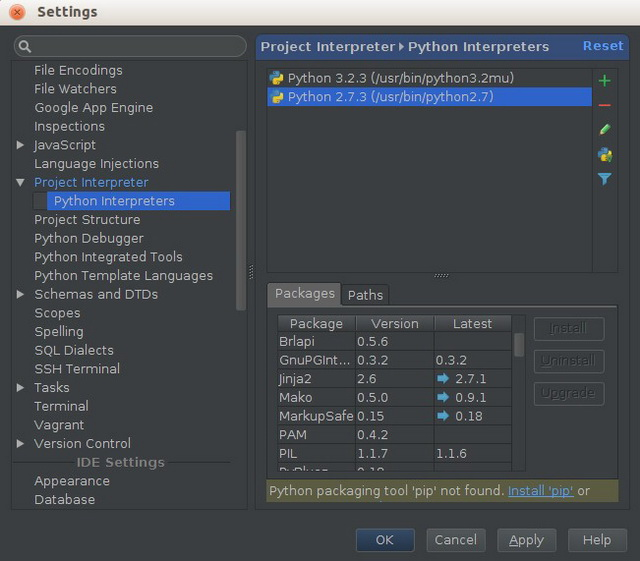

* 调试代码
 * 先打开一个terminal，输入 roscore 命令启动ROS Master

 * 在PyCharm左边的 Project 树形框中，找到 talker.py 文件，打开。然后找到 “hello world” 所在的位置，修改为 “hello I'm yuanboshe”，并设置断点

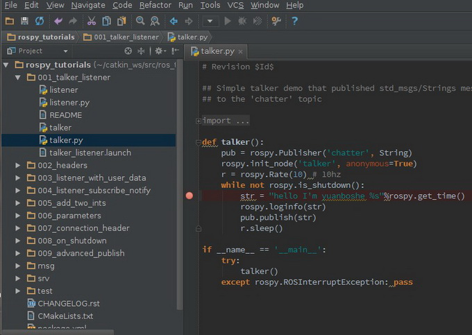 

 * 保存后，右键左边的 talker.py 文件，弹出右键菜单，选择 Debug 'talker' 项

 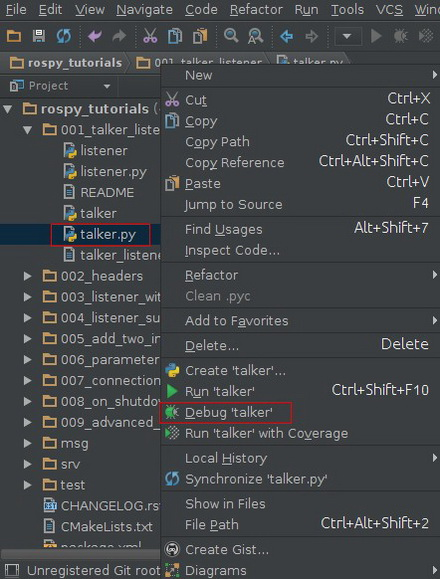

 * 启动调试后，talker 程序就会运行，并会运行到断点处停下来

 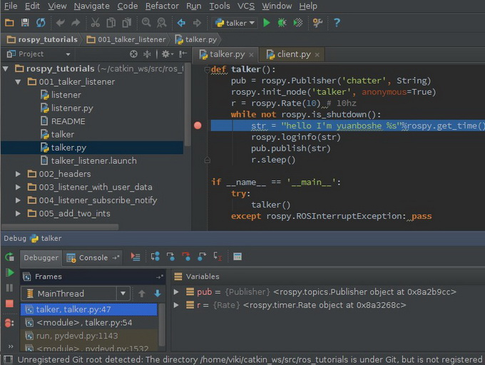

 * 在下面的变量栏能够看到变量值。取消断点，按 F9 继续运行，将下面的显示窗口切换到 Console 窗口，能够看到修改后的信息

 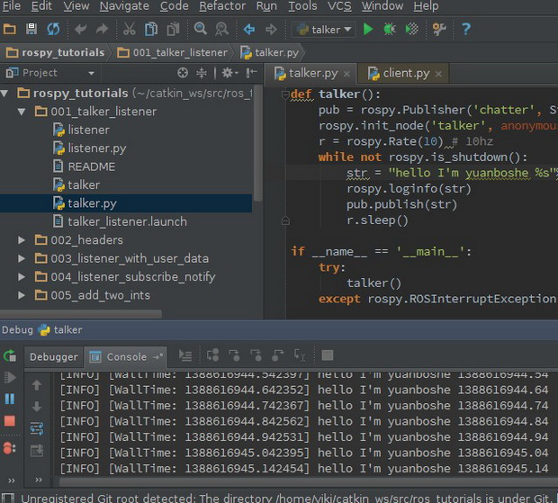

 * 回到桌面，再开一个terminal窗口，输入 rosrun rospy_tutorials listener 命令，可以看到正确的监听消息

 


## 三、 VS Code安装
### (一) 安装包安装
* 从vscode官网下载最新版本，deb包下载地址：https://code.visualstudio.com/docs?dv=linux64
  （由于是外网，可能下载速度极慢，可直接使用百度网盘下载）
                  链接：https://pan.baidu.com/s/1HKBQ6k9X-ZVX4C2vYgBFSA 
                  提取码：7ze2
  
* 下载后在放置deb包的文件夹直接打开终端，然后输入
>sudo  dpkg  -i code_1.45.1-1589445302_amd64.deb

  (其中的 -i 后面的就是deb包名；执行之后等待)


### (二) apt 安装

* 以 sudo 用户身份运行下面的命令，更新软件包索引，并且安装依赖软件
>sudo apt update
>sudo apt install software-properties-common apt-transport-https wget

* 使用 wget 命令插入 Microsoft GPG key
>wget -q https://packages.microsoft.com/keys/microsoft.asc -O- | sudo apt-key add -

* 启用 Visual Studio Code 源仓库，输入
>
>sudo add-apt-repository "deb [arch=amd64] https://packages.microsoft.com/repos/vscode stable main"

*  apt 软件源被启用，安装 Visual Studio Code 软件包
>sudo apt install code

* 新版本被发布时，可以通过桌面标准软件工具，或者在终端运行命令，来升级 Visual Studio Code 软件包
>sudo apt update

 >sudo apt upgrade


### (三) 拓展安装

  启动 VS Code 在软件拓展中安装插件

* ROS插件

    打开VS Code，在左侧栏点击Extensions，并在搜索框中输入ros，安装ROS插件

​       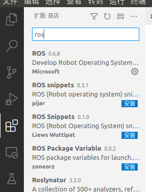
​    
* C/C++插件

    搜索框中输入c/c++，安装C/C++插件

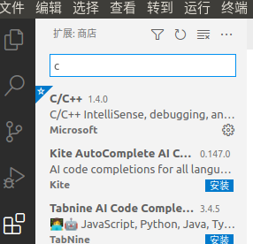


### (四) VS Code调试

#### 1）创建ROS工作环境

* 主目录新建一个文件夹，命名为test_ros，在该文件夹中打开终端，执行以下命令来创建ROS工作环境
>mkdir src && cd src

 >catkin_init_workspace

 >cd ../

 >catkin_make

* 在VScode中打开test_ros文件夹，此时的文件目录如下
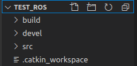

* 右键单击src，选择Create Catkin Package，Package命名为helloworld


* 添加roscpp, rospy作为依赖项
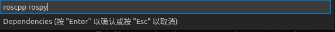

* src/helloworld/src目录下添加一个cpp文件，命名为helloworld.cpp，内容如下

  ```cpp
  
  #include <iostream>
  #include <string>
  #include <sstream>
  using namespace std;
  
  #include "ros/ros.h"
  #include "std_msgs/String.h"
  
  int main(int argc, char** argv)
  {
	ros::init(argc, argv, "talker");
	ros::NodeHandle n;
	ros::Publisher chatter_pub = n.advertise<std_msgs::String>("chatter", 1000);
	ros::Rate loop_rate(10);
	int count = 0;
	while(ros::ok())
	{
		std_msgs::String msg;
		std::stringstream ss;
		ss << "hello world " << count;
		msg.data = ss.str();
		ROS_INFO("%s", msg.data.c_str());
		chatter_pub.publish(msg);
		ros::spinOnce();
		loop_rate.sleep();
		count++;
	}
	return 0;
   }
  ;
  
  ```

此时会提示找不到ros/ros.h和std_msgs/String.h，我们继续通过后面的步骤来解决

#### 2）配置.json文件
配置c_cpp_properties.json,launch.json,tasks.json

* c_cpp_properties.json，用于指定C/C++类库和包含路径以及配置

 按住Fn+F1，找到C/C++:编辑配置(JSON)

 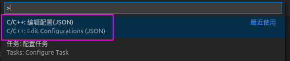

 生成c_cpp_properties.json文件，修改文件内容如下

 ```json
 {
    "configurations": [
        {
            "name": "Linux",
            "includePath": [
                "${workspaceFolder}/**",
                "/opt/ros/melodic/include"
            ],
            "defines": [],
            "compilerPath": "/usr/bin/gcc",
            "cStandard": "c11",
            "cppStandard": "c++17",
            "intelliSenseMode": "clang-x64",
            "compileCommands": "${workspaceFolder}/build/compile_commands.json"
        }
    ],
    "version": 4
}

 ```

 其中/opt/ros/melodic/include为ROS相关头文件所在的路径，此时可能仍然找不到ros/ros.h和std_msgs/String.h，继续运行以下命令即可在build文件夹下生成compile_commands.json文件

 > catkin_make -DCMAKE_EXPORT_COMPILE_COMMANDS=1
* launch.json，用于调试

  按住Fn+F5启动调试，就会生成launch.json，修改launch.json文件内容如下：
   ```json
  {
    // 使用 IntelliSense 了解相关属性。 
    // 悬停以查看现有属性的描述。
    // 欲了解更多信息，请访问: https://go.microsoft.com/fwlink/?linkid=830387
    "version": "0.2.0",
    "configurations": [
            {
            "name": "(gdb) Launch",
            "type": "cppdbg",
            "request": "launch",
            "program": "${workspaceFolder}/build/helloworld/helloworld",// 表示可执行程序所在的路径，其中，${workspaceRoot}表示VScode加载的文件夹的根目录
            "args": [],
            "stopAtEntry": false,
            "cwd": "${workspaceFolder}",
            "environment": [],
            "externalConsole": false,
            "MIMode": "gdb",
            "setupCommands": [
                {
                    "description": "Enable pretty-printing for gdb",
                    "text": "-enable-pretty-printing",
                    "ignoreFailures": true
                }
            ],
            //"preLaunchTask": "make build"//最好删了，不然会影响调试，每次调试都直接执行make build
        }
    ]
  }
  
   ```
  
* tasks.json，用于编译

  按住Fn+F1，找到任务：配置任务，创建tasks.json文件，修改tasks.json文件内容如下
  
    ```json
      {
      "version": "2.0.0",
               "tasks": [
        {
            "label": "catkin_make", //代表提示的描述性信息
            "type": "shell",  //可以选择shell或者process,如果是shell代码是在shell里面运行一个命令，如果是process代表作为一个进程来运行
            "command": "catkin_make",//这个是我们需要运行的命令
            "args": [],//如果需要在命令后面加一些后缀，可以写在这里，比如-DCATKIN_WHITELIST_PACKAGES=“pac1;pac2”
            "group": {"kind":"build","isDefault":true},
            "presentation": {
                "reveal": "always"//可选always或者silence，代表是否输出信息
            },
            "problemMatcher": "$msCompile"
        },
                             ]
                                                                                                                                       }
  
    ```

 #### 3） 修改CMakeLists.txt
* 继续修改src/helloworld/CMakeLists.txt文件，在其中添加以下程序
   ```xml
   # 头文件路径
   include_directories(
   include
  ${catkin_INCLUDE_DIRS}
  )
  # 生成可执行文件
  add_executable( helloworld src/helloworld.cpp )
  # 链接库
  target_link_libraries(helloworld ${catkin_LIBRARIES})
  
  ```

 #### 4）结果测试
* 按住Ctrl+Shift+B编译该程序，就可以看到与catkin_make一样的编译过程

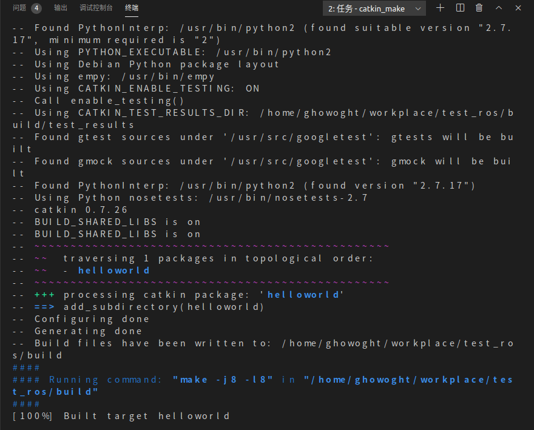

* 测试生成的可执行文件．新开一个终端，运行ROS的master节点，然后按住Fn+F5运行生成的可执行文件

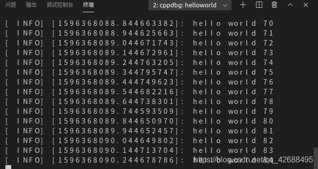


## 四、Ros与Python

原文链接: https://www.ncnynl.com/category/ros-python/

github链接  :https://github.com/ros/ros_tutorials/tree/melodic-devel


### (一) 构建工作空间

- 下面我们开始创建一个catkin 工作空间：

```
$ mkdir -p ~/catkin_ws/src
$ cd ~/catkin_ws/src
```

- 即使这个工作空间是空的（在'src'目录中没有任何软件包，只有一个CMakeLists.txt链接文件），你依然可以编译它：

```
$ cd ~/catkin_ws/
$ catkin_make
```

- catkin_make命令在catkin 工作空间中是一个非常方便的工具。如果你查看一下当前目录应该能看到'build'和'devel'这两个文件夹。在'devel'文件夹里面你可以看到几个setup.sh文件。source这些文件中的任何一个都可以将当前工作空间设置在ROS工作环境的最顶层，想了解更多请参考catkin文档。接下来首先source一下新生成的setup.sh文件：

```
$ source devel/setup.bash
```

- 要想保证工作空间已配置正确需确保ROS_PACKAGE_PATH环境变量包含你的工作空间目录，采用以下命令查看：

```
$ echo $ROS_PACKAGE_PATH
/home/ygd/catkin_ws/src:/opt/ros/melodic/share:/opt/ros/melodic/stacks
```

- ygd为用户目录

**每次打开终端自动加载ROS环境和工作空间**

```
$ vim ~/.bashrc
```

添加内容到文件末尾

```
source /opt/ros/melodic/setup.bash
source /home/ygd/catkin_ws/devel/setup.bash
```

- ygd为用户目录


### (二) 构建Catkin包

- 首先切换到之前通过创建catkin工作空间教程创建的catkin工作空间中的src目录下：

```
$ cd ~/catkin_ws/src
```

- 现在使用`catkin_create_pkg`命令来创建一个名为'beginner_tutorials'的新程序包，这个程序包依赖于std_msgs、roscpp和rospy：

```
$ catkin_create_pkg beginner_tutorials std_msgs rospy roscpp
```

- 这将会创建一个名为`beginner_tutorials`的文件夹，这个文件夹里面包含一个package.xml文件和一个CMakeLists.txt文件，这两个文件都已经自动包含了部分你在执行`catkin_create_pkg`命令时提供的信息。
- catkin_create_pkg命令会要求你输入package_name，如果有需要你还可以在后面添加一些需要依赖的其它程序包：

```
# catkin_create_pkg <package_name> [depend1] [depend2] [depend3]
```

**程序包依赖关系**

**一级依赖**

- 之前在使用catkin_create_pkg命令时提供了几个程序包作为依赖包，现在我们可以使用`rospack`命令工具来查看一级依赖包。

```
$ rospack depends1 beginner_tutorials
```

**效果：**

```
std_msgs
rospy
roscpp
```

- 就像你看到的，rospack列出了在运行catkin_create_pkg命令时作为参数的依赖包，这些依赖包随后保存在package.xml文件中。

```
$ roscd beginner_tutorials
$ cat package.xml
```

**效果：**

```
<?xml version="1.0"?>
<package>
...
 <buildtool_depend>catkin</buildtool_depend>
  <build_depend>roscpp</build_depend>
  <build_depend>rospy</build_depend>
  <build_depend>std_msgs</build_depend>
  <run_depend>roscpp</run_depend>
  <run_depend>rospy</run_depend>
  <run_depend>std_msgs</run_depend>

...
</package>
```

**间接依赖**

- 在很多情况中，一个依赖包还会有它自己的依赖包，比如，rospy还有其它依赖包。

```
$ rospack depends1 rospy
```

**效果：**

```
genpy
rosgraph
rosgraph_msgs
roslib
std_msgs
```

- 一个程序包还可以有好几个间接的依赖包，幸运的是使用rospack可以递归检测出所有的依赖包。

```
$ rospack depends beginner_tutorials
cpp_common
rostime
roscpp_traits
roscpp_serialization
genmsg
genpy
message_runtime
rosconsole
std_msgs
rosgraph_msgs
xmlrpcpp
roscpp
rosgraph
catkin
rospack
roslib
rospy
```

**自定义你的程序包**

**自定义 package.xml**

- 自动生成的package.xml文件应该在你的新程序包中。
- 现在让我们一起来看看新生成的package.xml文件以及每一个需要你注意的标签元素。

**描述标签**

- 首先更新描述标签：

```
<description>The beginner_tutorials package</description>
```

- 将描述信息修改为任何你喜欢的内容，但是按照约定第一句话应该简短一些，因为它覆盖了程序包的范围。
- 如果用一句话难以描述完全那就需要换行了。

**维护者标签**

- 接下来是维护者标签：

```
<!-- Example:  -->
<!-- <maintainer email="jane.doe@example.com">Jane Doe</maintainer> -->
<maintainer email="ubu@todo.todo">ubu</maintainer>
```

- 这是package.xml中要求填写的一个重要标签，因为它能够让其他人联系到程序包的相关人员。
- 至少需要填写一个维护者名称，但如果有需要的话你可以添加多个。
- 除了在标签里面填写维护者的名称外，还应该在标签的email属性中填写邮箱地址

**许可标签**

- 再接下来是许可标签，同样的也需要：

```
<!-- One license tag required, multiple allowed, one license per tag -->
<!-- Commonly used license strings: -->
<!--   BSD, MIT, Boost Software License, GPLv2, GPLv3, LGPLv2.1, LGPLv3 -->
<license>TODO</license>
```

- 你应该选择一种许可协议并将它填写到这里。

- 一些常见的开源许可协议有BSD、MIT、Boost Software License、GPLv2、GPLv3、LGPLv2.1和LGPLv3。

- 你可以在Open Source Initiative中阅读其中的若干个许可协议的相关信息。

- 对于本教程我们将使用BSD协议，因为ROS核心组件的剩余部分已经使用了该协议：

  BSD

**依赖项标签**

- 接下来的标签用来描述程序包的各种依赖项，这些依赖项分为：build_depend、buildtool_depend、run_depend、test_depend。
- 关于这些标签的更详细介绍请参考Catkin Dependencies相关的文档。在之前的操作中，因为我们将 std_msgs、 roscpp、 和 rospy作为catkin_create_pkg命令的参数，所以生成的依赖项看起来如下：

```
  <!-- The *_depend tags are used to specify dependencies -->
  <!-- Dependencies can be catkin packages or system dependencies -->
  <!-- Examples: -->
  <!-- Use build_depend for packages you need at compile time: -->
  <!--   <build_depend>genmsg</build_depend> -->
  <!-- Use buildtool_depend for build tool packages: -->
  <!--   <buildtool_depend>catkin</buildtool_depend> -->
  <!-- Use run_depend for packages you need at runtime: -->
  <!--   <run_depend>python-yaml</run_depend> -->
  <!-- Use test_depend for packages you need only for testing: -->
  <!--   <test_depend>gtest</test_depend> -->
  <buildtool_depend>catkin</buildtool_depend>
  <build_depend>roscpp</build_depend>
  <build_depend>rospy</build_depend>
  <build_depend>std_msgs</build_depend>
```

- 除了catkin中默认提供的buildtool_depend，所有我们列出的依赖包都已经被添加到build_depend标签中。在本例中，因为在编译和运行时我们需要用到所有指定的依赖包，因此还需要将每一个依赖包分别添加到run_depend标签中：

```
  <buildtool_depend>catkin</buildtool_depend> 
  <build_depend>roscpp</build_depend>
  <build_depend>rospy</build_depend>
  <build_depend>std_msgs</build_depend>
  <run_depend>roscpp</run_depend>
  <run_depend>rospy</run_depend>
  <run_depend>std_msgs</run_depend>
```


### (三) 写简单的发布器和订阅器

#### 1）定义msg消息

1.在beginner_tutorials,新建msg消息目录,新建Num.msg文件

```
$ roscd beginner_tutorials
$ mkdir msg
$ cd msg
$ touch Num.msg
$ rosed beginner_tutorials Num.msg
```

2.Num.msg文件，输入代码：

```
int64 num
```

3.打开文件`rosed beginner_tutorials package.xml`,增加依赖，

```
<build_depend>message_generation</build_depend>
<run_depend>message_runtime</run_depend>
```

4.打开文件`rosed beginner_tutorials CMakeLists.txt`,增加依赖,

```
# Do not just add this line to your CMakeLists.txt, modify the existing line
find_package(catkin REQUIRED COMPONENTS
  roscpp
  rospy
  std_msgs
 message_generation
)
```

5.在CMakeLists.txt文件，增加消息文件，取消#，并修改为

```
add_message_files(
  FILES
  Num.msg
)
```

6.在CMakeLists.txt文件，增加消息生成包，取消#，并修改为

```
generate_messages(
  DEPENDENCIES
  std_msgs
)
```

7.在CMakeLists.txt文件，增加消息生成包，取消CATKIN_DEPENDS的#，并修改为

```
catkin_package(
#  INCLUDE_DIRS include
#  LIBRARIES beginner_tutorials
   CATKIN_DEPENDS roscpp rospy std_msgs message_runtime
#  DEPENDS system_lib
)
```

8.编译代码

```
$ cd ~/catkin_ws
$ catkin_make
```

9.检查服务

- 命令：

```
$ rosmsg show beginner_tutorials/Num
```

- 效果：

```
int64 num
```

#### 2）编写发布器的步骤

1.进入之前建立的包beginner_tutorials

```
$ roscd beginner_tutorials
```

2.建立Python脚本目录

```
$ mkdir scripts
$ cd scripts
```

3.新建talker.py文件，设置权限为可执行，并输入代码

```
$ touch talker.py                #生成文件
$ chmod +x talker.py             #设置可执行
$ rosed beginner_tutorials talker.py #自己输入代码
```

**talker.py内容如下：**

```
#!/usr/bin/env python

import rospy
from std_msgs.msg import String

def talker():
    pub = rospy.Publisher('chatter', String, queue_size=10)
    rospy.init_node('talker', anonymous=True)
    rate = rospy.Rate(10) # 10hz
    while not rospy.is_shutdown():
        hello_str = "hello world %s" % rospy.get_time()
        rospy.loginfo(hello_str)
        pub.publish(hello_str)
        rate.sleep()

if __name__ == '__main__':
    try:
        talker()
    except rospy.ROSInterruptException:
pass
```

4.代码分析

- 代码：`#!/usr/bin/env python`
- 分析：指定通过python解释代码
- 代码：`import rospy`
- 分析：导入rospy包，rospy是ROS的python客户端。[参考rospy API接口](http://docs.ros.org/api/rospy/html/)
- 代码：`from std_msgs.msg import String`
- 分析：
  - 导入python的标准字符处理库
  - String是一个函数，可以另外方式赋值：

```
msg = String()  
msg.data = str
```

- 或者

```
String(data=str)
```

- [参考python的标准函数库](https://docs.python.org/2/library/index.html)
- 代码：`def talker()`
- 分析：定义talker函数，[参考如何定义函数](http://www.ncnynl.com/archives/201610/1011.html)
- 代码：`pub = rospy.Publisher('chatter', String, queue_size=10)`
- 分析：定义发布的主题名称chatter， 消息类型String,实质是std_msgs.msg.String， 设置队列条目个数.[参考rospy.Publisher API](http://docs.ros.org/api/rospy/html/rospy.topics.Publisher-class.html)
- 代码：`rospy.init_node('talker', anonymous=True)`
- 分析：
  - 初始化节点，节点名称为talker, [参考rospy.init_node API](http://docs.ros.org/api/rospy/html/rospy-module.html#init_node)
  - anonymous=True，要求每个节点都有唯一的名称，避免冲突。这样可以运行多个talker.py
- 代码：`rate = rospy.Rate(10) # 10hz`
- 分析：设置发布的频率，单位是每秒次数，这是每秒10次的频率发布主题，[参考rospy.Rate API](http://docs.ros.org/api/rospy/html/rospy.timer.Rate-class.html)
- 代码：`rospy.is_shutdown()`
- 分析：用于检测程序是否退出，是否按Ctrl-C 或其他
- 代码：`rospy.loginfo`
- 分析：在屏幕输出日志信息，写入到rosout节点，也可以通过rqt_console来查看。[参考rospy.loginfo API](http://docs.ros.org/api/rospy/html/rospy-module.html#loginfo)
- 代码：pub.publish(hello_str)
- 分析：发布信息到主题，[参考pub.publish API](http://docs.ros.org/api/rospy/html/rospy.topics.Publisher-class.html)
- 代码：`rate.sleep()`
- 分析：睡眠一定持续时间，如果参数为负数，睡眠会立即返回。[参考 sleep api](http://docs.ros.org/api/rospy/html/rospy-module.html#sleep)

5.编译代码

```
$ cd ~/catkin_ws
$ catkin_make
```

6.测试代码

- 打开新终端，启动roscore

```
$ roscore 
```

- 打开另一个终端，启动talker.py

```
$rosrun beginner_tutorials talker.py
```

- 效果：

```
ubu@ubu:~/catkin_ws/src$ rosrun beginner_tutorials talker.py 
[INFO] [WallTime: 1478418967.640556] hello world 1478418967.64
[INFO] [WallTime: 1478418967.741493] hello world 1478418967.74
```

7.查看主题

- 命令：

```
$ rostopic echo /chatter
```

- 效果：

```
data: hello world 1478444433.95
---
data: hello world 1478444434.45
---
data: hello world 1478444434.95
---
data: hello world 1478444435.45
```

#### 3）编写订阅器的步骤

1.进入~/catkin_ws/src/beginner_tutorials/scripts目录，建立listener.py文件

```
$ roscd beginner_tutorials 
$ cd scripts
$ touch listener.py
$ chmod +x listener.py
$ rosed beginner_tutorials  listener.py
```

2.输入代码：

```
#!/usr/bin/env python

import rospy
from std_msgs.msg import String

def callback(data):
    rospy.loginfo(rospy.get_caller_id() + 'I heard %s', data.data)

def listener():

    # In ROS, nodes are uniquely named. If two nodes with the same
    # name are launched, the previous one is kicked off. The
    # anonymous=True flag means that rospy will choose a unique
    # name for our 'listener' node so that multiple listeners can
    # run simultaneously.
    rospy.init_node('listener', anonymous=True)

    rospy.Subscriber('chatter', String, callback)

    # spin() simply keeps python from exiting until this node is stopped
    rospy.spin()

if __name__ == '__main__':
    listener()
```

3.代码分析

- 代码：`rospy.init_node('listener', anonymous=True)`
- 分析：
  - 初始化节点，节点名称为talker, [参考rospy.init_node API](http://docs.ros.org/api/rospy/html/rospy-module.html#init_node)
  - anonymous=True，要求每个节点都有唯一的名称，避免冲突。这样可以运行多个listener.py
- 代码： `rospy.Subscriber("chatter", String, callback)`
- 分析：
  - 订阅函数，订阅chatter主题，内容类型是std_msgs.msgs.String。
  - 当有新内容，调用callback函数处理。接受到的主题内容作为参数传递给callback.
- 代码：`rospy.spin()`
- 分析：保持节点运行，直到节点关闭。不像roscpp,rospy.spin不影响订阅的回调函数，因为回调函数有自己的线程。

4.编译代码

```
$ cd ~/catkin_ws
$ catkin_make
```

5.测试代码

- 打开新终端，启动roscore

```
$ roscore 
```

- 先打开终端运行talker.py, 打开另一个终端，启动listener.py

```
$rosrun beginner_tutorials listener.py
```

- 效果：

```
ubu@ubu:~/catkin_ws/src/beginner_tutorials/scripts$ rosrun beginner_tutoals listener.py 
[INFO] [WallTime: 1478442694.947875] /listerner_14737_1478442694294I heard hello world 1478442694.95
[INFO] [WallTime: 1478442695.448907] /listerner_14737_1478442694294I heard hello world 1478442695.45
```

6.也可以使用命令测试listener.py

- 命令：

```
$ rostopic pub -r 10 /chatter std_msgs/String "test"
```

- 效果：

```
$ rostopic echo /chatter

data: test
---
data: test
---
```

7.使用rqt_console命令查看日志输出

- 命令：

```
$ rqt_console
```

- 效果：

  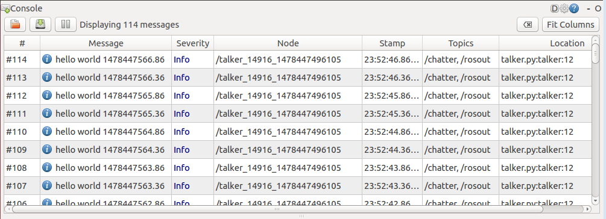

8.使用rqt_graph命令查看节点间调用关系

- 命令：

```
$ rqt_graph
```

- 效果：

  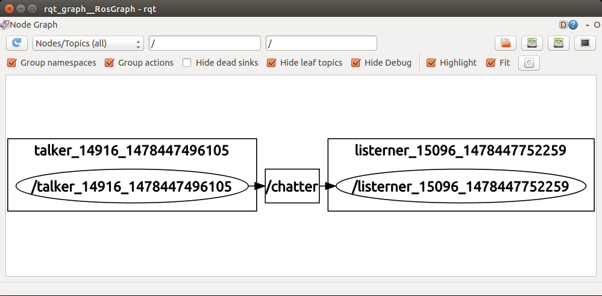


9.运行多个talker.py和listener.py, 查看调用关系

- 效果：
  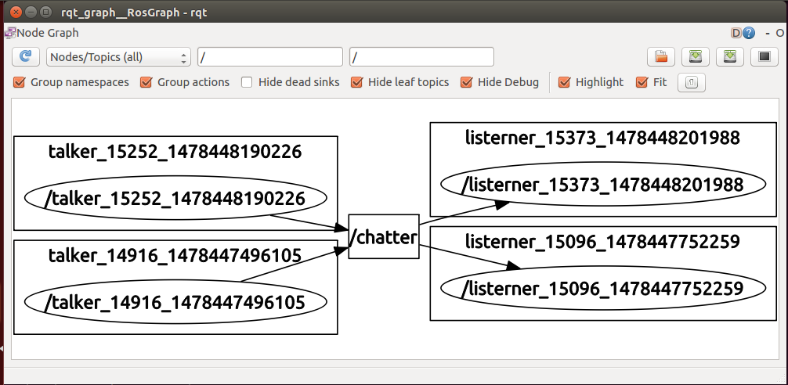

#### 4）制作Launch文件

1.在beginner_tutorials目录下新建bringup目录

```
$ roscd beginner_tutorials
$ mkdir -p bringup
```

2.进入bringup, 新建talker-and-listener.launch

```
$ cd bringup
$ rosed beginner_tutorials talker-and-listener.launch
```

3.手工输入代码:

```
<launch>
    <node name="talker" pkg="beginner_tutorials" type="talker.py" />
    <node name="listener" pkg="beginner_tutorials" type="listener.py" />
</launch>
```

4.运行launch

- 命令：

```
$ roslaunch beginner_tutorials talker-and-listener.launch
```


### (四) 写简单服务端与客户端

#### 1）定义srv服务

1.在beginner_tutorials,新建srv服务目录,新建AddTwoInts.srv文件

```
$ roscd beginner_tutorials
$ mkdir srv
$ cd srv
$ touch AddTwoInts.srv
$ rosed beginner_tutorials AddTwoInts.srv
```

2.srv文件分为请求和响应两部分，由'---'分隔。手工输入代码：

```
int64 A
int64 B
---
int64 Sum
```

3.打开文件`rosed beginner_tutorials package.xml`,增加依赖，

```
<build_depend>message_generation</build_depend>
<run_depend>message_runtime</run_depend>
```

1. 打开文件`rosed beginner_tutorials CMakeLists.txt`,增加依赖,

```
# Do not just add this line to your CMakeLists.txt, modify the existing line
find_package(catkin REQUIRED COMPONENTS
  roscpp
  rospy
  std_msgs
 message_generation
)
```

4.在CMakeLists.txt文件，增加服务文件，取消#，并修改为

```
add_service_files(
   FILES
   AddTwoInts.srv
 )
```

5.在CMakeLists.txt文件，增加消息生成包，取消#，并修改为

```
generate_messages(
  DEPENDENCIES
  std_msgs
)
```

6.编译代码

```
$ cd ~/catkin_ws
$ catkin_make
```

7.检查服务

- 命令：

```
$ rossrv show beginner_tutorials/AddTwoInts
```

- 效果：

```
int64 a
int64 b
---
int64 sum
```

#### 2）编写服务端节点

1.在scripts目录新建add_two_ints_server.py文件

```
$ roscd beginner_tutorials/scripts
$ touch add_two_ints_server.py
$ chmod +x add_two_ints_server.py
$ rosed beginner_tutorials add_two_ints_server.py
```

输入如下代码：

```
#!/usr/bin/env python

NAME = 'add_two_ints_server'

# import the AddTwoInts service
from beginner_tutorials.srv import *
import rospy 

def add_two_ints(req):
    print("Returning [%s + %s = %s]" % (req.a, req.b, (req.a + req.b)))
    sum = req.a + req.b
    return AddTwoIntsResponse(sum)

def add_two_ints_server():
    rospy.init_node(NAME)
    s = rospy.Service('add_two_ints', AddTwoInts, add_two_ints)
    print "Ready to add Two Ints"
    # spin() keeps Python from exiting until node is shutdown
    rospy.spin()

if __name__ == "__main__":
    add_two_ints_server()
```

2.代码分析

- 代码：`from beginner_tutorials.srv import *`
- 分析：导入定义的服务
- 代码：`s = rospy.Service('add_two_ints', AddTwoInts, add_two_ints)`
- 分析：
  - 定义服务节点名称，服务的类型，处理函数。
  - 处理函数调用实例化的AddTwoIntsRequest接收请求和返回实例化的AddTwoIntsResponse
  - [参考rospy.Service API](http://docs.ros.org/api/rospy/html/rospy.impl.tcpros_service.Service-class.html)
- 代码：return AddTwoIntsResponse(sum)
- 分析：AddTwoIntsResponse由服务生成的返回函数

3.编译代码

```
$ cd ~/catkin_ws/
$ catkin_make
```

4.测试代码

- 打开新终端，启动add_two_ints_server.py

```
$ rosrun beginner_tutorials add_two_ints_server.py
```

- 打开新终端，列出服务

```
$ rosservice list

/add_two_ints
/add_two_ints_server/get_loggers
/add_two_ints_server/set_logger_level
/rosout/get_loggers
/rosout/set_logger_level
```

- 查看服务参数类型

```
$ rosservice args /add_two_ints
A B
```

- 调用服务

```
$ rosservice call /add_two_ints 1 2
sum: 3
```

- 启动的服务端显示

```
$ rosrun beginner_tutorials add_two_ints_server.py 
Ready to add Two Ints
Returning [1 + 2 = 3]
Returning [1 + 4 = 5]
Returning [1 + 3 = 4]
```

#### 3）编写客户端节点

1.在scripts目录新建add_two_ints_client.py文件

```
$ roscd beginner_tutorials/scripts
$ touch add_two_ints_client.py
$ chmod +x add_two_ints_client.py
$ rosed beginner_tutorials add_two_ints_client.py
```

2.输入如下代码：

```
#!/usr/bin/env python

import sys
import os

import rospy

# imports the AddTwoInts service 
from rospy_tutorials.srv import *

## add two numbers using the add_two_ints service
## @param x int: first number to add
## @param y int: second number to add
def add_two_ints_client(x, y):

    # NOTE: you don't have to call rospy.init_node() to make calls against
    # a service. This is because service clients do not have to be
    # nodes.

    # block until the add_two_ints service is available
    # you can optionally specify a timeout
    rospy.wait_for_service('add_two_ints')
    
    try:
        # create a handle to the add_two_ints service
        add_two_ints = rospy.ServiceProxy('add_two_ints', AddTwoInts)
        
        print "Requesting %s+%s"%(x, y)
        
        # simplified style
        resp1 = add_two_ints(x, y)

        # formal style
        resp2 = add_two_ints.call(AddTwoIntsRequest(x, y))

        if not resp1.sum == (x + y):
            raise Exception("test failure, returned sum was %s"%resp1.sum)
        if not resp2.sum == (x + y):
            raise Exception("test failure, returned sum was %s"%resp2.sum)
        return resp1.sum
    except rospy.ServiceException, e:
        print "Service call failed: %s"%e

def usage():
    return "%s [x y]"%sys.argv[0]

if __name__ == "__main__":
    
    argv = rospy.myargv()
    if len(argv) == 1:
        import random
        x = random.randint(-50000, 50000)
        y = random.randint(-50000, 50000)
    elif len(argv) == 3:
        try:
            x = int(argv[1])
            y = int(argv[2])
        except:
            print usage()
            sys.exit(1)
    else:
        print usage()
        sys.exit(1)
    print "%s + %s = %s"%(x, y, add_two_ints_client(x, y))
```

3.代码分析

- 代码：`rospy.wait_for_service('add_two_ints')`
- 分析：等待接入服务节点，[参考rospy.wait_for_service api](http://docs.ros.org/api/rospy/html/rospy-module.html#wait_for_service)
- 代码：`add_two_ints = rospy.ServiceProxy('add_two_ints', AddTwoInts)`
- 分析：创建服务的处理句柄，[参考rospy.ServiceProxy api](http://docs.ros.org/api/rospy/html/rospy.impl.tcpros_service.ServiceProxy-class.html)

4.编译代码

```
$ cd ~/catkin_ws/
$ catkin_make
```

5.测试代码

- 命令：

```
$ rosrun beginner_tutorials add_two_ints_client.py 4 5
```

- 效果：

```
Requesting 4+5
4 + 5 = 9
```

- 服务器输出

```
Returning [4 + 5 = 9]
```

#### 4）制作launch文件

1.进入bringup目录，新建server_client.launch，用来启动add_two_ints_server.py

```
$ roscd beginner_tutorials/bringup
$ touch server_client.launch
$ rosed beginner_tutorials server_client.launch
```

2.输入如下代码：

```
<launch>
    <node name="server" pkg="beginner_tutorials" type="add_two_ints_server.py" />
</launch>
```

3.启动server_client.launch

- 命令：

```
$ roslaunch beginner_tutorials server_client.launch
```

- 效果：

```
started roslaunch server http://192.168.0.105:38839/

SUMMARY
========

PARAMETERS
 * /rosdistro: melodic
 * /rosversion: 1.11.16

NODES
  /
    service (beginner_tutorials/add_two_ints_server.py)

ROS_MASTER_URI=http://192.168.0.88:11311

core service [/rosout] found
process[service-1]: started with pid [32174]
```

- 运行客户端节点即可获得结果

```
$ rosrun beginner_tutorials add_two_ints_client.py 4 5
```


### (五) 参数使用

#### 1）参数类型

- 可使用整数，浮点数，字符串，布尔值，列表，字典等作为参数
- 字典有额外的意义，可当作[命名空间](http://wiki.ros.org/Names)使用。可以这样设置

```
/gains/P = 1.0
/gains/I = 2.0
/gains/D = 3.0
```

- 在rospy,可以获取输出/gains

```
{'P': 1.0, 'I': 2.0, 'D': 3.0}
```

#### 2）操作参数

1.获取参数，使用 `rospy.get_param(param_name)`：

```
# 获取全局参数
rospy.get_param('/global_param_name')

# 获取目前命名空间的参数
rospy.get_param('param_name')

# 获取私有命名空间参数
rospy.get_param('~private_param_name')
# 获取参数，如果没，使用默认值
rospy.get_param('foo', 'default_value')
```

2.设置参数，使用`rospy.set_param(param_name, param_value)`：

```
rospy.set_param('some_numbers', [1., 2., 3., 4.])
rospy.set_param('truth', True)
rospy.set_param('~private_bar', 1+2)
```

3.删除参数，使用`rospy.delete_param('param_name')`：

```
rospy.delete_param('to_delete')
```

4.判断参数是否存在，使用`rospy.has_param('param_name')`：

```
if rospy.has_param('to_delete'):
    rospy.delete_param('to_delete')
```

#### 3）解释参数名

- 在ROS,名称可以映射成不同名，你的节点也可以放入到命名空间。
- rospy一般都能自动解释这些名称，但作为调试目的，可能向了解所有名称之间的关联。
- 获取实际的名称， rospy.resolve_name(name)：

```
value = rospy.get_param('~foo')
rospy.loginfo('Parameter %s has value %s', rospy.resolve_name('~foo'), value)
```

**搜索参数**

- 如果你不知道命名空间，你可以搜索参数。
- 搜索由私有命名空间开始，向上到全局命名空间。
- 使用rospy.search_param(param_name)：

```
full_param_name = rospy.search_param('foo')
param_value = rospy.get_param(full_param_name)
```

- 获取参数名后，也可以进行参数操作。

#### 4）制作launch文件

1.通过launch设置参数，进入bringup目录，新建param_talker.launch

```
$ roscd beginner_tutorials/bringup
$ touch param_talker.launch
$ rosed beginner_tutorials param_talker.launch
```

2.输入代码：

```
<launch>

  <!-- set /global_example parameter -->
  <param name="global_example" value="global value" />
    
  <group ns="foo">

    <!-- set /foo/utterance -->
    <param name="utterance" value="Hello World" />

    <param name="to_delete" value="Delete Me" />

    <!-- a group of parameters that we will fetch together -->
    <group ns="gains">
      <param name="P" value="1.0" />
      <param name="I" value="2.0" />
      <param name="D" value="3.0" />      
    </group>
  
    <node pkg="rospy_tutorials" name="param_talker" type="param_talker.py" output="screen">
    
      <!-- set /foo/utterance/param_talker/topic_name -->
      <param name="topic_name" value="chatter" />
      
    </node>
    
  </group>
  
</launch>
```


#### 5）制作节点

1.使用参数，进入scripts目录，新建param_talker.py

```
$ roscd beginner_tutorials/scripts
$ touch param_talker.py
$ chmod +x param_talker.py
$ rosed beginner_tutorials param_talker.py
```

2.输入如下代码：

```
#!/usr/bin/env python

import rospy
from std_msgs.msg import String

def param_talker():
    rospy.init_node('param_talker')

    # Fetch values from the Parameter Server. In this example, we fetch
    # parameters from three different namespaces:
    #
    # 1) global (/global_example)
    # 2) parent (/foo/utterance)
    # 3) private (/foo/param_talker/topic_name)

    # fetch a /global parameter
    global_example = rospy.get_param("/global_example")
    rospy.loginfo("%s is %s", rospy.resolve_name('/global_example'), global_example)
    
    # fetch the utterance parameter from our parent namespace
    utterance = rospy.get_param('utterance')
    rospy.loginfo("%s is %s", rospy.resolve_name('utterance'), utterance)
    
    # fetch topic_name from the ~private namespace
    topic_name = rospy.get_param('~topic_name')
    rospy.loginfo("%s is %s", rospy.resolve_name('~topic_name'), topic_name)

    # fetch a parameter, using 'default_value' if it doesn't exist
    default_param = rospy.get_param('default_param', 'default_value')
    rospy.loginfo('%s is %s', rospy.resolve_name('default_param'), default_param)
    
    # fetch a group (dictionary) of parameters
    gains = rospy.get_param('gains')
    p, i, d = gains['P'], gains['I'], gains['D']
    rospy.loginfo("gains are %s, %s, %s", p, i, d)    

    # set some parameters
    rospy.loginfo('setting parameters...')
    rospy.set_param('list_of_floats', [1., 2., 3., 4.])
    rospy.set_param('bool_True', True)
    rospy.set_param('~private_bar', 1+2)
    rospy.set_param('to_delete', 'baz')
    rospy.loginfo('...parameters have been set')

    # delete a parameter
    if rospy.has_param('to_delete'):
        rospy.delete_param('to_delete')
        rospy.loginfo("deleted %s parameter"%rospy.resolve_name('to_delete'))
    else:
        rospy.loginfo('parameter %s was already deleted'%rospy.resolve_name('to_delete'))

    # search for a parameter
    param_name = rospy.search_param('global_example')
    rospy.loginfo('found global_example parameter under key: %s'%param_name)
    
    # publish the value of utterance repeatedly
    pub = rospy.Publisher(topic_name, String, queue_size=10)
    while not rospy.is_shutdown():
        pub.publish(utterance)
        rospy.loginfo(utterance)
        rospy.sleep(1)
        
if __name__ == '__main__':
    try:
        param_talker()
    except rospy.ROSInterruptException: pass
```

#### 6）整合测试

1.启动launch文件

- 命令：

```
$ roslaunch beginner_tutorials param_talker.launch
```

- 效果：

```
SUMMARY
========

PARAMETERS
 * /foo/gains/D: 3.0
 * /foo/gains/I: 2.0
 * /foo/gains/P: 1.0
 * /foo/param_talker/topic_name: chatter
 * /foo/to_delete: Delete Me
 * /foo/utterance: Hello World
 * /global_example: global name
 * /rosdistro: melodic
 * /rosversion: 1.11.16

NODES
  /foo/
    param_talker (beginner_tutorials/param_talker.py)

ROS_MASTER_URI=http://192.168.0.88:11311

core service [/rosout] found
process[foo/param_talker-1]: started with pid [32684]
[INFO] [WallTime: 1478587334.669759] /global_example is global name
[INFO] [WallTime: 1478587334.682391] /foo/utterance is Hello World
[INFO] [WallTime: 1478587334.693382] /foo/param_talker/topic_name is chatter
[INFO] [WallTime: 1478587334.708533] /foo/default_param is default_value
[INFO] [WallTime: 1478587334.729605] gains are 1.0, 2.0, 3.0
[INFO] [WallTime: 1478587334.731529] setting parameters...
[INFO] [WallTime: 1478587334.831270] ...parameters have been set
[INFO] [WallTime: 1478587334.871695] deleted /foo/to_delete parameter
[INFO] [WallTime: 1478587334.895860] found global_example parameter under key: /global_example
[INFO] [WallTime: 1478587334.922108] Hello World
[INFO] [WallTime: 1478587335.925285] Hello World
```


### (六) 日志使用

#### 1）日志级别

- 日志按严重程度，分为：DEBUG ，INFO ，WARN ，ERROR ，FATAL
- DEBUG（调试） , 您永远不需要查看系统是否正常工作的信息。实例：
  - “收到来自来电者Y的主题X的消息”
  - “发送20个字节的套接字9”。
- INFO(信息) ,少量的信息，可能是有用的用户。实例：
  - “节点初始化”
  - “在主题X上的广告与消息类型Y”
  - “新订阅的主题X：Y”
- WARN（警告） , 用户可能会发现报警，并可能会影响应用程序的输出，但是该系统的预期工作的一部分。实例：
  - “无法从<路径>中加载配置文件>。使用默认值。”
- ERROR（错误）， 一些严重的，已经错了的信息。实例：
  - “没有收到关于主题X的更新10秒。直到X继续广播停止机器人。”
  - “在转换X中接收到的意外的南值……”
- FATAL（致命），事情发生了不可恢复的。实例：
- “电机着火了！”

#### 2）日志API

- 有几个函数，可以写入日志的：

```
rospy.logdebug(msg, *args)
rospy.logwarn(msg, *args)
rospy.loginfo(msg, *args)
rospy.logerr(msg, *args)
rospy.logfatal(msg, *args)
```

- 这些函数跟日志等级是一对一对应的。
- 有四个潜在的地方日志消息可能最终取决于详细级别：
  - stdout: loginfo
  - stderr: logerr, logfatal, logwarn (ROS 0.9)
  - your Node's log file: all
  - the /rosout Topic: loginfo, logwarn, logerr, logfatal
- 注意：
  - 你的节点完全初始化前，您的信息将不会出现在/rosout话题，所以你可能看不到最初的消息。
  - 当你看到一个消息输出在stdout，不在“/rosout”，很可能是初始化未完成，或者你忘记调用rospy.init_node。
- 节点日志文件一般位于 `ROS_ROOT/log or ~/.ros/log`,你可以可以通过 `ROS_LOG_DIR` 环境变量来更改它
- 如果你想看到DEBUG信息，可以在初始化节点如：

```
rospy.init_node('my_node', log_level=rospy.DEBUG)
```

- 每个rospy.log*()函数可以输入格式化的字符串内容，如：

```
rospy.logerr("%s returned the invalid value %s", other_name, other_value)
```

- 逗号间隔多个对应%s的变量

#### 3）测试使用

1.进入scripts目录，新建log_level.py

```
$ roscd beginner_tutorials/scripts
$ touch log_level.py
$ chmod +x log_level.py
$ rosed beginner_tutorials log_level.py
```

2.手工输入如下代码：

```
#!/usr/bin/env python

import rospy
from  std_msgs.msg import String

def log_level():

    debug ="Received a message on topic X from caller Y"
    rospy.logdebug("it is debug: %s", debug)

    info = "Node initialized"
    rospy.loginfo("it is info: %s", info)

    warn = "Could not load configuration file from <path>. Using defaults"
    rospy.logwarn("it is warn: %s", warn)

    error = "Received unexpected NaN value in transform X. Skipping..."
    rospy.logerr("it is error:%s", error)

    fatal = "Motors have caught fire!"
    rospy.logfatal("it is fatal: %s", fatal)


if __name__ == '__main__':

    try:
        rospy.init_node('log_level', log_level=rospy.DEBUG)
        log_level()
    except rospy.ROSInterruptException :
        pass
```

3.运行代码

- 命令：

```
$ rosrun beginner_tutorials log_level.py 
```

- 效果：

```
[DEBUG] [WallTime: 1478592313.625470] init_node, name[/log_level], pid[537]
[DEBUG] [WallTime: 1478592313.626043] binding to 0.0.0.0 0
[DEBUG] [WallTime: 1478592313.626711] bound to 0.0.0.0 37694
[DEBUG] [WallTime: 1478592313.627204] ... service URL is rosrpc://192.168.0.105:37694
[DEBUG] [WallTime: 1478592313.627458] [/log_level/get_loggers]: new Service instance
[DEBUG] [WallTime: 1478592313.662173] ... service URL is rosrpc://192.168.0.105:37694
[DEBUG] [WallTime: 1478592313.662577] [/log_level/set_logger_level]: new Service instance
[DEBUG] [WallTime: 1478592313.684361] it is debug: Received a message on topic X from caller Y
[INFO] [WallTime: 1478592313.684937] it is info: Node initialized
[WARN] [WallTime: 1478592313.685350] it is warn: Could not load configuration file from <path>. Using defaults
[ERROR] [WallTime: 1478592313.686025] it is error:Received unexpected NaN value in transform X. Skipping...
[FATAL] [WallTime: 1478592313.686388] it is fatal: Motors have caught fire!
```

- 把系统的调试信息也显示出来了。

4.显示错误，通过rosout节点显示，要先监听节点，在执行log_level.py

- 监听/rosout节点：

```
$ rostopic echo /rosout
```

- 打开新终端，执行log_level.py节点

```
$ rosrun beginner_tutorials log_level.py 
```

- 效果

```
$ rostopic echo /rosout
header: 
  seq: 1
  stamp: 
    secs: 1478592586
    nsecs: 482081890
  frame_id: ''
level: 16
name: /log_level
msg: it is fatal: Motors have caught fire!
file: log_level.py
function: log_level
line: 21
topics: ['/rosout']
---
```


### (七) 制作Makefile文件

#### 1）创建包

- 在catkin的工作空间，创建新包：

```
$ cd ~/catkin_ws/src
$ catkin_create_pkg my_pkg message_generation rospy
```

- 上面命令创建my_pkg，它依赖rospy包和message_generation包。

- message_generation包可以定义message（消息）和service（服务）。

- 在package.xml文件，需包含:

  <buildtool_depend>catkin</buildtool_depend>

- 在CMakeLists.txt文件，最少包含：

```
cmake_minimum_required(VERSION 2.8.3)
project(my_pkg)

find_package(catkin REQUIRED COMPONENTS message_generation rospy ...)
catkin_package()
```

#### 2）添加message和service

- 添加message或service 需要更改 package.xml and CMakeLists.txt文件
- 在package.xml文件，添加：

```
<build_depend>message_generation</build_depend>
```

- 在CMakelists.txt文件， 添加：

```
cmake_minimum_required(VERSION 2.8.3)
project(my_pkg)

find_package(catkin REQUIRED COMPONENTS message_generation rospy)

add_message_files(
  FILES  # e.g. Floats.msg HeaderString.msg
)
add_service_files(
  DIRECTORY srv 
  FILES AddTwoInts.srv BadTwoInts.srv
)

## Generate services in the 'srv' folder
# add_service_files(
#  FILES  # e.g. Floats.srv HeaderString.srv
#)

## Generate added messages and services with any dependencies
generate_messages()

catkin_package(
  CATKIN_DEPENDS message_runtime
)
```

#### 3）安装脚本和导出模块

- 使用catkin，ROS包有一个安装目标。这使得其他软件包管理器自动创建安装包比apt-get容易得多，也适用于MacOS，拱，BSD，窗户，等。
- 开发者的责任就是描述需要安装什么，如果在你的源代码树上的每一个文件都安装在其他人的电脑上，这样不是十分好。
- 所以对于Python项目，我想安装脚本和python模块在其他的电脑上作为库来使用（其他资源目前还没有支持在setup.py声明，可以使用CMakeLists.txt代替）
- 在教程里，创建一个作为例子的Python包：

```
$ cd ~/catkin_ws/src/my_pkg    # new catkin package, in the workspace
$ mkdir bin
$ mkdir src
$ mkdir src/tutorial_package
$ touch src/tutorial_package/__init__.py
```

- 这里定义一个python包，叫tutorial_package。通常定义一个名称应该跟catkin包相同名称（如my_pkg），为了避免冲突，我们命名为不一样的名称，这样容易辨别。
- 在my_pkg，新建src/tutorial_package/hello.py文件

```
def say(name):
    print('Hello ' + name)
```

- 再创建bin/hello文件：

```
#! /usr/bin/env python

import tutorial_package.hello

if __name__ == '__main__':
    tutorial_package.hello.say('my friend!')
```

- 设置可执行

```
$ chmod u+x bin/hello
```

- 如果尝试执行，会报错

```
$ bin/hello 
Traceback (most recent call last):
  File "bin/hello", line 3, in <module>
    import tutorial_package.hello
ImportError: No module named tutorial_package.hello
```

- 解决1：更改 PYTHONPATH，但只能在你本地执行
- 解决2：如果要普遍适用，就要定义一个安装程序，移动文件到PYTHONPATH。
- 对于python包和脚本，catkin提供cmake macro来提取来自setup.py的相关信息。
- 在my_pkg根目录下创建setup.py，内容如下：

```
## ! DO NOT MANUALLY INVOKE THIS setup.py, USE CATKIN INSTEAD

from distutils.core import setup
from catkin_pkg.python_setup import generate_distutils_setup

# fetch values from package.xml
setup_args = generate_distutils_setup(
    packages=['tutorial_package'],
    package_dir={'': 'src'},
)

setup(**setup_args)
```

- 记住： setup.py是catkin使用的，而不是用户调用。catkin将确保setup.py文件安装到正确的位置。如果你手动调用setup.py，你可能会破坏你的ROS安装。
- 第一行，使用distutils （不推荐setuptools，因为它会在src生成文件）
- 使用generate_distutils_setup函数读取package.xml文件的值，同时也执行一些转换，例如漂亮地列出作者和维护者。
- 所有我们需要的不在package.xml的信息，如：
  - 想要安装的脚本名称
  - python包的名称
  - 那里可以找到这些包
  - python包的依赖
- 相比那些在package.xml使用的，以上的会有不同的名称，需要单独列出。
- 为了catkin能使用到setup.py, 需要去掉在CMakeLists.txt文件注释：

```
## Uncomment if the package has a setup.py
catkin_python_setup()
```

- 最后，如果用户安装你的包，你需要修改CMakeLists.txt这一行：

```
catkin_install_python(PROGRAMS bin/hello
  DESTINATION ${CATKIN_PACKAGE_BIN_DESTINATION})
```

- 编译包

```
$ cd ~/catkin_ws
$ catkin_make
```

- 让环境包含新的devel空间

```
$ . devel/setup.bash
```

- 现在你的脚本和模块可通过rosrun来运行，其他用户安装你的包，也同样有效。

```
$ rosrun my_pkg hello 
Hello my friend!
```

#### 4）在beginner_tutorials包里测试

1. 在beginner_tutorials包，新建bin,src,src/tutorial_package目录，新建**init**.py

```
$ roscd beginner_tutorials
$ mkdir bin
$ mkdir src
$ mkdir src/tutorial_package
$ touch src/tutorial_package/__init__.py
$ chmod +x src/tutorial_package/__init__.py
```

1. 和src/tutorial_package/hello.py文件

```
$ touch src/tutorial_package/hello.py
$ chmod +x src/tutorial_package/hello.py
```

1. 输入如下代码：

```
def say(name):
    print('Hello' + name)
```

1. 创建bin/hello文件

```
$ roscd beginner_tutorials/bin
$ touch hello
$ chmod +x hello
$ rosed beginner_tutorials hello
```

1. 输入代码：

```
#! /usr/bin/env python

import tutorial_package.hello

if __name__ == '__main__':
    tutorial_package.hello.say('my friend!')
```

1. 在beginner_tutorials目录下，新建setup.py

```
$ roscd beginner_tutorials
$ touch setup.py
$ chmod +x setup.py
$ rosed beginner_tutorials setup.py
```

1. 输入代码：

```
## ! DO NOT MANUALLY INVOKE THIS setup.py, USE CATKIN INSTEAD

from distutils.core import setup
from catkin_pkg.python_setup import generate_distutils_setup

# fetch values from package.xml
setup_args = generate_distutils_setup(
    packages=['tutorial_package'],
    package_dir={'': 'src'},
)

setup(**setup_args)
```

1.在CMakeLists.txt文件找到下面行，并去掉注释。让catkin使用setup.py

```
## Uncomment if the package has a setup.py
catkin_python_setup()
```

2.在CMakeLists.txt文件找到下面行，并去掉注释。让用户安装到正确目录：

```
catkin_install_python(PROGRAMS bin/hello
DESTINATION ${CATKIN_PACKAGE_BIN_DESTINATION})
```

3.编译代码

```
$ cd ~/catkin_ws
$ catkin_make
```

4.让环境识别

```
$ . devel/setup.bash
```

5.测试调用

```
$ rosrun beginner_tutorials hello 
Hello my friend!
```


### (八) 设置PYTHONPATH

#### 1）介绍

- 一般情况，如果你要调用Python模块，就需要引进,如：

```
import foo
```

- 用户使用你的代码，就要确保对应的模块`foo`在她的PYTHONPATH里。对于喜欢安装很多ROS库的用户，就可能出现两个不同的foo, 那么对的那个就要在PYTHONPATH里才能被正确找到。
- 在catkin里，模块导入不需要roslib.
- Catkin为工作空间，一些相关文件，甚至src目录下两个模块，设置PYTHONPATH。如果你有两个模块在工作空间，一个是依赖另一个的，就需要先配置和编译这些模块，才能使用。

#### 2）实例

- 创建一个新包listener_extend，重用beginner_tutorials包的消息Num

```
$ cd catkin_ws/src
$ catkin_create_pkg listener_extend rospy beginner_tutorials
```

- 创建node目录，新建listener_extend.py

```
$ cd listener_extend
$ mkdir nodes
$ cd nodes
$ touch listener_extend.py
$ chmod +x listener_extend.py
$ vim listener_extend.py
```

- 手工输入代码：

```
#!/usr/bin/env python
import beginner_tutorials.msg
num = beginner_tutorials.msg.Num()
print(num)
```

- 测试

  - 命令：

  $ source ~/catkin_ws/devel/setup.bash
  $ cd ../
  $ python nodes/listener_extend.py

  - 效果：

```
num: 0
```

### (九) 使用numpy

#### 1）创建包numpy_tutorial

- 创建新包，依赖numpy_tutorial，依赖rospy_tutorials的消息类型。

```
catkin_create_pkg numpy_tutorial rospy rospy_tutorials
```

- 查看rospy_tutorials的消息类型

```
$ rosmsg show rospy_tutorials/Floats
float32[] data
```

- 需要依赖python-numpy,添加下面两行代码到在package.xml文件里。

```
<build_depend>python-numpy</build_depend>
<run_depend>python-numpy</run_depend>
```

#### 2）创建没使用numpy的listener节点

- 创建节点_listener.py, 用来订阅floats主题。

```
$ cd ~/catkin_ws/src/numpy_tutorial
$ mkdir scripts
$ cd scripts 
$ touch numpy_listener.py
$ chmod +x numpy_listener.py
$ vim numpy_listener.py
```

- 输入代码：

```
#!/usr/bin/env python

import rospy
from rospy_tutorials.msg import Floats

def callback(data):
    print rospy.get_name(), "I heard %s"%str(data.data)

def listener():
    rospy.init_node('listener')
    rospy.Subscriber("floats", Floats, callback)
    rospy.spin()

if __name__ == '__main__':
    listener()
```

#### 3）测试listener节点

- 新开终端，启动roscore

```
$ roscore
```

- 新开终端，启动订阅节点

```
$ rosrun numpy_tutorial numpy_listener.py
```

- 新开终端，发布主题

```
$ rostopic pub -r 1 floats rospy_tutorials/Floats "[1.1, 2.2, 3.3, 4.4, 5.5]"
```

- 效果：

```
$ rosrun numpy_tutorial numpy_listener.py
/listener-977-1248226102144 I heard (1.1000000238418579, 2.2000000476837158, 3.2999999523162842, 4.4000000953674316, 5.5)
/listener-977-1248226102144 I heard (1.1000000238418579, 2.2000000476837158, 3.2999999523162842, 4.4000000953674316, 5.5)
... and so on
```

#### 4）使用Numpy的listener节点

- 更改节点，需要变化: 导入numpy_msg， 在订阅指定numpy_msg函数处理的浮点值。

```
from rospy.numpy_msg import numpy_msg
...
    rospy.Subscriber("floats", numpy_msg(Floats), callback)
```

- 更改代码为：

```
#!/usr/bin/env python

import rospy
from rospy_tutorials.msg import Floats
from rospy.numpy_msg import numpy_msg

def callback(data):
    print rospy.get_name(), "I heard %s"%str(data.data)

def listener():
    rospy.init_node('listener')
    rospy.Subscriber("floats", numpy_msg(Floats), callback)
    rospy.spin()

if __name__ == '__main__':
    listener()
```

#### 5）测试使用Numpy的listener节点

- 新开终端，启动roscore

```
$ roscore
```

- 新开终端，启动订阅节点

```
$ rosrun numpy_tutorial numpy_listener.py
```

- 发布主题

```
$ rostopic pub -r 1 floats rospy_tutorials/Floats "[1.1, 2.2, 3.3, 4.4, 5.5]"
```

- 效果：（跟之前稍有不同，就是位数变化，返回的是numpy数组格式）

```
$ rosrun rospy_tutorials listener_numpy.py
/listener-1243-1248226610835 I heard [ 1.10000002  2.20000005  3.29999995  4.4000001   5.5       ]
/listener-1243-1248226610835 I heard [ 1.10000002  2.20000005  3.29999995  4.4000001   5.5       ]
... and so on
```

#### 6）使用Numpy的Talker节点

- Talker节点需要正确处理Numpy的数组的数据格式

- 在scripts新建numpy_talker.py

  $ cd ~/catkin_ws/src/numpy_tutorial
  $ mkdir scripts
  $ cd scripts
  $ touch numpy_talker.py
  $ chmod +x numpy_talker.py
  $ vim numpy_talker.py

- 手工输入如下代码：

```
#!/usr/bin/env python

import rospy
from rospy.numpy_msg import numpy_msg
from rospy_tutorials.msg import Floats

import numpy
def talker():
    pub = rospy.Publisher('floats', numpy_msg(Floats),queue_size=10)
    rospy.init_node('talker', anonymous=True)
    r = rospy.Rate(10) # 10hz
    while not rospy.is_shutdown():
        a = numpy.array([1.0, 2.1, 3.2, 4.3, 5.4, 6.5], dtype=numpy.float32)
        pub.publish(a)
        r.sleep()

if __name__ == '__main__':
    talker()
```

- 代码分析：
  - 代码：`pub = rospy.Publisher('floats', numpy_msg(Floats))`
  - 分析：发布经过numpy_msg函数来处理浮点值内容
  - 代码：`a = numpy.array([1.0, 2.1, 3.2, 4.3, 5.4, 6.5], dtype=numpy.float32)`
  - 分析：利用numpy.array来转换成numpy的数组结构，并要指定内容的数据格式，这是float32

#### 7）测试使用numpy的Talker节点

- 新开终端，启动roscore

```
$ roscore
```

- 新开终端，启动订阅节点

```
$ rosrun numpy_tutorial numpy_listener.py
```

- 新开终端，启动发布节点

  $ rosrun numpy_tutorial numpy_talker.py

- 效果：

```
$ rosrun rospy_tutorials listener_numpy.py
/listener-1423-1248226794834 I heard [ 1.          2.0999999   3.20000005  4.30000019  5.4000001   6.5       ]
/listener-1423-1248226794834 I heard [ 1.          2.0999999   3.20000005  4.30000019  5.4000001   6.5       ]
... and so on
```


### (十) 发布信息

#### 1）方法

- 简化书写，如：

```
pub.publish(String(str))
```

- 可变更为：

```
 pub.publish(str)
```

- rospy已经知道你使用std_msgs.msg.String，会自动帮你实例化这个类
- 如果消息有多个参数的，你必需按在.msg文件定义的顺序来指定。例如：std_msgs/ColorRGBA

```
$ rosmsg show std_msgs/ColorRGBA
float32 r
float32 g
float32 b
float32 a
```

- 如下代码会依次初始化r g b 和a作为参数

```
pub.publish(0.1, 0.2, 0.3, 0.4)
```

- 这样很方便，但是也很脆弱，如果增加ColorRGBA字段，就需要找到所有相关的python代码，重新更改，增加参数。
- 幸运的是，有一个更强大的方式指定字段和你忽略任何字段（忽略的字段，分配默认值）。你只需使用Python关键字参数来指定您希望分配字段。其余的是分配的默认值（数值为零，数组的空列表，字符串的空字符串）：

```
pub.publish(a=1.0)
```

- 上面代码发布一个ColorRGBA消息，设置a=1.0，其他 (r, g, b)都指定为0.

#### 2）编写talker_color节点

- 在beginner_tutorials/scripts目录，talker_color.py节点

```
$ roscd beginner_tutorials/scripts
$ touch talker_color.py
$ chmod +x talker_color.py
$ rosed beginner_tutorials talker_color.py
```

- 手工输入如下代码:

```
#!/usr/bin/env python

import rospy
from std_msgs.msg import ColorRGBA
def talker():
    #pub = rospy.Publisher('chatter', String)
    pub = rospy.Publisher('chatter_color', ColorRGBA)
    rospy.init_node('talker_color')
    while not rospy.is_shutdown():
        pub.publish(a=1.0)
        rospy.sleep(1.0)
if __name__ == '__main__':
    try:
        talker()
    except rospy.ROSInterruptException: pass
```

#### 3）编写listener_color节点

- 在beginner_tutorials/scripts目录，listener_color.py节点

```
$ roscd beginner_tutorials/scripts
$ touch listener_color.py
$ chmod +x listener_color.py
$ rosed beginner_tutorials listener_color.py
```

- 手工输入如下代码:

```
#!/usr/bin/env python

import rospy
from std_msgs.msg import ColorRGBA
def callback(data):
    rospy.loginfo(rospy.get_name()+ "I heard r=%s g=%s b=%s a=%s", data.r, data.g, data.b, data.a)

def listener():
    rospy.init_node('listener_color', anonymous=True)
    rospy.Subscriber("chatter_color", ColorRGBA, callback)
    rospy.spin()

if __name__ == '__main__':
    listener()
```

#### 4）测试

- 新打开终端，启动roscore

```
$ roscore 
```

- 新打开终端，启动talker_color.py

```
$rosrun beginner_tutorials  talker_color.py
```

- 新打开终端，启动listener_color.py

```
$rosrun beginner_tutorials  listener_color.py
```


### (十一) CompressedImage类型的订阅器和发布器

#### 1）实现

- 在beginner_tutorials/scripts目录，新建subscriber_publisher_CompressedImage.py

```
$ roscd beginner_tutorials/scripts/
$ touch subscriber_publisher_CompressedImage.py
$ chmod +x subscriber_publisher_CompressedImage.py
$ rosed beginner_tutorials subscriber_publisher_CompressedImage.py
```

- 手工输入如下完整示例代码：（忽略注释部分）

```
#!/usr/bin/env python
"""OpenCV feature detectors with ros CompressedImage Topics in python.

This example subscribes to a ros topic containing sensor_msgs 
CompressedImage. It converts the CompressedImage into a numpy.ndarray, 
then detects and marks features in that image. It finally displays 
and publishes the new image - again as CompressedImage topic.
"""
__author__ =  'Simon Haller <simon.haller at uibk.ac.at>'
__version__=  '0.1'
__license__ = 'BSD'
# Python libs
import sys, time

# numpy and scipy
import numpy as np
from scipy.ndimage import filters

# OpenCV
import cv2

# Ros libraries
import roslib
import rospy

# Ros Messages
from sensor_msgs.msg import CompressedImage
# We do not use cv_bridge it does not support CompressedImage in python
# from cv_bridge import CvBridge, CvBridgeError

VERBOSE=False

class image_feature:

    def __init__(self):
        '''Initialize ros publisher, ros subscriber'''
        # topic where we publish
        self.image_pub = rospy.Publisher("/output/image_raw/compressed",
            CompressedImage,  queue_size = 10)
        # self.bridge = CvBridge()

        # subscribed Topic
        self.subscriber = rospy.Subscriber("/camera/image/compressed",
            CompressedImage, self.callback)
        if VERBOSE :
            print "subscribed to /camera/image/compressed"


    def callback(self, ros_data):
        '''Callback function of subscribed topic. 
        Here images get converted and features detected'''
        if VERBOSE :
            print 'received image of type: "%s"' % ros_data.format

        #### direct conversion to CV2 ####
        np_arr = np.fromstring(ros_data.data, np.uint8)
        image_np = cv2.imdecode(np_arr, cv2.CV_LOAD_IMAGE_COLOR)
        
        #### Feature detectors using CV2 #### 
        # "","Grid","Pyramid" + 
        # "FAST","GFTT","HARRIS","MSER","ORB","SIFT","STAR","SURF"
        method = "GridFAST"
        feat_det = cv2.FeatureDetector_create(method)
        time1 = time.time()

        # convert np image to grayscale
        featPoints = feat_det.detect(
            cv2.cvtColor(image_np, cv2.COLOR_BGR2GRAY))
        time2 = time.time()
        if VERBOSE :
            print '%s detector found: %s points in: %s sec.'%(method,
                len(featPoints),time2-time1)

        for featpoint in featPoints:
            x,y = featpoint.pt
            cv2.circle(image_np,(int(x),int(y)), 3, (0,0,255), -1)
        
        cv2.imshow('cv_img', image_np)
        cv2.waitKey(2)

        #### Create CompressedIamge ####
        msg = CompressedImage()
        msg.header.stamp = rospy.Time.now()
        msg.format = "jpeg"
        msg.data = np.array(cv2.imencode('.jpg', image_np)[1]).tostring()
        # Publish new image
        self.image_pub.publish(msg)
        
        #self.subscriber.unregister()

def main(args):
    '''Initializes and cleanup ros node'''
    ic = image_feature()
    rospy.init_node('image_feature', anonymous=True)
    try:
        rospy.spin()
    except KeyboardInterrupt:
        print "Shutting down ROS Image feature detector module"
    cv2.destroyAllWindows()

if __name__ == '__main__':
    main(sys.argv)
```

#### 2）代码分析

- 代码：

```
# Python libs
import sys, time
# numpy and scipy
import numpy as np
from scipy.ndimage import filters

# OpenCV
import cv2

# Ros libraries
import roslib
import rospy

# Ros Messages
from sensor_msgs.msg import CompressedImage
```

- 分析：
  - 导入所需的库，Python相关库，OpenCV相关库，ROS相关库，ROS相关消息
  - Time用于测量特征检测的时间
  - NumPy、SciPy和CV2用来实现处理转换，显示和特征检测
  - ROS消息需要来自sensor_msgs的CompressedImage

- 代码：`VERBOSE = False`
- 分析：如果设置为true，你会得到一些额外的信息打印到命令行（特征检测方法，检测点的数量，时间）
- 代码：

```
class image_feature:

    def __init__(self):
    ...
    
    def callback(self, ros_data):
```

- 分析：定义类，一个构造函数用于实例化，一个callback函数用于处理压缩的图片数据。
- 代码：`The __init__ method`
- 分析：发布主题/output/image_raw/compressed，订阅主题并用回调函数处理/camera/image/compressed，都传递CompressedImage的图片数据。

- 代码：

```
np_arr = np.fromstring(ros_data.data, np.uint8)
image_np = cv2.imdecode(np_arr, cv2.CV_LOAD_IMAGE_COLOR)
```

- 分析：转换压缩图片数据为cv2的图片数据。这里先转换成numpy数组，再转换成CV2的图片（numpy.ndarray）
- 代码：

```
#### Feature detectors using CV2 #### 
# "","Grid","Pyramid" + 
# "FAST","GFTT","HARRIS","MSER","ORB","SIFT","STAR","SURF"
method = "GridFAST"
feat_det = cv2.FeatureDetector_create(method)
time1 = time.time()
```

- 分析：
  - 第一行选择特征检测方法
  - 第二行创建特征检测
  - 第三行获取时间
- 代码：

```
# convert np image to grayscale
featPoints = feat_det.detect(cv2.cvtColor(image_np, cv2.COLOR_BGR2GRAY))
time2 = time.time()
if VERBOSE :
    print '%s detector found: %s featpoints in: %s sec.' %(method, 
        len(featPoints),time2-time1)
```

- 分析：
  - `cv2.cvtColor(image_np, cv2.COLOR_BGR2GRAY)` 转换图像成灰度图
  - `feat_det.detect(` 获取特征点
  - 第二行，记录时间点
  - 第三行，VERBOSE 为真，输出相关信息。

- 代码：

```
for featpoint in featPoints:
    x,y = featpoint.pt
    cv2.circle(image_np,(int(x),int(y)), 3, (0,0,255), -1)
        
cv2.imshow('cv_img', image_np)
cv2.waitKey(2)
```

- 分析：在图片上画圆标注出特征点
- 代码：

```
#### Create CompressedIamge ####
msg = CompressedImage()
msg.header.stamp = rospy.Time.now()
msg.format = "jpeg"
msg.data = np.array(cv2.imencode('.jpg', image_np)[1]).tostring()
```

- 分析：
  - 创建要发布的图片信息。
  - 三个变量内容：header,format,data. data是cv2的图片转换成np.array，再输出成字符串。
- 代码：

```
# Publish new image
self.image_pub.publish(msg)
```

- 分析：最后是发布主题

#### 3）测试节点

- 启动roscore

```
$ roscore
```

- 启动usbcam摄像头,使用ros by example的程序例子启动摄像头。

```
$ rosrun rbx1_vision usb_cam.launch
```

- 启动节点

```
$ rosrun beginner_tutorials subscriber_publisher_CompressedImage.py
```


### (十二) 节点初始化和关闭

#### 1）配置PYTHONPATH

- catkin包利用setup.py来配置PYTHONPATH
- setup.py定义要安装的包和脚本。
- 安装的包自动添加到PYTHONPATH。
- 需要使用source下工作空间的devel/setup.sh就可以使用
- 通常PYTHONPATH变量内容如下：

```
$ echo $PYTHONPATH
/home/ubu/catkin_ws/devel/lib/python2.7/dist-packages:/opt/ros/melodic/lib/python2.7/dist-packages
```

- 通常PYTHONPATH在/opt/ros/melodic/_setup_util.py定义，在setup.sh应用
- 也可以在用户根目录下.bashrc进行设置。

#### 2）初始化节点

- 两个常用初始化方式：

```
rospy.init_node('my_node_name')
```

或

```
rospy.init_node('my_node_name', anonymous=True)
```

- init_node()函数需要提供一个节点名，必须要是唯一的节点名称。
- 如果不太关心节点的唯一性情况下，可以设置anonymous=True。

- 函数定义：

```
rospy.init_node(name, anonymous=False, log_level=rospy.INFO, disable_signals=False) 
```

- 参数说明：
  - anonymous=True，这样可以启动多个版本。
  - log_level=rospy.INFO，日志级别。设置默认记录到rosout的信息。
  - disable_signals=False，默认rospy注册信号处理器以便可以使用ctrl+c来退出。下面的情况下，你可以禁止：
    - 不是从python的主线程调用init_node()。python只允许主线程注册信号处理器。
    - 在wxPython或其他GUI工具运行rospy，它们有自己的退出处理。
    - 你希望默认使用自己的信号处理器。

#### 3）使用命令行的参数

- 通过命令行传递参数来初始化[remapping arguments](http://wiki.ros.org/Remapping Arguments)

```
rospy.myargv(argv=sys.argv)
```

- 返回sys.argv的副本，并过滤掉映射参数
- 并赋值到argv数组。

#### 4）关闭节点

- 常用的关闭方式：

```
while not rospy.is_shutdown():
   do some work
```

- 和

  ... setup callbacks
  rospy.spin()

- 有多个方法，其中一个节点可以接收到一个关闭请求，所以重要的是，你使用上述两种方法之一，以确保您的程序正确终止。

- Registering shutdown hooks（注册关闭钩子）

- rospy.on_shutdown(h)，当处理关闭，会调用h函数，h函数不带参数。

- 这将在实际的关闭发生之前调用，这样您就可以安全地执行服务和参数服务器调用了。

- 消息不保证被发布。

- 示例：

```
def myhook():
  print "shutdown time!"

rospy.on_shutdown(myhook)
```

- Manual shutdown (Advanced)（手工关闭，高级）
- rospy.signal_shutdown(reason)，在初始化节点，disable_signals为True时。手工处理：

```
rospy.signal_shutdown(reason)
```

- 初始化节点关闭
- reason 为关闭理由，字符串内容。


### (十三)深入发布和订阅


#### 1）发布主题的常见方式

```
pub = rospy.Publisher('topic_name', std_msgs.msg.String, queue_size=10)
pub.publish(std_msgs.msg.String("foo"))
```

- 通过rospy.Publisher类构建对象
- 通过publish类函数发布主题

#### 2）rospy.Publisher类定义

```
rospy.Publisher(topic_name, msg_class, queue_size)
```

- topic_name, msg_class, queue_size是必需的
- queue_size是Hydro之后的版本才有效

#### 3）配置Publisher的高级选项

- subscriber_listener=rospy.SubscribeListener
  - 通过rospy.subscribelistener实例时，新用户连接和断开接收回调。
- tcp_nodelay=False
  - 激活TCP_NODELAY，在TCPROS链接里会禁用[Nagle algorithm](http://en.wikipedia.org/wiki/Nagle's_algorithm)
  - This results in lower latency publishing at the cost of efficiency.
- latch=False
  - 激活锁定链接，但链接锁定，最后的信息就会保存和发布到未来链接的订阅器。
  - 对于改变少的数据或静态地图数据有用。
- headers=None (dict)
  - 增加额外的key-value对
- queue_size=None (int)
  - Hydro版本新添加
  - 异步发布时候的信息队列的信息数目。
  - 在后面的如何选择queue_size有详细介绍

#### 4）Publisher.publish()函数

- 三种提供Message实例的方法：
  - 明确方式：

```
pub.publish(std_msgs.msg.String("hello world"))
```

- 有序参数的隐式风格：
  - 例如：std_msgs.msg.String，只有String字段,你可以调用

```
pub.publish("hello world")
```

- 例如：std_msgs.msg.ColorRGBA 4个字段 (r, g, b, a),你可以调用

```
pub.publish(255.0, 255.0, 255.0, 128.0)
```

- 带有关键字参数的隐式风格：
  - 提供关键词和值，其他关键词使用默认值。
  - 例如：std_msgs.msg.String，只有data关键词

```
pub.publish(data="hello world")
```

- 例如：std_msgs.msg.ColorRGBA 4个字段 (r, g, b, a),你可以调用

```
pub.publish(b=255)
```

#### 5）publish() behavior and queuing 发布行为和排队

- 发布默认采用同步方式（向后兼容的原因）
- 这意味在下面两步处理前，调用会出现阻塞
  - 消息已经序列化到缓存里
  - 缓存数据已经传输到目前所有的订阅器
- 如果出现连通性问题会导致无法确定的阻塞问题。
- 从Hydro开始，推荐使用异步发布行为，这更像roscpp的发布行为。
- 使用异步，需要传递关键词参数queue_size到subscribe()函数，它定义队列最大消息数目。
- 当pubulish调用，进行序列化到缓存是同步发生，缓存信息传送到不同线程的订阅器是异步发生。订阅器有连通性问题，也还是会收不到信息。
- 如果发布频率比发送速率快太多，rospy就会丢弃旧的信息。
- 注意，也有可能是一个操作系统级别的队列在传输层，如TCP/UDP发送缓冲区。

#### 6）选择合适的队列数目

- 很难提供一个通用法则，因为它取决于你的系统的许多变量。
- 如果以固定速率发送信息，可以使用小的发布频率。
- 如果你在一个突发发送多个消息，你应该确保队列的大小是足够大，以包含所有这些消息。否则很可能会丢失消息。
- 一般来说，使用一个更大的queue_size会更多的内存，实际处理，建议选择比它需要更大点的值。
- 如果队列太大，排队的消息太多，会导致订阅器收到信息很慢。因为队列采用先进先出机制。
- queue_size省略：会传入none。对于Groovy之前版本就是同步处理，对于melodic版本会在终端打印警告信息。
- queue_size设置None：不推荐，发布同步处理，如果一个订阅阻塞会导致所有的发布阻塞。对于melodic版本会在终端打印警告信息。
- queue_size设置One, Two, Three：如果您的系统没有超载，你可以说，一个队列的消息应该由调度线程在十分之一秒进行处理。因此，使用10赫兹速度发送的话，设置为3/2/1的队列大小是很合适的。
- queue_size设置One，对于有了新信息就不发送旧信息的地方是合适的。比如传感器的数据，通常希望得到都是最新的。
- queue_size设置10或大于10：一个例子，使用一个大的队列的大小，如10或更高，是用户界面的信息（例如digital_io，按钮状态），会从一个更大的queue_size利于防止遗漏值的改变。另一个例子是当您想记录所有已发布的值，包括在发布高速率/小队列大小时将被删除的值。

#### 7）发布的代码例子

```
import rospy
from std_msgs.msg import String

pub = rospy.Publisher('topic_name', String, queue_size=10)
rospy.init_node('node_name')
r = rospy.Rate(10) # 10hz
while not rospy.is_shutdown():
   pub.publish("hello world")
   r.sleep()
```

#### 8）订阅的代码例子

```
import rospy
from std_msgs.msg import String

def callback(data):
    rospy.loginfo("I heard %s",data.data)
    
def listener():
    rospy.init_node('node_name')
    rospy.Subscriber("chatter", String, callback)
    # spin() simply keeps python from exiting until this node is stopped
    rospy.spin()
```

#### 9）连接信息

- 订阅器可以访问"connection header(连接的头信息)"，它包含调试信息，如谁发送的信息或信息是否被锁定。
- 连接信息保存在_connection_header变量。
- 例如：

```
$ print m._connection_header
{'callerid': '/talker_38321_1284999593611',
 'latching': '0',
 'md5sum': '992ce8a1687cec8c8bd883ec73ca41d1',
 'message_definition': 'string data\n\n',
 'topic': '/chatter',
 'type': 'std_msgs/String'}
```


### (十四) 深入服务

#### 1）服务定义，请求信息和响应信息

- 服务是通过srv文件定义，它包含请求信息和响应信息
- 这些都是用与ROS的主题信息相同
- rospy将这些SRV文件转换成Python源代码并创建三个类：服务的定义，请求消息和响应消息。
- 这些类的名称直接来自SRV文件名：

```
my_package/srv/Foo.srv → my_package.srv.Foo
my_package/srv/Foo.srv → my_package.srv.FooRequest
my_package/srv/Foo.srv → my_package.srv.FooResponse
```

**服务定义**

- 服务是个容器，包含请求信息和响应信息。创建和调用服务都要用到
- 您需要导入服务定义并传递给适当的服务初始化方法：

```
add_two_ints = rospy.ServiceProxy('service_name', my_package.srv.Foo) 
```

**服务的请求信息**

- 请求消息被用来调用适当的服务。你通常不需要直接使用这些，因为rospy的服务调用方式（稍后介绍）允许你绕过直接使用它们，但在有些情况下，您可能希望使用这些信息。

**服务的响应信息**

- 响应消息用于包含适当的服务的返回值。服务处理程序必须返回正确类型的响应消息实例。

#### 2）Service proxies（服务代理）

- 查看接口定义
>http://docs.ros.org/api/rospy/html/rospy.impl.tcpros_service.ServiceProxy-class.html
- 通过 rospy.ServiceProxy函数指定服务名来调用服务。
- 通过rospy.wait_for_service()函数来阻塞直到服务有效。
- 如果当请求服务时发生错误， 就会抛出rospy.ServiceException异常内容。它包含错误所有的信息。
- 示例代码：

```
rospy.wait_for_service('add_two_ints')
add_two_ints = rospy.ServiceProxy('add_two_ints', AddTwoInts)
try:
  resp1 = add_two_ints(x, y)
except rospy.ServiceException as exc:
  print("Service did not process request: " + str(exc))
```

#### 3）服务调用

- rospy.serviceproxy实例可被调用，这意味着你可以调用它们就像跟方法一样
- 例如：

```
add_two_ints = rospy.ServiceProxy('add_two_ints', AddTwoInts)
add_two_ints(1, 2)
```

- 有三种方式传递参数：
  - 显式：创建*Request实例传递即可

```
req = rospy_tutorials.srv.AddTwoIntsRequest(1, 2)
resp = add_two_ints(req)
```

- 有循序的隐式 :创建Message实例需带有参数，参数的循序和信息字段的循序一样。
- 如rospy_tutorials.srv.AddTwoIntsRequest有两个整型字段

```
resp = add_two_ints(1, 2)
```

- 带关键词的隐式：只需初始化有值的关键词，剩下的使用默认。
- 如rospy_tutorials.srv.AddTwoIntsRequest有两个整型字段：a和b

```
resp = add_two_ints(a=1)
```

#### 4）三种异常

- TypeError，请求不是有效的类型
- ServiceException ,与远程服务通讯失败
- ROSSerializationException,这通常表示一个字段中的一个类型错误。

#### 5）Persistent connections（持久连接）

- ROS允许持久连接到服务，在持久连接下，客户端会一直保持连接，否则每次都需要查找和重连。
- 假设每次查找都是不同节点，即调用可能连接不同的节点
- 需要谨慎使用持久连接，它大大提高了重复请求的性能，但他们也使您的客户端更脆弱容易出现服务失败。使用持久连接的客户端应该在持久连接失败的事件中实现自己的重连逻辑。
- 创建持久连接使用 persistent=True，例如:

```
rospy.ServiceProxy(name, service_class, persistent=True)
```

- 调用close()去关闭持久连接。

#### 6）Providing services（提供服务）

- 查看[接口定义](http://docs.ros.org/api/rospy/html/rospy.impl.tcpros_service.Service-class.html)
- 通过创建rospy.Service实例并指定回调函数来提供服务，但新请求到达就会触发回调函数处理。
- 每个请求都会有独立线程，所以服务必定是线程安全的。
- 函数定义：`rospy.Service(name, service_class, handler, buff_size=65536)`
- name, 服务名称
- service_class，是服务类型（自动生成服务类）
- handler，回调函数，请求到达就触发调用。
- buff_size，缓冲区大小
- 示例代码：

```
  def add_two_ints(req):
      return rospy_tutorials.srv.AddTwoIntsResponse(req.a + req.b)
  
  def add_two_ints_server():
      rospy.init_node('add_two_ints_server')
      s = rospy.Service('add_two_ints', rospy_tutorials.srv.AddTwoInts, add_two_ints)
      rospy.spin()
```

- 您也可以简化服务处理程序的返回值，这样您就不必手动创建响应实例了。
- 从处理程序返回类型的有效组：
  - None (failure)
  - ServiceResponse (see above)
  - tuple or list
  - dict
- 处理器能返回tuple或list来创建响应实例。

```
def add_two_ints(req):
  return [req.a + req.b]
```

- AddTwoIntsResponse只取单一参数，简化为返回和值：

```
def add_two_ints(req):
  return req.a + req.b
```

- 处理器同样能返回带关键词参数的字典来创建响应对象，例如：

  def add_two_ints(req):
  return {'sum': req.a + req.b}

**(Waiting for) shutdown(关闭或等待关闭)**

- 有两个常用的方法关闭服务：
  - 调用shutdown() 函数
  - 调用spin()函数，有两个spin()函数可调用，服务的和节点的。
- 调用shutdown()：

```
s = rospy.Service('add_two_ints', rospy_tutorials.srv.AddTwoInts, add_two_ints)
...
s.shutdown('shutdown reason')
```

- 调用spin():

```
s = rospy.Service('add_two_ints', rospy_tutorials.srv.AddTwoInts, add_two_ints)
s.spin() #returns when either service or node is shutdown
```

**Service connection headers(服务连接头信息)**

- 连接头功能可用于服务和主题。
- 两个节点之间的初始连接，可发送额外的元数据。
- ROS使用连接头传递基本信息如客户连接的callerid。
- 在服务，这个功能可自定义执行高级特性，比如sessions(i.e. cookies)
- 服务客户端可以传递自己的元数据，识别相关的请求。
- 在客户端，ServiceProxy传递额外的headers参数，这个参数是key和value对的字典。
- 定义：`rospy.ServiceProxy(name, service_class, headers=header_dictionary)`，例如：

```
h = { 'cookies' : 'peanut butter' } 
s = rospy.ServiceProxy('foo', Foo, headers=h)
```

- 在服务端，可通过_connection_header字段获取请求信息。
- 定义：`request._connection_header`， 例如：

```
def add_two_ints(req):
    who = req._connection_header['callerid']
    if 'cookies' in req._connection_header:
        cookies = req._connection_header['cookies']
    return AddTwoIntsResponse(req.a + req.b)
  
def add_two_ints_server():
    rospy.init_node(NAME)
    s = rospy.Service('add_two_ints', AddTwoInts, add_two_ints)
```


### (十五) 名称和节点信息

**访问节点信息**

- rospy.get_name()，获取此节点的完全限定名称
- rospy.get_namespace()，获取此节点的命名空间
- rospy.get_node_uri()，获取这个节点的XMLRPC URI

**操作名称**

- 操作名称的独立的节点库，查看[rospy.names](http://docs.ros.org/api/rospy/html/rospy.names-module.html) 和[rosgraph.names](http://docs.ros.org/api/rosgraph/html/rosgraph.names-module.html).
- 函数定义：`rospy.resolve_name(name, caller_id=None)`
- 解析ROS名称，全局规范格式
- 私有~names 会解析成相对节点名
- 使用caller_id ，可解析相对于不同节点的名称（又叫 "caller ID"）
- 解析本地命名空间，可以忽略参数，或取caller_id=None


### (十六) 时间

#### 1）Time and Duration（时间和持续时间）

- ROS具有内置的时间和持续的原始类型

- 在rospy由rospy.Time和rospy.Duration实现

- Time是一个特定的时刻（如“今天下午”）而Duration是持续一段时间（如5小时）。持续时间可以是负的。

- 时间和持续时间有相同的表现形式：

  int32 secs
  int32 nsecs

- ROS有能力为节点设置一个模拟时钟。不必使用Python的time.time模块，而是使用ros的时间函数来获取当前时间

**获取当前时间**

- 获取当前时间：`rospy.Time.now(), rospy.get_rostime()`两个是相同的

```
now = rospy.get_rostime()
rospy.loginfo("Current time %i %i", now.secs, now.nsecs)
```

- 获取当前时间：`rospy.get_time()`，获取浮点值的秒数

```
seconds = rospy.get_time()
```

**时间为0值**

- 使用模拟时钟的时间，直到在/clock上收到第一条消息，否则get_rostime() 会得到0值。
- 0值意味客户端还不知道时间，需要区别对待，循环获取get_rostime() 直到非0值。

**创建时间实例**

- 使用rospy.Time(secs=0, nsecs=0)

```
epoch = rospy.Time() # secs=nsecs=0
t = rospy.Time(10) # t.secs=10
t = rospy.Time(12345, 6789)
```

- 使用rospy.Time.from_sec(float_secs)

```
t = rospy.Time.from_sec(123456.789)
```

**转换时间和持续时间实例**

- 时间和持续时间的情况下可以转换为秒以及纳秒，便于非ROS库使用。

```
t = rospy.Time.from_sec(time.time())
seconds = t.to_sec() #floating point
nanoseconds = t.to_nsec()

d = rospy.Duration.from_sec(60.1) # a minute and change
seconds = d.to_sec() #floating point
nanoseconds = d.to_nsec()
```

**时间和持续时间算术运算**

- 像其他原始类型一样，您可以执行时间和持续时间的算术运算。例如：

```
1 hour + 1 hour = 2 hours (duration + duration = duration)
2 hours - 1 hour = 1 hour (duration - duration = duration)
Today + 1 day = tomorrow (time + duration = time)
Today - tomorrow = -1 day (time - time = duration)
Today + tomorrow = error (time + time is undefined) 
```

- 与时间和持续时间的实例的算术类似于上面的例子：

  two_hours = rospy.Duration(60*60) + rospy.Duration(60*60)
  one_hour = rospy.Duration(2*60*60) - rospy.Duration(60*60)
  tomorrow = rospy.Time.now() + rospy.Duration(24*60*60)
  negative_one_day = rospy.Time.now() - tomorrow

**Sleeping and Rates（睡眠和速率）**

- rospy.sleep(duration)，duration可以是rospy.Duration或秒。会睡眠指定的时间。

```
# sleep for 10 seconds
rospy.sleep(10.)

# sleep for duration
d = rospy.Duration(10, 0)
rospy.sleep(d)
```

- rospy.sleep()如果出现错误，会抛出rospy.ROSInterruptException
- rospy.Rate(hz)，可以保持一定的速率来进行循环。

```
r = rospy.Rate(10) # 10hz
while not rospy.is_shutdown():
    pub.publish("hello")
    r.sleep()
```

- Rate.sleep() 出现错误，抛出rospy.ROSInterruptException

#### 2）Timer

- 函数定义：`rospy.Timer(period, callback, oneshot=False)`，实现方便定期调用回调函数。
- period，调用回调函数的时间间隔，如rospy.Duration(0.1)即为10分之1秒。
- callback，定义回调函数，会传递TimerEvent实例
- oneshot，定时器，是否执行多次。false即一直执行。
- 实例：

```
def my_callback(event):
    print 'Timer called at ' + str(event.current_real)

rospy.Timer(rospy.Duration(2), my_callback)
```

- 例子里，Timer实例会每2秒调用my_callback
- TimerEvent实例包含如下字段：
  - last_expected，上一个触发回调函数应该发生的时间
  - last_real，上一个触发回调函数实际发生的时间
  - current_expected，当前触发回调函数应该发生的时间
  - current_real，当前触发回调函数实际发生的时间
  - last_duration，上一个触发回调函数发生时间间隔（结束时间-开始时间）
- 调用shutdown()关闭。


### (十七) 异常

**异常类型**

- ROSException，ROS客户端基本异常类
- ROSSerializationException，信息序列化的错误异常
- ROSInitException，初始化ROS状态的错误异常
- ROSInterruptException，操作中断的错误异常，经常在 rospy.sleep() and rospy.Rate 中用到
- ROSInternalException，rospy内部错误的异常 (i.e. bugs).
- ServiceException，ROS服务通讯相关错误的异常

## 五、 机器人操作系统ROS

原文链接:  https://www.jianshu.com/u/143c9c8061ec

github链接  :https://github.com/zhaozhongch/ros_tutorial

资料：ROS_Robot_Programming_CN.pdf


### (一) 发布接收消息

#### 1）ROS常用概念
1: <b>message</b>:　即消息．机器人需要传感器，传感器采集到的信息，即这儿的message. 假如我们的GPS采集到机器人位置消息，温度计采集到的温度等.　任何数据都能作为message.

2: <b>topic</b>: 假设我们有两个传感器，GPS和温度计．在ROS中我们得给采集到的消息取个名字用来区分不同的message，这就是topic了.　至于怎么取名字，后面的程序可见.

3: <b>node</b>: 节点. ROS中，通常来讲你写的c++或者python程序主函数所在的程序称为一个节点(并不准确，暂时这么理解).
4: <b>package</b>: 一个ROS package包含了你要完成的一个项目的所有文件.

5: <b>workSpace</b>: ROS workspace，即ROS的工作空间．你当然需要ROS来完成很多不同的项目．你的ROS工作空间是用来存放很多不同package的．

6: <b>publish, subscribe</b>: ROS很大的一个作用就是传递message．信息的传输在ROS中称为publish. 信息的接收在ROS中称为subscribe.


#### 2）创建一个workspace
创建第一个ROS的工作空间用来放置我们后面会用到的不同的package了．打开一个terminal, 输入
>source /opt/ros/melodic/setup.bash

>mkdir -p ~/catkin_ws/src

>cd ~/catkin_ws/

>catkin_make

第一行 source命令的作用是使电脑进入ROS环境. melodic是ROS的版本名称，如果使用的其他版本就把那儿换成其他版本名称．

第二行命令创建一个名字叫catkin_ws的ROS工作空间，里面包含一个叫src的文件夹用来存放源程序.注意不是所有的ROS工作空间都得叫catkin_ws，那可以是任何名字.ROS官网一般使用catkin_ws这个工作空间名字做教程．但是src文件夹都得有的．

第三行命令进入工作空间文件夹

第四行命令．ROS怎么知道你创建的文件夹是ROS的workspace不是杂七杂八用的文件夹?经过第四行命令之后你会发现你的workspace多了两个文件夹，一个叫build，一个叫devel.　这时你的第一个ROS workspace就已经创建好了

####  3）创建一个package

建立好第一个workspace之后，开始创建你的第一个ROS项目啦．打开一个terminal，键入下面的命令
>cd ~/catkin_ws/src

>catkin_create_pkg pub_sub_test std_msgs rospy roscpp

>cd ..

>catkin_make

第一行进入workspace的src文件夹，所有package都要在这里面创建. 编译的时候ROS才能找得到.

第二行catkin_create_pkg是ROS自带的命令，表示要创建一个package了. pub_sub_test是这个package的名称，当然你也可以取任何名字. ROS的package命名习惯是不出现大写字母．后面的内容表示你这个ROS package的依赖项．(这就好像写c++你需要include,写python你需要import)可以一开始指定你需要包含哪些ROS已有的软件包(也可以后添加)．

备注：std_msgs全称standard_message，即标准消息．如果message是一些比较常见的量比如float, int, bool, array等，就需要包含这个软件包．
rospy表示你需要ROS能识别并使用python文件，
roscpp表示你需要ROS能识别使用并编译c++文件，所以这三个一般我们在创建新的package时都是需要的．

第三行重新回到workspace文件夹，编译命令catkin_make需要在这里执行．catkin_make在前面我们使用过，它集成了cmake,make等一系列命令．执行了这条命令，ROS会自动找到该workspace中的未编译的文件进行编译．
创建了一个新的package之后我们都需要使用catkin_make命令使ROS意识到我又有一个新的package添加到我的workspace中了．

完成上述命令后进入到catkin_ws/src文件夹中会发现多了一个pub_sub_test文件夹，这就是你的新package了．

#### 4）写发布消息的发布器
打开一个terminal键入下面命令
>cd ~/catkin_ws/src/pub_sub_test/src

>touch pub_string.cpp

第一个行命令进入你新package的src文件夹(在你之前catkin_make的时候就自动创建了)，我们一般在这个文件夹写c++的源代码．

第二行命令我们创建一个叫pub_string的c++文件.

```cpp
#include "ros/ros.h"
#include "std_msgs/String.h"
#include <sstream>

int main(int argc, char **argv)
{
    ros::init(argc,argv, "talker");
    ros::NodeHandle n;
    //初始化节点
    ros::Publisher chatter_pub=n.advertise<std_msgs::String>("chatter",1000);
    //发布话题"chatter"
    ros::Rate loop_rate(10); //睡眠频率，配合loop_rate.sleep()使用
    int count = 0;
    while (ros::ok)
    {
        std_msgs::String msg;
     //定义了std_msgs::String的对象msg       String/Int8
        std::stringstream ss;
        ss << "hello world"<<count;//写入ss 字符串流
        msg.data = ss.str();//赋值msg

        ROS_INFO("%s",msg.data.c_str());
        chatter_pub.publish(msg); //pusblish()
        ros::spinOnce();
        loop_rate.sleep();
        ++count;

    }
    return 0;    
}

```

1: #include "ros/ros.h" ，你的节点(包含main函数的那个程序)如果要使用ROS都得包含这个头文件

2: #include "std_msgs/String.h"，我们这个程序是用来发布一个String消息的，ROS针对每一个类型消息都有相应的头文件，如果要发布那个类型的消息就必须包含相应的头文件．以后我们发布不同的消息的时候你就会看到不同点．

3:#include<sstream>，sstream是c++自带的头文件，可以实现利用输入输出流的方式往string里写东西，并且还可以拼接string和其他类型的变量．

>std::stringstream ss;

>ss<<"hello world"<<count;

代码中的实现了string hello world和int变量 count的拼接，形成一个新的string．即如果count是１，那么helloworld1会作为string被存放在ss当中．ss.str()就可以调用．

4: ros::init(argc, argv, "talker")，从名字很好理解，在程序初始化ros，这行代码也是你几乎所有节点都需要的．talker就是node(节点)的名字．即你这段程序在ROS当中的名字叫talker．

5: ros::NodeHandle n，官方的解释是nodeHandle是和ROS系统通讯的重要工具。咱们可以暂时这么记着两个东西，4,5都是在程序中初始化ROS节点所必须的。
另外有一点需要提醒的是命名问题，节点名字talker，NodeHandle的对象名n，可以取任何名字，方便以后读懂程序。节点名一般要显示这个节点的作用。NodeHandle的对象名按照习惯一般取为n。

6:ros::Publisher 这一行定义你要publish的信息和信息的名字了。n.advertise通过NodeHandle的对象n告诉ROS系统我要创建一个可以发布信息的对象了。<std_msgs::String>告诉ROS我要发布的是标准信息中的String类型。名字叫chatter。这个chatter就是我们之前提到的topic！(topic名字代表的是你要发布的信息，节点的名字代表你这个程序)。

1000这个数字的意思是要缓冲的信息数量。ROS会把发布的信息都写进缓冲区，先存个1000条，然后接收的程序慢慢从缓冲区里读，只要信息不超过1000条，总归是可以慢慢读完的。超过1000条,最早的信息就直接丢掉了。缓冲区接收最新的信息放到信息序列的最后。即缓冲区的信息的数据结构是queue。第一条来的信息在序列满了的情况下会被第一个丢弃。

7：ros::Rate loop_rate(10) 这个很好理解，我的程序如果在不断地发布信息，那么有时候我会想控制发布的信息的快慢，这行表示你希望你发布信息的速度为10Hz。这个函数要和loop_rate.sleep()配合使用才能达到控制速度目的。

8：while(ros::ok()) 要是ros不OK，程序就退出了。什么时候ROS不OK呢？上面提供的中文链接中说了四种可能。最常见的就是你按下ctrl+c或者在程序遇到ros::shutdown()这行命令。

9: std_msgs::String msg定义了std_msgs::String的对象msg. 这是我们要发布的信息。ROS为了管理方便，把所有可能发布的消息都归类到ROS中了。

10：msg.data = ss.str()这一行把ss.str()赋值给msg.data。这行把我们想要发布的std::string搬运到了std_msgs::String中，这样我们才能发布这条消息。

10: ROS_INFO()这一行就可以理解为ROS里的printf()。

11: chatter_pub.publish(msg) ,定义了一个chatter_pub用来发布信息。在完成了把std::string放到std_msgs::String的msg之后，就可以发布这个信息了。方法就是这个直观的名字pusblish().

12: ros::spinOnce()关于这个函数和将出现的ros::spin()简单来说这个函数是用于接收器的，必须要有spinOnce或者spin，ROS才会检测是不是接收到信息。spinOnce就是检测一次，spin()就是一直检测。

#### 5）写订阅消息的接收器
打开一个terminal，输入下面命令
>cd ~/catkin_ws/src/pub_sub_test/src

>touch sub_string.cpp

通过这两行命令，我们进入和pub_string.cpp相同的文件夹写sub_string.cpp程序

```cpp
#include "ros/ros.h"
#include "std_msgs/String.h"


void chatterCallback(const std_msgs::String::ConstPtr&  msg)//msg --接收信息的指针
//回调函数  
//Int 8 类型(const std_msgs::Int8::ConstPtr&  msg)
{
    ROS_INFO("I heard: [%s]", msg->data.c_str());
}
int main(int argc, char **argv)
{
    ros::init(argc, argv, "listener");
    ros::NodeHandle n;
    //初始化节点
    ros::Subscriber sub =n.subscribe("chatter", 1000, chatterCallback);
    //订阅chatter话题
    ros::spin();
    return 0;
}

```

1: include的两个头文件在发布器中也包含了的。使用了ROS自然要包含ros/ros.h，同样，作为接收器要接收string类型的消息，你也得包含ROS中的string消息的定义std_msgs/String.h

2: main函数。我们说过节点就是main函数在的那个程序。而节点都得初始化ros和nodeHandle。main函数的头两行，和发布器的头两行一样的。除了节点的名字换成了listener。(如果ROS遇到了相同的节点名字那么他会停止掉旧节点的名字然后使用新节点的那个程序)

3: ros::Subscriber这一行是定义接收器的方法，对比发布器中定义ros::Publisher的方法，发现十分类似。Publisher使用'n.advertise'，这儿使用n.subscriber表示定义接收器, chatter即前面publisher的topic的名字。接收器通过找谁的topic和自己一样就接收谁的信息。chatterCallback称为回调函数，接收器每一次接收到消息，就会调用名字为它的函数。ROS的回调函数返回值只能为空。

4:  (const std_msgs::String::ConstPtr& msg)这个模式还是比较固定的，如果你要接受的是Int8类型的消息，那么参数会变成(const std_msgs::Int8::ConstPtr& msg)。ConstPtr代表一个指针。printf(ROS_INFO)中有msg->data这种调用方式。（在Publisher中我们定义了std_msgs::String对象msg，类包含数据成员data，调用方式为msg.data。如果类的指针叫msg,那么调用该成员的方式是msg->data）。所以现在msg->data就是一个std::string类型的量，假设有string类型的变量st要想print出来,代码就是printf("%s,", st.c_str() )（不能直接print st）。使用ROS_INFO其内部完全一样。

5: ros::spin()会使程序在循环中，一直检测有没有接收到新的消息。其终止方式和使ros::ok()返回false方式一样。

#### 6）编译ROS程序
打开你的terminal，首先进入你的package的CMakeLists所在的文件夹

>cd ~/catkin_ws/src/pub_sub_test/

>gedit CMakeLists.txt

gedit是一个文本编写软件，一般Linux会自带，你要是没有的话就直接进入文件夹，双击CMakeLists.txt打开也可以．(gedit ABC表示用gedit打开ABC，如果没有ABC就会创建一个．)

找到一行写着##Declare a C++ executable，在这一行前面或者后面添加如下内容

```json
add_executable(pub_string src/pub_string.cpp)
target_link_libraries(pub_string ${catkin_LIBRARIES})
add_executable(sub_string src/sub_string.cpp)
target_link_libraries(sub_string ${catkin_LIBRARIES})
```

第一行表示我们要编译add_executable表示我们要添加一个可执行文件，pub_string是这个可执行文件的名字（并不是非得和pub_string.cpp中的pub_string一样，不过建议用一样的），src/pub_string.cpp指定要编译的源文件的位置．

第二行target_link_libraries表示我们要将可执行文件链接到一个库，我们要使用ROS当然是要链接到ROS的库了，括号里pub_string指定要链接可执行文件的名字，后面是指定要链接的库的名字．

三四行类似，作用是编译sub_string.cpp文件．
添加完上述内容后我们保存并退出CMakeLists.txt文件．

编译文件
>cd ~/catkin_ws/

>catkin_make

#### 7）执行ROS程序
打开三个terminal.
第一个terminal中输入
>roscore

roscore是为了让各种节点之间能够沟通用的. 使用rosrun命令之前，如果没有开启roscore则命令会失败．

在第二个terminal中输入下面内容
>cd ~/catkin_ws/

>source devel/setup.bash

>rosrun pub_sub_test sub_string

第二行命令是source是使计算机进入ROS环境．

第三行命令是跑ROS程序的．rosrun代表你要跑一个ROS节点．第二个输入的是节点所在的package的名字，第三个是节点自己的名字了．

在第三个terminal中输入下面内容
>cd ~/catkin_ws/

>source devel/setup.bash

>rosrun pub_sub_test pub_string

即可在发布与订阅终端看到信息

打开新终端，输入以下内容即可看到node和node之间的关系(节点talker通过topicchatter向节点listener发布消息)
>source ~/catkin_ws/devel/setup.bash

>rqt_graph

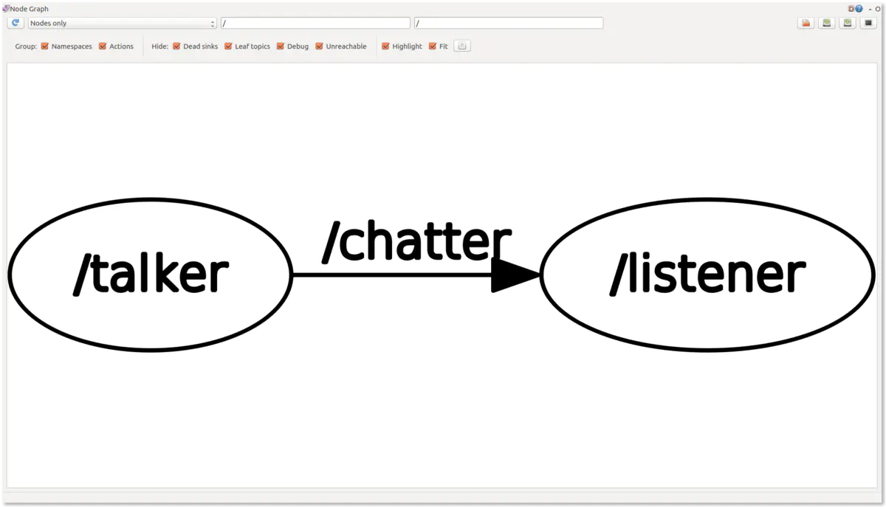


### (二) 发布接收不同类型消息1

#### 1）发布接收int类型消息
打开一个terminal．输入下面内容,创建了用来发布８位整型message的发布程序和接收程序
>cd ~/catkin_ws/src/pub_sub_test/src

>touch pub_int8.cpp

>touch sub_int8.cpp

打开pub_int8.cpp,输入

```cpp
#include "ros/ros.h"
#include "std_msgs/Int8.h" //#include "std_msgs/String.h"

#include <sstream>

int main(int argc, char **argv)
{
  ros::init(argc, argv, "talker");

  ros::NodeHandle n;

  ros::Publisher chatter_pub = n.advertise<std_msgs::Int8>("chatter", 1000); //ros::Publisher chatter_pub = n.advertise<std_msgs::String>("chatter", 1000);

  ros::Rate loop_rate(10);

  int count = 0;
  while (ros::ok())
  {
    std_msgs::Int8 msg; //std_msgs::String msg;

    // std::stringstream ss;
    // ss << "hello world " << count;
    msg.data = count;// msg.data = ss.str();


    ROS_INFO("%d", msg.data); //ROS_INFO("%f", msg.data.c_str())

    chatter_pub.publish(msg);

    ros::spinOnce();

    loop_rate.sleep();
    ++count;
  }


  return 0;
}
```

打开sub_int8.cpp,输入
```cpp
#include "ros/ros.h"
#include "std_msgs/Int8.h" //#include "std_msgs/String.h"

void chatterCallback(const std_msgs::Int8::ConstPtr& msg) //void chatterCallback(const std_msgs::String::ConstPtr& msg)
{
  ROS_INFO("I heard: [%d]", msg->data); //ROS_INFO("I heard: [%f]", msg->data.c_str());
}

int main(int argc, char **argv)
{
  ros::init(argc, argv, "listener");

  ros::NodeHandle n;

  ros::Subscriber sub = n.subscribe("chatter", 1000, chatterCallback);

  ros::spin();

  return 0;
}
```

需要添加到CMakeLists里编译，在terminal中输入
>cd ~/catkin_ws/src/pub_sub_test

>gedit CMakeLists.txt

在CMakeLists.txt里添加了下面的内容
>add_executable(pub_int8 src/pub_int8.cpp)

>target_link_libraries(pub_int8 ${catkin_LIBRARIES})

>add_executable(sub_int8 src/sub_int8.cpp)

>target_link_libraries(sub_int8 ${catkin_LIBRARIES})

保存并退出．接着在terminal中输入下面的内容
>cd ~/catkin_ws

>catkin_make

打开三个terminal.
第一个terminal中输入
>roscore

在第二个terminal中输入下面内容
>cd ~/catkin_ws/

>source devel/setup.bash

>rosrun pub_sub_test sub_int8

在第三个terminal中输入下面内容，运行程序
>cd ~/catkin_ws/

>source devel/setup.bash

>rosrun pub_sub_test pub_int8

#### 2）代码对比

首先是发布器程序
 1.`#include "std_msgs/Int8.h"`代替了`#include "std_msgs/String.h"`．

 每一种不同的消息都有自己的头文件，如果我们要使用不同的消息，就首先要包含它所在的头文件．像`Int8, String`这类都属于C++的标准数据类型，所以这些消息在ROS中也被划分到了`std_msgs`这个名字下．消息当然还有其他大类，比如我们以后要使用类似于pose的消息，它包含在geometry_msgs这个大类里．需要包含的头文件是 `#include "geometry_msgs/Pose.h"`.
 2.`ros::Publisher chatter_pub = n.advertise<std_msgs::Int8>("chatter", 1000);`　中，`std_msgs::Int8`代替了`std_msgs::String`，定义publisher的时候，它需要发布什么消息是需要指定明确的，之前是ros中的string那么现在就自然换成ros中的int8了
 3.`std_msgs::Int8 msg`　替换了　`std_msgs::String msg`.　同样你要发布的消息的类型替换掉．
 4.发布string类型的消息的代码中连续的三行

```cpp
    std::stringstream ss;
    ss << "hello world " << count;
    msg.data = ss.str();
```

直接被替换成了`msg.data = count`．我们知道原来的三行中，被注释的前两行是用来形成一个字符串的．原来的msg是std_msgs::String, msg.data就是string类型，现在msg是std::msgs_Int8，那么大概可以猜到msg.data如今就是int8类型了，考虑到我们的count本来就是一个int型变量，所以这儿直接把count赋值给msg.data了．注意这儿的类型变换是int到int8，问题不大，只是整型的范围缩小到-128到127了而已．
 5.`ROS_INFO`中msg.data本来就是int8型的变量，可以直接print出来，对应需要在ROSINFO中表明数据类型是`%d`(字符串类型是`%f`)．

 接收器程序．

1. `#include "std_msgs/Int8.h"`代替了`#include "std_msgs/String.h"`　不在赘述．

2. `chatterCallback`函数的参数由`std_msgs::String::ConstPtr& msg`变成了`std_msgs::Int8::ConstPtr& msg`

3. `ROS_INFO`中，之前msg->data是stiring类型现在是int8类型，可以直接print出来．
    主函数中没有设计到变量定义的地方，所以不需要更改．
    总结一下就是把涉及到表明数据类型的地方全部换成std_msgs::Int8就可(注意大小写)．
    
    

#### 3）ROS wiki了解需要数据类型
点进去你会发现里面有std_msgs所包含的所有信息种类．
 http://wiki.ros.org/std_msgs/


**例子:在ROS中使用double类型的变化**

创建pub_arrary.cpp

```cpp
#include "ros/ros.h"
#include "std_msgs/Float64MultiArray.h" //#include "std_msgs/String.h"

#include <sstream>

int main(int argc, char **argv)
{
  ros::init(argc, argv, "talker");

  ros::NodeHandle n;

  ros::Publisher chatter_pub = n.advertise<std_msgs::Float64MultiArray>("chatter", 1000); //ros::Publisher chatter_pub = n.advertise<std_msgs::String>("chatter", 1000);

  ros::Rate loop_rate(10);

  //int count = 0;

 // double testArray[5] = {1,2,3,4,5};  ROS使用double类型需要vector
    
  std::vector<double> testArray = {1,2,3,4,5}
  while (ros::ok())
  {
    std_msgs::Float64MultiArray msg; //std_msgs::String msg;

    // std::stringstream ss;
    // ss << "hello world " << count;
    msg.data = testArray;// msg.data = ss.str();


    ROS_INFO("I have published array data"); //ROS_INFO("%f", msg.data.c_str())

    chatter_pub.publish(msg);

    ros::spinOnce();

    loop_rate.sleep();
   // ++count;
  }
```


即`double testArray[5] = {1,2,3,4,5}`改成`std::vector<double> testArray = {1,2,3,4,5}`. 另外既然要使用vector，那么一般要添加其头文件，添加头文件`#include <vector>`，但是`"std_msgs/Float64MultiArray.h"`，已经包含了<vector>，就不用再重复包含了,`std::vector<double> testArray = {1,2,3,4,5}`这种给向量的赋值方式是C++11之后才有的，所以要添加C++11编译．ROS的CMakeLists.txt的最上面几行有一行是`#add_compile_options(-std=c++11)`，把注释符号#去掉就可以了．保存退出


在CMakeLists.txt中你之前添加编译文件的下方添加

>add_executable(pub_array src/pub_array.cpp)

>target_link_libraries(pub_array ${catkin_LIBRARIES})

在同样的位置创建一个叫sub_array.cpp的文件，内容大同小异．

```cpp
#include "ros/ros.h"
#include "std_msgs/Float64MultiArray.h" //#include "std_msgs/String.h"

void chatterCallback(const std_msgs::Float64MultiArray::ConstPtr& msg) //void chatterCallback(const std_msgs::String::ConstPtr& msg)
{
  ROS_INFO("I heard: [%f], [%f]", msg->data[0], msg->data[1]); //ROS_INFO("I heard: [%f]", msg->data.c_str());
}

int main(int argc, char **argv)
{
  ros::init(argc, argv, "listener");

  ros::NodeHandle n;

  ros::Subscriber sub = n.subscribe("chatter", 1000, chatterCallback);

  ros::spin();

  return 0;
}
```

添加好内容后保存退出，回到catkin_ws目录下使用catkin_make编译．


### (三) 发布接收不同类型消息2

#### 1）发布接收PoseStamped类型消息


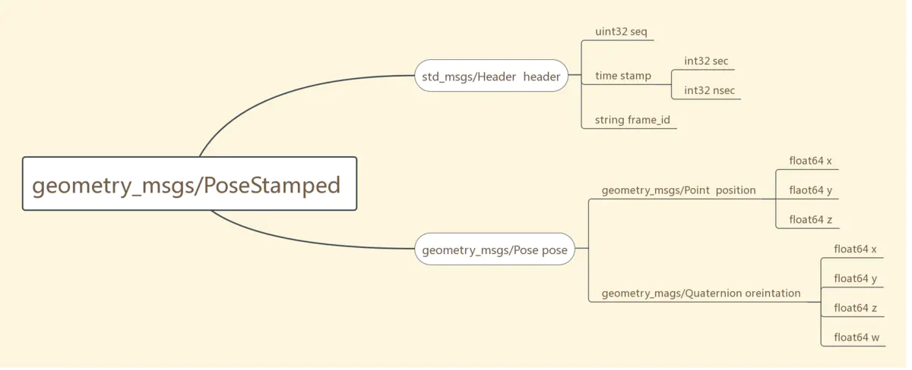

１是geometry_msgs/Point类型的`position`，而`position`包含三个float64的变量`x,y,z`，这个很好理解了，怎么定义机器人的位置？三维坐标x,y,z就可以了．
 2是geometry_msgs/Quaternion类型的'oreintation'，而`oreintation`包含四个float64的变量`x,y,z,w`，quaterion中文四元数，是一个用来表示方向的东西．四元数的缺点是不很形象，不熟的人很难直接通过四元数在脑海里构想出机器人目前到底是个什么朝向．我们一般用欧拉角表示方向时，一共有三个数roll,pitch,yaw，比较直观，但是欧拉角表示方向时会遇到一个叫Gimbal Lock（万向锁）的尴尬问题，所以ROS里统一用四元数表示方向．

在`pub_sub_test/src`中创建一个名字叫`pub_poseStamped.cpp`的文件．在文件中写入下面的内容

```cpp
#include "ros/ros.h"
#include "geometry_msgs/PoseStamped.h" //include posestamp head file

#include <cmath>//for sqrt() function

int main(int argc, char **argv)
{
    ros::init(argc, argv, "talker");

    ros::NodeHandle n;

    ros::Publisher chatter_pub = n.advertise<geometry_msgs::PoseStamped>("chatter", 10); //initialize chatter

    ros::Rate loop_rate(10);

    //generate pose by ourselves.
    double positionX, positionY, positionZ;
    double orientationX, orientationY, orientationZ, orientationW;

    //We just make the robot has fixed orientation. Normally quaternion needs to be normalized, which means x^2 + y^2 + z^2 +w^2 = 1
    double fixedOrientation = 0.1;
    orientationX = fixedOrientation ;
    orientationY = fixedOrientation ;
    orientationZ = fixedOrientation ;
    orientationW = sqrt(1.0 - 3.0*fixedOrientation*fixedOrientation); 

    double count = 0.0;
    while (ros::ok())
    {
        //We just make the position x,y,z all the same. The X,Y,Z increase linearly
        positionX = count;
        positionY = count;
        positionZ = count;

        geometry_msgs::PoseStamped msg; 

        //assign value to poseStamped

            //First assign value to "header".
        ros::Time currentTime = ros::Time::now();
        msg.header.stamp = currentTime;

            //Then assign value to "pose", which has member position and orientation
        msg.pose.position.x = positionX;
        msg.pose.position.y = positionY;
        msg.pose.position.z = positionY;

        msg.pose.orientation.x = orientationX;
        msg.pose.orientation.y = orientationY;
        msg.pose.orientation.z = orientationZ;
        msg.pose.orientation.w = orientationW;

        ROS_INFO("we publish the robot's position and orientaion"); 
        ROS_INFO("the position(x,y,z) is %f , %f, %f", msg.pose.position.x, msg.pose.position.y, msg.pose.position.z);
        ROS_INFO("the orientation(x,y,z,w) is %f , %f, %f, %f", msg.pose.orientation.x, msg.pose.orientation.y, msg.pose.orientation.z, msg.pose.orientation.w);
        ROS_INFO("the time we get the pose is %f",  msg.header.stamp.sec + 1e-9*msg.header.stamp.nsec);

        std::cout<<"\n \n"<<std::endl; //add two more blank row so that we can see the message more clearly

        chatter_pub.publish(msg);

        ros::spinOnce();

        loop_rate.sleep();

        ++count;
    }


  return 0;
}
```

发布器的代码中`fixedOrientation`的变量，赋值0.1，然后分别赋值给创建的double类型变量`orientationX,Y,Z,W`．在循环中，`orientationX,Y,Z,W`在分别赋值给我们创建的msg的成员变量`msg.pose.orientation.x y z w`．`msg.pose.orientation.x y z w`都是float64类型的变量，赋值了他们几个就可以定义pose的orientation了．orientation是相同的数，那么机器人就没有旋转．

那么pose的position的x y z我们直接赋值了count，count在循环中递增，那么XYZ都同时递增且相同．如果我们画一个三维坐标轴XYZ的话，那么咱么这儿模拟的机器人的运动状态，相当于机器人沿着坐标轴对角线匀速直线行驶．

 同样位置再创建一个`sub_poseStamped.cpp`．写入下面内容．

```cpp
#include "ros/ros.h"
#include "geometry_msgs/PoseStamped.h" 

void chatterCallback(const geometry_msgs::PoseStamped::ConstPtr& msg) //Note it is geometry_msgs::PoseStamped, not std_msgs::PoseStamped
{
    ROS_INFO("I heard the pose from the robot"); 
    ROS_INFO("the position(x,y,z) is %f , %f, %f", msg->pose.position.x, msg->pose.position.y, msg->pose.position.z);
    ROS_INFO("the orientation(x,y,z,w) is %f , %f, %f, %f", msg->pose.orientation.x, msg->pose.orientation.y, msg->pose.orientation.z, msg->pose.orientation.w);
    ROS_INFO("the time we get the pose is %f",  msg->header.stamp.sec + 1e-9*msg->header.stamp.nsec);

    std::cout<<"\n \n"<<std::endl; //add two more blank row so that we can see the message more clearly
}

int main(int argc, char **argv)
{
    ros::init(argc, argv, "listener");

    ros::NodeHandle n;

    ros::Subscriber sub = n.subscribe("chatter", 10, chatterCallback);

    ros::spin();

    return 0;
}
```

写完之后，我们同样打开位于`pub_sub_test`目录下的CMakeLists.txt添加编译两个文件的内容．

由于使用了新的依赖,所以添加新的依赖项,需要修改两个文件，一个是package目录下的CMakeLists.txt，另一个是位于同一位置的package.xml

打开CMakeLists.txt，发现就在最前面几行，有下面的内容．


```undefined
find_package(catkin REQUIRED COMPONENTS
  roscpp
  rospy
  std_msgs
)
```

括号中的内容正好一一对应我们创建package时添加的依赖项，那么想都不用想啦，肯定要在后面添加geometry_msgs，变成下面的样子，保存退出．


```undefined
find_package(catkin REQUIRED COMPONENTS
  roscpp
  rospy
  std_msgs
  geometry_msgs
)
```


添加完成后，保存退出．之后打开位于同一目录下的`package.xml`．（直接双击打开可能不能修改其中内容，还是用gedit什么的打开）．打开之后，在文档下方，你可以看到一下内容


```xml
  <build_depend>roscpp</build_depend>
  <build_depend>rospy</build_depend>
  <build_depend>std_msgs</build_depend>
  <build_export_depend>roscpp</build_export_depend>
  <build_export_depend>rospy</build_export_depend>
  <build_export_depend>std_msgs</build_export_depend>
  <exec_depend>roscpp</exec_depend>
  <exec_depend>rospy</exec_depend>
  <exec_depend>std_msgs</exec_depend>
```

又有`std_msgs, rospy, roscpp`，只不过每个出现了三次，那么同样，不用管什么意思，我们只需要按照这个文档里相同的语法让`geometry_msgs`出现三次就行了．更改之后该文件同样位置变成下面的内容


```xml
  <build_depend>roscpp</build_depend>
  <build_depend>rospy</build_depend>
  <build_depend>std_msgs</build_depend>
  <build_depend>geometry_msgs</build_depend>
  <build_export_depend>roscpp</build_export_depend>
  <build_export_depend>rospy</build_export_depend>
  <build_export_depend>std_msgs</build_export_depend>
  <build_export_depend>geometry_msgs</build_export_depend>
  <exec_depend>roscpp</exec_depend>
  <exec_depend>rospy</exec_depend>
  <exec_depend>std_msgs</exec_depend>
  <exec_depend>geometry_msgs</exec_depend>
```


保存退出后使用catkin_make编译（注意catkin_make这个命令要在catkin_ws这个目录下使用的）．


### (四) C++类，命名空间，模版，CMakeLists

#### 1）类(class)

创建一个叫C++Test的文件夹，再创建三个用于测试三种东西的子文件夹．

之后，在classTest文件夹下创建一个叫`classBasic.cpp`的文件和一个叫`CMakeLists.txt`的文件．在classBasic.cpp中输入下面内容.

```cpp
#include <iostream>

class poorPhd{
public:
    /*define constructor*/
    poorPhd(){
        std::cout<<"we create a poor phd class"<<std::endl;
    }

    /*public member variable*/
    int hairNumber = 100;

    /*public member function*/
    int getGirlFriendNumber(){
        return girlFriendNumber;
    }

private:
    /*private member variable*/
    int girlFriendNumber = 0;
};

int main(){
    /*define the object*/
    poorPhd phd;//will use constructor function 
 
    /*call the public memberfunction*/
    std::cout<<"girlFriendnNumber is "<<phd.getGirlFriendNumber()<<std::endl;

    /*change tha value of member variale*/
    phd.hairNumber = 101;

    /*call the member variable*/
    std::cout<<"hairNumber is "<<phd.hairNumber<<std::endl;

    /*define class pointer*/
    poorPhd *phdPointer;

    /*assign the pointer to an object*/
    phdPointer = &phd;

    /*call the member variable*/
    std::cout<<"use pointer, hair number is "<<phdPointer->hairNumber<<std::endl;
}
```

1:#include<>　包含头文件，这样可以使用std::cout<<...std::endl;

2:class poorPhd  定义了一个叫poorPhd的类．类后跟这宗括号{}.宗括号中的内容为类的内容．

3:public 加冒号之后的内容，即为`公有`．公有范围内定义的函数为公有成员函数，变量为公有成员变量．

4:poorPhd().　这个函数称为`构造函数(constructor function)`．在类创建时，会自动调用．构造函数的名字和类的名字必须一样并且没有返回值．

５：int hairNumber = 100.　定义了一个int类型公有成员变量，赋值100.

６：int getGirlFriendNumber().　定义了一个返回值为int的函数，该函数会返回私有成员变量girlFriendNumber.

7:private加冒号之后的内容，即为`私有`．私有范围内定义的函数为私有成员函数，变量为私有成员变量．

8: int girlFriendNumnber=0.　定义了一个int类型的私有成员变量`girlFriendNumber`并赋值为0

main函数中
 9: poorPhd phd 创建了一个类的对象(object)，名字叫`phd`．每一个类，要想实际被使用，都需要创建一个对象．对象会拥有之前我们在类中定义的所有东西．所谓拥有，即是可以调用他们．对象的数量是没有限制的，并且他们之间不会干扰．你还可以用类似方法创建一个名字加`abc`的对象，它也会拥有poorPhd这个类的全部东西．
 对象在创建时，会自动调用构造函数．

10:`std::cout....phd.getGirlFriendNumber()<<std::endl;`
 类对象调用成员函数或者成员变量的方法是`对象名.成员`．**公有成员可以在类的定义外使用这种方式直接调用，私有成员是不可以被直接调用的**．所以如果我们使用`phd.girlFriendNumber`就会报错．因为在类外，不可以直接调用私有成员变量．公有成员函数定义在类中，所以它可以使用私有成员变量，并把变量的值作为返回值，这样我们就得到可私有成员变量的值．

11.phd.hairNumber = 101;
 为公有成员变量赋值101．

12.`std::cout<<...phd.hairNumber...`
 调用公有成员并print出来．

13.`poorPhd *phdPointer` 创建一个类的指针．类的指针被创建时不会调用构造函数．它需要指向一个对象．

14.`phdPointer = &phd`　刚才创建的对象的地址赋值给指针，这个指针就有了`phd`对象的所有内容．

15.`...phdPointer->hairNumber...`　类指针调用类的成员的唯一不同之处就是使用`指针名->成员`调用而不是`对象名.成员`调用．

**和之前写的ROS代码的联系**: 之前我们定义过`std_msgs::Int8 msg`，msg即是类Int8的对象．我们通过查看roswiki http://docs.ros.org/api/std_msgs/html/msg/Int8.html 得知Int8包含类型为int8的成员变量data，所以我们通过`msg.data`使用这个成员．


打开之前建立的CMakeLists.txt文件．输入以下内容．

```bash
project(class_test)

cmake_minimum_required(VERSION 2.8)
set(CMAKE_CXX_FLAGS "${CMAKE_CXX_FLAG} -std=c++11 -Wall")

add_executable(classBasic classBasic.cpp)
```

这基本上算是一个最简单的CMakeLists.txt文件了．CMakeLists.txt是用来编译C++文件的．
 第一行表明了项目名称．
 第二行输入CMake使用的最小版本号，一般是2.8以及以上．
 第三行设定编译器．使用c++11．虽然我们的项目没用到c++11但是考虑到如今c++已经被普遍使用了，所以最好加上．我们在ROS的CMakeLists里注释过这个内容`add_compile_options(-std=c++11)`达到的也是使用c++11编译的效果．
 第四行指定要编译的文件．要编译的文件是classBasic.cpp，编译后的可执行文件名字叫classBasic．
 写完上面的内容后，保存退出．
 在terminal中cd 到`classTest`这个文件夹输入下面的内容

```bash
mkdir build
cd build
cmake ..
make
```

第一二行命令创建一个叫build的文件夹并进入
 第三行命令使用是使用cmake命令并通过`..`表示使用上一个文件夹的CMakeLists.txt．执行这行命令之后我们写的CMakeLists就会产生一系列的文件在build中，其中一个是Makefile．
 执行完上面的命令后，你会看到多了一个叫`classBasic`的文件没有后缀，这就是我们的可执行二进制文件了．使用`./classBasic`执行后得到下面的输出

```kotlin
we create a poor phd class
girlFriendnNumber is 0
hairNumber is 101
use pointer, hair number is 101
```


 在classTest文件夹下再创建一个新的文件叫 classBasic2.cpp．并输入下面的内容．

```cpp
#include <iostream>

class poorPhd{
public:
    /*define constructor*/
    poorPhd(){
        std::cout<<"we create a poor phd class"<<std::endl;
    }

    /*public member variable*/
    int hairNumber = 100;

    /*public member function*/
    int getGirlFriendNumber(){
        return girlFriendNumber;
    }

private:
    /*private member variable*/
    int girlFriendNumber = 0;
};

class master1 {
public:
    /*define constructor*/
    master1(){
        std::cout<<"we create a master class"<<std::endl;
    }
    /*member variable*/
    poorPhd future;
};


int main(){
    /*define the object*/
    master1 mStudent1;

    /*use inheritance*/
    std::cout<<"hairNumber of master student 1 is "<<mStudent1.future.hairNumber<<std::endl;
}
```

`poorPhd`类和上一个文件完全一样，新添加了一个类叫`master1`．master1同样有一个构造函数．另外它有一个成员变量，这个成员变量是poorPhd类型的对象future.那么在main函数中，定义了master1的对象mStudent1．咱们就可以用mStudent1.future调用变量future，再由于future是poorPhd类型的变量，所以可以用future.hairNumber调用hairNumber．连在一起就可以通过定义msater1的对象却最终调用了poorPhd的成员变量了．
 保存退出后，在CMakeLists.txt中添加下面的内容．


```css
add_executable(classBasic2 classBasic2.cpp)
```

terminal中进入classTest/build文件加输入


```go
cmake ..
make
```

这时候就多了一个二进制文件classBasic2，执行该二进制文件你会看到


```kotlin
we create a poor phd class
we create a master class
hairNumber of master student 1 is 100
```

从这个输入可以看出，创建master1的对象mStudent1的时候c++会首先初始化它的成员变量，所以咱得到的是create a poor phd class，之后再调用了构造函数．

#### 2）命名空间(namespace)

命名空间一般是用来避免重命名的．大型的库里面一般定义了很多类，无数的函数．不同的大型的库之间很可能会有函数甚至类的命名重复，这会造成很大的麻烦．
 namespace的命名语法也很简单

```csharp
namespace name{
    //内容
}
```

下面这个程序简单地展示了两个命名空间里定义相同名字的类，并分别使用两个类的简单程序．

```cpp
#include <iostream>

/*define a phd namespace*/
namespace phd {

    /*define a student class in phd namespace*/
    class student{
    public:
        student(){
            std::cout<<"create a student class in phd namespace"<<std::endl;
        }
        int graduateYear = 5;
        int hairNumber   = 100;
    };
}

/*define a master namespace*/
namespace master{

    /*define a student class in master namespace*/
    class student{
    public:
        student(){
            std::cout<<"create a student class in master namespace"<<std::endl;
        }
        int graduateYear = 2;
        int hairNumber   = 10000;
    };
}

int main(){

    /*create an object of student class, in phd namespace*/
    phd::student     phdStudent;

    /*create an object of student class, in master namespace*/
    master::student  masterStudent;

    std::cout<<"phd normally graduate in "<<phdStudent.graduateYear<<" years"<<std::endl;

    std::cout<<"master normally graduate in "<<masterStudent.graduateYear<<" years"<<std::endl;
}
```

上面的这个程序定义了两个命名空间，一个叫`phd`，一个叫`master`，这两个命名空间拥有一个类，类名都叫`student`．
 定义命名空间中的类的对象的方法是`命名空间名::类名　对象名`．`::`被称为作用域符号(scope resolution operator)．在main函数中我们定义了phd命名空间下的student类的对象phdStudent和master命名空间下的类student的对象masterStudenrt.　后面的两行各自输出了成员变量`graduateYear`．
 在我们之前的ros程序中，遇到了两个命名空间，一个是`std_msgs`，另一个是`geometry_msgs`．`Int8, Float64`等都是std_msgs这个命名空间下的类，`PoseStamped`等是geometry_msgs这个命名空间下的类．
 回到上面的程序我们在定义完phd这个命名空间后，可以使用`using namespace phd`，这样在main函数中我们可以不使用`phd::`来定义一个phd下的student类的对象,直接`student phdStudent`即可．同样，如果我们添加`using namespace master`，我们也可以直接使用`student masterStudent`来定义msater命名空间下student类的对象．
 但是如果在程序中同时添加了

```csharp
using namespace phd;
using namespace master;
```

这时候你在main函数中写`student object_name`就肯定会报错．因为电无法知道你要使用的student类是属于哪个命名空间的．所以一般为了图方便，在确定没有类名会重复时，我们添加`using namespace ...`这一行在定义完头文件之后，这样我们就可以省去在定义类时一直使用`namespace_name::类名`这种格式命名．但是有些时候如果两个库很有可能有相同的类名，就不要使用`using namespace ...`，不然很有可能造成程序的误解．


#### 3）模版(Template)

```cpp
#include <iostream>

int square(int a){
    return a*a;
}

int main(){
   double x = 5.3;
   std::cout<<"the square of "<<x <<" is "<<square(x)<<std::endl;
}
```

这个程序有个很明显的缺点，编写函数或者使用变量时，都必须先指定类型，由于c++函数形参类型和返回值已经指定为int类型了，你只能传int类型进去，如果传double类型的变量进去，变量会被强制转换截断为int类型．而且只能return整型的变量．所以你只能得到25．
 基本的解决方法是函数的重载，即我可以命名相同的函数但是变量类型或者个数不同以实现对不同输入的处理．类似于下面这样

```cpp
#include <iostream>

int square(int a){
    return a*a;
}

double suqare(double a ){
    return a*a;
}

int main(){
   double x = 5.3;
   std::cout<<"the square of "<<x <<" is "<<square(x)<<std::endl;
}
```

这样调用square(x)时会自动匹配形参相同的函数．我们可以得到5.3的平方．但是可以想象，如果我有很多不同类型的变量要传入，我就得写好多不同的除了变量类型不同，其他的一模一样的函数了！
 模版应运而生．模版的定义方式是

```cpp
template <typename T>
```

或者

```cpp
template <class T>
```

定义完之后后面紧跟要实现的函数或者是类．这个class不是我们之前理解的那种class了．这儿的class和typename作用完全一样，表示定义了一个新的类型T．这个新的类型具体是什么不知道，要等我们具体使用时程序根据传入的类型自行判断．
实现数字平方相同的功能.

```cpp
#include <iostream>

template <typename T>
T square(T a){
    return a*a;
}

int main(){
    double x = 5.3;
    std::cout<<"square of "<<x<<" is "<<square(x)<<std::endl;
}
```

现在你无论传什么类型的数据进去，都会得到它的平方．sqaure指定的函数形参和返回值类型都为T．可以这样理解，现在当我们传入一个double类型的变量时，T就会自动变成double，传入int时，T就自动变为int．
我们定义向量时要指定向量元素的类型．比如`std::vector<int> a`，`std::vector<double> b`等．和上一个例子一样，为了避免传入重载函数，我们使用模版．代码如下

```cpp
#include <iostream>
#include <vector>

template <typename T, typename U>
U addVector(T vec1, U vec2){
    
    U result;

    if(vec1.size()!=vec2.size()){
        std::cout<<"cannot add two vector, they must be the same length. Return a null vector"<<std::endl;
        return result;
    }

    for(int i = 0; i<vec1.size(); i++){
        result.push_back(vec1[i]+vec2[i]);
    }
    return result;
}

int main(){
    std::vector<int> vec1 = {1,2,3};
    std::vector<double> vec2 = {4.0,5.0,6.0};

    auto addVec = addVector(vec1,vec2);

    for(auto i:addVec)
        std::cout<<i<<",";

    std::cout<<std::endl;
}
```

我们的tempalte定义了两个类型，一个叫U，一个叫T．为什么要定义两个呢？因为前面说过模板定义的具体类型在使用时确定的，在主函数中我们要加两个vector,一个是int类型的，作为第一个参数传入addVector，那么T就会是`std::vector<int>`，而第二个参数是double类型的向量，作为第二个参数传入函数后U就会相当于`std::vector<double>`，函数返回的类型也是U.
 程序主函数第三行使用了`auto`这个关键字．使用c++11编译才可使用auto．这个是很有用的关键字．auto会自动分配被它定义的对象的类型，根据赋值的变量的类型．addVector返回的是U，在这个程序里也就是std::vector<double>了．那么auto会自动让addVec称为dpuble类型的vector．
 主函数第四行的for循环采用的是有别于我们常用的for循环的形式．

```cpp
for(auto i:addVec)
```

其中`i:addVec`的作用是把addVec中的元素依次赋值给i，这就要求i的类型得和addVec中的元素的类型相同，不过有auto的帮助，我们也就不用管这么多了，把i的类型定义为auto，那么程序会自动让i成为addVec中要赋值给i的元素的类型，这儿也就是double了．

 我们来建立一个简单的sqaure类．

```cpp
#include <iostream>

template <typename T>
class square{
public:
    T a;
    /*constructor function will store _a*_a as public member a*/
    square(T _a){
        a = _a*_a;
    }
};


int main(){
    double x = 5.5;
    square<double> test(x);
    std::cout<<"the square of "<<x<<" is "<<test.a<<std::endl;
}
```

在声明了模版之后紧接着我们声明了一个类，类的公有成员函数是一个类型为T的值a．主函数中，在我们声明模版下定义的类的对象时，我们需要在`<>`之中表明T的类型．再这之后才能定义对象．即普通的类的对象的定义格式如下

```undefined
类名　对象名(构造函数参数)
```

模版下的类的对象定义的格式就是

```xml
类名<模版变量类型> 对象名(构造函数参数)
```

main函数第二行的这种定义方法，就类似于我们`std::vector<int> ABC`这种定义方法了，后者多的不过是在命名空间下定义了模版．然后再在模版下定义类．


### (五) 在类中发布和接收消息
#### 1）例一

创建pub_int8_class.cpp和sub_int8_class.cpp．在pub_int8_class.cpp中输入以下内容．

```cpp
#include "ros/ros.h"
#include "std_msgs/Int8.h"

class pubInt8{
public:
   pubInt8(ros::NodeHandle& nh){
       chatter_pub = nh.advertise<std_msgs::Int8>("chatter", 1000); //assign value to chatter_pub
   };

   void pub(){
       int count = 0;
       ros::Rate loop_rate(10);
       while (ros::ok())
       {
           std_msgs::Int8 msg; 

           msg.data = count;// msg.data = ss.str();

           ROS_INFO("%d", msg.data);

           chatter_pub.publish(msg);

           ros::spinOnce();

           loop_rate.sleep();
           ++count;
       }
   }

private:
   ros::Publisher chatter_pub;//set the publisher as a member
};

int main(int argc, char **argv)
{
 ros::init(argc, argv, "talker");

 ros::NodeHandle n;

 pubInt8 p8(n);

 p8.pub();

 return 0;
}
```

对比我们在第二节中的pub_int8.cpp中的内容, 总的来说大同小异．
 我们把ros::Publisher chatter_pub作为类的一个私有成员成员变量定义在了类中．这时候并没有对它赋值．然后在构造函数中才对他赋值的．
 对publisher赋值需要rosNodeHandle，所以我们在创建对象时把rosNodeHandle作为一个参数传入了构造函数，这样我们就可以在构造函数中为chatter_pub赋值．
 之后在主函数中我们使用类的pub函数实现信息的发布，发布的部分的代码和pub_int8.cpp中的一模一样．

下面来看看sub_int8_class.cpp

```cpp
#include "ros/ros.h"
#include "std_msgs/Int8.h" 

class subInt8{
public:
    subInt8(){};
    void chatterCallback(const std_msgs::Int8::ConstPtr& msg){
        ROS_INFO("I heard: [%d]", msg->data);
    }
};

int main(int argc, char **argv)
{
  ros::init(argc, argv, "listener");

  ros::NodeHandle n;

  subInt8 s8;

  ros::Subscriber sub = n.subscribe("chatter", 1000, &subInt8::chatterCallback, &s8);

  ros::spin();

  return 0;
}
```

同样来看看和sub_int8.cpp不同的地方．
 callback函数内容一模一样，只是放到了类中．
 在定义subscriber时和不使用类时有很大的不同．
 不使用类时，我们是这么写的
 `ros::Subscriber sub = n.subscribe("chatter", 1000, chatterCallback);`
 使用类时，我们是这么写的
 `ros::Subscriber sub = n.subscribe("chatter", 1000, &subInt8::chatterCallback, &s8);`

即原来我们只需要把回调函数名作为参数写在n.subscribe中，现在我们需要用`&类名::函数名`代替原来那个参数，之后还需要增加一个参数，即在定义subscriber之前定义好的类的对象名`&对象名`．

把这两个程序写入CMakeLists中，catkin_make后使用rosrun跑起来．会得到第二讲pub_int8程序一样的效果．
 (注意不要死板，使用要灵活．比如说你写了一个在类中发布消息的程序，你不仅需要在构造函数当中使用rosNodeHandle，还需要在其他函数中使用，怎么做？你可以把ros::NodeHandle也作为一个私有成员（或者公有成员）写在类中，使用构造函数把外来这个nodeHandle传值给私有成员nodeHandle．或者甚至不在构造函数传值，专门写一个register　nodehandle的函数)

```cpp
void registerNodeHandle(ros::NodeHandle& _nh){
    nh = _nh; //_nh is a member in class, _nh is the nodehandle you define, for example, in main function.
}
```

这样nh属于你的类，你就可以在类的其他函数进行任何有关它的操作了．
 在类外，你只需要定义一个该类的对象，通过 `对象.registerNodeHandle(主函数中(或者其他位置)定义的NodeHandle)`把nodehandle传入类中．

#### 2）例二

首先写一个叫pubSub_class_example2A.cpp的程序，代码如下

```cpp
#include "ros/ros.h"
#include "std_msgs/Float64.h"
#include <unistd.h>

class tl1{
public:
    tl1();
    void registerNodeHandle(ros::NodeHandle& _nh);
    void registerPubSub();
    void iniPub();
    void fCallback(const std_msgs::Float64::ConstPtr& msg);
private:
    ros::Publisher pub_f64;
    ros::Subscriber sub_f64;
    ros::NodeHandle nh;
};

int main(int argc, char **argv){

    ros::init(argc, argv, "talker_listener1");

    ros::NodeHandle nh;

    tl1 pubSub1;

    pubSub1.registerNodeHandle(nh);
    pubSub1.registerPubSub();

    pubSub1.iniPub();

    ros::spin();
}

tl1::tl1(){};

void tl1::registerNodeHandle(ros::NodeHandle& _nh){
    nh = _nh;
};

void tl1::registerPubSub(){
    pub_f64 = nh.advertise<std_msgs::Float64>("chatter1to2",1000);
    sub_f64 = nh.subscribe("chatter2to1",1000,&tl1::fCallback, this); //this pointer here means the class itself
};

//When you receive some data, it is highly possible you do some operations on that data and then publish something in/after the call back function
void tl1::fCallback(const std_msgs::Float64::ConstPtr& msg){
    std::cout<<"talker_listener1 heard "<<msg->data<<std::endl;

    std_msgs::Float64 pubData;

    pubData.data = msg->data - 1;

    ros::Rate sr(10);
    pub_f64.publish(pubData);
    sr.sleep();
};

void tl1::iniPub(){
    std::cout<<"publish the first data "<<std::endl;

    std_msgs::Float64 pubData;

    pubData.data = 1;

    usleep(500000);//wait for connection
    pub_f64.publish(pubData);
}
```

接下来写一个pubSub_class_example2B.cpp的程序．

```cpp
#include "ros/ros.h"
#include "std_msgs/Float64.h"

class tl1{
public:
    tl1();
    void registerNodeHandle(ros::NodeHandle& _nh);
    void registerPubSub();
    void fCallback(const std_msgs::Float64::ConstPtr& msg);
private:
    ros::Publisher pub_f64;
    ros::Subscriber sub_f64;
    ros::NodeHandle nh;
};

int main(int argc, char **argv){

    ros::init(argc, argv, "talker_listener2");

    ros::NodeHandle nh;

    tl1 pubSub1;

    pubSub1.registerNodeHandle(nh);
    pubSub1.registerPubSub();

    ros::spin();
}

tl1::tl1(){};

void tl1::registerNodeHandle(ros::NodeHandle& _nh){
    nh = _nh;
};

void tl1::registerPubSub(){
    pub_f64 = nh.advertise<std_msgs::Float64>("chatter2to1",1000);
    sub_f64 = nh.subscribe("chatter1to2",1000,&tl1::fCallback, this); //this pointer here means the class itself
};

//When you receive some data, it is highly possible you do some operations on that data and then publish something in/after the call back function
void tl1::fCallback(const std_msgs::Float64::ConstPtr& msg){
    std::cout<<"talker_listener2 heard "<<msg->data<<std::endl;

    std_msgs::Float64 pubData;

    pubData.data = msg->data + 1;

    ros::Rate sr(10);
    pub_f64.publish(pubData);
    sr.sleep();
};
```

两个文件代码基本一样，
 不同的地方是
 1:...B中没有iniPub这个函数．
 2:两个程序的node名字和topic名字有些差异，方便建立连接，自行观察，一会儿用rqt_graph就可以更明了地看到．
 针对pubSub_class_example2A把代码中比较重要的点说明一下
 1:在tl1的类中我们把ros NodeHandle也作为类的成员了，专门谢了一个registerNodeHandle的函数把nodeHandle传递到类中．另外类成员不仅有了publisher还有subscriber．我们也专门写了一个registerPubSub函数来给publisher和subscriber赋值．这样写虽然我们麻烦了一些，但是代码读起来就更加明了．
 2:这里注意一下registerPubSub中给sub_f64赋值的方法，最后一个参数是this指针．我们的第一个例子在类外定义了subscriber，最后一个参数是类的对象，我们要在类中定义subscriber，不可能给一个类的对象了，毕竟这时候我们都还不知道对象叫啥．**最流行的说法是this指针指针指向类本身．当我们在类中需要指定类对象的时候，就可以用this指针代替那个我们不知道的对象**．
 3:回调函数fCallback中我做了一个很无聊的事儿，就是把接收到的数据减１而已．这代表了对你接收到的数据以操作．实际运用中你可能有很复杂的操作．这一系列操作完成后你需要将结果发布出去．我们再以每秒１０次的频率发布出去．
 ４：iniPub函数用来初始化发布一个数据，这样2B程序的subcriber接收到后经过一系列操作(我其实就是加了１==)，发布出来再被我们这个程序的subcriber接收，即fCallback接收，"一系列操作"(其实就是减１...)再发布出去，如此循环．
 这里注意到有一个usleep(500000)代表休眠500ms，至关重要．两个节点的通过topic建立起来联系是需要时间的．我们这个程序，如果没有休眠一下，可以说程序一跑起来瞬间消息就发布出去了．但是我们接下来要写的另一个节点和这个节点还没连接起来，说白了就是ROS没反应过来．那这个消息就漏掉了．有些程序漏掉一两个消息没关系，我们这个程序第一个消息漏掉了就没有然后了．因为B程序没有接收到消息就没办法发布，A程序就没法接收，也没法继续发布了．
 **当你一则消息都不想漏掉时让程序睡一会儿，等待节点连接起来再发布消息**．
 把两个代码写进CMakeLists跑起来，注意先跑B程序，如果先跑A程序，因为只休眠了500ms，你A程序iniPub的消息在你慢悠悠地在另一个terminal中跑B程序的时间之前也已经发布出去了并被漏掉了．跑起来后Ｂ可以看到一个程序一直接收１，另一个一直接收０．这时候再开一个terminal，像第一讲一样输入rqt_graph，可以看到下图.

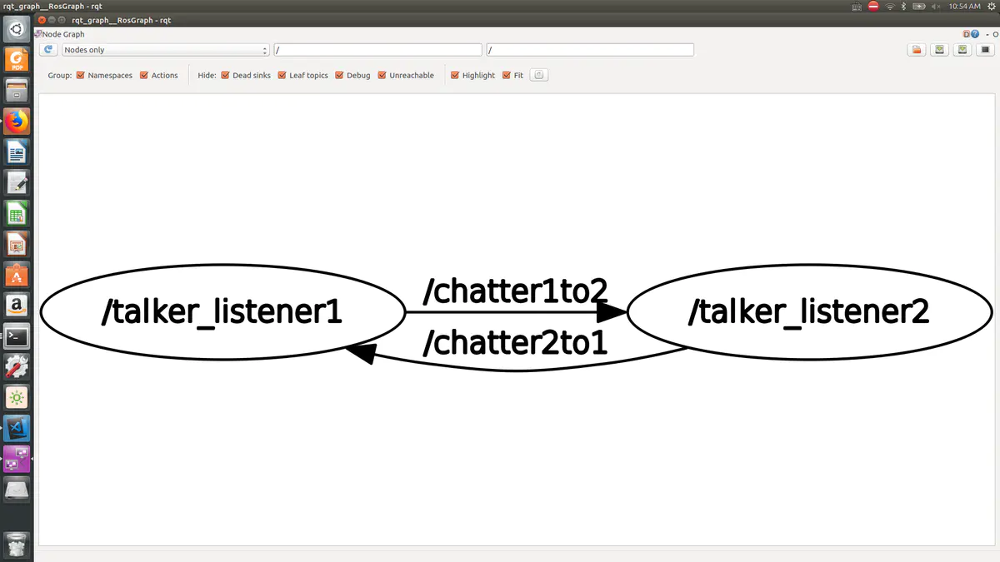

程序Ａ，即节点talker_listener1中通过topic chatter1to2把消息发送给节点talker_listener2，talker_listener2把消息接收到后，在callback函数中一系列操作再通过topic chatter2to1把消息发布回talker_listener1．可以回看代码中两个程序的subcriber和publisher赋值时他们对应的topic名字与这个图联系起来．


### (六) 使用roslaunch
#### 1）利用roslaunch同时启动数个节点

1:在我们最开始建立的pub_sub_test这个文件夹下建立一个新的文件夹，名字叫`launch`
 2:在launch中建立的一个文件，名字可以随意，后缀必须是launch．我们起名为`pub_int8.launch`
 3:用gedit或者你自己的IDE打开launch文件，输入下面的内容

```xml
<launch>
    <node name="pub_int8" pkg = "pub_sub_test" type = "pub_int8">
    </node>
</launch>
```

roslaunch使用的是xml语言，不过这种语言不需要专门学习了，大家就看这个例子就懂了．launch文件的内容是跑一个node最简单的形式．`<launch>`,`<\launch>`表示launch文件的开始和结束．要开始一个节点，那么内容很简单，第二行，<node ....>表示接下来输入node相关的内容，比如说首先输入的是node的名字，这个东西一般和type后面输入的内容一样，`type`需要被赋值为节点对应的可执行文件的名字，`name`则是节点的名字．具体区别是你在CMakeLists.txt文件里编译文件的命令

```css
add_executable(abc ABC.cpp)
```

中abc就是你需要填写在`type`后的内容，而填写在name后的内容，就是你的节点名字

```cpp
ros::init(argc, argv, "abcde");
```

ros程序中的这一行的`abcde`也是节点名,如果你程序中起的节点名字和launch文件中name后面对应的名字不同，ros会采用name后面的名字作为节点名。当你使用rqt_graph观察时，你看到的代表此程序的名字就是abcde了。一般我们把name和type后都接一样的名字，比如这儿都用的`pub_int8`。但是如果我们有时候需要把一个可执行文件同时作为数个节点运行，我们就需要给他们不同的节点名，即相同的type不同的name。
 即我们在cmakelists中add_executable(A a.cpp b.cpp)的A.　这里就是`pub_int8`，pkg参数被赋值为节点存在于哪个package，我们这儿自然是`pub_sub_test`．`</node>`表示要输入node相关的信息结束．
 其实总的来说，roslauch的最简形式，和我们使用rosrun差不多，指定了那个package和哪个node．接下来就是跑程序了．
 4:打开一个terminal,进入到我们创建的workspace，即之前创建的`catkin_ws`文件夹，和跑rosrun之前一样，我们先source.

```bash
cd catkin_ws
source devel/setup.bash
```

和跑rosrun之前不一样的是，如果我们没有开一个terminal跑`roscore`,运行roslaunch文件后rosmaster会自动启动．当然你关闭了roslaucn之后rosmaster也会关闭．
 5:运行roslaunch．接着在你的terminal中输入

```css
roslaunch pub_sub_test pub_int8.launch
```

格式和使用rosrun时相似，`roslaunch package_name launch_file_name`
 这时候节点就会跑起来开始发布消息了．我们可以用rosrun跑sub_int8的程序来检查一下．
 打开另外一个terminal

```bash
cd catkin_ws
source devel/setup.bash
rosrun pub_sub_test sub_int8
```

这时候可以看到在sub_int8节点中接收到信息．
使用roslaunch时，它默认把来自节点print出来的信息存放到一个log文件里面二不直接print在屏幕上．那么我们如何显示出来呢？output赋值为screen．模仿name, pkg这几个东西的赋值方式，我们只需要把roslaunch文件修改成下面的样子就可以了

```xml
<launch>
    <node name="pub_int8" pkg = "pub_sub_test" type = "pub_int8" output = "screen">
    </node>
</launch>
```

这时候再跑这个launch文件，我们就可以看到terminal中显示了我们发布的消息了．
接下来我们同时启动两个节点．我们同时启动以前写过的pub_int8和pub_string. 其实非常简单,　再相同的位置再写一个叫`double_pub.launch`的文件，在里面输入下面的内容．

```xml
<launch>
    <node name="pub_string" pkg = "pub_sub_test" type = "pub_string" output = "screen">
    </node>
    <node name="pub_int8" pkg = "pub_sub_test" type = "pub_int8" output = "screen">
    </node>
</launch>
```

我们就是把定义pub_int8的launch文件中多加了行类似的pub_string的东西，大家进行简单的比对就能看懂．以同样的方式跑这个launch文件，我们就可以看到两个publisher在同时发布消息．

### 

#### 2）利用roslaunch传递参数

建立一个新的pakcage

```bash
cd catkin_ws/src
catkin_create_pkg read_param_test roscpp rospy std_msgs
cd ..
catkin_make
```

这就建立好一个新的pakcage了．在这个pakcage的src文件夹中我们建立一个名叫show_param.cpp的文件．在文件中输入下面的内容

```cpp
#include "ros/ros.h"

int main(int argc, char **argv){

    ros::init(argc, argv, "show_param");

    ros::NodeHandle nh;

    double noise;
    nh.getParam("noise", noise);

    ROS_INFO("noise parameter is................... %f", noise);
};
```

保存退出后，进入该package的CMakeLists.txt，编译show_param.cpp，在CMakeLists中加入

```bash
add_executable(read_param src/show_param.cpp)
target_link_libraries(read_param ${catkin_LIBRARIES})
```

保存退出后使用catkin_make编译．
 之后在package中创建一个launch文件夹，在launch文件夹中创建一个名叫read_param.launch的文件，写入如下内容。

```xml
<launch>
    <param name = "noise" type = "double" value = "10.0" />
    <node name="read_param" pkg = "read_param_test" type = "read_param" output = "screen">
    </node>
</launch>
```

我们把show_param.cpp和这个launch文件结合起来读一下。
 在show_param.cpp中，到double noise的部分大家应该已经熟悉了，之后的一行是
 `nh.getParam("noise", noise)`nh是之前定义的nodehandle了，getParam为获取参数的函数，函数的参数，第一个是`"noise"`这个noise对应的是你在launch文件里为要传递的参数取的名字，即read_param.launch中`param name`后面跟的那个"noise"；getParam的第二个参数是你在程序中定义的变量的名字，即定义的`double noise`。

可以看出param中的name和程序中的变量名不需要一样，但是在实际使用中，我们为了不让自己搞混，通常param里给变量什么名字在launch文件里就给变量什么名字。程序中定义的变量类型和launch文件中type参数所赋的值保持，都是double. launch文件中通过给value一个double类型的数值给变量赋值。经过上面的操作，launch文件中的10就会传给程序中的noise。

下面我们来跑一下程序,打开terminal，输入

```bash
cd catkin_ws
source devel/setup.bash
roslaunch read_param_test read_param.launch
```

注意一下，通常我们source 之后，输入roslaunch或者rosrun，按空格之后输入package的前几个字母按tap建可以获取完整的package的名字，但是如果这是一个新建的package我们第一次使用时需要手动把整个名字输进去才行。
 程序跑起来后我们就可以看到terminal中有一行

```css
[ INFO] [1550108193.348086703]: noise parameter is................... 10.000000
```

证明参数已经读取成功了。

再传递一下srting类型，向量类型的参数。
 完全一样的方法，我们如下修改launch file

```xml
<launch>
    <param name = "noise" type = "double" value = "10.0" />
    <param name = "string_var" type = "string" value = "abc" />
    <node name="read_param" pkg = "read_param_test" type = "read_param" output = "screen">
    </node>
</launch>
```

可以看到只是添加了一行代码，定义变量名字叫`string_var`，值为`abc`，类型为`string`。自然要在程序中读取这个参数你就需要在代码中定义一个string类型的变量，用nh.getParam读取，这儿不再赘述。

如果我们想传递一个数组呢？其实是不能直接通过<param...>这种形式直接添加一个数组的。我们可以参考官网
 [http://wiki.ros.org/roslaunch/XML/param](https://links.jianshu.com/go?to=http%3A%2F%2Fwiki.ros.org%2Froslaunch%2FXML%2Fparam)
 在Attributes, type那一行可以看到type一共有

```swift
"str|int|double|bool|yaml"(optional)
```

五种形式，其中并不包含数组。
 要从外部传递数组的话，需要使用rosparam，简单来讲，把launch添加一行

```xml
<launch>
    <param name = "noise" type = "double" value = "10.0" />
    <param name = "string_var" type = "string" value = "abc" />
    <rosparam param="a_list" >[1, 2, 3, 4]</rosparam>
    <node name="read_param" pkg = "read_param_test" type = "read_param" output = "screen">
    </node>
</launch>
```

在程序中添加两行

```cpp
std::vector<int> a_list;
nh.getParam("a_list",a_list)
```

即可把[1,2,3,4]这个vector传递到程序中的a_list中。当我们遇到参数很多的程序时，我们需要使用yaml文件。

什么是yaml文件呢？yaml文件是使用一种特定结构来储存外部参数的文件。先不说我们要传递数组什么的，设想你有一个大型的程序，需要从外部读取数十个上百个参数，你把这些参数全部用<param...>形式写到launch文件中会让launch文件显得特别冗长，使用起来并不友好。而有了yaml文件的帮助，我们可以把所有要读取的参数全部写到yaml文件中去，然后launch文件中只需要一行代码读取yaml文件即可。

yaml文件内容的固定格式是

```undefined
变量名: 变量值
```

在`read_param_test`这个pakcage中创建一个叫config的文件夹，在该文件夹里面创建一个叫`read_param_test.yaml`的文件，打开并输入下面的内容。

```css
noise: 10.0
string_var: abc
vector_var: [1,2,3]
```

前两个变量是我们之前在launch文件中通过写<param...>传递的参数，现在试着通过yaml文件传递一下参数。至于第三个一看就是个向量(数组)了。
 注意在yaml文件中我们不需要指定变量类型什么的了，`变量名: 变量值`是它的固定格式，变量值包含非数字的量它会自动认为这是string类型变量，纯数字的值，如果不包含小数则会认为是int类型的变量，包含小数则是double类型的变量。
 接着写一个新的launch文件来读取这个yaml文件，进而能把yaml文件的值传递到程序中去。我们在之前建立的launch文件夹中新建一个launch文件，叫`read_param_from_yaml.launch`。写入下面的内容

```xml
<launch>
    <rosparam file="$(find read_param_test)/config/read_param_test.yaml" command="load" />  
    <node name="read_param" pkg = "read_param_test" type = "read_param" output = "screen">
    </node>
</launch>
```

可以看到launch文件的开头和结尾，<node...>那一行和之前写的读取参数的launch文件相比没有变化，变化的是我们有了一行<rosparam...>来读取yaml文件。
 rosparam后面接的第一个参数`file`用来指定yaml文件的地址，其中`$(find read_param_test)`表示read_param_test这个package的路径，之后建立的config文件夹，再接刚刚创建的read_param_test.yaml。第二个参数表示需要加载即读取yaml文件中的参数。
 接下来就是我们的读取程序了。其实如果不需要读取那个向量的话其实程序不需要修改，不过这儿要读取向量我还是把程序写出来吧。

```cpp
#include "ros/ros.h"
#include <string>
#include <vector>

int main(int argc, char **argv){

    ros::init(argc, argv, "show_param");

    ros::NodeHandle nh;

    double noise;
    if(nh.getParam("noise", noise))
        ROS_INFO("noise is %f", noise);
    else
        ROS_WARN("didn't find parameter noise");

    std::string string_var;
    if (nh.getParam("string_var", string_var))
        ROS_INFO("string_var: %s", string_var.c_str());
    else
        ROS_WARN("No string_var name message");

    std::vector<int> a_list;
    if (nh.getParam("a_list",a_list))
        ROS_INFO("get a_list");
    else
        ROS_WARN("didn't find a_list");
    
    std::vector<int> vector_var;
    if (nh.getParam("vector_var",vector_var))
        ROS_INFO("got vector");
    else
        ROS_WARN("didn't find vector");
};
```

把寻找参数的代码稍微修改了一下。人们在写yaml文件或者程序中的变量时常常手误，二者名字匹配不上还觉得自己写对了呀。这时候来个类似于

```bash
    if(nh.getParam("noise", noise))
        ROS_INFO("noise is %f", noise);
    else
        ROS_WARN("didn't find parameter noise");
```

这几行代码会让人很愉快。nh.getParam是有返回值的，如果找到了参数，则返回true，没有找到则返回false，基于这一点，我们可以在找不到时利用ROS_WARN输出信息，如果找到了变量，则输入它的值之类的，让我们能更方便地debug。
 好了yaml文件,launch文件，程序都弄好了，接下来使用catkin_make编译好程序后。使用

```css
roslaunch read_param_test read_param_from_yaml.launch
```

跑程序，你就应该能看到想要的结果了。


### (七) 使用rosbag
#### 1）使用rosbag采集数据

**rosbag在采集数据时自身相当于一个subscriber程序**

然后在terminal中，写入下面内容

```undefined
rosbag record /chatter -O record_poseStamped 
```

这行命令第一个是表示我们要使用rosbag相关命令了，第二个record表示我们想要采集(记录)数据。
 第三个，由于我们之前说了，rosbag在采集数据时自身相当于一个subscirber程序，既然要subscribe，那么我们肯定需要指定subscriber哪个topic了，观察我们在pub_poseStamped.cpp中，定义topic那一行我们定义的topic的名字是chatter，于是我们就在第三个参数写入`/chatter`表示记录这个topic发布出来的信息。rosbag可以同时记录多个topic的信息，你只需要在record后接`/topicA /topicB /topicC....`即可。
 命令行中-O及其后面的参数，是用来给bag文件命名的。我们在记录结束之后，rosbag的名字就会是`record_poseStamped.bag`，(如果参数是-o，那么记录名字会自动加上年月日时间，比如上面的例子如果用`rosbag record /chatter -o record_poseStamped`，输出会是`record_poseStamped-2019-09-08-15-24-05.bag`)。按下确认键后，你会看到下面的消息

```csharp
[ INFO] [1551144307.272157111]: Subscribing to /chatter
[ INFO] [1551144307.274766644]: Recording to record_poseStamped.bag.
```

表示已经在开始记录chatter发布的消息了，消息会存储到record_poseStamped.bag里。如果topic没有消息发布，那么自然不会有任何东西会储存到这个rosbag文件里，这个文件会一直处于检测是否有消息发布的状态。你如果去看dataset文件夹里的图标，会发现一个叫record_poseStamped.bag.active的文件，表示这个bag文件目前正在处于记录的状态。

打开另一个terminal，输入下面的命令

```bash
cd ~/catkin_ws
source devel/setup.bash
rosrun pub_sub_test pub_poseStamped
```

把pub_poseStamped跑起来。你应该看到print出很多信息，这时候你观察跑rosbag那个terminal，什么也没有输出。 你可能会担心，到底是不是在记录发布出来的消息。rosbag里的topic名字和你publisher的名字是在对应上的，就一定在记录。极少数情况rosbag会拒绝记录新的消息，比如你的磁盘空间小于一个G了，rosbag会自动停止记录，如果你的磁盘空间小于5个G了，会出现warning但是不影响记录。
有些时候写程序的人并不会把publisher发布的消息print出来，你如果有成千上万条消息发布都print出来确实很烦。这时候你publisher的terminal中没什么信息print出来，rosbag的terminal中没什么信息print出来，你可能慌得一匹，不知道消息有没有被发布出来。你可以用下面的方式检查一下你的topic有没有发布消息。
打开另一个terminal，输入

```bash
rostopic echo /chatter
```

这行命令会把你chatter这个topic发布的命令print到terminal中。按下确认之后你会安心地看到下面的内容。

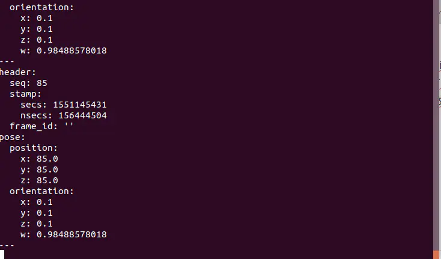

上面那行命令其实也相当于你跑了一个subscriber并且把收到的消息print出来。并且格式固定。可以看到每一则消息由`---`分开。然后显示出你消息的header。同时print出来了pose的内容，即position和orientation。
 当你觉得记录到足够的数据之后，点击rosbag在运行的那个terminal并按下`ctrl+c`，rosbag就会停止记录并被保存下来了。每次记录完数据，我们都要马上检查一下是否记录成功。这时候我们在terminal中使用下面的命令可以看到rosbag的信息

```css
rosbag info record_poseStamped.bag
```

运行这行命令，我们可以看到下面的信息。

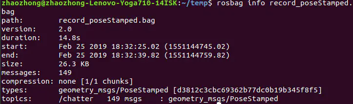

其中我们可以看到这个bag文件记录了多少消息，记录的是哪个topic的消息，消息的类型是什么等。读者自行研究了。
至此利用rosbag采集(记录)数据工作就完成了。

#### 2）重新使用储存在rosbag内的数据

当你采集完成数据之后，要拿回去分析，这时你就需要重新把储存在bag里的消息发布出来。
 首先确保roscore已经运行，cd到你rosbag所在的文件夹，然后执行下面的命令


```css
rosbag play record_poseStamped.bag
```

这时你会看到下面的内容

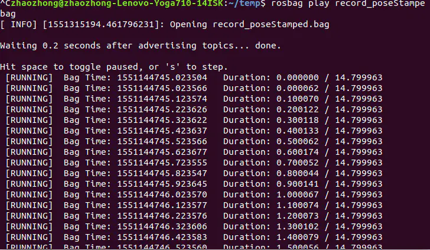

**当你重新使用rosbag的数据(即使用rosbag play bag_name.bag)的时候，你的rosbag自身相当于一个publisher程序**。
 你的消息会在rosbag记录的topic的名字下重新发布出来。如果你打开一个terminal，重新运行我们之前的sub_poseStamped.cpp对用的那个node，即在新的terminal中source之后运行

```undefined
rosrun pub_sub_test sub_poseStamped
```

你应该会看到运行pub和sub程序时一样的内容。只不过这时候我们的rosbag取代了那个pub程序.


### (八) 使用rviz进行可视化
#### 1）rviz 安装

终端运行:

rosdep update

rosdep install rviz

rosmake rviz


运行rviz：

在一个控制台中运行

roscore

在另一个控制台中运行

rosrun rviz rviz

注意:如果不事先运行roscore的话就会出现could not contact ROS master的错误


#### 2）rviz操作
```css
osbag play record_poseStamped.bag
```

有了publisher，我们自然就需要一个subscriber。虽然我们现在还不知道rviz怎么用，但是我们大概能猜到在rviz中我们需要定义一个subsriber，来接收那个rosbag发布出的消息。接下来我们打开rviz。
 首先跑roscore，之后打开另一个terminal，在里面输入

```undefined
rosrun rviz rviz
```


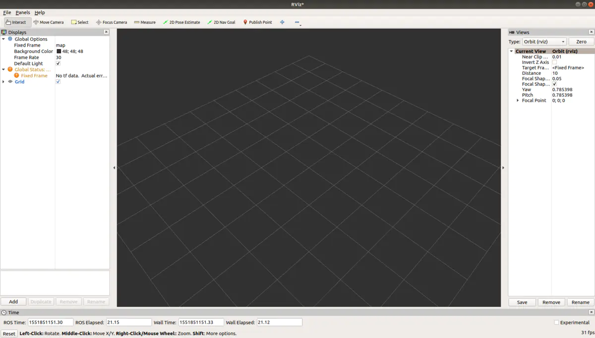

1：点击界面左下方的`Add`
 出现下面窗口

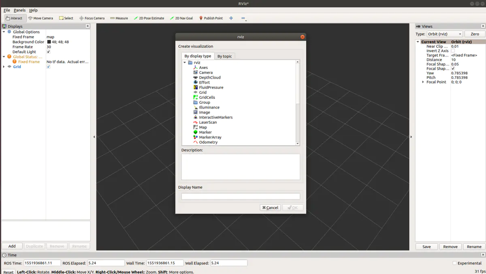


 2：点击里面的`Marker`，然后选择OK。这时候我们会发现在rivz界面左边的Displays那个大框框中，Grid下出现了一个新的东西，名字就是我们刚刚选择的Marker。

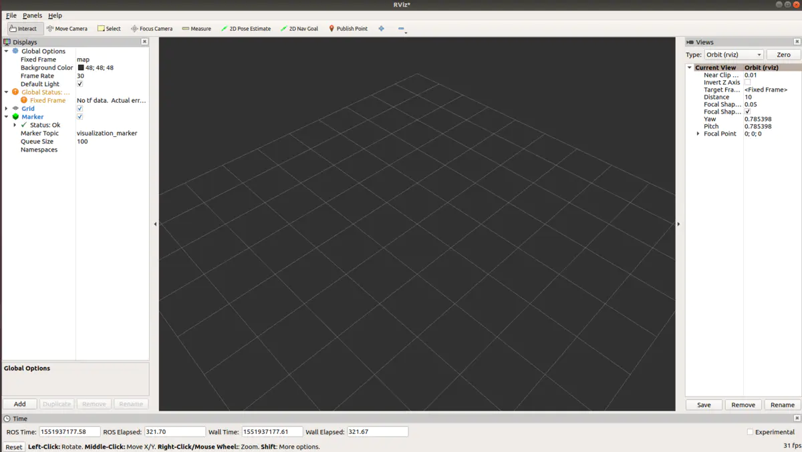


 Marker旁边有一个小三角，是Marker包含的下拉列表，点一下，就会出来和我这张图一样的东西了。在下拉列表里我们看到了一个很熟悉的东西`... Topic`。此时，**这个Marker就已经是一个subscriber了，并且正在试图接收消息**，它目前接收的是来自`visualization_marker`这个topic的消息。下面还有Queue_Size，也是我们以前定义一个subscriber时所熟悉的内容。Namespace可以暂且不管。
 那么marker到底是什么呢？和它的名字一样，它就是一个用来标记的东西。如果我们给定marker一个position和orientation（位置和姿态），那么rviz就会在中间画图区域的指定位置生成一个指定方向的marker，这个marker可以是立方体，箭头等我们可以在程序中自行选择。如何给marker一个orientation和position那自然就是我们发布消息，marker接收消息，消息里面包含了marker的位置和姿态。
下面我们就可以试试写程序，把我们之前的rosbag中记录的position和orientation发布给marker。这样rviz就能在画出每一时刻指定的position和orientation看起来什么样。我们写一个接收rosbag里posetamped的程序，并把posestamp转化为marker能接收的消息种类再发布出来，让marker接收。
 我们创建一个新的package来学习rviz

```bash
cd ~/catkin_ws/src
catkin_create_pkg learn_rviz_tf roscpp rospy std_msgs geometry_msgs visualization_msgs tf
cd ..
catkin_make
```

创建的package名称叫`learn_rviz_tf`，因为下一讲我们会结合rviz一起学习tf，所以就干脆在一个package里写程序了。 他的依赖项除了我们之前常用的外多了visualization_msgs，这里面会包含marker类型的消息;多了tf，tf是我们下一讲的内容。
 接下来在learn_rviz_tf的src文件夹创建一个pub_marker_msgs.cpp的文件并在里面输入下面的代码。

```cpp
#include "ros/ros.h"
#include "geometry_msgs/PoseStamped.h"
#include "visualization_msgs/Marker.h"

class MarkerPublisher{
public:
    MarkerPublisher(ros::NodeHandle& nh){
        pub_marker_ = nh.advertise<visualization_msgs::Marker>("visualization_marker", 10);//initialize marker publisher
        set_marker_fixed_property();
    };
    void PoseCallback(const geometry_msgs::PoseStamped::ConstPtr& msg){
        count_++;
        marker_.ns = "my_namespace";
        marker_.id = count_;
        
        marker_.header.stamp = ros::Time();
        marker_.pose = msg->pose;

        pub_marker_.publish(marker_);
    };
    void set_marker_fixed_property(){
        /*decide from which view we can see the marker*/
        marker_.header.frame_id = "my_frame";
        /*set marker type*/
        marker_.type = visualization_msgs::Marker::SPHERE;
        /*decide if the marker will be enlarge*/
        marker_.scale.x = 1;
        marker_.scale.y = 0.1;
        marker_.scale.z = 0.1;
        /*decide the color of the marker*/
        marker_.color.a = 1.0; // Don't forget to set the alpha!
        marker_.color.r = 0.0;
        marker_.color.g = 1.0;
        marker_.color.b = 0.0;
        /*set marker action*/
        marker_.action = visualization_msgs::Marker::ADD;
    };

private:
    ros::Publisher  pub_marker_;
    visualization_msgs::Marker marker_;
    int count_ = 0;
};


int main(int argc, char **argv){

    ros::init(argc, argv, "marker_worker");

    ros::NodeHandle n;

    MarkerPublisher mp(n);

    ros::Subscriber sub_pose   = n.subscribe("chatter", 100, &MarkerPublisher::PoseCallback, &mp);

    ros::spin();
}
```

主函数的前面两行大家都很熟悉了。
 第三行我们定义了MarkerPublisher的对象mp并把nodehandle传入，MarkerPublisher这个类是我们建立来发布Marker这种类型的消息的。
 第四行我们定义了接收chatter这个topic的接收器，由于callback函数定义在了MarkerPublisher这个类里，所以注意一下定义的方式。这个接收器以及接收函数是用来接收我们rosbag里topic名字为chatter，消息类型为posestamped的消息，所以注意topic的名字和callback函数里参数要和rosbag里一一对应起来。
 在类中发布消息的方式我们在第五讲讲过，不熟悉可以再去回顾一下。
 spin函数检测是否有消息发布。

接下来看MarkerPublisher这个类。
 首先我们已经将`visualization_msgs::Marker`类型的消息`marker`定义为私有成员了。这样我们不用每次发布消息时都重新定义一个marker并且为它的各种性质重新赋值。
 类的构造函数中我们定义了pub_marker的具体内容，它将要发布topic名为`visualization_marker`，消息类型为`visualization_msgs::Marker`的消息。首先topic的名字，是必须和rviz中我们设置的marker的topic名字对应(上一张图里我们可以看到 Marker Topic的名字是visualization_marker)。这个消息类型具体怎么赋值呢？我们第三讲讲过查自己需要的消息类型的方法，我们在搜索引擎中输入类似于visualization_msgs, marker, ros这类的东西，就可以看到下面的网页
 http://docs.ros.org/melodic/api/visualization_msgs/html/msg/Marker.html
 点进去你会看到这个消息包含的成员变量太多了，头都大了，怎么用不是很清楚。还好对于这种稍微复杂类型的消息，ROS一般有例子可寻找，其实你稍微花点儿功夫就可以找到下面的网页
 http://wiki.ros.org/rviz/DisplayTypes/Marker
 在网页中exmaple_usage里我们可以看到它有示例代码。我上面的代码也是根据它的内容来的。下面回到我的代码，在构造函数的第二行，我们创建了一个叫`set_marker_fixed_property()`的函数，这个函数我们设置了一些要发布的marker的一些我们不想改变的性质。比如该函数中的

```bash
marker_.header.frame_id = "my_frame"
```

这行的作用是指定我们在rviz中从哪个坐标系去观看我们的marker。其实道理很简单，大家知道机器人一般有很多参考坐标系，什么世界坐标系，相机坐标系或者其他传感器坐标系，世界坐标系一般固定不动，其他的可能随机器人移动。我们上面定义这个`my_frame`，表示我们希望从`my_frame`这个坐标系里去观察marker，而之后，可以想象，我们需要在rviz中把世界坐标系的名字设置为`my_frame`。二者能对应上，我们就能从一个固定不变的坐标系中观察我们的marker了。
 接下来是

```php
 marker_.type = visualization_msgs::Marker::SPHERE;
```

从字面意思不难理解是把我们marker的样子定义为球形。能定义成哪些形状大家可以看上面参考网页中的资料
 这个球得有多大呢，得设置它的scale。所以接下来是

```undefined
marker_.scale.x = 1;
marker_.scale.y = 0.1;
marker_.scale.z = 0.1;
```

设置marker的scale，很好理解，marker自身在x,y,z方向上的缩放系数。假设我们把marker的样子设置为一个球，x方向scalr为1，其他为0.1，那么我们应该看到的是一个椭球。
 接下来是定义marker这个球的颜色

```php
marker_.color.a = 1.0; // Don't forget to set the alpha!
marker_.color.r = 0.0;
marker_.color.g = 1.0;
marker_.color.b = 0.0;
```

第一个`marker_.color.a`要设置为1,marker才看得见(真是奇怪的性质hhhh)，后面三个分别是red,green,blue，颜色由0到1由浅变深，不必细说，如上设置的话marker就是绿色。
 接下来是

```php
marker_.action = visualization_msgs::Marker::ADD;
```

这行表示我们接收到marker的信息了之后是增加相应的marker，你也可以定义删除相应的marker。

上面这些性质我并不想每次更新marker的位置时都设置，所以放到一个函数里了。
 接下来我们看callback函数`void PoseCallback(const geometry_msgs::PoseStamped::ConstPtr& msg)`
 函数的第一行是`count_++`，其中count_是一个私有成员，可以看到count_在第三行赋值给了`frame_id`，这是什么意思呢？每一个rviz中出现的marker都有自己特定的id和namespace(即我们第二行给marker_ns赋值的内容)，不同的id或者namespace都代表着不同的marker。第三行代码意味着每一次接收函数接收到一条新的消息，marker的id都会改变。那么每一次接收到新的消息都会有一个新的marker诞生。
 可以想象，因为每一次接收到消息都会给marker赋值新的来自于posestamp消息的pose，如果这些pose的id都不同，我们就会看到那个椭球形的marker在不断增加，如果id和namespace都相同，那么我们会只看到一个marker,那个marker仿佛在移动。
 callback函数第四行给maker自身包含的timestamp赋值。在这个例子里不是很重要。
 第五行就是关键了，我们接收到的pose赋值给marker。为什么能这么直接赋值呢？打开我们的第一个网页链接我们可以看到marker是包含了类型为`geometry_msgs/Pose`的成员`pose`的。而posetamped类型的消息包含的是`pose`和`header`，所以我们可以直接进行pose的赋值，这样也就定义了marker的位置和方向。
 接下来我们只要发布marker_这个消息，rviz就应该能接收了。
 等一下，貌似忘了什么。刚才说了我们需要把rviz中世界坐标系的名字和marker的frame_id对应起来。这样我们才能从一个不动的上帝视角看marker。具体的做法是你的rviz中，找到Global Frame下面的`Fixed Frame`，这个就是世界坐标系。目前它的名字叫`map`，我们点击那个map，把它改成`my_frame`。现在就万事俱备了。

把cpp文件写到CMakeLists里

```bash
add_executable(pub_marker_msgs src/pub_marker_msgs.cpp)
target_link_libraries(pub_marker_msgs ${catkin_LIBRARIES})
```

编译好后打开一个terminal，source之后输入

```undefined
rosrun learn_rviz_tf pub_marker_msgs
```

开始接收来自topic`chatter`的`geometry_msgs::PoseStamped`类型的消息。接收到后发布类型为`visualization_msgs::Marker`，topic为`visualization_marker`的消息。
 之后再打开一个terminal,cd到rosbag的文件夹跑我们的rosbag，发布topic为`chatter`的消息

```css
rosbag play record_poseStamped.bag
```

我们就应该能在rviz中看到类似下面的东西。

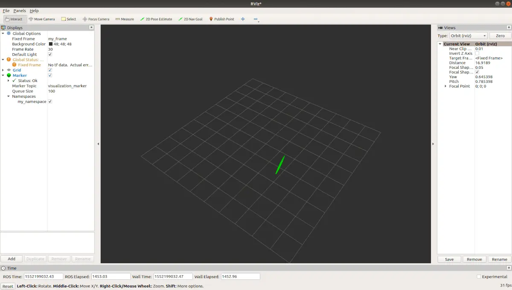


### (九) 使用tf追踪不同坐标系
#### 1）tf2基础例子

ROS官网例子链接如下
 [http://wiki.ros.org/tf2/Tutorials](https://links.jianshu.com/go?to=http%3A%2F%2Fwiki.ros.org%2Ftf2%2FTutorials)
 我们使用第二个 [Writing a tf2 broadcaster (C++)](https://links.jianshu.com/go?to=http%3A%2F%2Fwiki.ros.org%2Ftf2%2FTutorials%2FWriting%20a%20tf2%20broadcaster%20%28C%2B%2B%29)来讲解。
 进入链接后我们直接从2.1，the code部分开始，在我们的learn_rviz_tf/src中创建`turtle_tf2_broadcaster.cpp`并把代码复制进去。这儿为了方便讲解我也复制过来了

```cpp
#include <ros/ros.h>
#include <tf2/LinearMath/Quaternion.h>
#include <tf2_ros/transform_broadcaster.h>
#include <geometry_msgs/TransformStamped.h>
#include <turtlesim/Pose.h>

std::string turtle_name;

void poseCallback(const turtlesim::PoseConstPtr& msg){
  static tf2_ros::TransformBroadcaster br;
  geometry_msgs::TransformStamped transformStamped;
  
  transformStamped.header.stamp = ros::Time::now();
  transformStamped.header.frame_id = "world";
  transformStamped.child_frame_id = turtle_name;
  transformStamped.transform.translation.x = msg->x;
  transformStamped.transform.translation.y = msg->y;
  transformStamped.transform.translation.z = 0.0;
  tf2::Quaternion q;
  q.setRPY(0, 0, msg->theta);
  transformStamped.transform.rotation.x = q.x();
  transformStamped.transform.rotation.y = q.y();
  transformStamped.transform.rotation.z = q.z();
  transformStamped.transform.rotation.w = q.w();

  br.sendTransform(transformStamped);
}

int main(int argc, char** argv){
  ros::init(argc, argv, "my_tf2_broadcaster");

  ros::NodeHandle private_node("~");
  if (! private_node.hasParam("turtle"))
  {
    if (argc != 2){ROS_ERROR("need turtle name as argument"); return -1;};
    turtle_name = argv[1];
  }
  else
  {
    private_node.getParam("turtle", turtle_name);
  }
    
  ros::NodeHandle node;
  ros::Subscriber sub = node.subscribe(turtle_name+"/pose", 10, &poseCallback);

  ros::spin();
  return 0;
};
```

官网的代码解读不甚详细，我赘述一遍并加点东西。
 首先坐标系之间转换的发布不再是定义一个publisher然后用publisher.publish()函数来发布了，而是在`tf2_ros::TransformBroadcaster`这个类下定义一个专门的发布坐标转换的对象，使用`对象.sendTransform(msg_type)`来发布坐标之间的关系。发布的msg_type是特定的消息类型`geometry_msgs/TransformStamped.h`。基于这一点我们来看代码。
 1:
 头文件部分包含了`#include <tf2/LinearMath/Quaternion.h>`，代码有一行定义了tf::quaternion的对象`tf::Quaternion q`需要通过包含这个头文件来实现。
 回想我们在使用geometry_msgs/PoseStamped时曾需要定义消息的pose，而pose包含position和orientation，其中orientation的消息类型是geometry/Quaternion，也就是说我们也可以通过`geometry::Quaternion q`定义一个四元数对象q，这也是四元数。这两种四元数的定义的对象是有很大的区别的。后者只能通过q.w, q.x, q.y, q.z调用四元数包含的数据。

我们上面的代码中使用了这个函数，`q.setRPY(0, 0, msg->theta)`，这个函数完成了从roll pitch yaw到四元数的转换功能，通过设定roll pitch yaw来设定四元数的具体数据。tf::Quaternion定义的对象q获取四元数的具体方法是q.x(),q.y()...有别于geometry::Quaternion定义的q通过q.x,q.y...的获取方式。x(),y()..这几个函数我们并没有在上面的链接看到，原因是tf::Quaternion继承了QuadWord这个类的，在后者的定义中我们能看到能通过x()，y()这类型的函数来获取quaternion的具体数据。
 这意味着，利用tf定义的四元数是重载了计算符号的，即你如果有如下定义

```php
tf::Quaternion q_AB //A坐标到B坐标的的旋转变换
tf::Quaternion q_BC //B坐标到C坐标的旋转变换
```

那么你可以通过

```undefined
q_AB * q_BC
```

来获取到A坐标到C坐标的旋转变换。geometry_msgs定义的四元数是不具备上面的任何功能的，仅仅是储存数据并用来发布或者接收。
 这里啰嗦了这么多，主要是希望大家通过例子能学会自己找到相关资料，这是最重要的。比如以后使用了tf::Transform定义了对象tf1，那么tf1是什么东西，能包含哪些功能，有哪些函数可以调用？你在google上搜寻tf::Transform进入 [ tf: tf::Transform Class Reference](https://links.jianshu.com/go?to=http%3A%2F%2Fdocs.ros.org%2Fjade%2Fapi%2Ftf%2Fhtml%2Fc%2B%2B%2Fclasstf_1_1Transform.html)就自然可以查到。
 2：
 头文件包含了`<tf2_ros/transform_broadcaster.h>`。包含了这个头文件，就可以用代码中的`tf2_ros::TransformBroadcaster br`来定义一个发布坐标转换的对象了。
 3：
 头文件包含了`<geometry_msgs/TransformStamped.h>`，即我们之前说的br发布的内容需要是geometry_msgs命名空间下，TransformStamped类型的消息。可以看到要发布的消息类型在代码中这么定义的
 `geometry_msgs::TransformStamped transformStamped;`
 另外在代码中有一行`br.sendTransform(transformStamped)`就是用来发布坐标转换的消息的代码。
 总的来说，这和我们一般定义publisher并发布消息的过程很像

```php
ros::Publisher pub_abc = .... //定义publisher
std_msgs::Float64 abc; //定义要发布的消息类型
abc.data = .....; //给要发布的消息赋值 
pub_abc.publish(abc);//发布消息
```

只不过到发布坐标转换这儿变成了

```cpp
tf2_ros::TransformBroadcaster br; //定义坐标转换的publisher
geometry_msgs::TransformStamped transformStamped; //定义坐标转换要发布的消息类型(只能是此类型)
...//赋值，赋值部分是最上面代码中位于poseCallback()函数中transformedStamed.header.stamp = ...以及后面的是来行的内容，稍后再讲
br.sendTransform(transformStamped);//发布坐标转换
```

可以看到发布坐标变换的整体过程和发布普通消息是类似的，只不过使用的函数，消息名字有些变化而已。
 4：
 头文件包含了`#include <turtlesim/Pose.h>`. ROS真是很喜欢用turtlesim这个package的内容来讲解了，具体里面包含的内容我也没去看过。不过相信大家在自己学习ROS官网的教程时都使用过这个package，打开过一个窗口看到两个可爱的小乌龟了。
 我们的poseCallback函数的形参是这样的`(const turtlesim::PoseConstPtr& msg)`，对比我们写过很多的callback函数的形参比如接收flaot类型消息的`(const std_msgs::Float64::ConstPtr& msg)`
 我们就能猜到`#include <turtlesim/Pose.h>`是包含了消息类型Pose，这个Pose专门用来定义小乌龟的位置的。(定义ConstPtr时前面居然没有作用域符号::，我也吃了一惊，不过试了一下确实有没有都可以Em...)。
 5: `std::string turtle_name` 用来接收后面要写的launch文件传递进来乌龟的名字。如何使用launch文件传递参数参考使用roslaunch那一节。
 6: void poseCallback(const turtlesim::PoseConstPtr& msg), 这个回调函数对应的subscriber我们在main函数中可以看到。`ros::Subscriber sub = node.subscribe(turtle_name+"/pose", 10, &poseCallback);`也就是说它subscribe的topic是turtle_name+"/pose".一会儿我们运行程序我们就能看到小乌龟，小乌龟的位置会时刻发布出来，这个subscriber就会接收
 回调函数的内容，一二行我们已经讲过，第一行用了static定义br，主要是避免重复定义。就像定义publisher我们肯定也只定义一次。遇到这种情况其实我们最好把回调函数写在类中，把br定义为类成员(见在类中publish和subscribr那一讲)。
 回调函数的第三行开始给我们要发布的坐标转换赋值。关于transformStamped包含哪些成员，怎么使用，赋值等，和我们之前在第三讲过的poseStamped类似。
 `transformStamped.header.stamp = ros::Time::now();`坐标之间的关系可能变化，那么自然我们在定义坐标之间的关系时，自然要给它赋值在什么时刻，坐标之间的关系如何
 `transformStamped.header.frame_id = "world"` 和 `transformStamped.child_frame_id = turtle_name;`两行，既然涉及到两个坐标之间的关系，我们肯定需要知道两个坐标系的名字，所以world那一行定义了parent坐标系的名字，turtle_name那一行定义了child坐标系的名字。
 那么具体两个坐标之间的关系是怎么样的呢？自然就涉及到给坐标系之间的rotation和translation赋值。我们说回调函数接收到的是turtle的位置和方向，那么msg中的位置和方向我们就需要赋值transformStamped。即下面几行。

```php
  transformStamped.transform.translation.x = msg->x;
  transformStamped.transform.translation.y = msg->y;
  transformStamped.transform.translation.z = 0.0;
...
  transformStamped.transform.rotation.x = q.x();
  transformStamped.transform.rotation.y = q.y();
  transformStamped.transform.rotation.z = q.z();
  transformStamped.transform.rotation.w = q.w();
```

中间省略的两行

```css
  tf2::Quaternion q;
  q.setRPY(0, 0, msg->theta);
```

主要是换个方式表达rotation。后面我们可以看到由于乌龟是二维运动，所以msg涉及到的只有x,y和theta. theta即三维坐标中的yaw角度，这就是为什么利用`q.setRPY(0, 0, msg->theta);`定义了quaternion具体的内容。之后把tf的quaternon的值赋值给我们要发布的消息类型transformStamped所包含的quaternion的值就可以了。
 当transformed的内容都设置好了后`br.sendTransform(transformStamped);`发布坐标转换。

5：主函数中，`ros::NodeHandle private_node("~")`和我们平时定义node的方式不是很一样。平时我们定义node都是直接`ros::NodeHandle nh`。这里多了一个参数`～`。它表示此时这个nodehandle是读取局部参数的。具体可见这篇文章[https://blog.csdn.net/shijinqiao/article/details/50450844](https://links.jianshu.com/go?to=https%3A%2F%2Fblog.csdn.net%2Fshijinqiao%2Farticle%2Fdetails%2F50450844)。总体作用和使用方式和普通node没有大的区别。:
 6：main函数的if else语句就是要从launch文件中读取turtle_name那个参数。
 再之后定义获取乌龟pose的subscriber。为什么有两个nodehandle呢，我们在launch文件中解释。
 把这个文件添加到CMakeLists.txt编译。
 之后我们在learn_rviz_tf目录下添加一个launch文件夹，创建一个start_demo.launch。写入下面的内容。

```xml
  <launch>
     <!-- Turtlesim Node-->
    <node pkg="turtlesim" type="turtlesim_node" name="sim"/>

    <node pkg="turtlesim" type="turtle_teleop_key" name="teleop" output="screen"/>
    <!-- Axes -->
    <param name="scale_linear" value="2" type="double"/>
    <param name="scale_angular" value="2" type="double"/>

    <node pkg="learn_rviz_tf" type="turtle_tf2_broadcaster"
          args="/turtle1" name="turtle1_tf2_broadcaster" />
    <node pkg="learn_rviz_tf" type="turtle_tf2_broadcaster"
          args="/turtle2" name="turtle2_tf2_broadcaster" />

  </launch>
```

注意这儿和原tutorial的launch文件有些小出入。原launch文件第三个和第四个node的后面pkg的名字是`learning_tf2`，因为他们创建了一个叫learningtf2的package来做tf的tutorial，而我们的现在代码是在learning_rviz_tf这个pakcage里，所以package名字改一下，不是大问题。
 写好roslauch编译好文件后我们先来运行一下程序看看什么效果。

```css
roslaunch learn_rviz_tf start_demo.launch
```

看到下图一个小乌龟出来了。

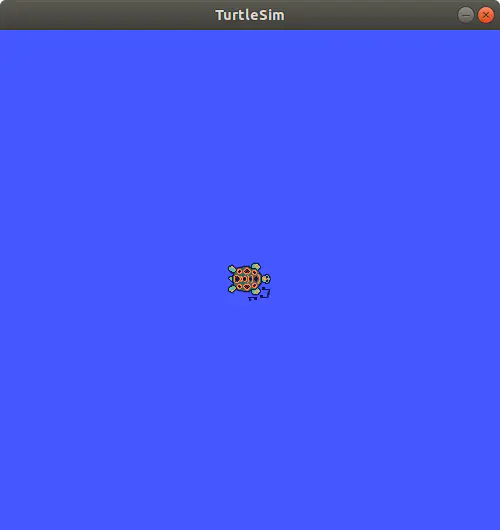

重新点击跑roslaunch的终端，你的小乌龟会移动。打开另一个terminal，在其中输入

```undefined
rosrun tf tf_echo /world /turtle1
```

这时候你会看到类似于下面的内容

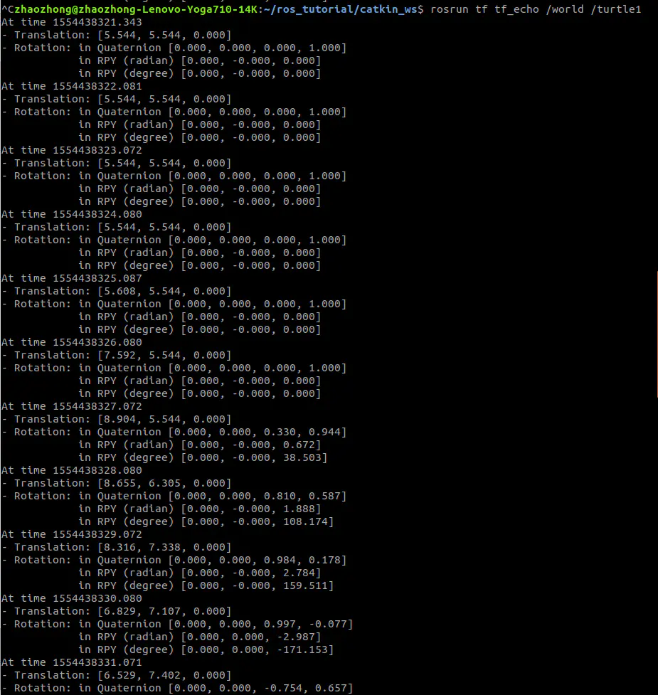

每一个

```undefined
At time ...
- Transolation ..
- Rotation ...
```

是一组tf，显示的是在某个时间点,world坐标系和turtle坐标系之间的关系。当你移动小乌龟时，translation和rotation会发生改变。
 下面解释launch文件中的内容
 1：

```bash
<node pkg="turtlesim" type="turtlesim_node" name="sim"/>
```

这个节点是显示乌龟这个GUI的，不用深究。
 2：

```bash
<node pkg="turtlesim" type="turtle_teleop_key" name="teleop" output="screen"/>
```

这是为了使你的的键盘能控制乌龟的移动。(从key那个名字就可以看出)不用深究。
 3：
 param两行的参数目前在我们程序中没有使用。
 4：


```go
<node ... args = `/turtle1`...>
```

即运行刚刚写的程序
 5：
 下面一个node暂时没有使用。官网关于tf2的tutorial的另一个例子会使用。
 好像并没有解释什么...
 最后回到程序中关于praivate_node的问题，为什么多用一个nodeHandle?其实我们在launch文件中可以发现


```bash
    <node pkg="learn_rviz_tf" type="turtle_tf2_broadcaster"
          args="/turtle1" name="turtle1_tf2_broadcaster" />
    <node pkg="learn_rviz_tf" type="turtle_tf2_broadcaster"
          args="/turtle2" name="turtle2_tf2_broadcaster" />
```

这代表这两个node其实使用的是一个可执行文件，即`turtle_tf2_broadcast`，为了区分他们，给了他们不同的名字`turtle1_tf2_broadcaster`，`turtle2_tf2_broadcaster`，即同样的执行文件不同的**节点
 **名。同时这两个节点的传入args不同。
 当好几个节点都来自于一个可执行文件时，我们难免遇到同一个问题。如果他们都需要传入某个名叫A的参数，但是A的值需要不一样，该怎么办呢？这时候我们通常要把要读取的参数分开写到节点内。如下


```xml
<param name="A" value="11" />
  <node name="you" pkg="ABC" type="abc" output="screen">
    <param name="A" value="10" />
  </node>
  <node name="me" pkg="ABC" type="abc" output="screen">
    <param name="A" value="9" />
  </node>
```

**在<node>...</node>内部定义的参数称为局部参数，必须定义一个私有nodehandle, 即`ros::NodeHandle abc("~")`并使用代码abc.getParam(...)才能读取**
 例如上面为了让节点you和me分别读取值为10的A和值为9的A，我们需要在程序内定义带参数的"~"的nodeHandle。表示读取自己内部的参数，同时不要读取值为11的全局参数A。
 但其实上面的launch文件没有重复名字的参数(args不算)，理论上可以不用局部的nodehandle。我把("~")去掉了也一切正常。不过大家以后要在一个launch文件中使用相同名字但值不同的参数时，一定要考虑这个问题。
 所以总的来说，我们原来的程序只定义一个node并且不添加参数("~")也没有问题，由于没用args为turtle2的节点，所以把args = "turtle2"那一个节点删掉了也没有问题，本来可以大大做简化，但是考虑到很多同学还是按照官网的例子学习，所以就冗杂地解释了一番。
 在程序运行时，我们在使用rviz来可视化tf。打开一个新的terminal，在其中输入


```undefined
rosrun rviz rivz
```

上一章节我们为了可视化pose通过ADD按钮添加了marker，现在类似，rviz打开后点击左下方的ADD按钮
 ，在显示出的对话框中选择`TF`，由于我们发布的TF是关于world和turtle1的，我们希望`world`坐标系是固定的，所以在rviz中把`Fixed Frame`改成`world`，这时候你刚才roslaunch跑的程序所发布的坐标系之间的转换就正在被rviz接收了。你会看到类似下图的东西

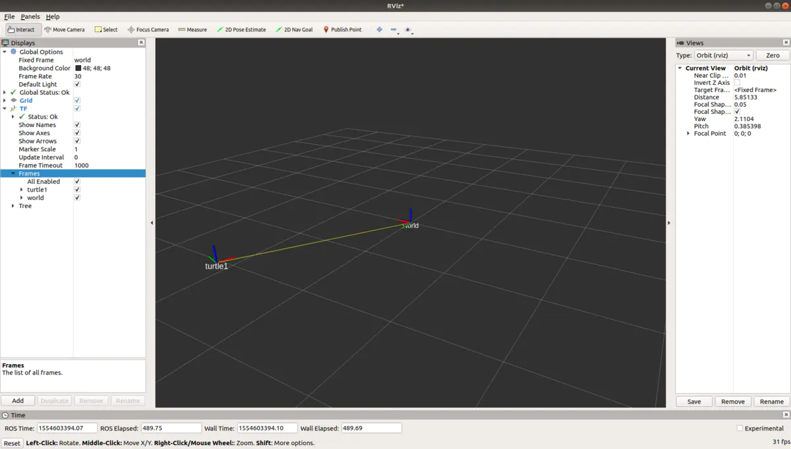


 rviz很清晰地显示了两个坐标系之间的联系。在你跑roslaunch的terminal中移动小乌龟，你会看到turtle1这个坐标系也在移动。
 同样类似于你可以用rqt_graph命令来观察publisher和subscriber的关系，你可以在terminal中用下面的命令观察坐标系之间的关系


```undefined
rosrun rqt_tf_tree rqt_tf_tree
```

输入该命令后会出现类似于下面的图像

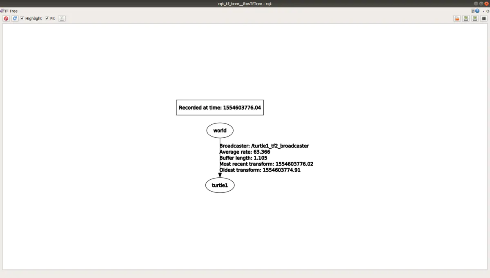

这表示world是母坐标系,turtle1是子坐标系。

#### 2）tf2多个坐标系追踪

讲完了基础例子，我们就可以来实现我第一张动图moving_robot.gif。在那个动图中，我们有三个坐标系，camera和gps相对静止，和我们的机器人(方块marker)一块儿相对于世界坐标系world移动。官网的例子很不错，不过turtlesim之类的东西内部是咋样的我们毕竟不是那么了解，还有局部nodeHandle，几个例子里还使用了service之类，虽然都不是复杂东西，但和在一起总会有人不清楚其中的部分。我还是倾向于大家能懂tutorial的例子的每一行代码，代码的内容我们在之前都有所接触。
 我们在learn_rviz_tf/src中创建一个叫`moving_coordinate_system.cpp`的文件。写入下面内容

```php
#include <ros/ros.h>
#include <tf2_ros/static_transform_broadcaster.h>
#include <geometry_msgs/TransformStamped.h>
#include <tf2_ros/transform_broadcaster.h>
#include <geometry_msgs/PoseStamped.h>
#include <visualization_msgs/Marker.h>
#include <tf2/LinearMath/Quaternion.h>

class MovingObject{
public:
    MovingObject(ros::NodeHandle& nh);
    void PoseCallback(const geometry_msgs::PoseStamped::ConstPtr& msg);
    void set_marker_fixed_property();
private:
    ros::Publisher pub_object_;
    visualization_msgs::Marker mk_;
    tf2_ros::TransformBroadcaster br_;
};

int main(int argc, char** argv){
    ros::init(argc, argv, "tf2_broadcaster");

    ros::NodeHandle nh;

    MovingObject mo(nh);

    ros::Subscriber sub_gps = nh.subscribe("/chatter", 10, &MovingObject::PoseCallback, &mo);
  
    ros::spin();
}

MovingObject::MovingObject(ros::NodeHandle& nh){
    pub_object_ = nh.advertise<visualization_msgs::Marker>("visualization_marker", 10);
    set_marker_fixed_property();
}

void MovingObject::PoseCallback(const geometry_msgs::PoseStamped::ConstPtr& msg){
    ROS_INFO("get gps position, %f, %f, %f", msg->pose.position.x, msg->pose.position.y, msg->pose.position.z);
    geometry_msgs::TransformStamped transformStamped;
    transformStamped.header.stamp = ros::Time::now();
    transformStamped.header.frame_id = "world";
    transformStamped.child_frame_id = "gps";
    transformStamped.transform.translation.x = msg->pose.position.x - 0.1;
    transformStamped.transform.translation.y = msg->pose.position.y;
    transformStamped.transform.translation.z = msg->pose.position.z;
    transformStamped.transform.rotation.w = msg->pose.orientation.w;
    transformStamped.transform.rotation.x = msg->pose.orientation.x;
    transformStamped.transform.rotation.y = msg->pose.orientation.y;
    transformStamped.transform.rotation.z = msg->pose.orientation.z;
    br_.sendTransform(transformStamped);

    mk_.header.stamp = ros::Time();
    mk_.pose = msg->pose;
    pub_object_.publish(mk_);
}

void MovingObject::set_marker_fixed_property(){
    mk_.ns = "my_namespace";
    mk_.id = 0;
    mk_.header.frame_id = "world";
    mk_.type = visualization_msgs::Marker::CUBE;

    mk_.scale.x = 0.5;
    mk_.scale.y = 0.5;
    mk_.scale.z = 0.5;

    mk_.color.a = 0.3; 
    mk_.color.r = 0.0;
    mk_.color.g = 1.0;
    mk_.color.b = 0.0;

    mk_.action = visualization_msgs::Marker::ADD;
}
```

头文件除了第一个基础例子的以外，增加了

```cpp
#include <geometry_msgs/PoseStamped.h>
#include <visualization_msgs/Marker.h>
```

我们依次讲解程序内容
 1:我们在上一章可视化marker的时候写了一个subscriber文件，用来接收rosbag发出的机器人pose的信息，并转换为marker的pose使之能在rviz中显示出来。而我们现在的例子同样显示marker，marker的pose后面可以看到同样来自于rosbag发出的消息。所以包含了这两个上一章节使用过的头文件，一个用来使用PoseStamped消息，一个用来使用Marker消息。并不意外。
 2:定义了MovingObject类。
 成员函数：
 类的构造函数传入了nodehandle，用来初始化一些性质并定义publisher的内容。
 PoseCallback函数用来接收来自于rosbag的机器人位置的消息并转化为marker类型的消息发布出去。
 set_marker_fixed_property()函数用来设置marker一些我们不想改变的性质，和上一章类似。
 成员变量：
 数据成员pub_object_用来发布marker的pose使rviz接收
 mk_就是maker了
 br_即用来发布坐标系之间的关系的。
 3：主函数中sub_gps就是用来接收来自rosbag发布的poseStamped类型消息。消息在PoseCallback函数中处理。
 4：主函数之后，是MovingObject类的构造函数，在构造函数中，我们首先给pub_object赋值，负责发布marker类型的消息，pub_object发布的内容会用来产生我们动图1中的小方块。构造函数调用了set_marker_fixed_property()函数，在上一讲我们用这个函数来设置一些我们不想要改变的marker性质。除了颜色和大小不想改变外，我们并不想像上次那样，每接收一个pose就产生一个新的marker，我们希望当前的marker接收到一个新的pose后就移动到那个位置，所以marker只能有一个。上一讲我们说过marker的id和namespace两个量共同定义一个marker，所以在set_marker_fixed_property中把这两个量设置为常亮就可以了。即

```bash
    mk_.ns = "my_namespace";
    mk_.id = 0;
```

5：最后是PoseCallback函数。
 我们要发布坐标系之间的tf，和第一个例子一样，需要定义是哪两个坐标系，即frame_id和child_frame_id，分别是world和gps。需要定义transform的平移和旋转。pose和transform本就是一个东西，都需要定义平移和旋转，他们在transformStamped和PoseStamped的中的名字不一样。所以我们挨个把pose的position赋值给transform的translation，把pose的orinetation赋值给transform的rotation就可以了。
 代码中有一行

```php
mk_.pose = msg->pose;
```

我们直接把接收到的消息的pose直接赋值给了marker的pose。如果gps到world的transform也用接收到的消息的pose，那么marker的中心就会和gps坐标系的中心重合。所以代码中我把`pose.position.x`减了0.1，只是人为地把为了gps的坐标系原点和marker中心做点区别，不是非得加。
 定义好了tranformStamped之后就可以用br_.sendTranform把它发布出去，定义好了marker的pose之后，由于它的其他性质我们已经在set_marker_fixed_property中定义，那么就可以用pub_object_把marker发布出去了。这两个东西同时发布出去，用的同一个pose(除了x方向有0.1的固定差别)，如果我们像第一个例子那样编译并跑程序，设置好rviz，跑rosbag文件发布pose，理论上就可以在rviz当中看到gps这个坐标系随着我们的机器人(marker一起移动了)。
 等一下！还有一个坐标系呢？？动图里还有个camera坐标系，可是仔细看我们的代码里，没有任何关于`camera`的东西。**原来当两个坐标系相对静止的时候我们，我们最好直接把他们之间的tf直接设置到launch文件里**。
 首先我们把源文件写到CMakelists里进行编译。

```bash
add_executable(moving_coordinate_system src/moving_coordinate_system.cpp)
target_link_libraries(moving_coordinate_system ${catkin_LIBRARIES})
```

然后在launch文件夹里创建一个叫`run_mcs.launch`的launch文件。并把下面的内容写到launch文件中

```xml
<launch>
    <node pkg="tf2_ros" type="static_transform_publisher" name="link1_broadcaster" args="0.3 0 0 0 0 0 1 gps camera" />
    <node type="moving_coordinate_system" pkg="learn_rviz_tf" name="moving_coordinate_system" output="screen">
    </node>
</launch>
```

可以看到`<node pkg = "tf2_ros"...>`那一行，我们使用了名叫`tf2_ros`这个pakcage里名叫`static_transform_publisher`这个可执行文件，节点名我们命名为`link1_broadcaster`，args即我们要传入的transform了，前三个数字是transform的平移，后四个是四元数x,y,z,w(如果只有三个数字默认roll pitch yaw)。`gps camera`表示前面那组平移旋转就是这两个坐标系的关系。接着如果我们运行我们刚刚编译好的`moving_coordinate_system`，就可以看到一个新的坐标系出现在rviz里了。
 我们先打开rviz

```undefined
rosrun rviz rviz
```

如果你保存了之前rviz的信息，现在你rviz可能直接能接收marker和tf的信息，但我们假设是空白的。现在由于我们的程序既要发布marker的消息，又要发布tf的消息，自然我们需要加两个接收器。如上一章一样，点击rviz中ADD按钮，选择`Marker`点击OK。再次点击ADD按钮，选择`TF`，点击OK。把`Global Options`下面的Fixed_Frame设置为`world`。这时候你的rviz界面应该是这样的(注意左边栏包含了TF和Marker)。

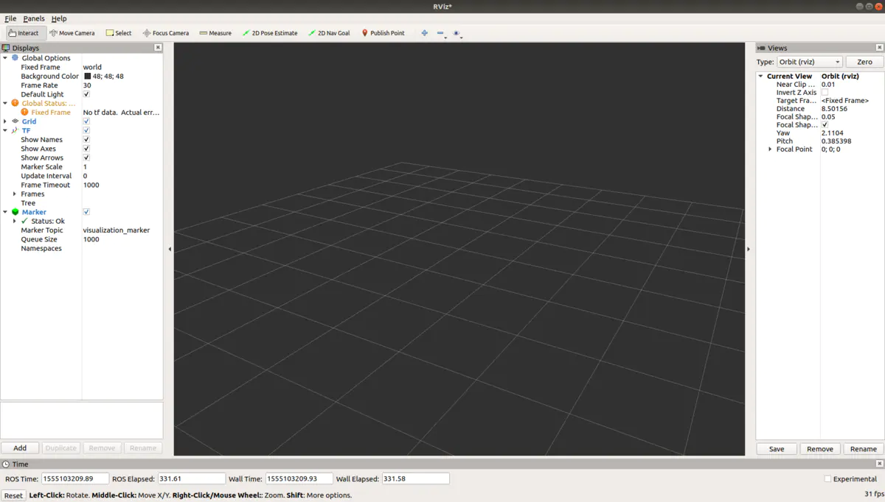


 下面我们运行roslaunch

```css
roslaunch learn_tf_rviz run_mcs.launch
```

这时候我们注意到rviz中有些变化，如下图


 可以看到，rviz左边的Global Statue有刚刚的黄色警告变成了红色错误,TF也有个地方变成黄色警告。点击拥有红色错误标识的Fixed Frame，它旁边写着`Fixed Frame [world] does not exist`。是world frame还没有定义。
 这是因为我们的程序中world是定义在PoseCallback函数里的，也就是需要接收到消息后，world才有定义，如果没有接收到消息，那么world 就一直没有定义。所以我们只要让程序开始接收消息，错误就会消失。下面跑我们的rosbag。这里的rosbag本质上和我们在rosbag那一章创造的rosbag没有不同，使用的同样是第三讲那个程序，不过我把每两个pose之间的时间缩短了，这样我们的方块儿移动起来看起来就更流畅。新的rosbag的名字叫`robot_pose.bag`，你用我们之前的bag文件跑也是可以的，只是看起来没那么流畅。

```css
rosbag play robot_pose.bag
```

这行命令一执行，rviz里的错误会消失.

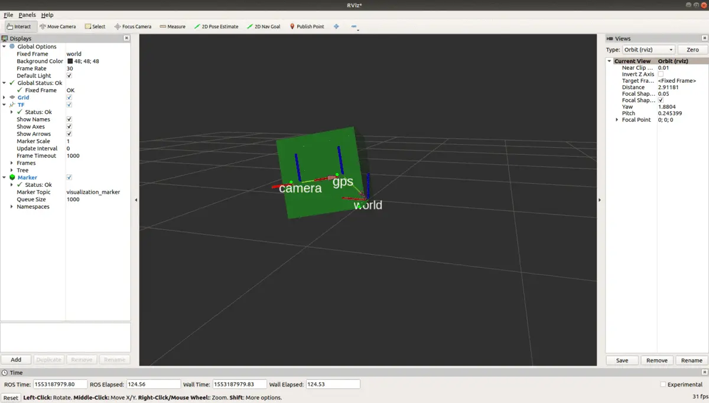


### (十) 创建自己的消息类型

#### 1）定制基本消息类型

当ROS提供的消息类型不满足你的需求时，你就需要考虑制作自己的消息类型了。比如你想要发布一则消息，这则消息包含一个double类型的向量，一个整数，一个字符串，他们都是基本的消息类型(属于std_msgs里的)。
 下面我们来看步骤
 1：在pub_sub_test这个package下建立一个新的文件夹，文件夹的名字叫msg
 2：在msg里创建一个新的文件，名字叫MyBasicMessage.msg。
 3：打开MyBasicMessage.msg，并在其中输入下面内容

```go
string message_id
int64 message_data1
float64[] message_data2
```

从这个页面我们知道Float64这个消息包含一个消息类型是float64名字叫data的成员。于是我们在pub_float64.cpp代码里类似如下使用


```cpp
...
double abc = 123.456;
std_msgs::Float64 msg; //定义Float64对象msg
msg.data = abc;//为类成员data赋值，赋值类型为double，即float64
...
```

当我们要自定义消息时，我们要做的就是模仿就行了。在.msg文件夹里，模仿上面的定义方式即可


```undefined
成员类型 自定义成员名字
```

那么我们怎么知道成员类型是什么呢？比如字符串是string，这个到简单，double变成float64，double类型的向量竟然是float64[]。其实这个我们同样在第一二讲讲了，ROS把这些基本类型重新定义了一番，具体可见[http://wiki.ros.org/msg](https://links.jianshu.com/go?to=http%3A%2F%2Fwiki.ros.org%2Fmsg)。在**Built-in types**下就写明了ROS自身的基本消息类型和C++,python中消息类型的对应关系，比如C++里的double在ROS中对应的是float64。所以我们会在msg文件里使用`float64 name`这种方式定义一个数据成员。同样在该页面中**Array handling**部分我们可以看到ROS对某种数据类型的数组的定义方式就是在基本类型后面加了个`[]`符号。比如`bool[]`对应c++的`std::vector<uint8_t>`.
 现在我们知道如何定义以及为什么如此定义基本类型了，在msg文件写好后，我们需要让我们的package知道我们新定义了消息类型，接着上面如下做
 4：打开pub_sub_test的CMakeLists.txt
 找到


```undefined
find_package(catkin REQUIRED COMPONENTS
  roscpp
  rospy
  std_msgs
  geometry_msgs
)
```

添加一行


```undefined
find_package(catkin REQUIRED COMPONENTS
  roscpp
  rospy
  std_msgs
  geometry_msgs
  message_generation
)
```

依赖项 message_generation是要自定义message所必须添加的。

找到


```bash
# add_message_files(
#   FILES
#   Message1.msg
#   Message2.msg
# )
```

改为


```css
add_message_files(
  FILES
  TestBasicMessage.msg
)
```

这相当于让这个package知道我们定义了新的message了。

找到


```bash
# generate_messages(
#   DEPENDENCIES
#   geometry_msgs#   std_msgs#  
# )
```

改为


```undefined
generate_messages(
  DEPENDENCIES
  std_msgs
)
```

这是让package知道我们定义的消息是依赖于std_msgs的。因为我们上面定义的消息类型都属于基础消息类型。我们得指明这一点。
 关闭保存CMakeLists.txt。打开pub_sub_test的package.xml。
 找到


```xml
<!--   <build_depend>message_generation</build_depend> -->
...
<!--   <build_export_depend>message_generation</build_export_depend> -->
...
<!--   <exec_depend>message_runtime</exec_depend> -->
```

把注释都去掉，变为


```xml
<build_depend>message_generation</build_depend> 
  ...
<build_export_depend>message_generation</build_export_depend>
...
<exec_depend>message_runtime</exec_depend> 
```

保存并关闭package.xml。这些都是死步骤，需要自定义message这么做即可。
 之后使用catkin_make编译。你自定义的消息类型就已经产生了。如何使用呢？和一般消息类型使用没有差别。
 我们在pub_sub_test/src里新创建一个cpp文件，名字叫`pub_my_basic_message.cpp`，把pub_string.cpp里或者之前写的其他基础pub程序赋值进去，改成下面的样子.


```cpp
#include "ros/ros.h"
#include "pub_sub_test/MyBasicMessage.h" //#include "std_msgs/String.h"

#include <sstream>

int main(int argc, char **argv)
{
  ros::init(argc, argv, "talker");

  ros::NodeHandle n;

  ros::Publisher chatter_pub = n.advertise<pub_sub_test::MyBasicMessage>("chatter", 1000); //ros::Publisher chatter_pub = n.advertise<std_msgs::String>("chatter", 1000);

  ros::Rate loop_rate(10);

  int count = 0;
  double data2 = 1;
  while (ros::ok())
  {
    pub_sub_test::MyBasicMessage msg; //std_msgs::String msg;

    // std::stringstream ss;
    // ss << "hello world " << count;
    msg.message_id = "1";
    msg.message_data1 = count;
    msg.message_data2.push_back(data2);


    ROS_INFO("%ld", msg.message_data1); //ROS_INFO("%f", msg.data.c_str())

    chatter_pub.publish(msg);

    ros::spinOnce();

    loop_rate.sleep();
    ++count;
  }


  return 0;
}
```

变化
 1：
 `#include "std_msgs/String.h"`变成了`#include "pub_sub_test/MyBasicMessage.h"`，即包含package名/msg文件名.h
 2：在advertise函数使用的地方
 <std_msgs::String>变成了<pub_sub_test::MyBasicMessage>
 3：std_msgs::String msg 变成了pub_sub_test::MyBasicMessage msg;
 4：为我们定义的消息类型赋值
 在MyBasicMessage.msg里我们定义了类型为string名字叫message_id的成员，所以我们使用`msg.message_id`，并赋值为字符串“1”。定义了float64(std::vector<double>)类型的成员message_data2，使用vector的函数push_back传入一个float64的变量。ROS_INFO就print出mesage_data1大家感受一下就是了。
 其余没变。总的来说程序中pub你自定义的消息和你想pub任何ROS自带的消息的步骤一样。
 你把这个cpp写入CMakeLists里编译即可。同样使用rosrun可以跑这个程序。sub文件就不再写了，很类似地改。不再赘述。

#### 2）定制高级消息

所谓高级消息，即是想PoseStamped那样的东西。其实步骤也一模一样，我们在msg文件夹再创建一个`MyAdvancedMessage.msg`。并在其中写入下面内容。


```undefined
geometry_msgs/Inertia SiHuan
geometry_msgs/Pose WuHuan
std_msgs/Header LiuHuan
```

定义了geometry_msgs/Inertia类型的成员名字叫四环，geometry_msgs/Pose类型的成员名字叫五环，std_msgs/Header类型的成员名字叫六环。

注意Compact Message Definition下面变量的定义方式，模仿就是了。你可以自己组建任何类型的消息。所以我把上面三种消息类型组合在了一起。其实没有什么大的意义hhh。至于Inertia类型的消息是什么怎么用，我想如果你看了前三讲这应该不是问题。
 之后我们需要进一步修改pub_sub_test的CMakeLists。打开CMakeLists.txt，在


```css
add_message_files(
  FILES
  MyBasicMessage.msg
)
```

中添加一行


```css
add_message_files(
  FILES
  MyBasicMessage.msg
  MyAdvancedMessage.msg
)
```

即我们刚刚新建立的message的名字。

在


```undefined
generate_messages(
  DEPENDENCIES
  std_msgs
)
```

中添加一行


```undefined
generate_messages(
  DEPENDENCIES
  std_msgs
  geometry_msgs
)
```

由于我们新建立的消息类型不仅有来自于std_msgs的，还有来自于geometry_msgs的，所以我们需要把这个包添加到消息的dependency里。保存退出，使用catkin_make编译即可。
 之后你如果想发布这个类型的消息，写一个pub_my_advanced_message.cpp之类的文件，包含`#include "pub_sub_test/MyAdvancedMessage.h"`，定义变量，赋值等，和前面一样。至于如何为Pose等类型的成员Wuhuan之类的赋值，我想看过第三讲应该不会有问题。

#### 3）在packageA中使用packageB的中定义的消息类型

如果我们在pub_sub_test里定义的MyBasicMessage想在另一个包，比如我们的在讲如何使用roslaunch时建立的read_param_test这个package里，使用，应该怎么办呢？
 我们可以先试一下，在read_param_test/src中我们写了一个show_param.cpp文件。我们可以先试一下添加头文件看成功否。打开show_param.cpp文件，在头文件那几行添加一行`#include "pub_sub_test/MyBasicMessage.h"`，保存退出，使用catkin_make编译。编译不成功，显示找不到头文件。

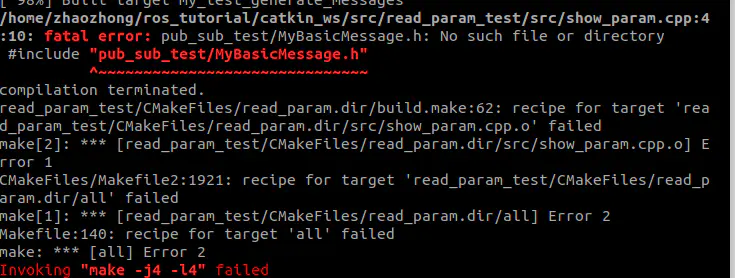


那么如何找到它呢？如下
 1：打开read_param_test里的CMakeLists.txt，在


```undefined
find_package(catkin REQUIRED COMPONENTS
  roscpp
  rospy
  std_msgs
  geometry_msgs
)
```

中添加一行


```undefined
find_package(catkin REQUIRED COMPONENTS
  roscpp
  rospy
  std_msgs
  geometry_msgs
  pub_sub_test
)
```

是的，我们自己定义的包pub_sub_test也成了依赖项了。
 之后在我们定义的可执行文件


```bash
add_executable(read_param src/show_param.cpp)
target_link_libraries(read_param ${catkin_LIBRARIES})
```

后添加一行


```bash
add_executable(read_param src/show_param.cpp)
target_link_libraries(read_param ${catkin_LIBRARIES})
add_dependencies(read_param ${catkin_EXPORTED_TARGETS})
```

即添加`add_dependencies(可执行文件名 ${catkin_EXPORTED_TARGETS})`。关闭保存CMakeLists.txt。打开read_param_test的package.xml，在`<build_depend>roscpp</build_depend>`周围的位置添加


```xml
  <build_depend>pub_sub_test</build_depend>
  <exec_depend>pub_sub_test</exec_depend>
```

其实和任何在find_package里添加的依赖项一样，我们也需要在xml中指明添加的依赖项。保存xml，使用catkin_make编译。现在就不会报错了。现在你成功包含头文件，要定义发布MyBasicMessage消息之类的事情就可以完成了.

#### 4）自定义的消息类型制成package/在不同workspace使用自定义的消息

现在我们能在同一个workspace(catkin_ws)的不同package里使用我们在pub_sub_test中定义的消息了，但是如果以后我们建立了一个其他的workspace我们还想用自定义的消息MyBasicMessage类型怎么办呢？
 方法1：把pub_sub_test这个package直接复制到新的workspace（比如名字叫my_ws）my_ws/src里，使用catkin_make编译之后，pub_sub_test就在你的新的workspace里了，这时候你可以根据上面在**packageA中使用pakcageB中定义的消息类型**中的内容在新的workspace的不同package里使用自定义的消息了。
 **而且这个方法有一个bug，是ROS自己的问题**。比如当我们把pub_sub_test移动到另一个新建的test_ws/src之后，使用catkin_make会编译失败，提示找不到`MyBasicMessage.h`。


因为**首先得编译成功新的消息类型，才可以使用**。现在这个workspace里并没有记载有这个类型的消息，然而我们的cpp文件

```bash
add_executable(pub_my_basic_message src/pub_my_basic_message.cpp)
target_link_libraries(pub_my_basic_message ${catkin_LIBRARIES})
```

已经包含了头文件并且试图编译使用了。这时候我们需要先把这两行文件注释，就能编译成功，编译成功后，新的消息类型在workspace里有了记录，在去掉那两行的注释，再编译，就能成功了= =....

方法2：方法1的弊端是我们只是想使用自定义的消息，却把整个package都复制过去了，那个package里所有内容(cpp文件什么的)都用不到呢，非常'划不来'。**当你意识到你自定义的消息类型需要被很多不同的workspace里的很多不同package使用时，把它单独制成一个package**。这个package里没有任何的cpp文件或者python文件，只有msg的定义。这样你把这个package复制到各个不同workspace，将不会有任何多余的累赘复制过去，其实本质上和方法1是一样的。我们可以简单地试一下，cd 到catkin_ws/src，建立一个新的package，假设我们现在自定义的消息同样只包含std_msgs中的内容


```undefined
catkin_create_package my_custom_message std_msgs message_generation message_runtime
```

由于我们并不会写任何执行文件，所以连roscpp和rospy这两个元老都省了。
 这时候你新创建了一个pakcage，在pakcage中新建一个叫msg的文件夹。在文件夹中新建一个`MyNewMsg.msg`，在其中随便写点内容，如下


```go
float64 data
string id
```

之后打开该pakcage的CMakeLists.txt，和前面的内容类似了


```bash
# add_message_files(
#   FILES
#   Message1.msg
#   Message2.msg
# )
```

去掉注释改为


```css
add_message_files(
  FILES
  MyNewMsg.msg
)
```

另外


```bash
# generate_messages(
#   DEPENDENCIES
#   std_msgs
# )
```

去掉注释，改为


```undefined
generate_messages(
  DEPENDENCIES
  std_msgs
)
```

由于我们一开始就添加了依赖项message_generation和message_runtime所以我们不需要早find_packge()中做修改了，也不需要修改package.xml了。保存CMakeLists.txt关闭。之后CMakeLists.txt编译。编译成功之后你就拥有了一个只为定义消息而生的pakcage，这时候结合**在packageA中使用packageB的中定义的消息类型**和方法1，你可以把它复制到任何workspace给任何package使用了。同时复制到新的workspace也编译也不会像方法1出错，因为这个pakcage里没有任何可执行文件使用了自定义的消息。


### (十一) 附录

#### 1）c++头文件实现函数的问题

头文件即.h文件一般是用来写函数或者类的定义的，而函数的实现一般在cpp文件中完成．但是我也看到过一些文件就在头文件中同时定义函数和实现．打个比方我现在有个头文件名叫`header.h`,内容如下


```cpp
#include <iostream>

void printInt(int number){
    std::cout<<"print an int number "<<number<<std::endl;
}
```

这个头文件同时定义与实现了这个函数．似乎不像是头文件的功能，但是这是允许的．那么这会不会造成什么问题呢？会的．如果你有两个文件同时包含了这个头文件并一起编译，就会有error产生．
 比如，你有一个cpp文件叫main.cpp，一个cpp文件叫test.cpp，两个文件都包含头文件header.h，里面实现了某个内容．编译时(这里使用CMakeLists.txt的语法作为例子)我们一起编译这两个文件


```css
add_executable(main main.cpp test.cpp)
```

就会出现问题．给出的错误是`...multiple definition...`．这个原因是test.cpp和main.cpp实现并定义了函数printInt，所以有重复定义．但这个问题很有意思的是如果你把函数写到类中，如下面


```cpp
#include <iostream>

class Print{
    void printInt(int number){
        std::cout<<"print an int number "<<number<<std::endl;
    }
};
```

则同样被两个文件包含，同样的编译，却不会出现error能正常编译．
 更有意思的是，我们经常喜欢在类外实现函数定义，即头文件改成如下面的这个样子


```cpp
#include <iostream>

class Print{
    void printInt(int number);
};

void Print::printInt(int number){
        std::cout<<"print an int number "<<number<<std::endl;
}
```

再重复上面的步骤编译，又会出现同样的multi definition的error了．

在头文件的实现中，有两种语法，即使实现了函数且被重复包含，也是不会出错的．一个是模版．模版需要定义和实现必须写在一起，无论是写在头文件还是cpp文件中．第二种是内联inline函数．即利用下面语句定义的函数．


```cpp
inline function_type function_name(){...}
```

个人想法是，除非用hpp文件(个人其实不经常使用)或者写模版内联函数，函数或者类的定义和实现还是分开在头文件和cpp源文件中写更好了．第一是代码清晰好读，第二是就算是函数写在类中实现没有大的问题，有经验的程序猿知道我们debug时头文件中函数实现部分的修改会导致包含头文件的所有文件重新编译，编译会耗时更长

#### 2）动态库和静态库

动态库是dynamic library 或者 shared library，在linux中以.so的后续名结尾．
 静态库是static library，　在linux中以.a方式结尾．
 具体见
 https://medium.com/@StueyGK/static-libraries-vs-dynamic-libraries-af78f0b5f1e4
 简单来讲，静态库会在可执行文件编译时一并被编译到文件中去．而动态库则不会，相当于是链接到可执行文件的．
 你如果修改了静态库，并重新编译了静态库，那么你使用了该库的执行文件也需要重新编译才能再次把静态库囊括进去。你如果修改了动态库，则只需要重新编译动态库本身不需要重新编译可执行文件。

#### 3）cmake module链接库

首先我有一个CMakeLists.txt文件，里面的可执行程序需要用到一个叫`libbayesopt.a`的静态库，库的位置位于`/usr/local/lib`.
 我们使用一些有名的库的时候，他好像自己就能找到，不需要多费精神，比如OpenCv，我们只需要在CMakeLists.txt里添加


```undefined
find_package(OpenCV REQUIRED)
```

并把某可执行文件链接到${OpenCv_LIBS}就可以了


```bash
add_executable(abc abc.cpp)
target_link_libraries(abc ${OpenCv_LIBS})
```

可是一些不知名的库，你直接使用find_package(<lib_name> REQUIRED)是找不到库的。因为其实都不知道那么lib_name是什么。比如我那么libbayesopt.a，我在CMakeLists.txt里应该叫它Bayesopt呢还是bayesopt呢？反正试了诸多名字，都是不能直接找到的。比如说我填写的是


```undefined
find_pakcage(Bayesopt REQUIRED)
```

在编译CMakeLists.txt时就会出现下面的错误:


```kotlin
CMake Error at bayesopt_compass/CMakeLists.txt:20 (find_package):
  By not providing "FindBayesopt.cmake" in CMAKE_MODULE_PATH this project has
  asked CMake to find a package configuration file provided by "Bayesopt",
  but CMake did not find one.

  Could not find a package configuration file provided by "Bayesopt" with any
  of the following names:

    BayesoptConfig.cmake
    bayesopt-config.cmake

  Add the installation prefix of "Bayesopt" to CMAKE_PREFIX_PATH or set
  "Bayesopt_DIR" to a directory containing one of the above files.  If
  "Bayesopt" provides a separate development package or SDK, be sure it has
  been installed.
```

其实不用仔细看，大概就是程序找不到Bayesopt是个什么玩意儿，想让你写一个叫`BayesoptConfig.cmake`或者`bayesopt-config.cmake`的文件来找到这个Bayesopt。那么接下来怎么做呢？
 1:在和CMakeLists.txt相同位置建立一个叫cmake_modules的文件夹，在里面创建一个叫`BayesoptConfig.cmake`的文件。注意根据上面error的信息我们只有两种命名选择，这也增加了规范性。
 2:在`BayesoptConfig.cmake`中写入下面内容。


```bash
# Try to find bayesopt library
find_library(Bayesopt_LIBRARIES NAMES bayesopt)
find_path(Bayesopt_INCLUDE_PATH NAMES bayesopt/bayesopt.h)
```

第一行是注释。
 第二行要求寻找一个叫(NAMES)libbayesopt.a或者.so的库。并在CMakeLists中命名为`Bayesopt_LIBRARIES`. 可以看到我们只是指定了bayesopt，并不是指定找libbayesopt.a。这是程序默认的。任何库的名字都是lib开头。你只需要指定lib后的那串字符就可以了。
 第三行指定该库对应的头文件的位置，并在CMakeLists中命名为`Bayesopt_INCLUDE_PATH`.
 这两个find函数会在`/usr/local/lib`和`/usr/local/include`里找相应的库，应该(注意我这儿说的应该，因为我还没自己尝试过找/usr/lib里的库)也会在`/usr/lib`这类文件夹里找相应的库。
 注意有些同学在编译时命名库在`usr/local/lib`里电脑却找不到，这时候你得考虑一下自己添加寻找目录。打开terminal输入


```ruby
export LD_LIBRARY_PATH=$LD_LIBRARY_PATH:/usr/local/lib
```

即可。或者要永久有效的话


```undefined
gedit ~/.bashrc
```

打开一个叫bashrc的文件，在里面最后面添加上面的那行代码。之后保存退出再


```bash
source ~/.bashrc
```

即可。你可以这样指定电脑去任何目录寻找库文件
 3：在你的CMakeLists.txt中，定义好最小cmake版本需求和项目名称后就可以输入我们cmake_modules的位置


```bash
cmake_minimum_required(VERSION 2.8.3)
project(bayesopt_compass)
list(APPEND CMAKE_MODULE_PATH "${PROJECT_SOURCE_DIR}/cmake_modules/")
find_package(Bayesopt REQUIRED)
...
add_executable(abc abc.cpp)
target_link_libraries(abc ${Bayesopt_LIBRARIES})
```

list那一行告诉cmake在哪儿去找我们的modules。之后输入我们要找的package名称。这里正如前面所说的，我们需要把Bayesopt这个名字和FindXXX.cmake中的XXX对应起来。最后在可执行文件添加库链接的时候，那个库的名字和`FindBayesopt.cmake`中的find_library中定义的名字一样。(其实个人试了一下，链接到${Bayesopt_LIBRARY}也是可以的，好像不区分单复数)。可以参考一下https://blog.csdn.net/dbzhang800/article/details/6329314里的内容
 保存CMakeLists.txt之后就能正常编译了。

#####   暴力链接库

如果你实在不想写.cmake文件，但是又要链接到一个你不知道find_package(<name> REQUIRED)中name是何物的库，你可以用一种很暴力的方法。
 比如你知道你要链接的库的位置就是在`/usr/local/lib/libabc.a`，你可以在target_link_libraries中直接添加这个路径


```ruby
cmake_minimum_required(VERSION 2.8.3)
project(your_project)
...
add_executable(def def.cpp)
target_link_libraries(def /usr/local/lib/libabc.a)
```

这种方法也是work的！不仅不用写cmake，而且连find_package这个语句都省略了，怎么样是不是简单又暴力！不过这样做的话看起来也就没那么专业了hhhh，而且以后别人如果使用你的程序来扩展也会比较麻烦，如果你写的程序只想自己或少数几个人弄懂，这也不失为一个办法。


## 六、 ROS报错总结

### (一) sudo rosdep init  找不到命令提示

**问题描述：**

这个错误算是比较好解决的，相当于少包

**解决办法：**

缺啥补啥的原则，进行apt安装即可           **注意：安装的rosdep版本**

对于ROS Melodic（Ubuntu18.04）及以前版本，如ROS Kinetic（Ubuntu16.04），选择安装

>sudo apt-get install python-rosdep

对于ROS Noetic（Ubuntu20.04），选择安装

>sudo apt-get install python3-rosdep

以上相当于一个是python2一个是python3的区别


### (二) 执行sudo rosdep init：ERROR: cannot download default sources list from......

**问题描述：**

执行rosdep update：ERROR: unable to process source......
产生这个错误的原因就是：网络被墙

**解决办法：**

所以如果你有破墙的方法可以直接切换即可避免这个错误，以下针对无数次更换网络、切换手机热点也无法解决问题的情况

#### 1）关键问题1

能否浏览器访问https://raw.githubusercontent.com/ros/rosdistro/master/rosdep/sources.list.d/20-default.list
现实情况是不行的，解决方案和不能访问github一样，找到raw.githubusercontent.com的ip，或者把dns修改成谷歌服务器

##### 1.修改DNS

之所以无法访问raw.githubusercontent.com，是因为国内DNS服务器无法解析这个网址的ip地址，导致无法连接至网站服务器，因此我们需要添加能够解析这个网址的DNS服务器

ubuntu中储存DNS地址的文件为/etc/resolv.conf，可以通过gedit打开，如下面的命令，也可以通过其他文本编辑程序如nano,vi等打开

>sudo gedit /etc/resolv.conf

将原有的nameserver这一行注释，并添加以下两行：

```
nameserver 8.8.8.8
nameserver 8.8.4.4
```

8.8.8.8和8.8.4.4是谷歌的DNS服务器，按理应该能够解析github网站的ip，但是**国内访问谷歌的DNS比较慢**，所以在使用结束后，最好还是还原为114.114.114.114这种国内的DNS服务器，这样访问国内镜像也会快一些，但是注意**不要同时都添加**，可能会出错

（参考https://blog.csdn.net/c417469898/article/details/106360595） 

##### 2.修改IP

修改DNS的好处在于，可以动态适应网站的IP变化，但是由于谷歌DNS服务器的响应比较慢，很容易出现超时等网络错误，并且也存在被墙的可能，所以也可以直接查找raw.githubusercontent.com的解析IP，直接建立域名和IP的映射关系

ubuntu中储存IP映射的文件为/etc/hosts，同样，我这采用gedit打开

>sudo gedit /etc/hosts

加入一行

>199.232.4.133	raw.githubusercontent.com

值得注意的是，上面的ip：199.232.4.133并不一定是你现在的ip，这种方法具有时效性，因此需要预先查询网站的ip

https://githubusercontent.com.ipaddress.com/raw.githubusercontent.com

可通过上述网站进行查询，将查询结果替代199.232.4.133即可

（参考https://blog.csdn.net/u013468614/article/details/102917569）

不论是修改DNS还是修改IP，其结果是为了让电脑能够连接raw.githubusercontent.com，切换DNS或IP时需要等待一小会才能生效，一般而言，通过本方法基本能够解决rosdep的网络问题

#### 2）关键问题2

浏览器能够访问raw.githubusercontent.com，但rosdep的连接时好时坏，完全靠运气，update时，部分网址出现urlopen error [Errno XXX]
出现这个问题，就比较麻烦，因为电脑是能够ping通github的，但是就是连接不稳定，对于rosdep update只要有一个连接错误就会报错，无法继续更新

##### 1.拷贝新rosdep

以下仅对安装了python-rosdep的ROS系统有效，安装python3-rosdep可以参考如下解决方案，只不过把2的代码移植到3即可

从这里https://github.com/HILMR/rosdep_fix/blob/main/sources_list.py下载新的sources_list.py文件到当前目录，然后在终端执行下列命令

>sudo cp /usr/lib/python2.7/dist-packages/rosdep2/sources_list.py sources_list.py.bak #备份

>sudo cp sources_list.py /usr/lib/python2.7/dist-packages/rosdep2/sources_list.py #写入新文件

然后在终端执行sudo rosdep init 或者rosdep update，如果网络连接不稳定会进行重试，最多重试20次（可修改）
```
Retry:1
Retry:2
...
Hit ...
```
这样就基本解决了靠运气的重试方法 

下面介绍一下具体的细节，如果不想看细节可以直接跳过

##### 2.rosdep源码修改

rosdep的源码位于/usr/lib/python2.7/dist-packages/rosdep2，可以通过ls指令查看相应的文件

>ls /usr/lib/python2.7/dist-packages/rosdep2

关键的文件为main.py和sources_list.py
main.py是入口程序，从中可知

rosdep init 调用了sources_list.py的download_default_sources_list()函数

rosdep update 调用了sources_list.py的update_sources_list()函数

网络连接的错误都是urllib2库中的urlopen抛出的，因此最核心的问题可以从这里入手，比如：

###### ①设置超时时间

（urlopen error timed out）

找到sources_list.py里下面的变量，把15改大即可解决urlopen抛出的超时错误

>DOWNLOAD_TIMEOUT = 15.0

###### ②重试连接

（urlopen error [Errno 104] Connection reset by peer）

在一些需要访问网络连接的代码段加入重试机制
```cpp
is_ok=False
count=0
while(not is_ok):
    try:
        f = urlopen(url_request, timeout=DOWNLOAD_TIMEOUT) #这里是需要网络连接的函数区
        is_ok=True
    except:
        count=count+1 #进行重试
        print('Retry:',count)
        if count>MAX_RETRY: #超过最大次数MAX_RETRY则跳出
            is_ok=True
```
**注意，如果是urlopen error [Errno 111] Connection refused，还是应该考虑DNS和IP是否设置正确，否则即使重试也是一直失败的** 

###### ③证书问题

（urlopen error [SSL: CERTIFICATE_VERIFY_FAILED]）

可以通过修改sources_list.py代码解决，即在代码开头加上
```cpp
import ssl
ssl._create_default_https_context = ssl._create_unverified_context
```
（参考https://zhuanlan.zhihu.com/p/77483614）

#### 3）关键问题3：上述方法无效

这里提供一个思路

执行sudo rosdep init会在/etc/ros/rosdep/sources.list.d产生一个20-default.list的文件

执行rosdep update会在/home/xxx/.ros/rosdep/sources.cache（xxx是你的用户名）产生一个文件夹，里面有一堆缓存文件

因此将这些文件拷贝过来，理论上是可以直接使用的，不需要再rosdep了，但是注意，如果时间相隔太久或者版本不一致，可能导致文件失效

github链接：https://github.com/HILMR/rosdep_fix【Ubuntu18.04LTS，ROS Melodic】


### (三) 安装anaconda后roscore报错

**问题描述：**

Command 'roscore' not found, but can be installed with:

报错,roscore ,roslaunch 都不能用 

**解决办法：**

有可能是环境变量所致, 只需

source /opt/ros/melodic/setup.sh

环境变量默认是anaconda的因此需要使用ROS的时候，在打开终端时输入上面的命令


### (四) roslaunch 启动launch文件报错 

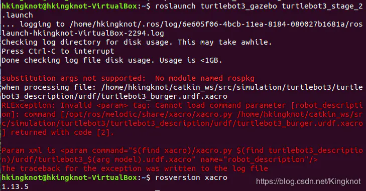

**问题描述：**

**substitution args not supported: No module named rospkg**

安装的是anaconda3,python3.8，ROS中pkg依赖包可能用的Python版本不同

**解决办法：**

>conda install setuptools

>pip install -U rosdep rosinstall_generator wstool rosinstall six vcstools

重新运行


### (五) catkin_make工作空间编译，找不到功能包

#### 1）功能包查询

在工程中使用功能包时，使用下面命令对当前安装完成的功能包进行查询。

```c
rospack list
```

#### 2）功能包安装不完整造成的

```text
CMake Error at /opt/ros/kinetic/share/catkin/cmake/catkinConfig.cmake:83 (find_package
):
  Could not find a package configuration file provided by "gazebo_plugins"
  with any of the following names:
    gazebo_pluginsConfig.cmake
    gazebo_plugins-config.cmake

  Add the installation prefix of "gazebo_plugins" to CMAKE_PREFIX_PATH or set
  "gazebo_plugins_DIR" to a directory containing one of the above files.  If "gazebo_plugins" provides a separate development package or SDK, be sure it has been installed.
```

**问题描述：**

“ Could not find a package configuration file provided by "gazebo_plugins”

缺少“gazebo_plugins”功能包导致编译无法通过。

**解决办法：**

使用的工作空间里没有用到这个功能包，提示我缺少这个功能包？因为工程中使用到的功能包A是依赖功能包B的，如果功能包B没有正确安装，功能包A是无法运行的。

**安装方法有两种：**

##### 1.使用包安装命令直接安装：

```text
sudo apt-get install ros-melodic-功能包名
```

**注意：由于国内网络原因这种方法大概率会失败**

##### 2.下载功能包的压缩文件，自己解压到工作空间后编译使用：

- 登录ROS-Wiki：

[Documentation - ROS Wiki](https://link.zhihu.com/?target=http%3A//wiki.ros.org/)

- 在software列表下选择package选项，如下图

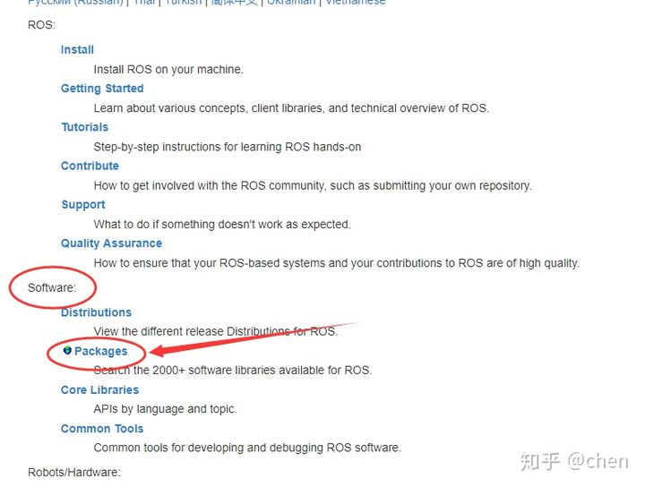

- 点击后在出现的页面输入我们想要查找的功能包，例如我需要查找这个功能包，点击搜索，在搜索结果中选择我们需要的。如下图

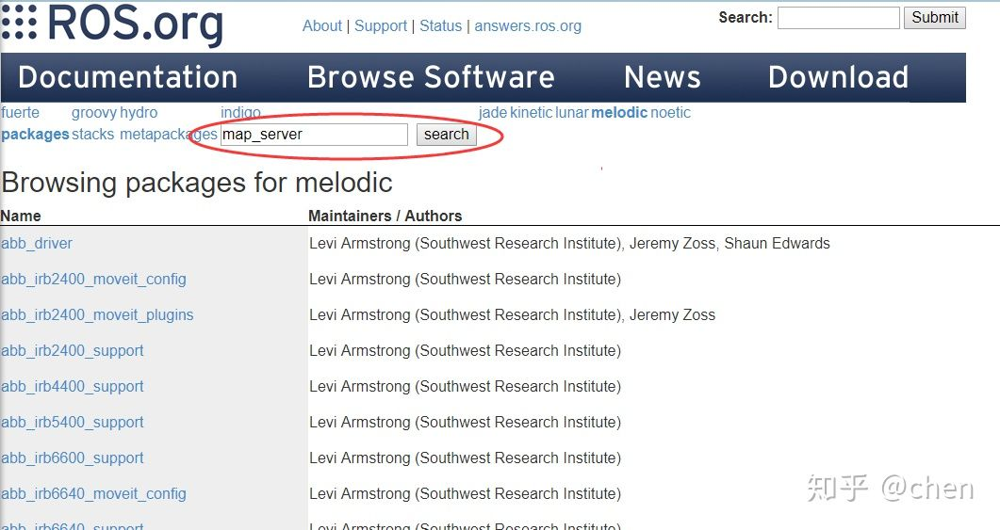


- 最后这个界面中，有两个网址，第一个网址是对此功能包的具体说明；第二个网址是该功能包在GitHub中的下载地址。如下图

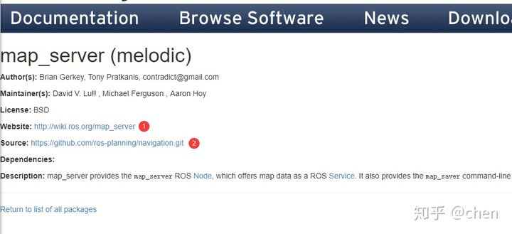

建议在使用一个未知的功能包之前，进入第一个网址对功能包的功能和说明进行简要阅读。

- 了解功能包的基本功能后，进入source指定的GitHub网址。点击1、2下载功能包压缩文件。如下图


解压后，将相应的功能包放入工作空间即可。再次编译，问题解决。


### (六) ROS-map_server功能包编译报错解决方法

**问题描述：**

在使用导航功能包之前，需要先保存gmapping功能包构建的地图数据。对gmapping在rviz中产生的地图数据需要使用mapserver功能包来进行保存。下载mapserver功能包到工作空间后，catkin_make编译报错：

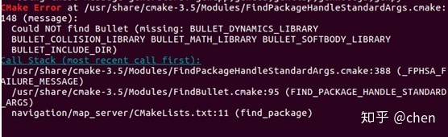

提示：could not find bullet

在map_server功能包的package.xml文件中我发现这样一条语句：

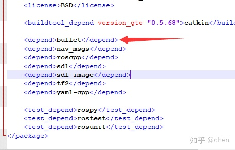

package.xml文件是功能包清单，bullet是map_server功能包的一个依赖项。由于ROS中没有这个包导致编译无法继续进行，编译失败。

**解决办法：**

```text
sudo apt-get install libbullet-dev
```

安装完成后，继续报错：Could NOT find SDL (missing: SDL_LIBRARYSDL_INCLUDE_DIR)同样的，还是由于缺少依赖项。

**解决办法：**

```text
sudo aptitude install libsdl1.2-dev
```

继续报错：Could NOT find SDL_image (missing:SDL_IMAGE_LIBRARIES SDL_IMAGE_INCLUDE_DIRS)

**解决办法：**

```text
sudo apt-get installlibsdl-image1.2-dev 
```

再次运行，问题解决。


### (七) ROS-找不到launch文件的解决办法

**1.问题描述：**

**“is neither a launch file”**

```text
[*****.launch] is neither a launch file in package [******] nor is [******] a launch file name
The traceback for the exception was written to the log file
```

**解决办法：**

```text
$   cd ~/catkin_ws/

$   catkin_make
$   source devel/setup.bash

$   echo $ROS_PACKAGE_PATH   /home/ideallic/catkin_ws/src:/opt/ros/indigo/share:/opt/ros/indigo/stacks
$   export | grep ROS
```

**原理解释：**

来到工作空间下对工作空间进行编译，并使用source命令配置环境变量，再使用echo命令使得环境变量在所有命令行终端中生效。最后使用export显示当前环境变量的配置信息。

出现这个报错信息的原因是工程中新建一个launch文件后，没有及时配置环境变量，导致roslaunch命令无法识别到新添加的launch文件。


**2.问题描述：**

**is not a launch file**

**解决办法：**

```text
roslaunch package_name abc.launch
```

**原理解释：**在启动一个launch文件时，如果直接使用“roslaunch + launch文件名 ”的方式，就可能会导致ros系统找不到所需launch文件的位置。为了使ROS能够正确启动launch文件，应这样输入命令：

```text
roslaunch + 功能包名 + launch文件名
```


### (八) 其他问题

ROS报错总结链接：

https://www.cnblogs.com/fuzhuoxin/p/12564325.html

https://blog.csdn.net/qq_39178398/article/details/108691091

https://www.cnblogs.com/hgl0417/p/11562580.html

http://www.manongjc.com/detail/8-xxxsdiwsnvoeuih.html


## 七、 ROS教程

### (一) 学习ROS wiki官方教程

原版地址：http://wiki.ros.org/cn/ROS/Tutorials 
创客智造整理版地址：[http://www.ncnynl.com/category ... rial/](http://www.ncnynl.com/category/ros-junior-tutorial/) 
作用：了解ROS机器人操作系统的安装，使用，系统结构，系统命令，包开发等


### (二) 学习来自古月居的ROS探索总结

网址：http://www.ncnynl.com/category/ros-learning/
作用：作者在学习和使用ROS过程中的总结与创新，帮助其他学习者更快了解、熟悉ROS(来自古月居)


### (三) 学习ROS的官方推荐硬件平台Turtlebot系列，目前是turtlebot2

网址：[http://www.ncnynl.com/category ... rial/](http://www.ncnynl.com/category/turtlebot-junior-tutorial/)
网址：[http://www.ncnynl.com/category ... rial/](http://www.ncnynl.com/category/turtlebot-coffee-machine-tutorial/)
网址：[http://www.ncnynl.com/category ... tion/](http://www.ncnynl.com/category/turtlebot-Simulation/)
网址：http://www.ncnynl.com/category/turtlebot-android/
作用：ROS官方的硬件平台，是学习ROS入门的优选平台，通过DEMO的学习，可以快速掌握。

### (四) 学习arduino版的ROS小车

网址：http://www.ncnynl.com/category/ros-car/
网址：http://www.ncnynl.com/category/ros-diego/
作用：了解如何结合Arduino进行ROS开发


### (五) 学习stm32版的ROS小车

网址：http://www.ncnynl.com/category/ros-car-b/
作用：了解如何结合STM32进行ROS开发


### (六) 学习Python语言及ROS开发

网址：http://www.ncnynl.com/category/Python/
网址：http://www.ncnynl.com/category/ros-python/
作用：了解Python语言并如何开发ROS程序

### (七) 学习C++语言及ROS开发

网址：http://www.ncnynl.com/category/cplusplus/
网站：http://www.ncnynl.com/category/roscpp/
作用：了解C++语言并如何开发ROS程序


### (八) 学习SLAM相关

网址：http://www.ncnynl.com/category/ros-rgbd/
网址：http://www.ncnynl.com/category/ros-laser/
网址：http://www.ncnynl.com/category/ros-slam/
网址：http://www.ncnynl.com/category/rgbd-slam/
作用：了解如何结合各种传感器实现SLAM


### (九) 学习无人机相关

网址：http://www.ncnynl.com/category/ros-ardrone/
网址：http://www.ncnynl.com/category/ros-bebop/
作用：了解如何通过ROS控制无人机


### (十) 学习机械臂相关

网址：http://www.ncnynl.com/category/turtlebot-arm/
网址：http://www.ncnynl.com/category/ros-moveit/
作用：了解如何通过ROS控制机械臂

