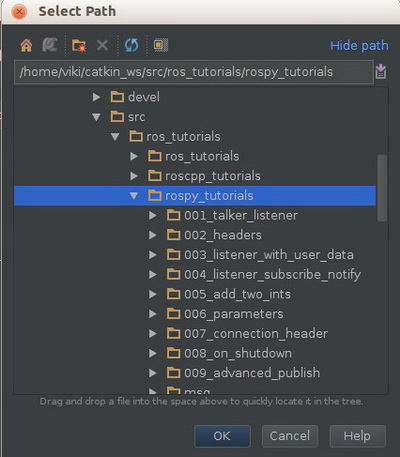
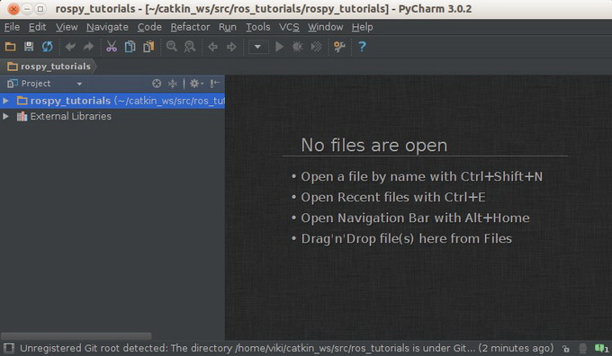
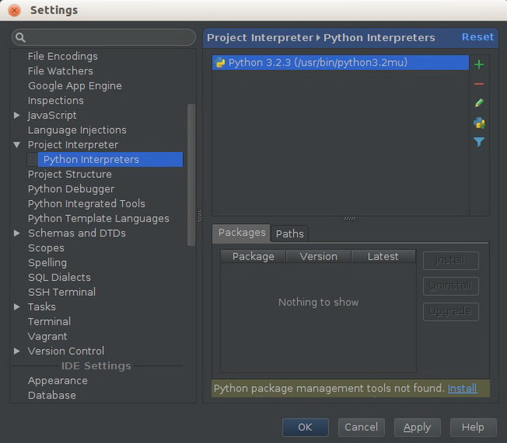
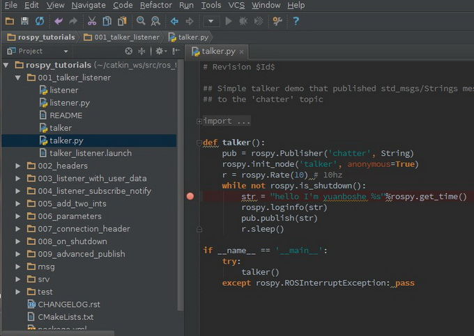
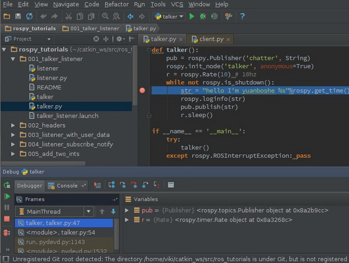

## PyCharm 安装

### (一) PyCharm 

* 版本选择

  PyCharm 官方下载地址：http://www.jetbrains.com/pycharm/download/

  选择Linux版本，目前有Professional和Community两个Linux版本，前者是付费版，30天免费试用期限，后者是免费版

* Wget方式下载，建立下载目录tools，下载并安装

>mkdir ~/tools

 >cd ~/tools

 >wget https://download.jetbrains.com/python/pycharm-professional-2016.2.3.tar.gz

* 或使用其他工具下载后，在上传到tools目录
* 安装,在tools目录下

 >cd ~/tools
 >tar xfz pycharm-professional-2016.2.3.tar.gz  #解压
 >cd pycharm-professional-2016.2.3
 >./pycharm.sh                       #按提示安装即可

### (二) PyCharm调试Python工程

* 新建catkin工作空间

>mkdir -p ~/catkin_ws/src   #建立源目录

 >cd ~/catkin_ws/src

 >catkin_init_workspace      #初始化空间

 >cd ~/catkin_ws/

 >catkin_make                #首次编译

 >echo "source ~/catkin_ws/devel/setup.bash" >> ~/.bashrc   #使用工作空间

* 需要重新打开终端，环境配置才能生效
* 添加测试代码

 >cd ~/catkin_ws/src

 > git clone https://github.com/ros/ros_tutorials.git

 >ls

* 或使用其他工具下载后，在上传到tools目录
* 安装,在tools目录下

 >cd ~/tools
 >tar xfz pycharm-professional-2016.2.3.tar.gz  #解压
 >cd pycharm-professional-2016.2.3
 >./pycharm.sh                       #按提示安装即可

### (三) PyCharm里添加工程

* 导入 rospy_tutorials 包，使之成为PyCharm的python工程。点击 Open Directory 按钮，在弹出的对话框中选择 ~/catkin_ws/src/ros_tutorials/rospy_tutorials/ 路径

* 点击 OK，工程将被创建

* 设置python2.7为PyCharm工程的Interpreter

 * PyCharm默认将Python 3.2设置为工程的interpreter，而ROS使用的是Python 2.7，这里需要设置一下，使用Python 2.7，否则无法运行ROS相关的Python库。如果默认是Python 2.7则不用修改

 * File 菜单 -> Settings 项，打开设置对话框，选择 Project Interpreter -> Python Interpreters 

 * 点击右边选框的加号，增加 Python 2.7 Interpreter，并将其设置为工程默认

  

* 调试代码
 * 先打开一个terminal，输入 roscore 命令启动ROS Master

 * 在PyCharm左边的 Project 树形框中，找到 talker.py 文件，打开。然后找到 “hello world” 所在的位置，修改为 “hello I'm yuanboshe”，并设置断点

 

 * 保存后，右键左边的 talker.py 文件，弹出右键菜单，选择 Debug 'talker' 项

 

 * 启动调试后，talker 程序就会运行，并会运行到断点处停下来

 

 * 在下面的变量栏能够看到变量值。取消断点，按 F9 继续运行，将下面的显示窗口切换到 Console 窗口，能够看到修改后的信息

 

 * 回到桌面，再开一个terminal窗口，输入 rosrun rospy_tutorials listener 命令，可以看到正确的监听消息

