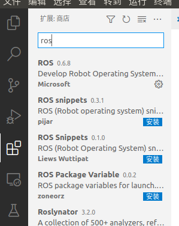
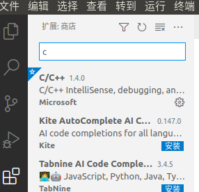
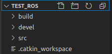

##  VS Code安装

### (一) 安装包安装

* 从vscode官网下载最新版本，deb包下载地址：https://code.visualstudio.com/docs?dv=linux64
  （由于是外网，可能下载速度极慢，可直接使用百度网盘下载）
                  链接：https://pan.baidu.com/s/1HKBQ6k9X-ZVX4C2vYgBFSA 
                  提取码：7ze2

* 下载后在放置deb包的文件夹直接打开终端，然后输入

>sudo  dpkg  -i code_1.45.1-1589445302_amd64.deb

  (其中的 -i 后面的就是deb包名；执行之后等待)


### (二) apt 安装

* 以 sudo 用户身份运行下面的命令，更新软件包索引，并且安装依赖软件

>sudo apt update
>sudo apt install software-properties-common apt-transport-https wget

* 使用 wget 命令插入 Microsoft GPG key

>wget -q https://packages.microsoft.com/keys/microsoft.asc -O- | sudo apt-key add -

* 启用 Visual Studio Code 源仓库，输入

>sudo add-apt-repository "deb [arch=amd64] https://packages.microsoft.com/repos/vscode stable main"

*  apt 软件源被启用，安装 Visual Studio Code 软件包

>sudo apt install code

* 新版本被发布时，可以通过桌面标准软件工具，或者在终端运行命令，来升级 Visual Studio Code 软件包

>sudo apt update

 >sudo apt upgrade


### (三) 拓展安装

  启动 VS Code 在软件拓展中安装插件

* ROS插件

  打开VS Code，在左侧栏点击Extensions，并在搜索框中输入ros，安装ROS插件

​       
​    

* C/C++插件

  搜索框中输入c/c++，安装C/C++插件




### (四) VS Code调试

#### 1）创建ROS工作环境

* 主目录新建一个文件夹，命名为test_ros，在该文件夹中打开终端，执行以下命令来创建ROS工作环境

>mkdir src && cd src

 >catkin_init_workspace

 >cd ../

 >catkin_make

* 在VScode中打开test_ros文件夹，此时的文件目录如下
  

* 右键单击src，选择Create Catkin Package，Package命名为helloworld
  

* 添加roscpp, rospy作为依赖项
  

* src/helloworld/src目录下添加一个cpp文件，命名为helloworld.cpp，内容如下

  ```cpp
  #include <iostream>
  #include <string>
  #include <sstream>
  using namespace std;
  
  #include "ros/ros.h"
  #include "std_msgs/String.h"
  
  int main(int argc, char** argv)
  {
  ros::init(argc, argv, "talker");
  ros::NodeHandle n;
  ros::Publisher chatter_pub = n.advertise<std_msgs::String>("chatter", 1000);
  ros::Rate loop_rate(10);
  int count = 0;
  while(ros::ok())
  {
  	std_msgs::String msg;
  	std::stringstream ss;
  	ss << "hello world " << count;
  	msg.data = ss.str();
  	ROS_INFO("%s", msg.data.c_str());
  	chatter_pub.publish(msg);
  	ros::spinOnce();
  	loop_rate.sleep();
  	count++;
  }
  return 0;
   }
  ;
  
  ```

此时会提示找不到ros/ros.h和std_msgs/String.h，我们继续通过后面的步骤来解决

#### 2）配置.json文件

配置c_cpp_properties.json,launch.json,tasks.json

* c_cpp_properties.json，用于指定C/C++类库和包含路径以及配置

 按住Fn+F1，找到C/C++:编辑配置(JSON)

 

 生成c_cpp_properties.json文件，修改文件内容如下

 ```json
 {
    "configurations": [
        {
            "name": "Linux",
            "includePath": [
                "${workspaceFolder}/**",
                "/opt/ros/melodic/include"
            ],
            "defines": [],
            "compilerPath": "/usr/bin/gcc",
            "cStandard": "c11",
            "cppStandard": "c++17",
            "intelliSenseMode": "clang-x64",
            "compileCommands": "${workspaceFolder}/build/compile_commands.json"
        }
    ],
    "version": 4
}

 ```

 其中/opt/ros/melodic/include为ROS相关头文件所在的路径，此时可能仍然找不到ros/ros.h和std_msgs/String.h，继续运行以下命令即可在build文件夹下生成compile_commands.json文件

 > catkin_make -DCMAKE_EXPORT_COMPILE_COMMANDS=1

* launch.json，用于调试

  按住Fn+F5启动调试，就会生成launch.json，修改launch.json文件内容如下：

   ```json
  {
    // 使用 IntelliSense 了解相关属性。 
    // 悬停以查看现有属性的描述。
    // 欲了解更多信息，请访问: https://go.microsoft.com/fwlink/?linkid=830387
    "version": "0.2.0",
    "configurations": [
            {
            "name": "(gdb) Launch",
            "type": "cppdbg",
            "request": "launch",
            "program": "${workspaceFolder}/build/helloworld/helloworld",// 表示可执行程序所在的路径，其中，${workspaceRoot}表示VScode加载的文件夹的根目录
            "args": [],
            "stopAtEntry": false,
            "cwd": "${workspaceFolder}",
            "environment": [],
            "externalConsole": false,
            "MIMode": "gdb",
            "setupCommands": [
                {
                    "description": "Enable pretty-printing for gdb",
                    "text": "-enable-pretty-printing",
                    "ignoreFailures": true
                }
            ],
            //"preLaunchTask": "make build"//最好删了，不然会影响调试，每次调试都直接执行make build
        }
    ]
  }
  
   ```

* tasks.json，用于编译

  按住Fn+F1，找到任务：配置任务，创建tasks.json文件，修改tasks.json文件内容如下

    ```json
      {
      "version": "2.0.0",
               "tasks": [
        {
            "label": "catkin_make", //代表提示的描述性信息
            "type": "shell",  //可以选择shell或者process,如果是shell代码是在shell里面运行一个命令，如果是process代表作为一个进程来运行
            "command": "catkin_make",//这个是我们需要运行的命令
            "args": [],//如果需要在命令后面加一些后缀，可以写在这里，比如-DCATKIN_WHITELIST_PACKAGES=“pac1;pac2”
            "group": {"kind":"build","isDefault":true},
            "presentation": {
                "reveal": "always"//可选always或者silence，代表是否输出信息
            },
            "problemMatcher": "$msCompile"
        },
                             ]
                                                                                                                                       }
  
    ```

 #### 3） 修改CMakeLists.txt

* 继续修改src/helloworld/CMakeLists.txt文件，在其中添加以下程序

  ```xml
  # 头文件路径
  include_directories(
  include
  ${catkin_INCLUDE_DIRS}
  )
  # 生成可执行文件
  add_executable( helloworld src/helloworld.cpp )
  # 链接库
  target_link_libraries(helloworld ${catkin_LIBRARIES})
  
  ```

 #### 4）结果测试

* 按住Ctrl+Shift+B编译该程序，就可以看到与catkin_make一样的编译过程


* 测试生成的可执行文件．新开一个终端，运行ROS的master节点，然后按住Fn+F5运行生成的可执行文件


