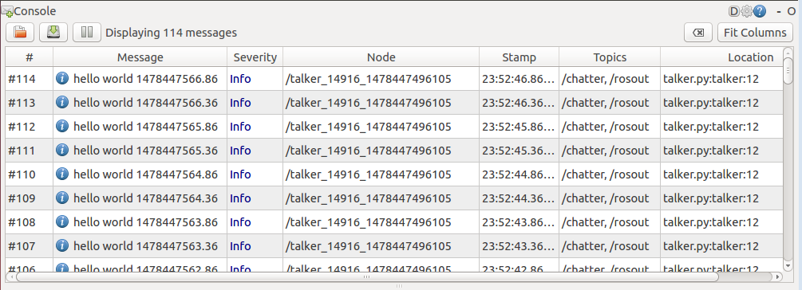
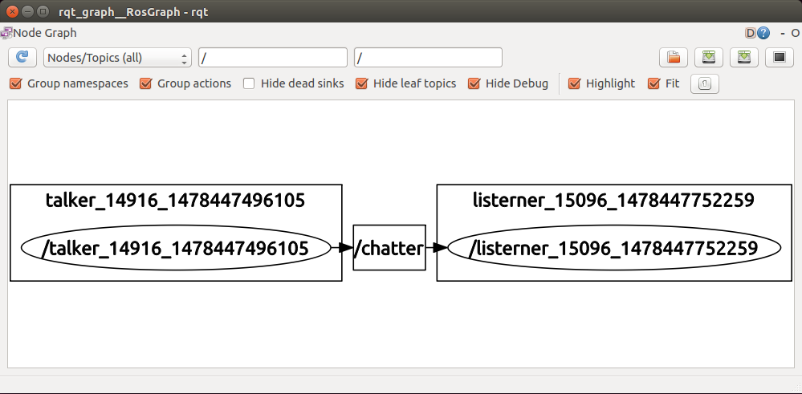

## Ros与Python

原文链接: https://www.ncnynl.com/category/ros-python/

github链接  :https://github.com/ros/ros_tutorials/tree/melodic-devel


### (一) 构建工作空间

- 下面我们开始创建一个catkin 工作空间：

```
$ mkdir -p ~/catkin_ws/src
$ cd ~/catkin_ws/src
```

- 即使这个工作空间是空的（在'src'目录中没有任何软件包，只有一个CMakeLists.txt链接文件），你依然可以编译它：

```
$ cd ~/catkin_ws/
$ catkin_make
```

- catkin_make命令在catkin 工作空间中是一个非常方便的工具。如果你查看一下当前目录应该能看到'build'和'devel'这两个文件夹。在'devel'文件夹里面你可以看到几个setup.sh文件。source这些文件中的任何一个都可以将当前工作空间设置在ROS工作环境的最顶层，想了解更多请参考catkin文档。接下来首先source一下新生成的setup.sh文件：

```
$ source devel/setup.bash
```

- 要想保证工作空间已配置正确需确保ROS_PACKAGE_PATH环境变量包含你的工作空间目录，采用以下命令查看：

```
$ echo $ROS_PACKAGE_PATH
/home/ygd/catkin_ws/src:/opt/ros/melodic/share:/opt/ros/melodic/stacks
```

- ygd为用户目录

**每次打开终端自动加载ROS环境和工作空间**

```
$ vim ~/.bashrc
```

添加内容到文件末尾

```
source /opt/ros/melodic/setup.bash
source /home/ygd/catkin_ws/devel/setup.bash
```

- ygd为用户目录


### (二) 构建Catkin包

- 首先切换到之前通过创建catkin工作空间教程创建的catkin工作空间中的src目录下：

```
$ cd ~/catkin_ws/src
```

- 现在使用`catkin_create_pkg`命令来创建一个名为'beginner_tutorials'的新程序包，这个程序包依赖于std_msgs、roscpp和rospy：

```
$ catkin_create_pkg beginner_tutorials std_msgs rospy roscpp
```

- 这将会创建一个名为`beginner_tutorials`的文件夹，这个文件夹里面包含一个package.xml文件和一个CMakeLists.txt文件，这两个文件都已经自动包含了部分你在执行`catkin_create_pkg`命令时提供的信息。
- catkin_create_pkg命令会要求你输入package_name，如果有需要你还可以在后面添加一些需要依赖的其它程序包：

```
# catkin_create_pkg <package_name> [depend1] [depend2] [depend3]
```

**程序包依赖关系**

**一级依赖**

- 之前在使用catkin_create_pkg命令时提供了几个程序包作为依赖包，现在我们可以使用`rospack`命令工具来查看一级依赖包。

```
$ rospack depends1 beginner_tutorials
```

**效果：**

```
std_msgs
rospy
roscpp
```

- 就像你看到的，rospack列出了在运行catkin_create_pkg命令时作为参数的依赖包，这些依赖包随后保存在package.xml文件中。

```
$ roscd beginner_tutorials
$ cat package.xml
```

**效果：**

```
<?xml version="1.0"?>
<package>
...
 <buildtool_depend>catkin</buildtool_depend>
  <build_depend>roscpp</build_depend>
  <build_depend>rospy</build_depend>
  <build_depend>std_msgs</build_depend>
  <run_depend>roscpp</run_depend>
  <run_depend>rospy</run_depend>
  <run_depend>std_msgs</run_depend>

...
</package>
```

**间接依赖**

- 在很多情况中，一个依赖包还会有它自己的依赖包，比如，rospy还有其它依赖包。

```
$ rospack depends1 rospy
```

**效果：**

```
genpy
rosgraph
rosgraph_msgs
roslib
std_msgs
```

- 一个程序包还可以有好几个间接的依赖包，幸运的是使用rospack可以递归检测出所有的依赖包。

```
$ rospack depends beginner_tutorials
cpp_common
rostime
roscpp_traits
roscpp_serialization
genmsg
genpy
message_runtime
rosconsole
std_msgs
rosgraph_msgs
xmlrpcpp
roscpp
rosgraph
catkin
rospack
roslib
rospy
```

**自定义你的程序包**

**自定义 package.xml**

- 自动生成的package.xml文件应该在你的新程序包中。
- 现在让我们一起来看看新生成的package.xml文件以及每一个需要你注意的标签元素。

**描述标签**

- 首先更新描述标签：

```
<description>The beginner_tutorials package</description>
```

- 将描述信息修改为任何你喜欢的内容，但是按照约定第一句话应该简短一些，因为它覆盖了程序包的范围。
- 如果用一句话难以描述完全那就需要换行了。

**维护者标签**

- 接下来是维护者标签：

```
<!-- Example:  -->
<!-- <maintainer email="jane.doe@example.com">Jane Doe</maintainer> -->
<maintainer email="ubu@todo.todo">ubu</maintainer>
```

- 这是package.xml中要求填写的一个重要标签，因为它能够让其他人联系到程序包的相关人员。
- 至少需要填写一个维护者名称，但如果有需要的话你可以添加多个。
- 除了在标签里面填写维护者的名称外，还应该在标签的email属性中填写邮箱地址

**许可标签**

- 再接下来是许可标签，同样的也需要：

```
<!-- One license tag required, multiple allowed, one license per tag -->
<!-- Commonly used license strings: -->
<!--   BSD, MIT, Boost Software License, GPLv2, GPLv3, LGPLv2.1, LGPLv3 -->
<license>TODO</license>
```

- 你应该选择一种许可协议并将它填写到这里。

- 一些常见的开源许可协议有BSD、MIT、Boost Software License、GPLv2、GPLv3、LGPLv2.1和LGPLv3。

- 你可以在Open Source Initiative中阅读其中的若干个许可协议的相关信息。

- 对于本教程我们将使用BSD协议，因为ROS核心组件的剩余部分已经使用了该协议：

  BSD

**依赖项标签**

- 接下来的标签用来描述程序包的各种依赖项，这些依赖项分为：build_depend、buildtool_depend、run_depend、test_depend。
- 关于这些标签的更详细介绍请参考Catkin Dependencies相关的文档。在之前的操作中，因为我们将 std_msgs、 roscpp、 和 rospy作为catkin_create_pkg命令的参数，所以生成的依赖项看起来如下：

```
  <!-- The *_depend tags are used to specify dependencies -->
  <!-- Dependencies can be catkin packages or system dependencies -->
  <!-- Examples: -->
  <!-- Use build_depend for packages you need at compile time: -->
  <!--   <build_depend>genmsg</build_depend> -->
  <!-- Use buildtool_depend for build tool packages: -->
  <!--   <buildtool_depend>catkin</buildtool_depend> -->
  <!-- Use run_depend for packages you need at runtime: -->
  <!--   <run_depend>python-yaml</run_depend> -->
  <!-- Use test_depend for packages you need only for testing: -->
  <!--   <test_depend>gtest</test_depend> -->
  <buildtool_depend>catkin</buildtool_depend>
  <build_depend>roscpp</build_depend>
  <build_depend>rospy</build_depend>
  <build_depend>std_msgs</build_depend>
```

- 除了catkin中默认提供的buildtool_depend，所有我们列出的依赖包都已经被添加到build_depend标签中。在本例中，因为在编译和运行时我们需要用到所有指定的依赖包，因此还需要将每一个依赖包分别添加到run_depend标签中：

```
  <buildtool_depend>catkin</buildtool_depend> 
  <build_depend>roscpp</build_depend>
  <build_depend>rospy</build_depend>
  <build_depend>std_msgs</build_depend>
  <run_depend>roscpp</run_depend>
  <run_depend>rospy</run_depend>
  <run_depend>std_msgs</run_depend>
```


### (三) 写简单的发布器和订阅器

#### 1）定义msg消息

1.在beginner_tutorials,新建msg消息目录,新建Num.msg文件

```
$ roscd beginner_tutorials
$ mkdir msg
$ cd msg
$ touch Num.msg
$ rosed beginner_tutorials Num.msg
```

2.Num.msg文件，输入代码：

```
int64 num
```

3.打开文件`rosed beginner_tutorials package.xml`,增加依赖，

```
<build_depend>message_generation</build_depend>
<run_depend>message_runtime</run_depend>
```

4.打开文件`rosed beginner_tutorials CMakeLists.txt`,增加依赖,

```
# Do not just add this line to your CMakeLists.txt, modify the existing line
find_package(catkin REQUIRED COMPONENTS
  roscpp
  rospy
  std_msgs
 message_generation
)
```

5.在CMakeLists.txt文件，增加消息文件，取消#，并修改为

```
add_message_files(
  FILES
  Num.msg
)
```

6.在CMakeLists.txt文件，增加消息生成包，取消#，并修改为

```
generate_messages(
  DEPENDENCIES
  std_msgs
)
```

7.在CMakeLists.txt文件，增加消息生成包，取消CATKIN_DEPENDS的#，并修改为

```
catkin_package(
#  INCLUDE_DIRS include
#  LIBRARIES beginner_tutorials
   CATKIN_DEPENDS roscpp rospy std_msgs message_runtime
#  DEPENDS system_lib
)
```

8.编译代码

```
$ cd ~/catkin_ws
$ catkin_make
```

9.检查服务

- 命令：

```
$ rosmsg show beginner_tutorials/Num
```

- 效果：

```
int64 num
```

#### 2）编写发布器的步骤

1.进入之前建立的包beginner_tutorials

```
$ roscd beginner_tutorials
```

2.建立Python脚本目录

```
$ mkdir scripts
$ cd scripts
```

3.新建talker.py文件，设置权限为可执行，并输入代码

```
$ touch talker.py                #生成文件
$ chmod +x talker.py             #设置可执行
$ rosed beginner_tutorials talker.py #自己输入代码
```

**talker.py内容如下：**

```
#!/usr/bin/env python

import rospy
from std_msgs.msg import String

def talker():
    pub = rospy.Publisher('chatter', String, queue_size=10)
    rospy.init_node('talker', anonymous=True)
    rate = rospy.Rate(10) # 10hz
    while not rospy.is_shutdown():
        hello_str = "hello world %s" % rospy.get_time()
        rospy.loginfo(hello_str)
        pub.publish(hello_str)
        rate.sleep()

if __name__ == '__main__':
    try:
        talker()
    except rospy.ROSInterruptException:
pass
```

4.代码分析

- 代码：`#!/usr/bin/env python`
- 分析：指定通过python解释代码
- 代码：`import rospy`
- 分析：导入rospy包，rospy是ROS的python客户端。[参考rospy API接口](http://docs.ros.org/api/rospy/html/)
- 代码：`from std_msgs.msg import String`
- 分析：
  - 导入python的标准字符处理库
  - String是一个函数，可以另外方式赋值：

```
msg = String()  
msg.data = str
```

- 或者

```
String(data=str)
```

- [参考python的标准函数库](https://docs.python.org/2/library/index.html)
- 代码：`def talker()`
- 分析：定义talker函数，[参考如何定义函数](http://www.ncnynl.com/archives/201610/1011.html)
- 代码：`pub = rospy.Publisher('chatter', String, queue_size=10)`
- 分析：定义发布的主题名称chatter， 消息类型String,实质是std_msgs.msg.String， 设置队列条目个数.[参考rospy.Publisher API](http://docs.ros.org/api/rospy/html/rospy.topics.Publisher-class.html)
- 代码：`rospy.init_node('talker', anonymous=True)`
- 分析：
  - 初始化节点，节点名称为talker, [参考rospy.init_node API](http://docs.ros.org/api/rospy/html/rospy-module.html#init_node)
  - anonymous=True，要求每个节点都有唯一的名称，避免冲突。这样可以运行多个talker.py
- 代码：`rate = rospy.Rate(10) # 10hz`
- 分析：设置发布的频率，单位是每秒次数，这是每秒10次的频率发布主题，[参考rospy.Rate API](http://docs.ros.org/api/rospy/html/rospy.timer.Rate-class.html)
- 代码：`rospy.is_shutdown()`
- 分析：用于检测程序是否退出，是否按Ctrl-C 或其他
- 代码：`rospy.loginfo`
- 分析：在屏幕输出日志信息，写入到rosout节点，也可以通过rqt_console来查看。[参考rospy.loginfo API](http://docs.ros.org/api/rospy/html/rospy-module.html#loginfo)
- 代码：pub.publish(hello_str)
- 分析：发布信息到主题，[参考pub.publish API](http://docs.ros.org/api/rospy/html/rospy.topics.Publisher-class.html)
- 代码：`rate.sleep()`
- 分析：睡眠一定持续时间，如果参数为负数，睡眠会立即返回。[参考 sleep api](http://docs.ros.org/api/rospy/html/rospy-module.html#sleep)

5.编译代码

```
$ cd ~/catkin_ws
$ catkin_make
```

6.测试代码

- 打开新终端，启动roscore

```
$ roscore 
```

- 打开另一个终端，启动talker.py

```
$rosrun beginner_tutorials talker.py
```

- 效果：

```
ubu@ubu:~/catkin_ws/src$ rosrun beginner_tutorials talker.py 
[INFO] [WallTime: 1478418967.640556] hello world 1478418967.64
[INFO] [WallTime: 1478418967.741493] hello world 1478418967.74
```

7.查看主题

- 命令：

```
$ rostopic echo /chatter
```

- 效果：

```
data: hello world 1478444433.95
---
data: hello world 1478444434.45
---
data: hello world 1478444434.95
---
data: hello world 1478444435.45
```

#### 3）编写订阅器的步骤

1.进入~/catkin_ws/src/beginner_tutorials/scripts目录，建立listener.py文件

```
$ roscd beginner_tutorials 
$ cd scripts
$ touch listener.py
$ chmod +x listener.py
$ rosed beginner_tutorials  listener.py
```

2.输入代码：

```
#!/usr/bin/env python

import rospy
from std_msgs.msg import String

def callback(data):
    rospy.loginfo(rospy.get_caller_id() + 'I heard %s', data.data)

def listener():

    # In ROS, nodes are uniquely named. If two nodes with the same
    # name are launched, the previous one is kicked off. The
    # anonymous=True flag means that rospy will choose a unique
    # name for our 'listener' node so that multiple listeners can
    # run simultaneously.
    rospy.init_node('listener', anonymous=True)

    rospy.Subscriber('chatter', String, callback)

    # spin() simply keeps python from exiting until this node is stopped
    rospy.spin()

if __name__ == '__main__':
    listener()
```

3.代码分析

- 代码：`rospy.init_node('listener', anonymous=True)`
- 分析：
  - 初始化节点，节点名称为talker, [参考rospy.init_node API](http://docs.ros.org/api/rospy/html/rospy-module.html#init_node)
  - anonymous=True，要求每个节点都有唯一的名称，避免冲突。这样可以运行多个listener.py
- 代码： `rospy.Subscriber("chatter", String, callback)`
- 分析：
  - 订阅函数，订阅chatter主题，内容类型是std_msgs.msgs.String。
  - 当有新内容，调用callback函数处理。接受到的主题内容作为参数传递给callback.
- 代码：`rospy.spin()`
- 分析：保持节点运行，直到节点关闭。不像roscpp,rospy.spin不影响订阅的回调函数，因为回调函数有自己的线程。

4.编译代码

```
$ cd ~/catkin_ws
$ catkin_make
```

5.测试代码

- 打开新终端，启动roscore

```
$ roscore 
```

- 先打开终端运行talker.py, 打开另一个终端，启动listener.py

```
$rosrun beginner_tutorials listener.py
```

- 效果：

```
ubu@ubu:~/catkin_ws/src/beginner_tutorials/scripts$ rosrun beginner_tutoals listener.py 
[INFO] [WallTime: 1478442694.947875] /listerner_14737_1478442694294I heard hello world 1478442694.95
[INFO] [WallTime: 1478442695.448907] /listerner_14737_1478442694294I heard hello world 1478442695.45
```

6.也可以使用命令测试listener.py

- 命令：

```
$ rostopic pub -r 10 /chatter std_msgs/String "test"
```

- 效果：

```
$ rostopic echo /chatter

data: test
---
data: test
---
```

7.使用rqt_console命令查看日志输出

- 命令：

```
$ rqt_console
```

- 效果：

  

8.使用rqt_graph命令查看节点间调用关系

- 命令：

```
$ rqt_graph
```

- 效果：

  


9.运行多个talker.py和listener.py, 查看调用关系

- 效果：
  

#### 4）制作Launch文件

1.在beginner_tutorials目录下新建bringup目录

```
$ roscd beginner_tutorials
$ mkdir -p bringup
```

2.进入bringup, 新建talker-and-listener.launch

```
$ cd bringup
$ rosed beginner_tutorials talker-and-listener.launch
```

3.手工输入代码:

```
<launch>
    <node name="talker" pkg="beginner_tutorials" type="talker.py" />
    <node name="listener" pkg="beginner_tutorials" type="listener.py" />
</launch>
```

4.运行launch

- 命令：

```
$ roslaunch beginner_tutorials talker-and-listener.launch
```


### (四) 写简单服务端与客户端

#### 1）定义srv服务

1.在beginner_tutorials,新建srv服务目录,新建AddTwoInts.srv文件

```
$ roscd beginner_tutorials
$ mkdir srv
$ cd srv
$ touch AddTwoInts.srv
$ rosed beginner_tutorials AddTwoInts.srv
```

2.srv文件分为请求和响应两部分，由'---'分隔。手工输入代码：

```
int64 A
int64 B
---
int64 Sum
```

3.打开文件`rosed beginner_tutorials package.xml`,增加依赖，

```
<build_depend>message_generation</build_depend>
<run_depend>message_runtime</run_depend>
```

1. 打开文件`rosed beginner_tutorials CMakeLists.txt`,增加依赖,

```
# Do not just add this line to your CMakeLists.txt, modify the existing line
find_package(catkin REQUIRED COMPONENTS
  roscpp
  rospy
  std_msgs
 message_generation
)
```

4.在CMakeLists.txt文件，增加服务文件，取消#，并修改为

```
add_service_files(
   FILES
   AddTwoInts.srv
 )
```

5.在CMakeLists.txt文件，增加消息生成包，取消#，并修改为

```
generate_messages(
  DEPENDENCIES
  std_msgs
)
```

6.编译代码

```
$ cd ~/catkin_ws
$ catkin_make
```

7.检查服务

- 命令：

```
$ rossrv show beginner_tutorials/AddTwoInts
```

- 效果：

```
int64 a
int64 b
---
int64 sum
```

#### 2）编写服务端节点

1.在scripts目录新建add_two_ints_server.py文件

```
$ roscd beginner_tutorials/scripts
$ touch add_two_ints_server.py
$ chmod +x add_two_ints_server.py
$ rosed beginner_tutorials add_two_ints_server.py
```

输入如下代码：

```
#!/usr/bin/env python

NAME = 'add_two_ints_server'

# import the AddTwoInts service
from beginner_tutorials.srv import *
import rospy 

def add_two_ints(req):
    print("Returning [%s + %s = %s]" % (req.a, req.b, (req.a + req.b)))
    sum = req.a + req.b
    return AddTwoIntsResponse(sum)

def add_two_ints_server():
    rospy.init_node(NAME)
    s = rospy.Service('add_two_ints', AddTwoInts, add_two_ints)
    print "Ready to add Two Ints"
    # spin() keeps Python from exiting until node is shutdown
    rospy.spin()

if __name__ == "__main__":
    add_two_ints_server()
```

2.代码分析

- 代码：`from beginner_tutorials.srv import *`
- 分析：导入定义的服务
- 代码：`s = rospy.Service('add_two_ints', AddTwoInts, add_two_ints)`
- 分析：
  - 定义服务节点名称，服务的类型，处理函数。
  - 处理函数调用实例化的AddTwoIntsRequest接收请求和返回实例化的AddTwoIntsResponse
  - [参考rospy.Service API](http://docs.ros.org/api/rospy/html/rospy.impl.tcpros_service.Service-class.html)
- 代码：return AddTwoIntsResponse(sum)
- 分析：AddTwoIntsResponse由服务生成的返回函数

3.编译代码

```
$ cd ~/catkin_ws/
$ catkin_make
```

4.测试代码

- 打开新终端，启动add_two_ints_server.py

```
$ rosrun beginner_tutorials add_two_ints_server.py
```

- 打开新终端，列出服务

```
$ rosservice list

/add_two_ints
/add_two_ints_server/get_loggers
/add_two_ints_server/set_logger_level
/rosout/get_loggers
/rosout/set_logger_level
```

- 查看服务参数类型

```
$ rosservice args /add_two_ints
A B
```

- 调用服务

```
$ rosservice call /add_two_ints 1 2
sum: 3
```

- 启动的服务端显示

```
$ rosrun beginner_tutorials add_two_ints_server.py 
Ready to add Two Ints
Returning [1 + 2 = 3]
Returning [1 + 4 = 5]
Returning [1 + 3 = 4]
```

#### 3）编写客户端节点

1.在scripts目录新建add_two_ints_client.py文件

```
$ roscd beginner_tutorials/scripts
$ touch add_two_ints_client.py
$ chmod +x add_two_ints_client.py
$ rosed beginner_tutorials add_two_ints_client.py
```

2.输入如下代码：

```
#!/usr/bin/env python

import sys
import os

import rospy

# imports the AddTwoInts service 
from rospy_tutorials.srv import *

## add two numbers using the add_two_ints service
## @param x int: first number to add
## @param y int: second number to add
def add_two_ints_client(x, y):

    # NOTE: you don't have to call rospy.init_node() to make calls against
    # a service. This is because service clients do not have to be
    # nodes.

    # block until the add_two_ints service is available
    # you can optionally specify a timeout
    rospy.wait_for_service('add_two_ints')
    
    try:
        # create a handle to the add_two_ints service
        add_two_ints = rospy.ServiceProxy('add_two_ints', AddTwoInts)
        
        print "Requesting %s+%s"%(x, y)
        
        # simplified style
        resp1 = add_two_ints(x, y)

        # formal style
        resp2 = add_two_ints.call(AddTwoIntsRequest(x, y))

        if not resp1.sum == (x + y):
            raise Exception("test failure, returned sum was %s"%resp1.sum)
        if not resp2.sum == (x + y):
            raise Exception("test failure, returned sum was %s"%resp2.sum)
        return resp1.sum
    except rospy.ServiceException, e:
        print "Service call failed: %s"%e

def usage():
    return "%s [x y]"%sys.argv[0]

if __name__ == "__main__":
    
    argv = rospy.myargv()
    if len(argv) == 1:
        import random
        x = random.randint(-50000, 50000)
        y = random.randint(-50000, 50000)
    elif len(argv) == 3:
        try:
            x = int(argv[1])
            y = int(argv[2])
        except:
            print usage()
            sys.exit(1)
    else:
        print usage()
        sys.exit(1)
    print "%s + %s = %s"%(x, y, add_two_ints_client(x, y))
```

3.代码分析

- 代码：`rospy.wait_for_service('add_two_ints')`
- 分析：等待接入服务节点，[参考rospy.wait_for_service api](http://docs.ros.org/api/rospy/html/rospy-module.html#wait_for_service)
- 代码：`add_two_ints = rospy.ServiceProxy('add_two_ints', AddTwoInts)`
- 分析：创建服务的处理句柄，[参考rospy.ServiceProxy api](http://docs.ros.org/api/rospy/html/rospy.impl.tcpros_service.ServiceProxy-class.html)

4.编译代码

```
$ cd ~/catkin_ws/
$ catkin_make
```

5.测试代码

- 命令：

```
$ rosrun beginner_tutorials add_two_ints_client.py 4 5
```

- 效果：

```
Requesting 4+5
4 + 5 = 9
```

- 服务器输出

```
Returning [4 + 5 = 9]
```

#### 4）制作launch文件

1.进入bringup目录，新建server_client.launch，用来启动add_two_ints_server.py

```
$ roscd beginner_tutorials/bringup
$ touch server_client.launch
$ rosed beginner_tutorials server_client.launch
```

2.输入如下代码：

```
<launch>
    <node name="server" pkg="beginner_tutorials" type="add_two_ints_server.py" />
</launch>
```

3.启动server_client.launch

- 命令：

```
$ roslaunch beginner_tutorials server_client.launch
```

- 效果：

```
started roslaunch server http://192.168.0.105:38839/

SUMMARY
========

PARAMETERS
 * /rosdistro: melodic
 * /rosversion: 1.11.16

NODES
  /
    service (beginner_tutorials/add_two_ints_server.py)

ROS_MASTER_URI=http://192.168.0.88:11311

core service [/rosout] found
process[service-1]: started with pid [32174]
```

- 运行客户端节点即可获得结果

```
$ rosrun beginner_tutorials add_two_ints_client.py 4 5
```


### (五) 参数使用

#### 1）参数类型

- 可使用整数，浮点数，字符串，布尔值，列表，字典等作为参数
- 字典有额外的意义，可当作[命名空间](http://wiki.ros.org/Names)使用。可以这样设置

```
/gains/P = 1.0
/gains/I = 2.0
/gains/D = 3.0
```

- 在rospy,可以获取输出/gains

```
{'P': 1.0, 'I': 2.0, 'D': 3.0}
```

#### 2）操作参数

1.获取参数，使用 `rospy.get_param(param_name)`：

```
# 获取全局参数
rospy.get_param('/global_param_name')

# 获取目前命名空间的参数
rospy.get_param('param_name')

# 获取私有命名空间参数
rospy.get_param('~private_param_name')
# 获取参数，如果没，使用默认值
rospy.get_param('foo', 'default_value')
```

2.设置参数，使用`rospy.set_param(param_name, param_value)`：

```
rospy.set_param('some_numbers', [1., 2., 3., 4.])
rospy.set_param('truth', True)
rospy.set_param('~private_bar', 1+2)
```

3.删除参数，使用`rospy.delete_param('param_name')`：

```
rospy.delete_param('to_delete')
```

4.判断参数是否存在，使用`rospy.has_param('param_name')`：

```
if rospy.has_param('to_delete'):
    rospy.delete_param('to_delete')
```

#### 3）解释参数名

- 在ROS,名称可以映射成不同名，你的节点也可以放入到命名空间。
- rospy一般都能自动解释这些名称，但作为调试目的，可能向了解所有名称之间的关联。
- 获取实际的名称， rospy.resolve_name(name)：

```
value = rospy.get_param('~foo')
rospy.loginfo('Parameter %s has value %s', rospy.resolve_name('~foo'), value)
```

**搜索参数**

- 如果你不知道命名空间，你可以搜索参数。
- 搜索由私有命名空间开始，向上到全局命名空间。
- 使用rospy.search_param(param_name)：

```
full_param_name = rospy.search_param('foo')
param_value = rospy.get_param(full_param_name)
```

- 获取参数名后，也可以进行参数操作。

#### 4）制作launch文件

1.通过launch设置参数，进入bringup目录，新建param_talker.launch

```
$ roscd beginner_tutorials/bringup
$ touch param_talker.launch
$ rosed beginner_tutorials param_talker.launch
```

2.输入代码：

```
<launch>

  <!-- set /global_example parameter -->
  <param name="global_example" value="global value" />
    
  <group ns="foo">

    <!-- set /foo/utterance -->
    <param name="utterance" value="Hello World" />

    <param name="to_delete" value="Delete Me" />

    <!-- a group of parameters that we will fetch together -->
    <group ns="gains">
      <param name="P" value="1.0" />
      <param name="I" value="2.0" />
      <param name="D" value="3.0" />      
    </group>
  
    <node pkg="rospy_tutorials" name="param_talker" type="param_talker.py" output="screen">
    
      <!-- set /foo/utterance/param_talker/topic_name -->
      <param name="topic_name" value="chatter" />
      
    </node>
    
  </group>
  
</launch>
```


#### 5）制作节点

1.使用参数，进入scripts目录，新建param_talker.py

```
$ roscd beginner_tutorials/scripts
$ touch param_talker.py
$ chmod +x param_talker.py
$ rosed beginner_tutorials param_talker.py
```

2.输入如下代码：

```
#!/usr/bin/env python

import rospy
from std_msgs.msg import String

def param_talker():
    rospy.init_node('param_talker')

    # Fetch values from the Parameter Server. In this example, we fetch
    # parameters from three different namespaces:
    #
    # 1) global (/global_example)
    # 2) parent (/foo/utterance)
    # 3) private (/foo/param_talker/topic_name)

    # fetch a /global parameter
    global_example = rospy.get_param("/global_example")
    rospy.loginfo("%s is %s", rospy.resolve_name('/global_example'), global_example)
    
    # fetch the utterance parameter from our parent namespace
    utterance = rospy.get_param('utterance')
    rospy.loginfo("%s is %s", rospy.resolve_name('utterance'), utterance)
    
    # fetch topic_name from the ~private namespace
    topic_name = rospy.get_param('~topic_name')
    rospy.loginfo("%s is %s", rospy.resolve_name('~topic_name'), topic_name)

    # fetch a parameter, using 'default_value' if it doesn't exist
    default_param = rospy.get_param('default_param', 'default_value')
    rospy.loginfo('%s is %s', rospy.resolve_name('default_param'), default_param)
    
    # fetch a group (dictionary) of parameters
    gains = rospy.get_param('gains')
    p, i, d = gains['P'], gains['I'], gains['D']
    rospy.loginfo("gains are %s, %s, %s", p, i, d)    

    # set some parameters
    rospy.loginfo('setting parameters...')
    rospy.set_param('list_of_floats', [1., 2., 3., 4.])
    rospy.set_param('bool_True', True)
    rospy.set_param('~private_bar', 1+2)
    rospy.set_param('to_delete', 'baz')
    rospy.loginfo('...parameters have been set')

    # delete a parameter
    if rospy.has_param('to_delete'):
        rospy.delete_param('to_delete')
        rospy.loginfo("deleted %s parameter"%rospy.resolve_name('to_delete'))
    else:
        rospy.loginfo('parameter %s was already deleted'%rospy.resolve_name('to_delete'))

    # search for a parameter
    param_name = rospy.search_param('global_example')
    rospy.loginfo('found global_example parameter under key: %s'%param_name)
    
    # publish the value of utterance repeatedly
    pub = rospy.Publisher(topic_name, String, queue_size=10)
    while not rospy.is_shutdown():
        pub.publish(utterance)
        rospy.loginfo(utterance)
        rospy.sleep(1)
        
if __name__ == '__main__':
    try:
        param_talker()
    except rospy.ROSInterruptException: pass
```

#### 6）整合测试

1.启动launch文件

- 命令：

```
$ roslaunch beginner_tutorials param_talker.launch
```

- 效果：

```
SUMMARY
========

PARAMETERS
 * /foo/gains/D: 3.0
 * /foo/gains/I: 2.0
 * /foo/gains/P: 1.0
 * /foo/param_talker/topic_name: chatter
 * /foo/to_delete: Delete Me
 * /foo/utterance: Hello World
 * /global_example: global name
 * /rosdistro: melodic
 * /rosversion: 1.11.16

NODES
  /foo/
    param_talker (beginner_tutorials/param_talker.py)

ROS_MASTER_URI=http://192.168.0.88:11311

core service [/rosout] found
process[foo/param_talker-1]: started with pid [32684]
[INFO] [WallTime: 1478587334.669759] /global_example is global name
[INFO] [WallTime: 1478587334.682391] /foo/utterance is Hello World
[INFO] [WallTime: 1478587334.693382] /foo/param_talker/topic_name is chatter
[INFO] [WallTime: 1478587334.708533] /foo/default_param is default_value
[INFO] [WallTime: 1478587334.729605] gains are 1.0, 2.0, 3.0
[INFO] [WallTime: 1478587334.731529] setting parameters...
[INFO] [WallTime: 1478587334.831270] ...parameters have been set
[INFO] [WallTime: 1478587334.871695] deleted /foo/to_delete parameter
[INFO] [WallTime: 1478587334.895860] found global_example parameter under key: /global_example
[INFO] [WallTime: 1478587334.922108] Hello World
[INFO] [WallTime: 1478587335.925285] Hello World
```


### (六) 日志使用

#### 1）日志级别

- 日志按严重程度，分为：DEBUG ，INFO ，WARN ，ERROR ，FATAL
- DEBUG（调试） , 您永远不需要查看系统是否正常工作的信息。实例：
  - “收到来自来电者Y的主题X的消息”
  - “发送20个字节的套接字9”。
- INFO(信息) ,少量的信息，可能是有用的用户。实例：
  - “节点初始化”
  - “在主题X上的广告与消息类型Y”
  - “新订阅的主题X：Y”
- WARN（警告） , 用户可能会发现报警，并可能会影响应用程序的输出，但是该系统的预期工作的一部分。实例：
  - “无法从<路径>中加载配置文件>。使用默认值。”
- ERROR（错误）， 一些严重的，已经错了的信息。实例：
  - “没有收到关于主题X的更新10秒。直到X继续广播停止机器人。”
  - “在转换X中接收到的意外的南值……”
- FATAL（致命），事情发生了不可恢复的。实例：
- “电机着火了！”

#### 2）日志API

- 有几个函数，可以写入日志的：

```
rospy.logdebug(msg, *args)
rospy.logwarn(msg, *args)
rospy.loginfo(msg, *args)
rospy.logerr(msg, *args)
rospy.logfatal(msg, *args)
```

- 这些函数跟日志等级是一对一对应的。
- 有四个潜在的地方日志消息可能最终取决于详细级别：
  - stdout: loginfo
  - stderr: logerr, logfatal, logwarn (ROS 0.9)
  - your Node's log file: all
  - the /rosout Topic: loginfo, logwarn, logerr, logfatal
- 注意：
  - 你的节点完全初始化前，您的信息将不会出现在/rosout话题，所以你可能看不到最初的消息。
  - 当你看到一个消息输出在stdout，不在“/rosout”，很可能是初始化未完成，或者你忘记调用rospy.init_node。
- 节点日志文件一般位于 `ROS_ROOT/log or ~/.ros/log`,你可以可以通过 `ROS_LOG_DIR` 环境变量来更改它
- 如果你想看到DEBUG信息，可以在初始化节点如：

```
rospy.init_node('my_node', log_level=rospy.DEBUG)
```

- 每个rospy.log*()函数可以输入格式化的字符串内容，如：

```
rospy.logerr("%s returned the invalid value %s", other_name, other_value)
```

- 逗号间隔多个对应%s的变量

#### 3）测试使用

1.进入scripts目录，新建log_level.py

```
$ roscd beginner_tutorials/scripts
$ touch log_level.py
$ chmod +x log_level.py
$ rosed beginner_tutorials log_level.py
```

2.手工输入如下代码：

```
#!/usr/bin/env python

import rospy
from  std_msgs.msg import String

def log_level():

    debug ="Received a message on topic X from caller Y"
    rospy.logdebug("it is debug: %s", debug)

    info = "Node initialized"
    rospy.loginfo("it is info: %s", info)

    warn = "Could not load configuration file from <path>. Using defaults"
    rospy.logwarn("it is warn: %s", warn)

    error = "Received unexpected NaN value in transform X. Skipping..."
    rospy.logerr("it is error:%s", error)

    fatal = "Motors have caught fire!"
    rospy.logfatal("it is fatal: %s", fatal)


if __name__ == '__main__':

    try:
        rospy.init_node('log_level', log_level=rospy.DEBUG)
        log_level()
    except rospy.ROSInterruptException :
        pass
```

3.运行代码

- 命令：

```
$ rosrun beginner_tutorials log_level.py 
```

- 效果：

```
[DEBUG] [WallTime: 1478592313.625470] init_node, name[/log_level], pid[537]
[DEBUG] [WallTime: 1478592313.626043] binding to 0.0.0.0 0
[DEBUG] [WallTime: 1478592313.626711] bound to 0.0.0.0 37694
[DEBUG] [WallTime: 1478592313.627204] ... service URL is rosrpc://192.168.0.105:37694
[DEBUG] [WallTime: 1478592313.627458] [/log_level/get_loggers]: new Service instance
[DEBUG] [WallTime: 1478592313.662173] ... service URL is rosrpc://192.168.0.105:37694
[DEBUG] [WallTime: 1478592313.662577] [/log_level/set_logger_level]: new Service instance
[DEBUG] [WallTime: 1478592313.684361] it is debug: Received a message on topic X from caller Y
[INFO] [WallTime: 1478592313.684937] it is info: Node initialized
[WARN] [WallTime: 1478592313.685350] it is warn: Could not load configuration file from <path>. Using defaults
[ERROR] [WallTime: 1478592313.686025] it is error:Received unexpected NaN value in transform X. Skipping...
[FATAL] [WallTime: 1478592313.686388] it is fatal: Motors have caught fire!
```

- 把系统的调试信息也显示出来了。

4.显示错误，通过rosout节点显示，要先监听节点，在执行log_level.py

- 监听/rosout节点：

```
$ rostopic echo /rosout
```

- 打开新终端，执行log_level.py节点

```
$ rosrun beginner_tutorials log_level.py 
```

- 效果

```
$ rostopic echo /rosout
header: 
  seq: 1
  stamp: 
    secs: 1478592586
    nsecs: 482081890
  frame_id: ''
level: 16
name: /log_level
msg: it is fatal: Motors have caught fire!
file: log_level.py
function: log_level
line: 21
topics: ['/rosout']
---
```


### (七) 制作Makefile文件

#### 1）创建包

- 在catkin的工作空间，创建新包：

```
$ cd ~/catkin_ws/src
$ catkin_create_pkg my_pkg message_generation rospy
```

- 上面命令创建my_pkg，它依赖rospy包和message_generation包。

- message_generation包可以定义message（消息）和service（服务）。

- 在package.xml文件，需包含:

  <buildtool_depend>catkin</buildtool_depend>

- 在CMakeLists.txt文件，最少包含：

```
cmake_minimum_required(VERSION 2.8.3)
project(my_pkg)

find_package(catkin REQUIRED COMPONENTS message_generation rospy ...)
catkin_package()
```

#### 2）添加message和service

- 添加message或service 需要更改 package.xml and CMakeLists.txt文件
- 在package.xml文件，添加：

```
<build_depend>message_generation</build_depend>
```

- 在CMakelists.txt文件， 添加：

```
cmake_minimum_required(VERSION 2.8.3)
project(my_pkg)

find_package(catkin REQUIRED COMPONENTS message_generation rospy)

add_message_files(
  FILES  # e.g. Floats.msg HeaderString.msg
)
add_service_files(
  DIRECTORY srv 
  FILES AddTwoInts.srv BadTwoInts.srv
)

## Generate services in the 'srv' folder
# add_service_files(
#  FILES  # e.g. Floats.srv HeaderString.srv
#)

## Generate added messages and services with any dependencies
generate_messages()

catkin_package(
  CATKIN_DEPENDS message_runtime
)
```

#### 3）安装脚本和导出模块

- 使用catkin，ROS包有一个安装目标。这使得其他软件包管理器自动创建安装包比apt-get容易得多，也适用于MacOS，拱，BSD，窗户，等。
- 开发者的责任就是描述需要安装什么，如果在你的源代码树上的每一个文件都安装在其他人的电脑上，这样不是十分好。
- 所以对于Python项目，我想安装脚本和python模块在其他的电脑上作为库来使用（其他资源目前还没有支持在setup.py声明，可以使用CMakeLists.txt代替）
- 在教程里，创建一个作为例子的Python包：

```
$ cd ~/catkin_ws/src/my_pkg    # new catkin package, in the workspace
$ mkdir bin
$ mkdir src
$ mkdir src/tutorial_package
$ touch src/tutorial_package/__init__.py
```

- 这里定义一个python包，叫tutorial_package。通常定义一个名称应该跟catkin包相同名称（如my_pkg），为了避免冲突，我们命名为不一样的名称，这样容易辨别。
- 在my_pkg，新建src/tutorial_package/hello.py文件

```
def say(name):
    print('Hello ' + name)
```

- 再创建bin/hello文件：

```
#! /usr/bin/env python

import tutorial_package.hello

if __name__ == '__main__':
    tutorial_package.hello.say('my friend!')
```

- 设置可执行

```
$ chmod u+x bin/hello
```

- 如果尝试执行，会报错

```
$ bin/hello 
Traceback (most recent call last):
  File "bin/hello", line 3, in <module>
    import tutorial_package.hello
ImportError: No module named tutorial_package.hello
```

- 解决1：更改 PYTHONPATH，但只能在你本地执行
- 解决2：如果要普遍适用，就要定义一个安装程序，移动文件到PYTHONPATH。
- 对于python包和脚本，catkin提供cmake macro来提取来自setup.py的相关信息。
- 在my_pkg根目录下创建setup.py，内容如下：

```
## ! DO NOT MANUALLY INVOKE THIS setup.py, USE CATKIN INSTEAD

from distutils.core import setup
from catkin_pkg.python_setup import generate_distutils_setup

# fetch values from package.xml
setup_args = generate_distutils_setup(
    packages=['tutorial_package'],
    package_dir={'': 'src'},
)

setup(**setup_args)
```

- 记住： setup.py是catkin使用的，而不是用户调用。catkin将确保setup.py文件安装到正确的位置。如果你手动调用setup.py，你可能会破坏你的ROS安装。
- 第一行，使用distutils （不推荐setuptools，因为它会在src生成文件）
- 使用generate_distutils_setup函数读取package.xml文件的值，同时也执行一些转换，例如漂亮地列出作者和维护者。
- 所有我们需要的不在package.xml的信息，如：
  - 想要安装的脚本名称
  - python包的名称
  - 那里可以找到这些包
  - python包的依赖
- 相比那些在package.xml使用的，以上的会有不同的名称，需要单独列出。
- 为了catkin能使用到setup.py, 需要去掉在CMakeLists.txt文件注释：

```
## Uncomment if the package has a setup.py
catkin_python_setup()
```

- 最后，如果用户安装你的包，你需要修改CMakeLists.txt这一行：

```
catkin_install_python(PROGRAMS bin/hello
  DESTINATION ${CATKIN_PACKAGE_BIN_DESTINATION})
```

- 编译包

```
$ cd ~/catkin_ws
$ catkin_make
```

- 让环境包含新的devel空间

```
$ . devel/setup.bash
```

- 现在你的脚本和模块可通过rosrun来运行，其他用户安装你的包，也同样有效。

```
$ rosrun my_pkg hello 
Hello my friend!
```

#### 4）在beginner_tutorials包里测试

1. 在beginner_tutorials包，新建bin,src,src/tutorial_package目录，新建**init**.py

```
$ roscd beginner_tutorials
$ mkdir bin
$ mkdir src
$ mkdir src/tutorial_package
$ touch src/tutorial_package/__init__.py
$ chmod +x src/tutorial_package/__init__.py
```

1. 和src/tutorial_package/hello.py文件

```
$ touch src/tutorial_package/hello.py
$ chmod +x src/tutorial_package/hello.py
```

1. 输入如下代码：

```
def say(name):
    print('Hello' + name)
```

1. 创建bin/hello文件

```
$ roscd beginner_tutorials/bin
$ touch hello
$ chmod +x hello
$ rosed beginner_tutorials hello
```

1. 输入代码：

```
#! /usr/bin/env python

import tutorial_package.hello

if __name__ == '__main__':
    tutorial_package.hello.say('my friend!')
```

1. 在beginner_tutorials目录下，新建setup.py

```
$ roscd beginner_tutorials
$ touch setup.py
$ chmod +x setup.py
$ rosed beginner_tutorials setup.py
```

1. 输入代码：

```
## ! DO NOT MANUALLY INVOKE THIS setup.py, USE CATKIN INSTEAD

from distutils.core import setup
from catkin_pkg.python_setup import generate_distutils_setup

# fetch values from package.xml
setup_args = generate_distutils_setup(
    packages=['tutorial_package'],
    package_dir={'': 'src'},
)

setup(**setup_args)
```

1.在CMakeLists.txt文件找到下面行，并去掉注释。让catkin使用setup.py

```
## Uncomment if the package has a setup.py
catkin_python_setup()
```

2.在CMakeLists.txt文件找到下面行，并去掉注释。让用户安装到正确目录：

```
catkin_install_python(PROGRAMS bin/hello
DESTINATION ${CATKIN_PACKAGE_BIN_DESTINATION})
```

3.编译代码

```
$ cd ~/catkin_ws
$ catkin_make
```

4.让环境识别

```
$ . devel/setup.bash
```

5.测试调用

```
$ rosrun beginner_tutorials hello 
Hello my friend!
```


### (八) 设置PYTHONPATH

#### 1）介绍

- 一般情况，如果你要调用Python模块，就需要引进,如：

```
import foo
```

- 用户使用你的代码，就要确保对应的模块`foo`在她的PYTHONPATH里。对于喜欢安装很多ROS库的用户，就可能出现两个不同的foo, 那么对的那个就要在PYTHONPATH里才能被正确找到。
- 在catkin里，模块导入不需要roslib.
- Catkin为工作空间，一些相关文件，甚至src目录下两个模块，设置PYTHONPATH。如果你有两个模块在工作空间，一个是依赖另一个的，就需要先配置和编译这些模块，才能使用。

#### 2）实例

- 创建一个新包listener_extend，重用beginner_tutorials包的消息Num

```
$ cd catkin_ws/src
$ catkin_create_pkg listener_extend rospy beginner_tutorials
```

- 创建node目录，新建listener_extend.py

```
$ cd listener_extend
$ mkdir nodes
$ cd nodes
$ touch listener_extend.py
$ chmod +x listener_extend.py
$ vim listener_extend.py
```

- 手工输入代码：

```
#!/usr/bin/env python
import beginner_tutorials.msg
num = beginner_tutorials.msg.Num()
print(num)
```

- 测试

  - 命令：

  $ source ~/catkin_ws/devel/setup.bash
  $ cd ../
  $ python nodes/listener_extend.py

  - 效果：

```
num: 0
```

### (九) 使用numpy

#### 1）创建包numpy_tutorial

- 创建新包，依赖numpy_tutorial，依赖rospy_tutorials的消息类型。

```
catkin_create_pkg numpy_tutorial rospy rospy_tutorials
```

- 查看rospy_tutorials的消息类型

```
$ rosmsg show rospy_tutorials/Floats
float32[] data
```

- 需要依赖python-numpy,添加下面两行代码到在package.xml文件里。

```
<build_depend>python-numpy</build_depend>
<run_depend>python-numpy</run_depend>
```

#### 2）创建没使用numpy的listener节点

- 创建节点_listener.py, 用来订阅floats主题。

```
$ cd ~/catkin_ws/src/numpy_tutorial
$ mkdir scripts
$ cd scripts 
$ touch numpy_listener.py
$ chmod +x numpy_listener.py
$ vim numpy_listener.py
```

- 输入代码：

```
#!/usr/bin/env python

import rospy
from rospy_tutorials.msg import Floats

def callback(data):
    print rospy.get_name(), "I heard %s"%str(data.data)

def listener():
    rospy.init_node('listener')
    rospy.Subscriber("floats", Floats, callback)
    rospy.spin()

if __name__ == '__main__':
    listener()
```

#### 3）测试listener节点

- 新开终端，启动roscore

```
$ roscore
```

- 新开终端，启动订阅节点

```
$ rosrun numpy_tutorial numpy_listener.py
```

- 新开终端，发布主题

```
$ rostopic pub -r 1 floats rospy_tutorials/Floats "[1.1, 2.2, 3.3, 4.4, 5.5]"
```

- 效果：

```
$ rosrun numpy_tutorial numpy_listener.py
/listener-977-1248226102144 I heard (1.1000000238418579, 2.2000000476837158, 3.2999999523162842, 4.4000000953674316, 5.5)
/listener-977-1248226102144 I heard (1.1000000238418579, 2.2000000476837158, 3.2999999523162842, 4.4000000953674316, 5.5)
... and so on
```

#### 4）使用Numpy的listener节点

- 更改节点，需要变化: 导入numpy_msg， 在订阅指定numpy_msg函数处理的浮点值。

```
from rospy.numpy_msg import numpy_msg
...
    rospy.Subscriber("floats", numpy_msg(Floats), callback)
```

- 更改代码为：

```
#!/usr/bin/env python

import rospy
from rospy_tutorials.msg import Floats
from rospy.numpy_msg import numpy_msg

def callback(data):
    print rospy.get_name(), "I heard %s"%str(data.data)

def listener():
    rospy.init_node('listener')
    rospy.Subscriber("floats", numpy_msg(Floats), callback)
    rospy.spin()

if __name__ == '__main__':
    listener()
```

#### 5）测试使用Numpy的listener节点

- 新开终端，启动roscore

```
$ roscore
```

- 新开终端，启动订阅节点

```
$ rosrun numpy_tutorial numpy_listener.py
```

- 发布主题

```
$ rostopic pub -r 1 floats rospy_tutorials/Floats "[1.1, 2.2, 3.3, 4.4, 5.5]"
```

- 效果：（跟之前稍有不同，就是位数变化，返回的是numpy数组格式）

```
$ rosrun rospy_tutorials listener_numpy.py
/listener-1243-1248226610835 I heard [ 1.10000002  2.20000005  3.29999995  4.4000001   5.5       ]
/listener-1243-1248226610835 I heard [ 1.10000002  2.20000005  3.29999995  4.4000001   5.5       ]
... and so on
```

#### 6）使用Numpy的Talker节点

- Talker节点需要正确处理Numpy的数组的数据格式

- 在scripts新建numpy_talker.py

  $ cd ~/catkin_ws/src/numpy_tutorial
  $ mkdir scripts
  $ cd scripts
  $ touch numpy_talker.py
  $ chmod +x numpy_talker.py
  $ vim numpy_talker.py

- 手工输入如下代码：

```
#!/usr/bin/env python

import rospy
from rospy.numpy_msg import numpy_msg
from rospy_tutorials.msg import Floats

import numpy
def talker():
    pub = rospy.Publisher('floats', numpy_msg(Floats),queue_size=10)
    rospy.init_node('talker', anonymous=True)
    r = rospy.Rate(10) # 10hz
    while not rospy.is_shutdown():
        a = numpy.array([1.0, 2.1, 3.2, 4.3, 5.4, 6.5], dtype=numpy.float32)
        pub.publish(a)
        r.sleep()

if __name__ == '__main__':
    talker()
```

- 代码分析：
  - 代码：`pub = rospy.Publisher('floats', numpy_msg(Floats))`
  - 分析：发布经过numpy_msg函数来处理浮点值内容
  - 代码：`a = numpy.array([1.0, 2.1, 3.2, 4.3, 5.4, 6.5], dtype=numpy.float32)`
  - 分析：利用numpy.array来转换成numpy的数组结构，并要指定内容的数据格式，这是float32

#### 7）测试使用numpy的Talker节点

- 新开终端，启动roscore

```
$ roscore
```

- 新开终端，启动订阅节点

```
$ rosrun numpy_tutorial numpy_listener.py
```

- 新开终端，启动发布节点

  $ rosrun numpy_tutorial numpy_talker.py

- 效果：

```
$ rosrun rospy_tutorials listener_numpy.py
/listener-1423-1248226794834 I heard [ 1.          2.0999999   3.20000005  4.30000019  5.4000001   6.5       ]
/listener-1423-1248226794834 I heard [ 1.          2.0999999   3.20000005  4.30000019  5.4000001   6.5       ]
... and so on
```


### (十) 发布信息

#### 1）方法

- 简化书写，如：

```
pub.publish(String(str))
```

- 可变更为：

```
 pub.publish(str)
```

- rospy已经知道你使用std_msgs.msg.String，会自动帮你实例化这个类
- 如果消息有多个参数的，你必需按在.msg文件定义的顺序来指定。例如：std_msgs/ColorRGBA

```
$ rosmsg show std_msgs/ColorRGBA
float32 r
float32 g
float32 b
float32 a
```

- 如下代码会依次初始化r g b 和a作为参数

```
pub.publish(0.1, 0.2, 0.3, 0.4)
```

- 这样很方便，但是也很脆弱，如果增加ColorRGBA字段，就需要找到所有相关的python代码，重新更改，增加参数。
- 幸运的是，有一个更强大的方式指定字段和你忽略任何字段（忽略的字段，分配默认值）。你只需使用Python关键字参数来指定您希望分配字段。其余的是分配的默认值（数值为零，数组的空列表，字符串的空字符串）：

```
pub.publish(a=1.0)
```

- 上面代码发布一个ColorRGBA消息，设置a=1.0，其他 (r, g, b)都指定为0.

#### 2）编写talker_color节点

- 在beginner_tutorials/scripts目录，talker_color.py节点

```
$ roscd beginner_tutorials/scripts
$ touch talker_color.py
$ chmod +x talker_color.py
$ rosed beginner_tutorials talker_color.py
```

- 手工输入如下代码:

```
#!/usr/bin/env python

import rospy
from std_msgs.msg import ColorRGBA
def talker():
    #pub = rospy.Publisher('chatter', String)
    pub = rospy.Publisher('chatter_color', ColorRGBA)
    rospy.init_node('talker_color')
    while not rospy.is_shutdown():
        pub.publish(a=1.0)
        rospy.sleep(1.0)
if __name__ == '__main__':
    try:
        talker()
    except rospy.ROSInterruptException: pass
```

#### 3）编写listener_color节点

- 在beginner_tutorials/scripts目录，listener_color.py节点

```
$ roscd beginner_tutorials/scripts
$ touch listener_color.py
$ chmod +x listener_color.py
$ rosed beginner_tutorials listener_color.py
```

- 手工输入如下代码:

```
#!/usr/bin/env python

import rospy
from std_msgs.msg import ColorRGBA
def callback(data):
    rospy.loginfo(rospy.get_name()+ "I heard r=%s g=%s b=%s a=%s", data.r, data.g, data.b, data.a)

def listener():
    rospy.init_node('listener_color', anonymous=True)
    rospy.Subscriber("chatter_color", ColorRGBA, callback)
    rospy.spin()

if __name__ == '__main__':
    listener()
```

#### 4）测试

- 新打开终端，启动roscore

```
$ roscore 
```

- 新打开终端，启动talker_color.py

```
$rosrun beginner_tutorials  talker_color.py
```

- 新打开终端，启动listener_color.py

```
$rosrun beginner_tutorials  listener_color.py
```


### (十一) CompressedImage类型的订阅器和发布器

#### 1）实现

- 在beginner_tutorials/scripts目录，新建subscriber_publisher_CompressedImage.py

```
$ roscd beginner_tutorials/scripts/
$ touch subscriber_publisher_CompressedImage.py
$ chmod +x subscriber_publisher_CompressedImage.py
$ rosed beginner_tutorials subscriber_publisher_CompressedImage.py
```

- 手工输入如下完整示例代码：（忽略注释部分）

```
#!/usr/bin/env python
"""OpenCV feature detectors with ros CompressedImage Topics in python.

This example subscribes to a ros topic containing sensor_msgs 
CompressedImage. It converts the CompressedImage into a numpy.ndarray, 
then detects and marks features in that image. It finally displays 
and publishes the new image - again as CompressedImage topic.
"""
__author__ =  'Simon Haller <simon.haller at uibk.ac.at>'
__version__=  '0.1'
__license__ = 'BSD'
# Python libs
import sys, time

# numpy and scipy
import numpy as np
from scipy.ndimage import filters

# OpenCV
import cv2

# Ros libraries
import roslib
import rospy

# Ros Messages
from sensor_msgs.msg import CompressedImage
# We do not use cv_bridge it does not support CompressedImage in python
# from cv_bridge import CvBridge, CvBridgeError

VERBOSE=False

class image_feature:

    def __init__(self):
        '''Initialize ros publisher, ros subscriber'''
        # topic where we publish
        self.image_pub = rospy.Publisher("/output/image_raw/compressed",
            CompressedImage,  queue_size = 10)
        # self.bridge = CvBridge()

        # subscribed Topic
        self.subscriber = rospy.Subscriber("/camera/image/compressed",
            CompressedImage, self.callback)
        if VERBOSE :
            print "subscribed to /camera/image/compressed"


    def callback(self, ros_data):
        '''Callback function of subscribed topic. 
        Here images get converted and features detected'''
        if VERBOSE :
            print 'received image of type: "%s"' % ros_data.format

        #### direct conversion to CV2 ####
        np_arr = np.fromstring(ros_data.data, np.uint8)
        image_np = cv2.imdecode(np_arr, cv2.CV_LOAD_IMAGE_COLOR)
        
        #### Feature detectors using CV2 #### 
        # "","Grid","Pyramid" + 
        # "FAST","GFTT","HARRIS","MSER","ORB","SIFT","STAR","SURF"
        method = "GridFAST"
        feat_det = cv2.FeatureDetector_create(method)
        time1 = time.time()

        # convert np image to grayscale
        featPoints = feat_det.detect(
            cv2.cvtColor(image_np, cv2.COLOR_BGR2GRAY))
        time2 = time.time()
        if VERBOSE :
            print '%s detector found: %s points in: %s sec.'%(method,
                len(featPoints),time2-time1)

        for featpoint in featPoints:
            x,y = featpoint.pt
            cv2.circle(image_np,(int(x),int(y)), 3, (0,0,255), -1)
        
        cv2.imshow('cv_img', image_np)
        cv2.waitKey(2)

        #### Create CompressedIamge ####
        msg = CompressedImage()
        msg.header.stamp = rospy.Time.now()
        msg.format = "jpeg"
        msg.data = np.array(cv2.imencode('.jpg', image_np)[1]).tostring()
        # Publish new image
        self.image_pub.publish(msg)
        
        #self.subscriber.unregister()

def main(args):
    '''Initializes and cleanup ros node'''
    ic = image_feature()
    rospy.init_node('image_feature', anonymous=True)
    try:
        rospy.spin()
    except KeyboardInterrupt:
        print "Shutting down ROS Image feature detector module"
    cv2.destroyAllWindows()

if __name__ == '__main__':
    main(sys.argv)
```

#### 2）代码分析

- 代码：

```
# Python libs
import sys, time
# numpy and scipy
import numpy as np
from scipy.ndimage import filters

# OpenCV
import cv2

# Ros libraries
import roslib
import rospy

# Ros Messages
from sensor_msgs.msg import CompressedImage
```

- 分析：
  - 导入所需的库，Python相关库，OpenCV相关库，ROS相关库，ROS相关消息
  - Time用于测量特征检测的时间
  - NumPy、SciPy和CV2用来实现处理转换，显示和特征检测
  - ROS消息需要来自sensor_msgs的CompressedImage

- 代码：`VERBOSE = False`
- 分析：如果设置为true，你会得到一些额外的信息打印到命令行（特征检测方法，检测点的数量，时间）
- 代码：

```
class image_feature:

    def __init__(self):
    ...
    
    def callback(self, ros_data):
```

- 分析：定义类，一个构造函数用于实例化，一个callback函数用于处理压缩的图片数据。
- 代码：`The __init__ method`
- 分析：发布主题/output/image_raw/compressed，订阅主题并用回调函数处理/camera/image/compressed，都传递CompressedImage的图片数据。

- 代码：

```
np_arr = np.fromstring(ros_data.data, np.uint8)
image_np = cv2.imdecode(np_arr, cv2.CV_LOAD_IMAGE_COLOR)
```

- 分析：转换压缩图片数据为cv2的图片数据。这里先转换成numpy数组，再转换成CV2的图片（numpy.ndarray）
- 代码：

```
#### Feature detectors using CV2 #### 
# "","Grid","Pyramid" + 
# "FAST","GFTT","HARRIS","MSER","ORB","SIFT","STAR","SURF"
method = "GridFAST"
feat_det = cv2.FeatureDetector_create(method)
time1 = time.time()
```

- 分析：
  - 第一行选择特征检测方法
  - 第二行创建特征检测
  - 第三行获取时间
- 代码：

```
# convert np image to grayscale
featPoints = feat_det.detect(cv2.cvtColor(image_np, cv2.COLOR_BGR2GRAY))
time2 = time.time()
if VERBOSE :
    print '%s detector found: %s featpoints in: %s sec.' %(method, 
        len(featPoints),time2-time1)
```

- 分析：
  - `cv2.cvtColor(image_np, cv2.COLOR_BGR2GRAY)` 转换图像成灰度图
  - `feat_det.detect(` 获取特征点
  - 第二行，记录时间点
  - 第三行，VERBOSE 为真，输出相关信息。

- 代码：

```
for featpoint in featPoints:
    x,y = featpoint.pt
    cv2.circle(image_np,(int(x),int(y)), 3, (0,0,255), -1)
        
cv2.imshow('cv_img', image_np)
cv2.waitKey(2)
```

- 分析：在图片上画圆标注出特征点
- 代码：

```
#### Create CompressedIamge ####
msg = CompressedImage()
msg.header.stamp = rospy.Time.now()
msg.format = "jpeg"
msg.data = np.array(cv2.imencode('.jpg', image_np)[1]).tostring()
```

- 分析：
  - 创建要发布的图片信息。
  - 三个变量内容：header,format,data. data是cv2的图片转换成np.array，再输出成字符串。
- 代码：

```
# Publish new image
self.image_pub.publish(msg)
```

- 分析：最后是发布主题

#### 3）测试节点

- 启动roscore

```
$ roscore
```

- 启动usbcam摄像头,使用ros by example的程序例子启动摄像头。

```
$ rosrun rbx1_vision usb_cam.launch
```

- 启动节点

```
$ rosrun beginner_tutorials subscriber_publisher_CompressedImage.py
```


### (十二) 节点初始化和关闭

#### 1）配置PYTHONPATH

- catkin包利用setup.py来配置PYTHONPATH
- setup.py定义要安装的包和脚本。
- 安装的包自动添加到PYTHONPATH。
- 需要使用source下工作空间的devel/setup.sh就可以使用
- 通常PYTHONPATH变量内容如下：

```
$ echo $PYTHONPATH
/home/ubu/catkin_ws/devel/lib/python2.7/dist-packages:/opt/ros/melodic/lib/python2.7/dist-packages
```

- 通常PYTHONPATH在/opt/ros/melodic/_setup_util.py定义，在setup.sh应用
- 也可以在用户根目录下.bashrc进行设置。

#### 2）初始化节点

- 两个常用初始化方式：

```
rospy.init_node('my_node_name')
```

或

```
rospy.init_node('my_node_name', anonymous=True)
```

- init_node()函数需要提供一个节点名，必须要是唯一的节点名称。
- 如果不太关心节点的唯一性情况下，可以设置anonymous=True。

- 函数定义：

```
rospy.init_node(name, anonymous=False, log_level=rospy.INFO, disable_signals=False) 
```

- 参数说明：
  - anonymous=True，这样可以启动多个版本。
  - log_level=rospy.INFO，日志级别。设置默认记录到rosout的信息。
  - disable_signals=False，默认rospy注册信号处理器以便可以使用ctrl+c来退出。下面的情况下，你可以禁止：
    - 不是从python的主线程调用init_node()。python只允许主线程注册信号处理器。
    - 在wxPython或其他GUI工具运行rospy，它们有自己的退出处理。
    - 你希望默认使用自己的信号处理器。

#### 3）使用命令行的参数

- 通过命令行传递参数来初始化[remapping arguments](http://wiki.ros.org/Remapping Arguments)

```
rospy.myargv(argv=sys.argv)
```

- 返回sys.argv的副本，并过滤掉映射参数
- 并赋值到argv数组。

#### 4）关闭节点

- 常用的关闭方式：

```
while not rospy.is_shutdown():
   do some work
```

- 和

  ... setup callbacks
  rospy.spin()

- 有多个方法，其中一个节点可以接收到一个关闭请求，所以重要的是，你使用上述两种方法之一，以确保您的程序正确终止。

- Registering shutdown hooks（注册关闭钩子）

- rospy.on_shutdown(h)，当处理关闭，会调用h函数，h函数不带参数。

- 这将在实际的关闭发生之前调用，这样您就可以安全地执行服务和参数服务器调用了。

- 消息不保证被发布。

- 示例：

```
def myhook():
  print "shutdown time!"

rospy.on_shutdown(myhook)
```

- Manual shutdown (Advanced)（手工关闭，高级）
- rospy.signal_shutdown(reason)，在初始化节点，disable_signals为True时。手工处理：

```
rospy.signal_shutdown(reason)
```

- 初始化节点关闭
- reason 为关闭理由，字符串内容。


### (十三)深入发布和订阅


#### 1）发布主题的常见方式

```
pub = rospy.Publisher('topic_name', std_msgs.msg.String, queue_size=10)
pub.publish(std_msgs.msg.String("foo"))
```

- 通过rospy.Publisher类构建对象
- 通过publish类函数发布主题

#### 2）rospy.Publisher类定义

```
rospy.Publisher(topic_name, msg_class, queue_size)
```

- topic_name, msg_class, queue_size是必需的
- queue_size是Hydro之后的版本才有效

#### 3）配置Publisher的高级选项

- subscriber_listener=rospy.SubscribeListener
  - 通过rospy.subscribelistener实例时，新用户连接和断开接收回调。
- tcp_nodelay=False
  - 激活TCP_NODELAY，在TCPROS链接里会禁用[Nagle algorithm](http://en.wikipedia.org/wiki/Nagle's_algorithm)
  - This results in lower latency publishing at the cost of efficiency.
- latch=False
  - 激活锁定链接，但链接锁定，最后的信息就会保存和发布到未来链接的订阅器。
  - 对于改变少的数据或静态地图数据有用。
- headers=None (dict)
  - 增加额外的key-value对
- queue_size=None (int)
  - Hydro版本新添加
  - 异步发布时候的信息队列的信息数目。
  - 在后面的如何选择queue_size有详细介绍

#### 4）Publisher.publish()函数

- 三种提供Message实例的方法：
  - 明确方式：

```
pub.publish(std_msgs.msg.String("hello world"))
```

- 有序参数的隐式风格：
  - 例如：std_msgs.msg.String，只有String字段,你可以调用

```
pub.publish("hello world")
```

- 例如：std_msgs.msg.ColorRGBA 4个字段 (r, g, b, a),你可以调用

```
pub.publish(255.0, 255.0, 255.0, 128.0)
```

- 带有关键字参数的隐式风格：
  - 提供关键词和值，其他关键词使用默认值。
  - 例如：std_msgs.msg.String，只有data关键词

```
pub.publish(data="hello world")
```

- 例如：std_msgs.msg.ColorRGBA 4个字段 (r, g, b, a),你可以调用

```
pub.publish(b=255)
```

#### 5）publish() behavior and queuing 发布行为和排队

- 发布默认采用同步方式（向后兼容的原因）
- 这意味在下面两步处理前，调用会出现阻塞
  - 消息已经序列化到缓存里
  - 缓存数据已经传输到目前所有的订阅器
- 如果出现连通性问题会导致无法确定的阻塞问题。
- 从Hydro开始，推荐使用异步发布行为，这更像roscpp的发布行为。
- 使用异步，需要传递关键词参数queue_size到subscribe()函数，它定义队列最大消息数目。
- 当pubulish调用，进行序列化到缓存是同步发生，缓存信息传送到不同线程的订阅器是异步发生。订阅器有连通性问题，也还是会收不到信息。
- 如果发布频率比发送速率快太多，rospy就会丢弃旧的信息。
- 注意，也有可能是一个操作系统级别的队列在传输层，如TCP/UDP发送缓冲区。

#### 6）选择合适的队列数目

- 很难提供一个通用法则，因为它取决于你的系统的许多变量。
- 如果以固定速率发送信息，可以使用小的发布频率。
- 如果你在一个突发发送多个消息，你应该确保队列的大小是足够大，以包含所有这些消息。否则很可能会丢失消息。
- 一般来说，使用一个更大的queue_size会更多的内存，实际处理，建议选择比它需要更大点的值。
- 如果队列太大，排队的消息太多，会导致订阅器收到信息很慢。因为队列采用先进先出机制。
- queue_size省略：会传入none。对于Groovy之前版本就是同步处理，对于melodic版本会在终端打印警告信息。
- queue_size设置None：不推荐，发布同步处理，如果一个订阅阻塞会导致所有的发布阻塞。对于melodic版本会在终端打印警告信息。
- queue_size设置One, Two, Three：如果您的系统没有超载，你可以说，一个队列的消息应该由调度线程在十分之一秒进行处理。因此，使用10赫兹速度发送的话，设置为3/2/1的队列大小是很合适的。
- queue_size设置One，对于有了新信息就不发送旧信息的地方是合适的。比如传感器的数据，通常希望得到都是最新的。
- queue_size设置10或大于10：一个例子，使用一个大的队列的大小，如10或更高，是用户界面的信息（例如digital_io，按钮状态），会从一个更大的queue_size利于防止遗漏值的改变。另一个例子是当您想记录所有已发布的值，包括在发布高速率/小队列大小时将被删除的值。

#### 7）发布的代码例子

```
import rospy
from std_msgs.msg import String

pub = rospy.Publisher('topic_name', String, queue_size=10)
rospy.init_node('node_name')
r = rospy.Rate(10) # 10hz
while not rospy.is_shutdown():
   pub.publish("hello world")
   r.sleep()
```

#### 8）订阅的代码例子

```
import rospy
from std_msgs.msg import String

def callback(data):
    rospy.loginfo("I heard %s",data.data)
    
def listener():
    rospy.init_node('node_name')
    rospy.Subscriber("chatter", String, callback)
    # spin() simply keeps python from exiting until this node is stopped
    rospy.spin()
```

#### 9）连接信息

- 订阅器可以访问"connection header(连接的头信息)"，它包含调试信息，如谁发送的信息或信息是否被锁定。
- 连接信息保存在_connection_header变量。
- 例如：

```
$ print m._connection_header
{'callerid': '/talker_38321_1284999593611',
 'latching': '0',
 'md5sum': '992ce8a1687cec8c8bd883ec73ca41d1',
 'message_definition': 'string data\n\n',
 'topic': '/chatter',
 'type': 'std_msgs/String'}
```


### (十四) 深入服务

#### 1）服务定义，请求信息和响应信息

- 服务是通过srv文件定义，它包含请求信息和响应信息
- 这些都是用与ROS的主题信息相同
- rospy将这些SRV文件转换成Python源代码并创建三个类：服务的定义，请求消息和响应消息。
- 这些类的名称直接来自SRV文件名：

```
my_package/srv/Foo.srv → my_package.srv.Foo
my_package/srv/Foo.srv → my_package.srv.FooRequest
my_package/srv/Foo.srv → my_package.srv.FooResponse
```

**服务定义**

- 服务是个容器，包含请求信息和响应信息。创建和调用服务都要用到
- 您需要导入服务定义并传递给适当的服务初始化方法：

```
add_two_ints = rospy.ServiceProxy('service_name', my_package.srv.Foo) 
```

**服务的请求信息**

- 请求消息被用来调用适当的服务。你通常不需要直接使用这些，因为rospy的服务调用方式（稍后介绍）允许你绕过直接使用它们，但在有些情况下，您可能希望使用这些信息。

**服务的响应信息**

- 响应消息用于包含适当的服务的返回值。服务处理程序必须返回正确类型的响应消息实例。

#### 2）Service proxies（服务代理）

- 查看接口定义

>http://docs.ros.org/api/rospy/html/rospy.impl.tcpros_service.ServiceProxy-class.html

- 通过 rospy.ServiceProxy函数指定服务名来调用服务。
- 通过rospy.wait_for_service()函数来阻塞直到服务有效。
- 如果当请求服务时发生错误， 就会抛出rospy.ServiceException异常内容。它包含错误所有的信息。
- 示例代码：

```
rospy.wait_for_service('add_two_ints')
add_two_ints = rospy.ServiceProxy('add_two_ints', AddTwoInts)
try:
  resp1 = add_two_ints(x, y)
except rospy.ServiceException as exc:
  print("Service did not process request: " + str(exc))
```

#### 3）服务调用

- rospy.serviceproxy实例可被调用，这意味着你可以调用它们就像跟方法一样
- 例如：

```
add_two_ints = rospy.ServiceProxy('add_two_ints', AddTwoInts)
add_two_ints(1, 2)
```

- 有三种方式传递参数：
  - 显式：创建*Request实例传递即可

```
req = rospy_tutorials.srv.AddTwoIntsRequest(1, 2)
resp = add_two_ints(req)
```

- 有循序的隐式 :创建Message实例需带有参数，参数的循序和信息字段的循序一样。
- 如rospy_tutorials.srv.AddTwoIntsRequest有两个整型字段

```
resp = add_two_ints(1, 2)
```

- 带关键词的隐式：只需初始化有值的关键词，剩下的使用默认。
- 如rospy_tutorials.srv.AddTwoIntsRequest有两个整型字段：a和b

```
resp = add_two_ints(a=1)
```

#### 4）三种异常

- TypeError，请求不是有效的类型
- ServiceException ,与远程服务通讯失败
- ROSSerializationException,这通常表示一个字段中的一个类型错误。

#### 5）Persistent connections（持久连接）

- ROS允许持久连接到服务，在持久连接下，客户端会一直保持连接，否则每次都需要查找和重连。
- 假设每次查找都是不同节点，即调用可能连接不同的节点
- 需要谨慎使用持久连接，它大大提高了重复请求的性能，但他们也使您的客户端更脆弱容易出现服务失败。使用持久连接的客户端应该在持久连接失败的事件中实现自己的重连逻辑。
- 创建持久连接使用 persistent=True，例如:

```
rospy.ServiceProxy(name, service_class, persistent=True)
```

- 调用close()去关闭持久连接。

#### 6）Providing services（提供服务）

- 查看[接口定义](http://docs.ros.org/api/rospy/html/rospy.impl.tcpros_service.Service-class.html)
- 通过创建rospy.Service实例并指定回调函数来提供服务，但新请求到达就会触发回调函数处理。
- 每个请求都会有独立线程，所以服务必定是线程安全的。
- 函数定义：`rospy.Service(name, service_class, handler, buff_size=65536)`
- name, 服务名称
- service_class，是服务类型（自动生成服务类）
- handler，回调函数，请求到达就触发调用。
- buff_size，缓冲区大小
- 示例代码：

```
  def add_two_ints(req):
      return rospy_tutorials.srv.AddTwoIntsResponse(req.a + req.b)
  
  def add_two_ints_server():
      rospy.init_node('add_two_ints_server')
      s = rospy.Service('add_two_ints', rospy_tutorials.srv.AddTwoInts, add_two_ints)
      rospy.spin()
```

- 您也可以简化服务处理程序的返回值，这样您就不必手动创建响应实例了。
- 从处理程序返回类型的有效组：
  - None (failure)
  - ServiceResponse (see above)
  - tuple or list
  - dict
- 处理器能返回tuple或list来创建响应实例。

```
def add_two_ints(req):
  return [req.a + req.b]
```

- AddTwoIntsResponse只取单一参数，简化为返回和值：

```
def add_two_ints(req):
  return req.a + req.b
```

- 处理器同样能返回带关键词参数的字典来创建响应对象，例如：

  def add_two_ints(req):
  return {'sum': req.a + req.b}

**(Waiting for) shutdown(关闭或等待关闭)**

- 有两个常用的方法关闭服务：
  - 调用shutdown() 函数
  - 调用spin()函数，有两个spin()函数可调用，服务的和节点的。
- 调用shutdown()：

```
s = rospy.Service('add_two_ints', rospy_tutorials.srv.AddTwoInts, add_two_ints)
...
s.shutdown('shutdown reason')
```

- 调用spin():

```
s = rospy.Service('add_two_ints', rospy_tutorials.srv.AddTwoInts, add_two_ints)
s.spin() #returns when either service or node is shutdown
```

**Service connection headers(服务连接头信息)**

- 连接头功能可用于服务和主题。
- 两个节点之间的初始连接，可发送额外的元数据。
- ROS使用连接头传递基本信息如客户连接的callerid。
- 在服务，这个功能可自定义执行高级特性，比如sessions(i.e. cookies)
- 服务客户端可以传递自己的元数据，识别相关的请求。
- 在客户端，ServiceProxy传递额外的headers参数，这个参数是key和value对的字典。
- 定义：`rospy.ServiceProxy(name, service_class, headers=header_dictionary)`，例如：

```
h = { 'cookies' : 'peanut butter' } 
s = rospy.ServiceProxy('foo', Foo, headers=h)
```

- 在服务端，可通过_connection_header字段获取请求信息。
- 定义：`request._connection_header`， 例如：

```
def add_two_ints(req):
    who = req._connection_header['callerid']
    if 'cookies' in req._connection_header:
        cookies = req._connection_header['cookies']
    return AddTwoIntsResponse(req.a + req.b)
  
def add_two_ints_server():
    rospy.init_node(NAME)
    s = rospy.Service('add_two_ints', AddTwoInts, add_two_ints)
```


### (十五) 名称和节点信息

**访问节点信息**

- rospy.get_name()，获取此节点的完全限定名称
- rospy.get_namespace()，获取此节点的命名空间
- rospy.get_node_uri()，获取这个节点的XMLRPC URI

**操作名称**

- 操作名称的独立的节点库，查看[rospy.names](http://docs.ros.org/api/rospy/html/rospy.names-module.html) 和[rosgraph.names](http://docs.ros.org/api/rosgraph/html/rosgraph.names-module.html).
- 函数定义：`rospy.resolve_name(name, caller_id=None)`
- 解析ROS名称，全局规范格式
- 私有~names 会解析成相对节点名
- 使用caller_id ，可解析相对于不同节点的名称（又叫 "caller ID"）
- 解析本地命名空间，可以忽略参数，或取caller_id=None


### (十六) 时间

#### 1）Time and Duration（时间和持续时间）

- ROS具有内置的时间和持续的原始类型

- 在rospy由rospy.Time和rospy.Duration实现

- Time是一个特定的时刻（如“今天下午”）而Duration是持续一段时间（如5小时）。持续时间可以是负的。

- 时间和持续时间有相同的表现形式：

  int32 secs
  int32 nsecs

- ROS有能力为节点设置一个模拟时钟。不必使用Python的time.time模块，而是使用ros的时间函数来获取当前时间

**获取当前时间**

- 获取当前时间：`rospy.Time.now(), rospy.get_rostime()`两个是相同的

```
now = rospy.get_rostime()
rospy.loginfo("Current time %i %i", now.secs, now.nsecs)
```

- 获取当前时间：`rospy.get_time()`，获取浮点值的秒数

```
seconds = rospy.get_time()
```

**时间为0值**

- 使用模拟时钟的时间，直到在/clock上收到第一条消息，否则get_rostime() 会得到0值。
- 0值意味客户端还不知道时间，需要区别对待，循环获取get_rostime() 直到非0值。

**创建时间实例**

- 使用rospy.Time(secs=0, nsecs=0)

```
epoch = rospy.Time() # secs=nsecs=0
t = rospy.Time(10) # t.secs=10
t = rospy.Time(12345, 6789)
```

- 使用rospy.Time.from_sec(float_secs)

```
t = rospy.Time.from_sec(123456.789)
```

**转换时间和持续时间实例**

- 时间和持续时间的情况下可以转换为秒以及纳秒，便于非ROS库使用。

```
t = rospy.Time.from_sec(time.time())
seconds = t.to_sec() #floating point
nanoseconds = t.to_nsec()

d = rospy.Duration.from_sec(60.1) # a minute and change
seconds = d.to_sec() #floating point
nanoseconds = d.to_nsec()
```

**时间和持续时间算术运算**

- 像其他原始类型一样，您可以执行时间和持续时间的算术运算。例如：

```
1 hour + 1 hour = 2 hours (duration + duration = duration)
2 hours - 1 hour = 1 hour (duration - duration = duration)
Today + 1 day = tomorrow (time + duration = time)
Today - tomorrow = -1 day (time - time = duration)
Today + tomorrow = error (time + time is undefined) 
```

- 与时间和持续时间的实例的算术类似于上面的例子：

  two_hours = rospy.Duration(60*60) + rospy.Duration(60*60)
  one_hour = rospy.Duration(2*60*60) - rospy.Duration(60*60)
  tomorrow = rospy.Time.now() + rospy.Duration(24*60*60)
  negative_one_day = rospy.Time.now() - tomorrow

**Sleeping and Rates（睡眠和速率）**

- rospy.sleep(duration)，duration可以是rospy.Duration或秒。会睡眠指定的时间。

```
# sleep for 10 seconds
rospy.sleep(10.)

# sleep for duration
d = rospy.Duration(10, 0)
rospy.sleep(d)
```

- rospy.sleep()如果出现错误，会抛出rospy.ROSInterruptException
- rospy.Rate(hz)，可以保持一定的速率来进行循环。

```
r = rospy.Rate(10) # 10hz
while not rospy.is_shutdown():
    pub.publish("hello")
    r.sleep()
```

- Rate.sleep() 出现错误，抛出rospy.ROSInterruptException

#### 2）Timer

- 函数定义：`rospy.Timer(period, callback, oneshot=False)`，实现方便定期调用回调函数。
- period，调用回调函数的时间间隔，如rospy.Duration(0.1)即为10分之1秒。
- callback，定义回调函数，会传递TimerEvent实例
- oneshot，定时器，是否执行多次。false即一直执行。
- 实例：

```
def my_callback(event):
    print 'Timer called at ' + str(event.current_real)

rospy.Timer(rospy.Duration(2), my_callback)
```

- 例子里，Timer实例会每2秒调用my_callback
- TimerEvent实例包含如下字段：
  - last_expected，上一个触发回调函数应该发生的时间
  - last_real，上一个触发回调函数实际发生的时间
  - current_expected，当前触发回调函数应该发生的时间
  - current_real，当前触发回调函数实际发生的时间
  - last_duration，上一个触发回调函数发生时间间隔（结束时间-开始时间）
- 调用shutdown()关闭。


### (十七) 异常

**异常类型**

- ROSException，ROS客户端基本异常类
- ROSSerializationException，信息序列化的错误异常
- ROSInitException，初始化ROS状态的错误异常
- ROSInterruptException，操作中断的错误异常，经常在 rospy.sleep() and rospy.Rate 中用到
- ROSInternalException，rospy内部错误的异常 (i.e. bugs).
- ServiceException，ROS服务通讯相关错误的异常

