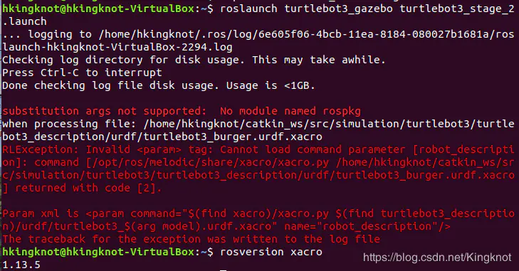
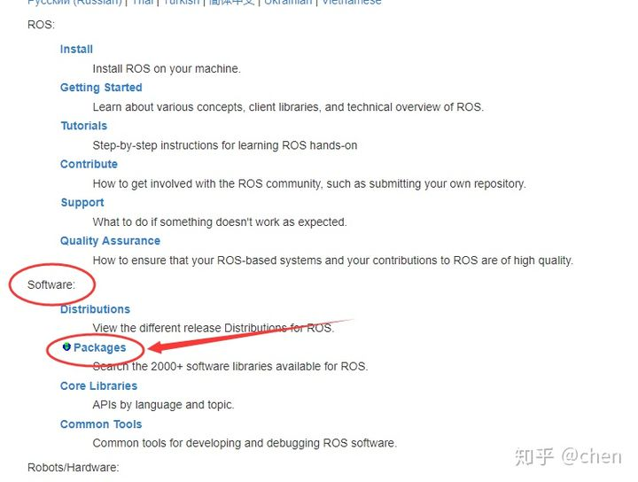
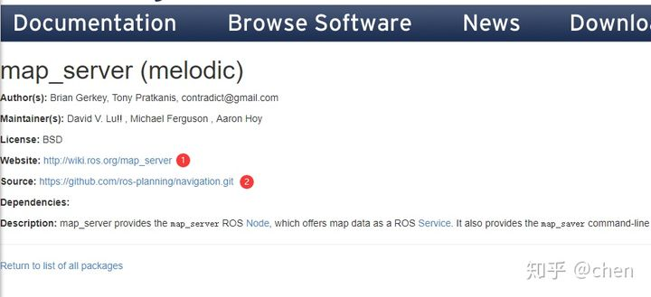
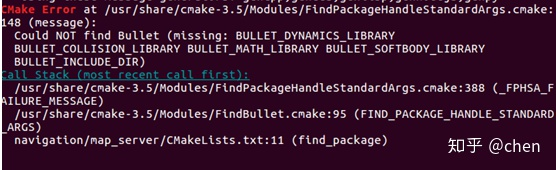

## ROS报错总结

### (一) sudo rosdep init  找不到命令提示

**问题描述：**

这个错误算是比较好解决的，相当于少包

**解决办法：**

缺啥补啥的原则，进行apt安装即可           **注意：安装的rosdep版本**

对于ROS Melodic（Ubuntu18.04）及以前版本，如ROS Kinetic（Ubuntu16.04），选择安装

>sudo apt-get install python-rosdep

对于ROS Noetic（Ubuntu20.04），选择安装

>sudo apt-get install python3-rosdep

以上相当于一个是python2一个是python3的区别

### (二) 执行sudo rosdep init：ERROR: cannot download default sources list from......

**问题描述：**

执行rosdep update：ERROR: unable to process source......
产生这个错误的原因就是：网络被墙

**解决办法：**

所以如果你有破墙的方法可以直接切换即可避免这个错误，以下针对无数次更换网络、切换手机热点也无法解决问题的情况

#### 1）关键问题1

能否浏览器访问https://raw.githubusercontent.com/ros/rosdistro/master/rosdep/sources.list.d/20-default.list
现实情况是不行的，解决方案和不能访问github一样，找到raw.githubusercontent.com的ip，或者把dns修改成谷歌服务器

##### 1.修改DNS

之所以无法访问raw.githubusercontent.com，是因为国内DNS服务器无法解析这个网址的ip地址，导致无法连接至网站服务器，因此我们需要添加能够解析这个网址的DNS服务器

ubuntu中储存DNS地址的文件为/etc/resolv.conf，可以通过gedit打开，如下面的命令，也可以通过其他文本编辑程序如nano,vi等打开

>sudo gedit /etc/resolv.conf

将原有的nameserver这一行注释，并添加以下两行：

```
nameserver 8.8.8.8
nameserver 8.8.4.4
```

8.8.8.8和8.8.4.4是谷歌的DNS服务器，按理应该能够解析github网站的ip，但是**国内访问谷歌的DNS比较慢**，所以在使用结束后，最好还是还原为114.114.114.114这种国内的DNS服务器，这样访问国内镜像也会快一些，但是注意**不要同时都添加**，可能会出错

（参考https://blog.csdn.net/c417469898/article/details/106360595） 

##### 2.修改IP

修改DNS的好处在于，可以动态适应网站的IP变化，但是由于谷歌DNS服务器的响应比较慢，很容易出现超时等网络错误，并且也存在被墙的可能，所以也可以直接查找raw.githubusercontent.com的解析IP，直接建立域名和IP的映射关系

ubuntu中储存IP映射的文件为/etc/hosts，同样，我这采用gedit打开

>sudo gedit /etc/hosts

加入一行

>199.232.4.133	raw.githubusercontent.com

值得注意的是，上面的ip：199.232.4.133并不一定是你现在的ip，这种方法具有时效性，因此需要预先查询网站的ip

https://githubusercontent.com.ipaddress.com/raw.githubusercontent.com

可通过上述网站进行查询，将查询结果替代199.232.4.133即可

（参考https://blog.csdn.net/u013468614/article/details/102917569）

不论是修改DNS还是修改IP，其结果是为了让电脑能够连接raw.githubusercontent.com，切换DNS或IP时需要等待一小会才能生效，一般而言，通过本方法基本能够解决rosdep的网络问题

#### 2）关键问题2

浏览器能够访问raw.githubusercontent.com，但rosdep的连接时好时坏，完全靠运气，update时，部分网址出现urlopen error [Errno XXX]
出现这个问题，就比较麻烦，因为电脑是能够ping通github的，但是就是连接不稳定，对于rosdep update只要有一个连接错误就会报错，无法继续更新

##### 1.拷贝新rosdep

以下仅对安装了python-rosdep的ROS系统有效，安装python3-rosdep可以参考如下解决方案，只不过把2的代码移植到3即可

从这里https://github.com/HILMR/rosdep_fix/blob/main/sources_list.py下载新的sources_list.py文件到当前目录，然后在终端执行下列命令

>sudo cp /usr/lib/python2.7/dist-packages/rosdep2/sources_list.py sources_list.py.bak #备份

>sudo cp sources_list.py /usr/lib/python2.7/dist-packages/rosdep2/sources_list.py #写入新文件

然后在终端执行sudo rosdep init 或者rosdep update，如果网络连接不稳定会进行重试，最多重试20次（可修改）

```
Retry:1
Retry:2
...
Hit ...
```

这样就基本解决了靠运气的重试方法 

下面介绍一下具体的细节，如果不想看细节可以直接跳过

##### 2.rosdep源码修改

rosdep的源码位于/usr/lib/python2.7/dist-packages/rosdep2，可以通过ls指令查看相应的文件

>ls /usr/lib/python2.7/dist-packages/rosdep2

关键的文件为main.py和sources_list.py
main.py是入口程序，从中可知

rosdep init 调用了sources_list.py的download_default_sources_list()函数

rosdep update 调用了sources_list.py的update_sources_list()函数

网络连接的错误都是urllib2库中的urlopen抛出的，因此最核心的问题可以从这里入手，比如：

###### ①设置超时时间（urlopen error timed out）

找到sources_list.py里下面的变量，把15改大即可解决urlopen抛出的超时错误

>DOWNLOAD_TIMEOUT = 15.0

###### ②重试连接（urlopen error [Errno 104] Connection reset by peer）

在一些需要访问网络连接的代码段加入重试机制

```cpp
is_ok=False
count=0
while(not is_ok):
    try:
        f = urlopen(url_request, timeout=DOWNLOAD_TIMEOUT) #这里是需要网络连接的函数区
        is_ok=True
    except:
        count=count+1 #进行重试
        print('Retry:',count)
        if count>MAX_RETRY: #超过最大次数MAX_RETRY则跳出
            is_ok=True
```

**注意，如果是urlopen error [Errno 111] Connection refused，还是应该考虑DNS和IP是否设置正确，否则即使重试也是一直失败的** 

###### ③证书问题（urlopen error [SSL: CERTIFICATE_VERIFY_FAILED]）

可以通过修改sources_list.py代码解决，即在代码开头加上

```cpp
import ssl
ssl._create_default_https_context = ssl._create_unverified_context
```

（参考https://zhuanlan.zhihu.com/p/77483614）

#### 3）关键问题3：上述方法无效

这里提供一个思路

执行sudo rosdep init会在/etc/ros/rosdep/sources.list.d产生一个20-default.list的文件

执行rosdep update会在/home/xxx/.ros/rosdep/sources.cache（xxx是你的用户名）产生一个文件夹，里面有一堆缓存文件

因此将这些文件拷贝过来，理论上是可以直接使用的，不需要再rosdep了，但是注意，如果时间相隔太久或者版本不一致，可能导致文件失效

github链接：https://github.com/HILMR/rosdep_fix【Ubuntu18.04LTS，ROS Melodic】

### (三) 安装anaconda后roscore报错

**问题描述：**

Command 'roscore' not found, but can be installed with:

报错,roscore ,roslaunch 都不能用 

**解决办法：**

有可能是环境变量所致, 只需

source /opt/ros/melodic/setup.sh

环境变量默认是anaconda的因此需要使用ROS的时候，在打开终端时输入上面的命令

### (四) roslaunch 启动launch文件报错 



**问题描述：**

**substitution args not supported: No module named rospkg**

安装的是anaconda3,python3.8，ROS中pkg依赖包可能用的Python版本不同

**解决办法：**

>conda install setuptools

>pip install -U rosdep rosinstall_generator wstool rosinstall six vcstools

重新运行

### (五) catkin_make工作空间编译，找不到功能包

#### 1）功能包查询

在工程中使用功能包时，使用下面命令对当前安装完成的功能包进行查询。

```c
rospack list
```

#### 2）功能包安装不完整造成的

```text
CMake Error at /opt/ros/kinetic/share/catkin/cmake/catkinConfig.cmake:83 (find_package
):
  Could not find a package configuration file provided by "gazebo_plugins"
  with any of the following names:
    gazebo_pluginsConfig.cmake
    gazebo_plugins-config.cmake

  Add the installation prefix of "gazebo_plugins" to CMAKE_PREFIX_PATH or set
  "gazebo_plugins_DIR" to a directory containing one of the above files.  If "gazebo_plugins" provides a separate development package or SDK, be sure it has been installed.
```

**问题描述：**

“ Could not find a package configuration file provided by "gazebo_plugins”

缺少“gazebo_plugins”功能包导致编译无法通过。

**解决办法：**

使用的工作空间里没有用到这个功能包，提示我缺少这个功能包？因为工程中使用到的功能包A是依赖功能包B的，如果功能包B没有正确安装，功能包A是无法运行的。

**安装方法有两种：**

##### 1.使用包安装命令直接安装：

```text
sudo apt-get install ros-melodic-功能包名
```

**注意：由于国内网络原因这种方法大概率会失败**

##### 2.下载功能包的压缩文件，自己解压到工作空间后编译使用：

- 登录ROS-Wiki：

[Documentation - ROS Wiki](https://link.zhihu.com/?target=http%3A//wiki.ros.org/)

- 在software列表下选择package选项，如下图



- 点击后在出现的页面输入我们想要查找的功能包，例如我需要查找这个功能包，点击搜索，在搜索结果中选择我们需要的。如下图


- 最后这个界面中，有两个网址，第一个网址是对此功能包的具体说明；第二个网址是该功能包在GitHub中的下载地址。如下图



建议在使用一个未知的功能包之前，进入第一个网址对功能包的功能和说明进行简要阅读。

- 了解功能包的基本功能后，进入source指定的GitHub网址。点击1、2下载功能包压缩文件。如下图


解压后，将相应的功能包放入工作空间即可。再次编译，问题解决。

### (六) ROS-map_server功能包编译报错解决方法

**问题描述：**

在使用导航功能包之前，需要先保存gmapping功能包构建的地图数据。对gmapping在rviz中产生的地图数据需要使用mapserver功能包来进行保存。下载mapserver功能包到工作空间后，catkin_make编译报错：



提示：could not find bullet

在map_server功能包的package.xml文件中我发现这样一条语句：


package.xml文件是功能包清单，bullet是map_server功能包的一个依赖项。由于ROS中没有这个包导致编译无法继续进行，编译失败。

**解决办法：**

```text
sudo apt-get install libbullet-dev
```

安装完成后，继续报错：Could NOT find SDL (missing: SDL_LIBRARYSDL_INCLUDE_DIR)同样的，还是由于缺少依赖项。

**解决办法：**

```text
sudo aptitude install libsdl1.2-dev
```

继续报错：Could NOT find SDL_image (missing:SDL_IMAGE_LIBRARIES SDL_IMAGE_INCLUDE_DIRS)

**解决办法：**

```text
sudo apt-get installlibsdl-image1.2-dev 
```

再次运行，问题解决。


### (七) ROS-找不到launch文件的解决办法

**1.问题描述：**

**“is neither a launch file”**

```text
[*****.launch] is neither a launch file in package [******] nor is [******] a launch file name
The traceback for the exception was written to the log file
```

**解决办法：**

```text
$   cd ~/catkin_ws/

$   catkin_make
$   source devel/setup.bash

$   echo $ROS_PACKAGE_PATH   /home/ideallic/catkin_ws/src:/opt/ros/indigo/share:/opt/ros/indigo/stacks
$   export | grep ROS
```

**原理解释：**

来到工作空间下对工作空间进行编译，并使用source命令配置环境变量，再使用echo命令使得环境变量在所有命令行终端中生效。最后使用export显示当前环境变量的配置信息。

出现这个报错信息的原因是工程中新建一个launch文件后，没有及时配置环境变量，导致roslaunch命令无法识别到新添加的launch文件。


**2.问题描述：**

**is not a launch file**

**解决办法：**

```text
roslaunch package_name abc.launch
```

**原理解释：**在启动一个launch文件时，如果直接使用“roslaunch + launch文件名 ”的方式，就可能会导致ros系统找不到所需launch文件的位置。为了使ROS能够正确启动launch文件，应这样输入命令：

```text
roslaunch + 功能包名 + launch文件名
```

### (八) 其他问题

ROS报错总结链接：

https://www.cnblogs.com/fuzhuoxin/p/12564325.html

https://blog.csdn.net/qq_39178398/article/details/108691091

https://www.cnblogs.com/hgl0417/p/11562580.html

http://www.manongjc.com/detail/8-xxxsdiwsnvoeuih.html

