#  SOME/IP学习

[SOME/IP 协议介绍](https://blog.csdn.net/xllhd100s/article/details/112171880?spm=1001.2014.3001.5501)

[SOME/IP-SD 深入浅出](https://blog.csdn.net/xllhd100s/article/details/112309194?spm=1001.2014.3001.5501)

## 一、SOME/IP入门

### (一) 总体说明

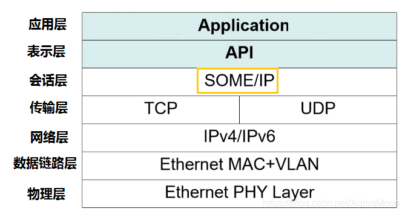

如上图所示为标准的网络七层架构，SOME/IP ( Scalable service-Oriented MiddlewarE over IP)，即“运行于IP之上的可伸缩的面向服务的中间件”。

他在系统中其实就是一个中间件的存在，所谓“Middleware中间件”是一种独立的系统软件或服务程序，分布式应用软件可借助Middleware在不同的技术之间共享资源。

**所谓的分布式应用软件，在这里指的就是“服务”；不同的技术之间，在这里指的就是“不同的平台或操作系统，比如Adaptive AUTOSAR系统等**。

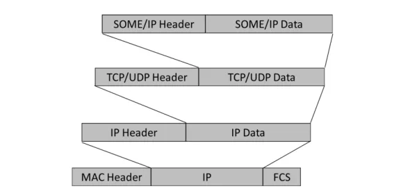

SOME/IP协议在OSI七层网络结构中位于应用层，在AUTOSAR中位于BSW的服务层。从功能上讲，SOME/IP是一种将服务接口进行打包或解包的中间件：从应用层发送的数据（就是服务相关的信息以及前文提到的服务接口中的内容），按照SOME/IP的格式打包后，再传递到下层的TCP/IP层，再进行逐层打包和封装，最终通过物理层以比特流的形式进行传输；接收时则按照与打包相反的规则进行解包。


### (二) 服务说明

服务是SOME/IP的最核心概念。在一个服务中，定义了Server和Client两个角色：Server提供服务，Client调用服务。对于同一个服务，只能存在一个Server，但可以同时存在多个Client调用服务。一个Service由0~多个Event/Method/Field组成。与CAN相比，面向服务的通讯方式能够大大降低总线的负载率。s

#### 1）Method

调用或引用一个进程/函数/子程序，通常由Client发起，并由Server答复。

##### 1.Request (最常见的一种Method)，

由Client向Server请求数据；Response是Request的结果，由Server答复Client的Request。

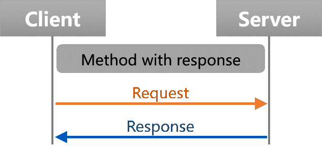

##### 2.Method Fire & Forget

只Client向Server发起，但Server对该请求不回复。

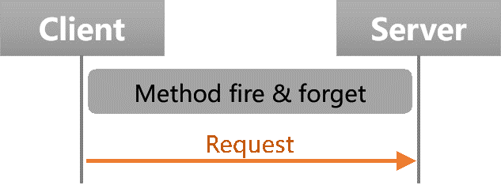

#### 2）Event

一个单向的数据传输，只能是on change类型，用于Server主动向订阅（Subscribe）了相关服务的Client发布（Publish）信息。

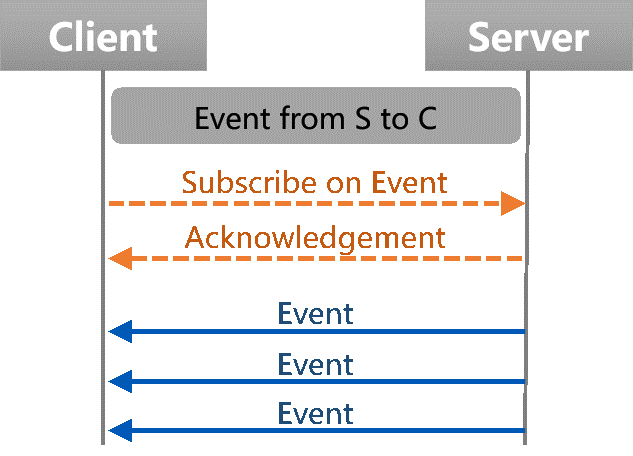

#### 3）Field

由以下三项内容构成：

Notifier：通知，Server的Client订阅了服务后第一时间主动向其发送数据。

Getter：获取，由Client向Server请求数据。

Setter：设置，由Client修改Server的数据。

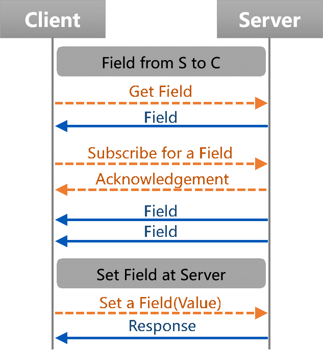


### (三) 解析SOME/IP格式

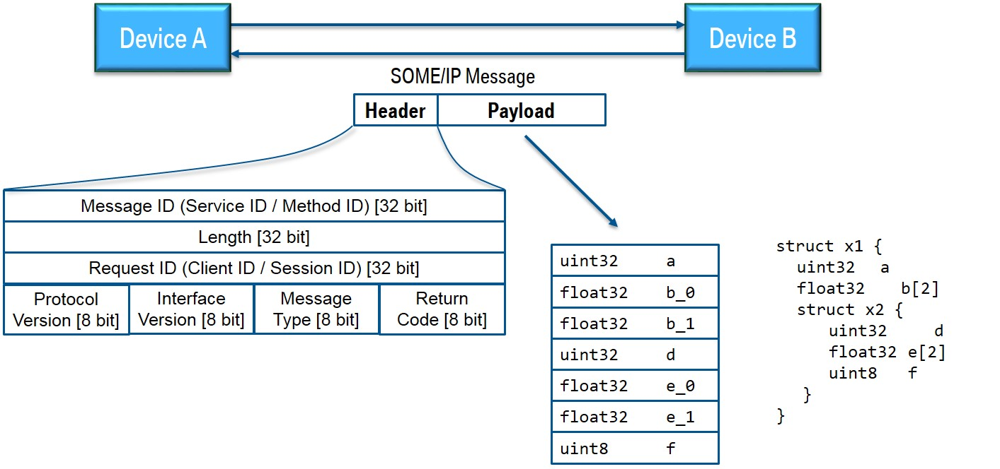

在那里你会看到两个设备（A 和 B）；设备 A 向 B 发送 SOME/IP 消息并返回一条消息。底层传输协议可以是TCP或UDP；对于消息本身，这没有区别。现在我们假设设备 B 正在运行一个服务，该服务提供了一个功能，该功能从设备 A 被此消息调用，返回的消息就是回复。

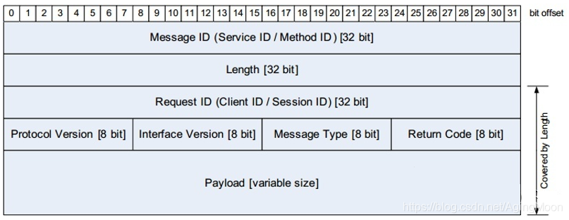

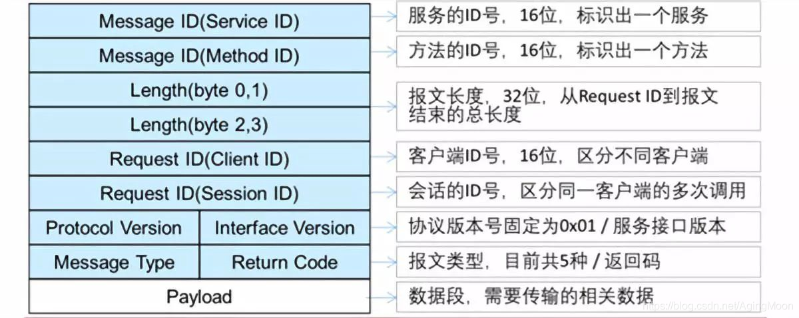

SOME/IP报文由消息头（Header）和数据段（Payload）组成，消息头是按照固定格式排列的有效信息，这些有效信息包括报文ID、请求ID、协议版本、接口版本以及处理之后（序列化）的服务接口信息等内容。

SOME/IP报文格式如图所示。

报文ID包括Service ID和Method ID，Service ID指的是Service本身的ID值；Method ID是指服务接口中的不同内容的ID，每个服务接口中定义的所有方法、单向方法、事件等都需要设置一个ID值；

Session ID是从1开始增加的循环值，用于使得Request与Response相配对；Message Type主要分为请求、请求无响应、通知、响应、错误几种类型。

- **Service ID**: 每个服务的唯一标识符

- **Method ID**:方法为 0-32767，事件为 32768-65535

- **Length**: 以字节为单位的有效负载长度（还包括接下来的 ID，这意味着 8 个额外的字节）

- **Client ID**: ECU内部调用客户端的唯一标识符；在整个车辆中必须是独一无二的

- **Session ID**: 会话处理的标识符；必须为每次调用递增

- **Protocol Version**: 协议版本一般为 0x01

- **Interface Version**: 服务接口的主要版本

- **Message Type**:  -- REQUEST (0x00) 一个需要响应的请求（甚至无效） 

  ​                            -- REQUEST_NO_RETURN (0x01) 一个即发即弃的请求

  ​                            -- NOTIFICATION (0x02) 一个需要没有响应的通知/事件回调请求

  /home/ygd/vsomeip/examples/service_client/src/event_test_service.cpp/home/ygd/vsomeip/examples/service_client/src/event_test_service.cpp                            -- RESPONSE (0x80)响应消息

- **Return Code**:   -- E_OK (0x00) 未发生错误

  ​                          -- E_NOT_OK (0x01) 发生未指定的错误

  ​                          -- E_WRONG_INTERFACE_VERSION (0x08) 接口版本不匹配

  ​                          -- E_MALFORMED_MESSAGE (0x09) 反序列化错误，因此无法对有效载     荷进行反序列化

  ​                          --E_WRONG_MESSAGE_TYPE (0x0A) 收到了意外的消息类型（例如 RE-QUEST_NO_RETURN 用于定义为 RE-QUEST 的方法）

#### 1）Message Type说明

| **值**|报文类型 |**说明**|
| ----------- | ----------- |-----|
|  0x00 | REQUEST | 请求，需要回复|
| 0x01 |REQUEST_NO_RETURN|请求，不需要回复|
| 0x02 |NOTIFICATION|Notifier/Event，不需要回复|
| 0x80 |RESPONSE|回复|
| 0X81 |ERROR|带有错误信息的回复|
#### 2）Payload说明

通常在传输数据时，为了使数据传输更可靠，要把原始数据分批传输，并且在每一批数据的头和尾都加上一定的辅助信息，比如数据量的大小、校验位等，这样就相当于给已经分批的原始数据加一些外套，这些外套起标示作用，使得原始数据不易丢失，一批数据加上“外套”就形成了传输通道的基本传输单元，叫做数据帧或数据包，而其中的原始数据就是payload。


### (四) SOME/IP SD

- Client如何发现服务

- 当服务不可用时，如何通知Client

- Client如何订阅事件

  

  SOME/IP-SD消息通过UDP进行传输，报文格式如下图所示：

  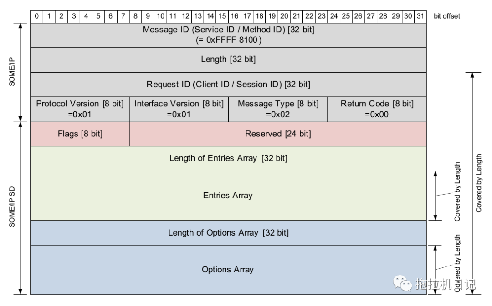

Flags=重新启动标志+单播标志+显示初始数据控制标志，如下图所示：

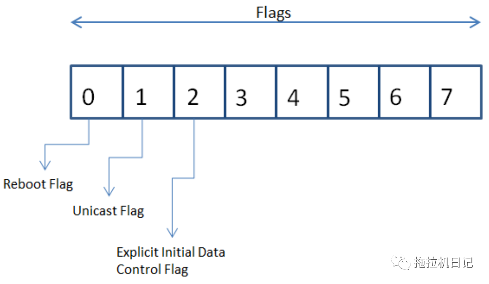

服务重新启动后，所有消息的Reboot Flag须置为1，直到Session ID重新从1开始计数，之后的Reboot Flag须置为0。

SD（Service Discovery）是服务的信息清单及管理机制，也是一种服务，主要实现服务寻址及事件订阅两种功能。SD用来对服务进行寻址时，服务提供者（Server端）通过服务发现（SD）通知其他ECU（Client端）某服务可用，并间接地通知该服务的地址（Server端地址）；服务消费者（Client端）了解到某服务状态后，能够调用该服务的相关内容。SD用来事件订阅时，专门针对Event类型的接口，可以通过SD实现对Event所在的Event group进行订阅、停止订阅等操作。

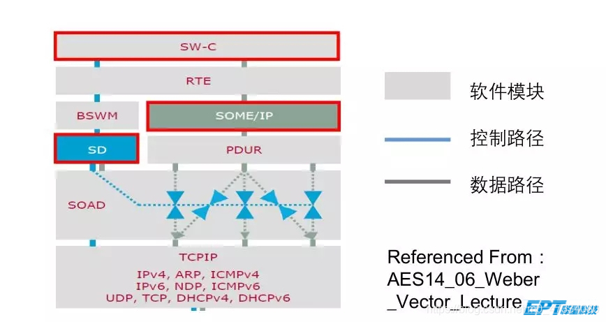


**服务发现的报文格式与一般的SOME/IP报文相同，但是其Message ID固定为0xFFFF8100**。

#### 1）主要功能

定位服务实例
检测服务实例是否在运行（即服务实例的状态）
发布/订阅行为的管理

#### 2）SD报文解析

SOME/IP SD报文也是一种SOME/IP报文，是在SOME/IP报文的基础上进行了扩展，增加了Entry、Option等字段；Entries用于同步服务实例的状态和发布/订阅的管理，Options用于传输Entries的附加信息。

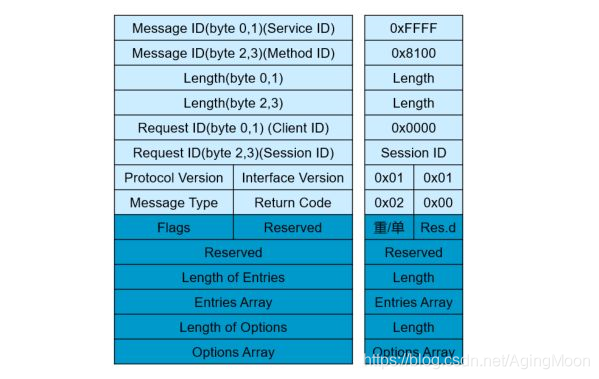

SOME/IP SD报文也是一种SOME/IP报文，是在SOME/IP报文的基础上进行了扩展，增加了Entry、Option等字段；SOME/IP SD报文的ServiceID（0xFFFF）、MethodID（0x8100）、Request ID（0x0000）、ProtocolVersion（0x01）、Interface Version（0x01）、MessageType（0x02）、ReturnCode（0x00）等属性都是固定值。

Entry字段可以理解为服务实例的“入口”，该入口包含服务实例以及需要订阅的事件组的信息。服务提供者和消费者通过SD中的Entry实现提供服务、发现服务，以及订阅事件组的功能，即服务提供者可以告知其他节点服务的“入口”在哪里，服务消费者也可以通过该“入口”找到自己所需要的服务；也能够实现订阅事件组、取消订阅事件组等功能。

##### 1.Entry

Entry字段可以理解为服务实例的“入口”，该入口包含服务实例以及需要订阅的事件组的信息。主要通过Entry实现提供服务、发现服务，以及订阅事件组的功能。

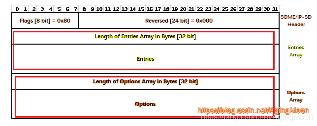

供服务用Entries

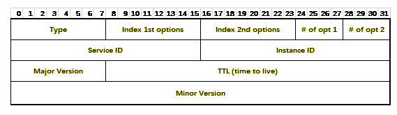

供EventGroup用Entries

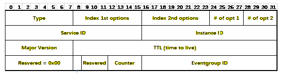

报文中Type内容解释如下：

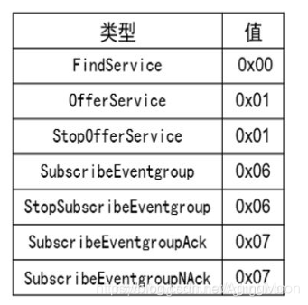

| **类别** | **Type值** | **Type名称** |
|--|--|--|
|   Service        | 0x00 | FindService 用于Client查找服务 |
|  | 0x01 | Offer/StopOfferService 用于Server向Client提供服务或停止提供服务 |
|    Eventgroup       | 0x06 | Subscribe/StopSubscribe Client向Server订阅服务或停止订阅 |
|  | 0x07 | SubscribeAck/Nack Server对于订阅的应答，如果订阅成功，Client收到的就是SubscribeAck，否则收到SubscribeNack |

对于Offer/ StopOfferService、Subscribe/ StopSubscribe和SubscribeAck/ Nack，每一组Entries都共用了相同的Type值，但通过TTL字段可以识别究竟是提供服务还是停止提供服务，是订阅事件还是取消订阅，是订阅成功应答还是订阅失败应答：当TTL = 0时，表示报文对应的服务实例不再有效，此时对应的Type类型分别就是停止提供服务、停止订阅事件以及订阅失败应答。

##### 2.Options


每一个Option都是有一个2字节的Length字段、1字节的Type字段和1字节的保留位开始的。Length字段指示的长度是从保留位开始的。

Options的类型如下表所示：

|类别|Type值|Type名称|
|--|--|--|
|Configuration  (用于配置服务)|0x01|Configuration|
|Load  Balancing (用于配置服务实例的优先级 )|0x05|Load Balancing|
|Endpoint  (发送服务相关的地址和端口)|0x04|IPv4  Endpoint|
||0x06|IPv6  Endpoint|
||0x24|IPv4  SD Endpoint|
||0x26|IPv6  SD Endpoint|
|Multicast (声明Multicast地址)|0x14|IPv4  Multicast|
||0x16|IPv6  Multicast|


##### 3.SD状态机 


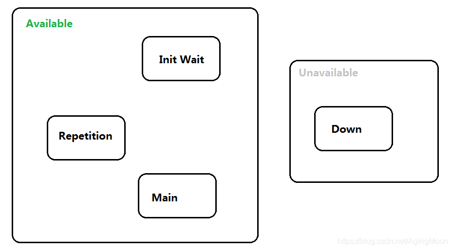不管是客户端还是服务端，都有同样的状态机，但是他们的状态机具有不同的行为。 

|状态|	服务端行为|	客户端行为|
|--|--|--|
|Down| Service不可用 | 服务未被应用请求，则停留在该状态；收到OfferService，启动TTL计时器，此时服务若被应用请求，进入Main； |
|Init| **进入条件**：当服务准备完毕(Available)后                               **During：**收到Find Service报文，服务端忽略此消息                                                                 **退出条件**：若服务不可用了，将进入Down ；INITIAL_DELAY，当定时器超时后，进入Repetition。 | **进入条件：**服务被请求后，进入此阶段；                                                         **During：**等待INITIAL_DELAY时间；                                                                                           **退出条件：**如果此时收到Offer Service，则取消计时器，直接进入Main ；如果服务请求被释放，进入Down ；计时器超时后，发送第一个Find service，进入Repetition。 |
| Repetition | **作用：**为了让客户端快速找到有哪些Service，                                                                **During**：如果收到某客户端的FindService，延迟一定时间后，单独发送单播OfferService给服务请求端；如果收到SubscribeEventgroup后，发送单播Ack/Nack，启动此订阅Entry的TTL计时器；如果收到StopSubscribeEventgroup后，停止此订阅Entry的TTL计时器；                                                    **退出条件：**如果服务不可用，离开此阶段进入Down ，并发送StopOfferService通知所有客户端。 | **作用：**重复发送Find service；                                                          **退出条件：**收到Offer Service，停止发送计数和计时，立即进入Main 触发发SubscribeEventgroup；如果服务请求被释放，进入Down ，若有订阅，则发送StopSubscribeEventgroup。 |
| Main       | **作用：**此阶段将周期性发送OfferService；                                    **During：**如果收到某客户端的FindService，不影响发送计数，发送单播OfferService给服务请求端；如果收到SubscribeEventgroup后，发送单播Ack/Nack，启动此订阅Entry的TTL计时器；收到StopSubscribeEventgroup后，停止此订阅Entry的TTL计时器；                                     **退出条件：**如果服务不可用，离开此阶段进入Down，并发送StopOfferService。 | **作用：**不再周期发送Find Service，不必要负载；**During：**收到Offer Service，触发发送SubscribeEventgroup；如果收到StopOfferService，则停止所有计时器；                                               **退出条件：**如果服务请求被释放，进入Down Phase；若有订阅，则发送StopSubscribeEventgroup。 |

### (五)SOME/IP SD的通信行为

SD的优点：

**①**上电启动时，车内各ECU的启动电压和启动时间各不相同，ECU通过SD就可以灵活的官宣其Service的可用状态；

**②**车辆变型(可以是同款车型的不同配置，或者是车型沿用)时，可以灵活的适应功能/配置的变化，减少前期的配置工作；

**③**错误处理，当提供的Service出现问题时，可以通过SD即刻了解Service的不可用状态，接收方就可以做出相应的处理了；

**④**能源效率，需要的时候才会提供/订阅服务，减少能量消耗。

总结一下就是：你用与不用，SD一直在那里。简单车载网络可以考虑不使用SD，原因是完全发挥不了SD的优势；而车载网络越复杂，越能体现SD的强大优势。


SD通信主要涉及到3类报文：Find Service、Offer Service和Subscribe报文。

服务端和客户端的通信行为包含以下几个阶段：


#### 1） **服务端的通信行为** 

**Down Phase**

- 在这个阶段，Service是不可用的，即服务端无法提供服务。

**Initial Wait Phase**

- 当服务准备完毕(Available)后，进入此阶段；
- 如果此阶段收到Find Service报文，服务端忽略此消息，不做任何处理；
- 如果服务不可用了，将返回进入Down Phase；
- 此阶段需要定义时间参数INITIAL_DELAY_Min和INITIAL_DELAY_Max，初始化时间取其之间的随机值，当定时器超时后，发送第一帧OfferService，标志着进入下一个阶段。


**Repetition Phase**

- 为了让客户端快速找到有哪些Service，此阶段重复发送OfferService，重复次数由REPETITIONS_MAX决定；
- 发送间隔以REPETITIONS_BASE_DELAY为基本时间，每发送一次，间隔是前一间隔的2倍；
- 如果收到某客户端的FindService，不影响当前阶段的发送计数和计时，延迟一定时间(REQUEST_RESPONSE_DELAY)后，单独发送单播OfferService给服务请求端；
- 如果收到SubscribeEventgroup后，发送单播Ack/Nack，启动此订阅Entry的TTL计时器；
- 如果收到StopSubscribeEventgroup后，停止此订阅Entry的TTL计时器；
- 如果服务不可用，离开此阶段进入Down Phase，并发送StopOfferService通知所有客户端。


**Main Phase**

- 此阶段将周期性发送OfferService，周期时间为CYCLIC_OFFER_DELAY；
- 如果收到某客户端的FindService，不影响发送计数，延迟一定时间(REQUEST_RESPONSE_DELAY)后，发送单播OfferService给服务请求端；
- 如果收到SubscribeEventgroup后，发送单播Ack/Nack，启动此订阅Entry的TTL计时器；
- 收到StopSubscribeEventgroup后，停止此订阅Entry的TTL计时器；
- 如果服务不可用，离开此阶段进入Down Phase，并发送StopOfferService。


服务端通信行为：


服务端状态机转换图：


#### 2）**客户端的通信行为** 

**Down Phase**

- 服务未被应用请求；
- 收到OfferService，存储当前服务实例状态，启动TTL计时器，此时服务若被应用请求，直接进入Main Phase。

**Initial Wait Phase**

- 服务被请求后，进入此阶段；
- 等待INITIAL_DELAY时间（最大和最小值之间的随机值）；
- 如果此时收到Offer Service，则取消计时器，直接进入Main Phase；
- 如果服务请求被释放，进入Down Phase；
- 计时器超时后，发送第一个Find service，进入下一阶段。


客户端通信阶段(在Initial Phase收到offer service)：


**Repetition Phase**

- 重复发送Find service，重复次数由REPETITIONS_MAX决定；
- 发送间隔以REPETITIONS_BASE_DELAY为基时间，每发送一次间隔加倍；
- 收到Offer Service，停止发送计数和计时，立即进入Main Phase；触发发送SubscribeEventgroup(延迟一定时间）；
- 如果服务请求被释放，进入Down Phase；若有订阅，则发送StopSubscribeEventgroup。


客户端通信阶段(在Repetition Phase收到offer service)：


**Main Phase**

- 不再周期发送Find Service；
- 收到Offer Service，触发发送SubscribeEventgroup(延迟一定时间）；
- 如果收到StopOfferService，则停止所有计时器；
- 如果服务请求被释放，进入Down Phase；若有订阅，则发送StopSubscribeEventgroup。


客户端状态机转换图：


### (六) SOME/IP序列化 

#### 1）概念

序列化（Serialization）指的是将数据结构或对象依据事先定义的规则转换成二进制串的过程；反序列化（Deserialization）指的是将二进制串依据相同规则重新构建成数据结构或对象的过程。

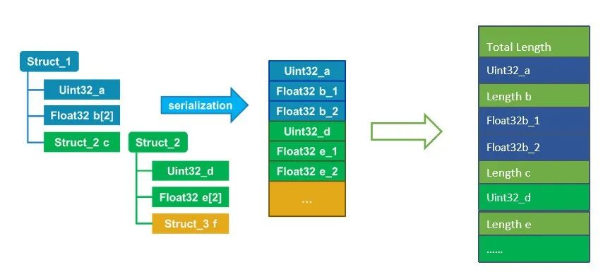

#### 2）说明

在AUTOSAR中是指数据在PDU中的表达形式，可以理解为来自应用层的真实数据转换成固定格式的字节序，以实现数据在网络上的传输。软件组件将数据从应用层传递到RTE层，在RTE层调用SOME/IP Transformer，执行可配置的数据序列化（Serialize）或反序列化（Deserialize）。SOME/IP Serializer将结构体形式的数据序列化为线性结构的数据；SOME/IP Deserializer将线性结构数据再反序列化为结构体形式数据。在服务端，数据经过SOME/IP Serializer序列化后，被传输到服务层的COM模块；在客户端，数据从COM模块传递到SOME/IP Deserializer反序列化后再进入RTE层。如下图参考Autosar Com过程

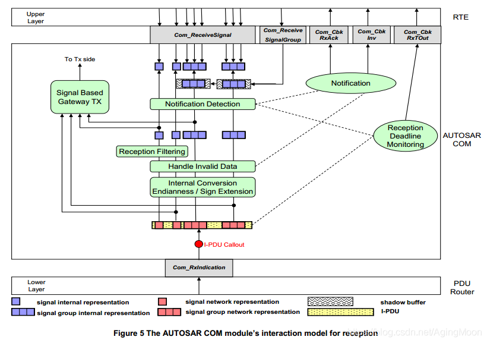

#### 3）举例

一个unit32类型数据（0x12345678）的序列化。

|| Byte0|	Byte1|	Byte2|	Byte3|
|--|--|--|--|--|
|大端（Big Endian）| 12 | 34 | 56 | 78 |
|小端（Little Endian）| 78 | 56 | 34 | 21 |

### (七) SOME/IP 应用

SOME/IP相关参数的设计是汽车以太网面向服务的架构(SOA)设计中的主要设计内容，在本文中介绍的服务、服务的提供者、消费者、服务接口的各种方法、事件、字段等内容，以及文中未提到的TCP/IP通信中的配置信息，都是以太网SOA设计中的主要内容，因此对SOME/IP中各种参数的理解，对于整个架构和通信设计都非常重要。

随着汽车绿色智能互联的快速发展，对汽车运行时的高灵活性、车辆内部与外部服务的可关联、服务和软件的扩展与升级等需求都提出了更高的要求，此时面向服务架构（Service Oriented Architecture）的优势也变得越来越凸显。SOME/IP作为面向服务架构的通信基础，将会得到越来越多的应用。

## 二、安装Boost (vsomeip依赖)

boost中，用到了别的函数库，所以为了使用boost中相应的功能，需要先安装系统中可能缺失的库。

### (一) 安装依赖库

```bash
sudo apt-get install mpi-default-dev　　#安装mpi库  
sudo apt-get install libicu-dev　　　　　#支持正则表达式的UNICODE字符集   
sudo apt-get install python-dev　　　　　#需要python的话  
sudo apt-get install libbz2-dev　　　　　#如果编译出现错误：bzlib.h: No such file ordirectory
```


注意：复制粘贴的时候，不要复制命令后面的空格，这样会导致一个无法定位软件包的错误。

安装失败统一的办法：

```bash
sudo apt-get update  
```

### (二) 下载boost

http://sourceforge.net/projects/boost/files/latest/download?source=dlp

(如果下载速度很慢，重新下载，不用一直等)

下载好了以后，解压 .bz2 文件

```bash
tar -jxvf xx.tar.bz2
```

解压之后，进入解压目录，执行：

```bash
./bootstrap.sh
sudo ./b2
sudo ./b2 install
```

PS : boost的安装时间还是很长的，单核的虚拟机上面 30 min 左右。

### (三) 测试

在test文件夹中建立test.cpp

```c++
#include<iostream>
#include<boost/bind.hpp>
using namespace std;
using namespace boost;
int fun(int x,int y){return x+y;}
int main(){
    int m=1;int n=2;
    cout<<boost::bind(fun,_1,_2)(m,n)<<endl;
    return 0;
}
```

编译：

```bash
g++ test.cpp -o test  
```

最后执行的结果是 3

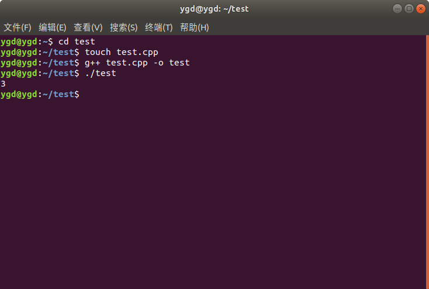

参考：http://valleylord.github.io/post/201601-boost-install/

linux查看boost版本

```
dpkg -S /usr/include/boost/version.hpp
```


## 三、Vsomeip安装

- **vsomeip 概述**

  vsomeip 堆栈实现了http://some-ip.com/（基于 IP 的可扩展的面向服务的中间件 (SOME/IP)）协议。堆栈包括：

  - SOME/IP 的共享库 ( `libvsomeip3.so`)
  - SOME/IP 服务发现的第二个共享库 ( `libvsomeip3-sd.so`)，如果启用了服务发现，则在运行时加载。

- ##### Linux 构建说明

  ###### 依赖关系

  - 需要启用 C++11 的编译器，例如 gcc >= 4.8。
  - vsomeip 使用 CMake 作为构建系统。
  - vsomeip 使用 Boost >= 1.55：

### (一) 安装Vsomeip

打开终端，执行安装语句

```bash
git clone https://github.com/GENIVI/vsomeip.git
cd vsomeip
mkdir build
cd build
cmake -DENABLE_SIGNAL_HANDLING=1 -DDIAGNOSIS_ADDRESS=0x10 ..
make
sudo make install
```

(如果git失败，多试几次就行,或者直接下载https://github.com/GENIVI/vsomeip)


### (二) 测试

#### 1）构建 hello_world

```bash
cmake --build . --target hello_world   #vsomip/build 目录操作
cd ./examples/hello_world/
make
```

#### 2）运行 hello_world

```bash
vim ~/.bashrc
```

添加环境变量内容：

```bash
export VSOMEIP_CONFIGURATION=../examples/hello_world/helloworld-local.json
export VSOMEIP_APPLICATION_NAME=hello_world_service
```

```bash
export VSOMEIP_CONFIGURATION=../examples/hello_world/helloworld-local.json
export VSOMEIP_APPLICATION_NAME=hello_world_client
```

编辑生效：source ~/.bashrc

**在vsomeip/examples/hello_world/**目录

编写服务端与客户端（源码自带hello_word）(编译前需要在vsomip/build文件夹make一下)

**在vsomeip/build/examples/hello_world/**目录

启动服务端与客户端：

```bash
./hello_world_service

./hello_world_client
```

#### 3）运行结果

预期服务端输出：

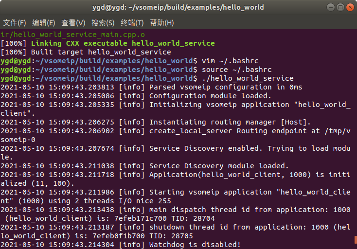

预期客户端输出：

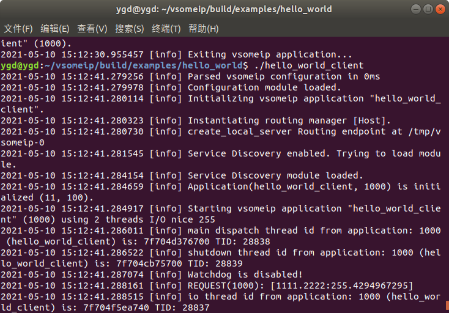


## 四、 深入SOME/IP

原文链接：https://docs.projects.genivi.org/vSomeIP/1.3.0/html/README.html

##### 版权

版权所有 © 2015, Bayerische Motoren Werke Aktiengesellschaft (BMW AG)

##### 执照

此源代码表单受 Mozilla 公共许可证 v. 2.0 条款的约束。如果 MPL 的副本没有随此文件一起分发，您可以从http://mozilla.org/MPL/2.0/获得一份。

## (一) vsomeip概述

vsomeip 堆栈实现了[基于 IP](http://some-ip.com/)的[可扩展的面向服务的中间件 (SOME/IP)](http://some-ip.com/)协议。堆栈包括：

- SOME/IP 的共享库 ( `libvsomeip.so`)
- SOME/IP 服务发现的第二个共享库 ( `libvsomeip-sd.so`)，如果启用了服务发现，则在运行时加载。

## (二) 构建说明

### 1）依赖关系

- 需要启用 C++11 的编译器，例如 gcc >= 4.8。

- vsomeip 使用 cmake 作为构建系统。

- vsomeip 使用 Boost >= 1.54：

  - Ubuntu 14.04：

    ```bash
    sudo apt-get install libboost-system1.54-dev libboost-thread1.54-dev libboost-log1.54-dev
    ```

  - Ubuntu 12.04：使用 Boost 1.54 版需要 PPA：

    - 网址：[https](https://launchpad.net/~boost-latest/+archive/ubuntu/ppa) : [//launchpad.net/~boost-latest/+archive/ubuntu/ppa](https://launchpad.net/~boost-latest/+archive/ubuntu/ppa)

    - ```bash
      sudo add-apt-repository ppa:boost-latest/ppa
      ```

      

    - ```bash
      sudo apt-get install libboost-system1.54-dev libboost-thread1.54-dev libboost-log1.54-dev
      ```

      

- 对于测试，需要谷歌1.7.0 版 的测试框架 [gtest](https://code.google.com/p/googletest/)

  - URL：[直接链接，版本 1.7.0](https://googletest.googlecode.com/files/gtest-1.7.0.zip)

- 要构建文档 asciidoc，需要 source-highlight、doxygen 和 graphviz：

  - ```bash
    sudo apt-get install asciidoc source-highlight doxygen graphviz
    ```

    

### 2）汇编

对于编译调用：

```bash
mkdir build
cd build
cmake ..
make -j8
```

要指定安装目录（就像`--prefix=`您习惯使用 autotools 一样）调用 cmake 如下：

```bash
cmake -DCMAKE_INSTALL_PREFIX:PATH=$YOUR_PATH ..
make -j8
make install
```

#### 1. 测试汇编

要编译测试，首先将 gtest 解压缩到您想要的位置。然后运行：

```
mkdir build
cd build
export GTEST_ROOT=$PATH_TO_GTEST/gtest-1.7.0/
cmake ..
make check
```

- 测试的其他 make 目标：
  - 调用`make build_tests`只编译测试
  - 调用`ctest`构建目录以在没有详细输出的情况下执行测试
  - 要运行单个测试，请调用`ctest --verbose --tests-regex $TESTNAME`简短格式：`ctest -V -R $TESTNAME`
  - 列出所有可用的测试运行`ctest -N`。
  - 有关测试的更多信息，请看看在 `readme.txt`的`test`子目录。

#### 2. 生成文档

要生成文档，请按照[[编译\] 中](https://docs.projects.genivi.org/vSomeIP/1.3.0/html/README.html#Compilation)所述调用 cmake ，然后调用`make doc`. 这将生成：

- html 中的 README 文件： `$BUILDDIR/documentation/README.html`
- 一个 doxygen 文档在 `$BUILDDIR/documentation/html/index.html`

`

## (三) 启动vsomeip应用程序/使用的环境变量

启动时会读出以下环境变量：

- `VSOMEIP_APPLICATION_NAME`: 这个环境变量用于指定应用程序的名称。此名称稍后用于将客户端 ID 映射到配置文件中的应用程序。它独立于应用程序的二进制名称。
- `VSOMEIP_CONFIGURATION_FILE`：此环境变量可用于指定应用程序要使用的配置文件。如果未定义此变量，`/etc/vsomeip.json`则将使用默认配置文件。

在以下示例中，应用程序`my_vsomeip_application`启动。从`my_settings.json`当前工作目录中的文件中读取设置。应用程序的客户端 ID 可以`my_vsomeip_client`在配置文件的名称下找到 。

```bash
#!/bin/bash
export VSOMEIP_APPLICATION_NAME=my_vsomeip_client
export VSOMEIP_CONFIGURATION_FILE=my_settings.json
```
```bash
./my_vsomeip_application
```

## (四) 配置文件结构

vsomeip 的配置文件是[JSON](http://www.json.org/)文件，由多个键值对和数组组成。

- 对象是一组无序的名称/值对。一个对象以 开始`{ (left brace)`并以结束`} (right brace)`。每个名称后跟，`: (colon)`名称/值对以 分隔`, (comma)`。
- 数组是值的有序集合。数组以 开始`[ (left bracket)`并以 结束`] (right bracket)`。值由 分隔`, (comma)`。
- 值可以是双引号中的*字符串*、*数字*、或`true`或`false` 或`null`、*对象*或*数组*。这些结构可以嵌套。


配置文件元素说明：

- *unicast*

  主机系统的 IP 地址。

- *netmask*

  指定主机系统子网的网络掩码。

- *logging*

  - *level*

    指定日志级别（有效值：*trace*、*debug*、*info*、*warning*、 *error*、*fatal*）。

  - *console*

    指定是否启用通过控制台进行日志记录（有效值：*true、false*）。

  - *file*

    - *enable*

      指定是否应创建日志文件（有效值：*true 、 false*）。

    - *path*

      日志文件的绝对路径。

  - *dlt*

    指定是否启用诊断日志和跟踪 (DLT)（有效值： *true、false*）。

- *applications (array)*

  包含使用此配置文件的主机系统的应用程序。

  - *name*

    应用程序的名称。

  - *id*

    应用程序的 ID。

  - *num_dispatchers*

    用于执行应用程序回调的线程数。如果*num_dispatchers*设置为*0*，回调将在应用程序线程内执行。如果应用程序想要必须直接在事件、可用性或消息回调中执行耗时的工作，则*num_dispatchers*应设置为*2*或更高。

- *servicegroups (array)*

  服务可以组合成一个服务组。服务组包含特定服务提供商的服务及其连接信息。

  | ![Note](data:image/png;base64,%0AiVBORw0KGgoAAAANSUhEUgAAADAAAAAwCAYAAABXAvmHAAAJhUlEQVRoge2ZWWycVxXHf+fce7/v%0Am/GaGCde4pI0aQlJC0kRtE1L00JbLIjY4QkeUB9YHhAIJFCExAsKUkE8IAFFPIDUIqhBRSDRBUqC%0ACimFFBCBpCWx02IaZ3G2SdyxPZ7vHh6+mcnSZnFjKIge6Wj8zYzvPf9z/me5d8TM+F8WfbkNuFx5%0ABcDLLf/fAEZGRmx4eNh6enqsp6fHhoeHbWRk5D9aFeSlVqHNmzfb6H33sHnT7ZQmD5GfOMax6Sm+%0APl5h1Yc+xpYtW2SBbX1ReUkRGBkZsdH77mHLW95EOv4Ms3ueJh6YYPHUFF9aljJ63z3cf//9/5FI%0AvKQIDA8P293L2yhVjjH7t51ocDiviFecF46n7XzBreChhx4qNhH5t0XjJUVgx44ddGUZ9b/vIpQD%0AoRQIWSDJAiFL6B9axo4dO4gxAmANWVDLG+Ln82URMRGhVCqRHxonlAPqFXWKC4r6IhI6OMjMzBN4%0A/4LlTUQQEZxzZ32QJAlpmrb+p16vU6vVOHXq1AWjN18AnDj0F971vrs4OnmYJVkoDA4FCPUO172I%0ACgnt7SV++4vvsGhRJx3tJbIsRVVpsUnOBBABBVFEClKYwbKr7sTM7EIUnBcA7z21k7t49x1X8JXv%0AbOWra7rw5QRtcN8PLCfvvZJvb9vJycpJpg4/hp/N0I4SMQs4Jw0A5zBXHGiCaIZIKABgpGlKjPEF%0A0TpT5pUDRXiVt99+Le03r+WzuytM1gO6pB/3+o0cbxvk8yOPMjW6i2iR2lxOjJDHSDMFogmGwzQ7%0ArRJAUpAENAGXIZq2AFzQpvkACCEQcahP+cRH3sKHn9zHXU+MM7rtGeD33NDXzaZynZU9gcezpUw9%0AX6OzIyOakkfF4QEpPG6nDRNNEA2FSgKimETSNCXPc0II57VpXhEolUqoOrxPSLOMT330Dv5SqfKD%0ANR388Y2L+caQsjITNv3pMBs3rOT56ZyZGaM+J0QUxDc0INrWUgggoRGBAOIRAt77hY1AmqaoeJxP%0AcN645jVDbNn8Hj73o8fZ/af9mEE9j9y2YRXt5YzZWmRmzjj1/BwhTXAKzitOHEbeWlc0AVwDnCv8%0AKoZzjotV33lTSL1HNKAuEtKM1169jM98/E6mTk3x4Nbd7Bk7TEdHRvAeVY+hmDqmZwx1kIkiqrhz%0AS2zL+AbNMC6l/80LgHMOEY9oQvBCks5RKpXo7JhFxbhz42pet2aQet1YtLiDJAkIDq8BHwJmwlwO%0AUaD0ojsrNKuUReIZyb9gABCHcwWFgg+0lTPyvIRToVzKWLpkMfV6REQplYvmZCj1uuBUSdJwTg8A%0AXBdoCZMOsBkQBeGi/J83gBgjmABC8AlJGsjzFLMyaXDM1etEA0VR50iCx6mSZhkiijpPjEpQD+SF%0A4WdJrTAewdCFB1CtVlFVVATnhMQnWJqC5aTBk+c5IIgWRoTgSZJAmiZAo1s7hwsppglI+fTiljeY%0AnyHkLQotKIAYI4igzpFHISQOiwEnKTEG8hhRVZw6YjRQLfJGHcF7jleqTBw8znXr12MABnv37efY%0AiSnesG4tiUsRUQwD7JIAzKsPqCqiRbVwweM04XdPjhJN+dvTBxgbn6G9q59yZx9/3HWEb33vN+zc%0A/RzOJ+w/eJLtO8Z5ZNtT7PvHIUQTvvv9X/Lc/mN0d3by3fseRLQwvWh0Fy+h8wbQ2VFG1KM+xfuA%0Aqufo8So/fejPPD/rqJys8pvf7eLAoeNMHqnw2U9+kH3jVQ5MClMzKUla5obr13HliiEMmDx6gltv%0AuY7Vr1nBQF8PJopQ9AFTt/AROFfMjCW9XTy19xB33Hodb924jr1j+/nDk3/nzTdei4jw3nfeyCOP%0Abufa1y5jzeoVrcHM8HR3dfHlr/2Q+x94jFtuuh44/9B2PplXDryYLF3STXd3e+t5UXcHY89OsOH6%0ANS2Qed7wpM1Rm50G4MGHH2P961Zy3bqreXrPP5mrzwLt5y6/cACq1eoLCKm+TN/SAebmfn8aUG83%0APYs7+cnPH+eqKwd5as8/edc7bi02847pmVkATk1VWbF8AOcca1Yv59DkqcYK0tCL02deACqVCldc%0A0YdIwLmEPM9RV6NnUZlPf3wT6oqJcePN6wHhzTeu4/CRCrfctJ4sSxBRli7pYfHEMUSU97/7Th75%0A1RP8eec+Yp5zzTVXM9DfDyogBvHS6HTJACYmJnjVoq5GFw0454gCEOnoaMfiNGZFFRFxJGkbywZ6%0Ai1NWoy9kWYmbb1gHKCHApuGbisVFGyoYUswa5OR5ftF56JIBjI6OMtDfWwAQ35jnc8AVpRXBohVq%0AUowECKqK4RBxoE0W6gvGCcEjaOEAwEQWdpgbGxujt7erOLO2mk3R8i0Wz9EiuUGz+qlKEQEUaJbI%0A4lTHmTVePKgWzpDGJGpc8CDTlEsuo88++wxXDA0UIUbAOP23KGZKjI48KnkuhcbiPbPCOBoeBikO%0ALk2VxjqNRilaAEqSZGEAbN261bZt+zW33XY7IAXXm6Ou0YhIMamaaUOl5WRrzg00viuKWWxpQUOH%0ANAZFQRpD48Xlkig0MTHBB95zG+VSylz1KCbWyDOh2XyK+56IqjWMKigkUnzWnPPFFFRRLZ29SQRU%0AELOGY4pZ6LKOlM07mZ07d/KOtw1TcB4sGkTDiDQ9K1IkrKeYmQC08d7pZLSiRBpE5s7aS0XAHFEK%0AAGY51Wr18g80Zmb33nsvX/z8XdSmj2AWOXhwkrxe46+79jB55Dh/3T2GxUhHextdXW2sXN7PNWtW%0AIQKDA71FFBoAjIgQkVg/a5+oHrU5zIznDhxk964xKpXKggAoTlWW8+OfPorlOQ//cjsDy1bS2dFO%0AW+diVly1iL6+Pqanpzl5qsL4pPHwN3/G1InDlMsZ7Z1tDA30cfWqIa5dexV9fb2YnT7UTxw4xsHJ%0Ao4yOjfOP8QOMjx/k4OQx7r777lY0zycXvJ02M4sxMjg4SL1eR0TYsGEDw8PD9PX10d7ejogUN3a1%0AGqpKCIE8z5mdnUVVqVarbN++nba2Nvbu3csDDzyAqrJ8+atb+zjn6e/vZ/Xq1axatYq1a9fS29tL%0AlmUMDQ1RKpXOm9EXvV6v1+tWr9eZnp5mZmaGWq1GjLHF62aiNZ+bnPfe45xrvTZzxMyYmZk56+LX%0AzKjX661DvHOOJElIkoRSqYT3/vLvRlW15eHCa4VxzdvmpjZDfubzuXeb3vuzqCEixBhbo0NTkyS5%0APAr9L8j/96+U/w3yCoCXW14B8HLLvwDd67nwZIEPdgAAAABJRU5ErkJggg==) | 还可以定义多个服务组来处理来自不同服务提供商的服务。 |
  | ------------------------------------------------------------ | ---------------------------------------------------- |

  - *name*

    服务组的名称。

  - *unicast*

    服务提供者的 IP 地址（有效值：*local*如果服务提供者是本地主机，否则为远程服务提供者的*有效 IP 地址*）。

  - *delays*

    分别包含与服务发现相关的延迟到服务实例。

    | Service Discovery 的多播消息带有太多消息溢出网络的风险。因此，可以使用合适的消息发送行为来配置服务发现。 |
    | ------------------------------------------------------------ |

    - *initial*

      | 一个服务实例经历不同的阶段。一个阶段称为初始等待阶段。当服务完全可用并等待客户端的服务发现消息时进入此阶段。 |
      | ------------------------------------------------------------ |

      - *minimum*

        指定客户端的服务发现消息将被忽略的最短时间（以毫秒为单位的值）。

      - *maximum*

        指定客户端的服务发现消息将被忽略的最长时间（以毫秒为单位的值）。

    - `repetition-base`

      | 在初始延迟结束的情况下，进入重复阶段。在此阶段，服务提供商的服务发现将通过多播重复提供服务。 |
      | ------------------------------------------------------------ |

      重复基本延迟指定第一个要约开始发送后的时间（以毫秒为单位的值）。

    - `repetition-max`

      指定重复阶段内发送的商品数量。

    - `cyclic-offer`

      | 在特定的重复次数后，进入主要阶段。在主要阶段，服务提供者的服务发现以服务的循环提供开始。 |
      | ------------------------------------------------------------ |

      循环提供指定通过多播提供服务的时间间隔（以毫秒为单位的值）。

    - `cyclic-request`

      指定循环请求延迟。目前未使用。

  - `services` (array)

    包含服务提供者的服务。

    - `service`

      服务的 ID。

    - `instance`

      服务实例的 ID。

    - `reliable`

      指定与服务的通信是可靠的，分别使用 TCP 协议进行通信。

      - `port`

        TCP 端点的端口。

      - `enable-magic-cookies`

        指定是否启用魔法 cookie（有效值：*true*、*false*）。

    - `unreliable`

      指定与服务的通信不可靠，分别使用 UDP 协议进行通信（有效值：UDP 端点的*端口*）。

    - `multicast`

      可以通过多播向特定的客户端组提供服务。

      - `address`

        特定的多播地址。

      - `port`

        具体端口。

    - `events` (array)

      包含服务的事件。

      - `event`

        事件的 ID。

        - `is_field`

          指定事件是否为字段类型。

          | 字段是 getter、setter 和通知事件的组合。它至少包含一个 getter、一个 setter 或一个通知程序。通知器发送一个事件消息，在更改时传输字段的当前值。 |
          | ------------------------------------------------------------ |

        - `is_reliable`

          分别指定事件是否通过 TCP 协议发送（有效值：*true*，*false*），通信是否可靠。

          如果值为*false*，则将使用 UDP 协议。

    - `eventgroups` (array)

      事件可以组合到一个事件组中。因此，对于客户端，可以订阅事件组并在组内接收适当的事件。

      - `eventgroup`

        事件组的 ID。

      - `events` (array)

        包含相应事件的 ID。

      - `is_multicast`

        指定是否应通过多播发送事件（有效值： *true*、*false*）。

      - `multicast`

        事件发送到的多播地址。

- `routing`

  负责路由的应用程序的名称。

- `service-discovery`

  包含与主机应用程序的服务发现相关的设置。

  - `enable`

    指定是否启用服务发现（有效值：*true*、 *false*）。

  - `multicast`

    服务发现的消息将被发送到的多播地址。

  - `port`

    服务发现的端口。

  - `protocol`

    用于发送服务发现消息的协议（有效值：*tcp*、*udp*）

## (五) vsomeip Hello World

在本段中，开发了一个由客户端和服务组成的 Hello World 程序。客户端向服务发送一条包含字符串的消息。服务将接收到的字符串附加到字符串`Hello`并将其发送回客户端。收到来自服务的响应后，客户端打印响应的负载（“Hello World”）。此示例旨在在同一主机上运行。

此处列出的所有文件都包含在`examples\hello_world`子目录中。

### 1）构建说明

该示例可以使用自己的 CMakeFile 构建，请按照[[编译\] 中](https://docs.projects.genivi.org/vSomeIP/1.3.0/html/README.html#Compilation)的说明事先编译 vsomeip 堆栈。然后从存储库根目录开始编译示例，如下所示：

```bash
cd examples/hello_world
mkdir build
cd build
cmake ..
make
```

### 2）预期输出

#### 1. 服务的开始和预期输出

```bash
$ VSOMEIP_CONFIGURATION_FILE=../helloworld-local.json \
  VSOMEIP_APPLICATION_NAME=hello_world_service \
  ./hello_world_service
2015-04-01 11:31:13.248437 [info] Using configuration file: ../helloworld-local.json
2015-04-01 11:31:13.248766 [debug] Routing endpoint at /tmp/vsomeip-0
2015-04-01 11:31:13.248913 [info] Service Discovery disabled. Using static routing information.
2015-04-01 11:31:13.248979 [debug] Application(hello_world_service, 4444) is initialized.
2015-04-01 11:31:22.705010 [debug] Application/Client 5555 got registered!
```

#### 2. 客户端的启动和预期输出

```bash
$ VSOMEIP_CONFIGURATION_FILE=../helloworld-local.json \
  VSOMEIP_APPLICATION_NAME=hello_world_client \
  ./hello_world_client
2015-04-01 11:31:22.704166 [info] Using configuration file: ../helloworld-local.json
2015-04-01 11:31:22.704417 [debug] Connecting to [0] at /tmp/vsomeip-0
2015-04-01 11:31:22.704630 [debug] Listening at /tmp/vsomeip-5555
2015-04-01 11:31:22.704680 [debug] Application(hello_world_client, 5555) is initialized.
Sending: World
Received: Hello World
```

### 3）CMakeFile

```bash
# 版权所有 (C) 2015 Bayerische Motoren Werke Aktiengesellschaft (BMW AG) 
# 本源代码表受 Mozilla 公共
# 许可证条款 2.0的约束。如果 MPL 的副本没有随此# 文件一起分发，您可以从http://mozilla.org/MPL/2.0/ 获得一份。

cmake_minimum_required (VERSION 2.8.7)
project (vSomeIPHelloWorld)

＃这将让我们查看在
＃VSOMEIP_INCLUDE_DIRS -包括vSomeIP目录
＃VSOMEIP_LIBRARIES -库链接对

find_package(vsomeip)
if (NOT vsomeip_FOUND)
    message("vsomeip was not found. Please specify vsomeip_DIR")
endif()

set(CMAKE_CXX_FLAGS "${CMAKE_CXX_FLAGS} -std=c++11")

include_directories(${VSOMEIP_INCLUDE_DIRS})

add_executable (hello_world_service hello_world_service.cpp)
target_link_libraries(hello_world_service ${VSOMEIP_LIBRARIES})

add_executable (hello_world_client hello_world_client.cpp)
target_link_libraries(hello_world_client ${VSOMEIP_LIBRARIES})
```

### 4）客户端和服务的配置文件

```json
{
   "unicast" : "134.86.56.94",
   "logging" :
   {
      "level" : "debug",
      "console" : "true"
   },

   "applications" :
   [
      {
         "name" : "hello_world_service",
         "id" : "0x4444"
      },

      {
         "name" : "hello_world_client",
         "id" : "0x5555"
      }
   ],

   "servicegroups" :
   [
      {
         "name" : "default",
         "unicast" : "local",
         "services" :
         [
            {
               "service" : "0x1111",
               "instance" : "0x2222",
               "unreliable" : "30509"
            }
         ]
      }
   ],

   "routing" : "hello_world_service",
   "service-discovery" :
   {
      "enable" : "false"
   }
}
```

### 5） Service

```c++
//版权所有( C )  2015 Bayerische Motoren Werke Aktiengesellschaft ( BMW AG ) 
//本源代码表受 Mozilla Public
 // License , v .  2.0 。如果 MPL 的副本未随此//文件分发，您可以在 http : //mozilla获得一份。组织/MPL / 2.0 /。

#include <vsomeip/vsomeip.hpp>

static vsomeip::service_t service_id = 0x1111;
static vsomeip::instance_t service_instance_id = 0x2222;
static vsomeip::method_t service_method_id = 0x3333;

class hello_world_service {
public:
    //获取 vSomeIP 运行时并
    //通过运行时创建应用程序，我们可以传递应用程序名称
    //否则通过 VSOMEIP_APPLICATION_NAME 提供的名称
    // 使用环境变量
    hello_world_service() :
                    rtm_(vsomeip::runtime::get()),
                    app_(rtm_->create_application())
    {
    }

    void init()
    {
        //初始化应用程序
        app_->init();

      //注册消息处理程序回调为发送到我们的服务消息
        app_->register_message_handler(service_id, service_instance_id,
                service_method_id,
                std::bind(&hello_world_service::on_message_cbk, this,
                        std::placeholders::_1));

        //注册事件处理程序被调用在注册后返回
        //运行时是成功的
        app_->register_event_handler(
                std::bind(&hello_world_service::on_event_cbk, this,
                        std::placeholders::_1));
    }

    void start()
    {
       //启动应用程序并等待对于所述ON_EVENT回调被调用
        //该方法只有当app_->stop（）时被调用
        app_->start();
    }

    void stop()
    {
       //停止提供服务
        app_->stop_offer_service(service_id, service_instance_id);
       //取消注册事件处理程序
        app_->unregister_event_handler();
        //注销消息处理程序
        app_->unregister_message_handler(service_id, service_instance_id,
                service_method_id);
        //关闭应用程序
        app_->stop();
    }

    void on_event_cbk(vsomeip::event_type_e _event)
    {
        if(_event == vsomeip::event_type_e::ET_REGISTERED)
        {
            //我们在运行时注册，可以提供我们的服务
            app_->offer_service(service_id, service_instance_id);
        }
    }

    void on_message_cbk(const std::shared_ptr<vsomeip::message> &_request)
    {
        //根据请求创建响应
        std::shared_ptr<vsomeip::message> resp = rtm_->create_response(_request);

        //构造字符串以发回
        //reinterpret_cast<const char*>为强制转换，参考附录
        std::string str("Hello ");
        str.append(
                reinterpret_cast<const char*>(_request->get_payload()->get_data()),
                0, _request->get_payload()->get_length());

        //创建一个将被发送回客户端的负载
        std::shared_ptr<vsomeip::payload> resp_pl = rtm_->create_payload();
        std::vector<vsomeip::byte_t> pl_data(str.begin(), str.end());
        resp_pl->set_data(pl_data);
        resp->set_payload(resp_pl);

         //将响应发送回
        app_->send(resp, true);
       //我们已经完成了 stop now 
        stop();
    }

private:
    std::shared_ptr<vsomeip::runtime> rtm_;
    std::shared_ptr<vsomeip::application> app_;
};

int main(int argc, char **argv)
{
    hello_world_service hw_srv;
    hw_srv.init();
    hw_srv.start();
    return 0;
}
```

**服务示例导致以下程序执行：Main**

1.***main()*** (line 101-107)

首先，应用程序被初始化（第 104 行）。初始化完成后，应用程序启动（第 105 行）。Initialization

2.***init()*** (line 26-42)

初始化包含消息处理程序和事件处理程序的注册。

消息处理程序为发送到特定服务的消息声明一个回调（*on_message_cbk*）（指定服务 id、服务实例 id 和服务方法 id）。

事件处理程序为发生的事件声明一个回调（*on_event_cbk*）。一个事件可以是在运行时成功注册应用程序。

#### Start

3.***start()*** (line 44-49)

应用程序将启动。此函数仅在应用程序停止时返回。

#### Callbacks

4.***on_event_cbk()*** (line 64-71)

该函数在事件发生时由应用程序调用。如果事件与在运行时成功注册应用程序有关，则提供特定服务。

5.***on_message_cbk()*** (line 73-94)

当收到来自客户端的指定服务的消息/请求时调用此函数。

首先创建基于请求的响应（第 76 行）。之后，字符串*Hello*将与客户端请求的负载连接（第 80-82 行）。之后创建响应的有效负载（第 85 行）。有效载荷数据设置为之前连接的字符串（第 87 行）。最后，响应被发送回客户端（第 91 行）并停止应用程序（第 93 行）。

#### Stop

6.***stop()*** (line 51-62)

该函数停止提供服务（第 54 行），取消注册消息和事件处理程序（第 56-59 行）并关闭应用程序（第 61 行）。

### 6）Client

```c++
//版权所有( C )  2015 Bayerische Motoren Werke Aktiengesellschaft ( BMW AG ) 
//本源代码表受 Mozilla Public
 // License , v .  2.0 。如果 MPL 的副本未随此//文件分发，您可以在 http : //mozilla获得一份。组织/MPL / 2.0 /。

#include <vsomeip/vsomeip.hpp>
#include <iostream>

static vsomeip::service_t service_id = 0x1111;
static vsomeip::instance_t service_instance_id = 0x2222;
static vsomeip::method_t service_method_id = 0x3333;

class hello_world_client {
public:
    //获取 vSomeIP 运行时并
    //通过运行时创建应用程序，我们可以传递应用程序名称
    //否则通过 VSOMEIP_APPLICATION_NAME 提供的名称
    // 使用环境变量
    hello_world_client() :
                    rtm_(vsomeip::runtime::get()),
                    app_(rtm_->create_application())
    {
    }

    void init(){
        //初始化应用程序
        app_->init();

        //注册事件处理程序被调用在注册后回来
        //运行成功
        app_->register_event_handler(
                std::bind(&hello_world_client::on_event_cbk, this,
                        std::placeholders::_1));

        //注册一个回调，它在服务可用时
        app_->register_availability_handler(service_id, service_instance_id,
                std::bind(&hello_world_client::on_availability_cbk, this,
                        std::placeholders::_1, std::placeholders::_2,
                        std::placeholders::_3));

       //为来自服务的响应注册回调
        app_->register_message_handler(vsomeip::ANY_SERVICE,
                service_instance_id, vsomeip::ANY_METHOD,
                std::bind(&hello_world_client::on_message_cbk, this,
                        std::placeholders::_1));
    }

    void start()
    {
        //启动应用程序并等待对于所述ON_EVENT回调被调用
        //该方法只有当app_->stop（）被调用
        app_->start();
    }

    void on_event_cbk(vsomeip::event_type_e _event)
    {
        if(_event == vsomeip::event_type_e::ET_REGISTERED)
        {
            //我们在运行时注册的，现在我们可以请求服务
            //并等待 对的on_availability回调被称为
            app_->request_service(service_id, service_instance_id);
        }
    }

    void on_availability_cbk(vsomeip::service_t _service,
            vsomeip::instance_t _instance, bool _is_available)
    {
         //检查是否可用的服务是 hello_world 服务
        if(service_id == _service && service_instance_id == _instance
                && _is_available)
        {
            //服务可用然后我们发送请求
            //创建一个新请求
            std::shared_ptr<vsomeip::message> rq = rtm_->create_request();
            //将 hello world 服务设置为请求的目标
            rq->set_service(service_id);
            rq->set_instance(service_instance_id);
            rq->set_method(service_method_id);

            //创建一个将发送到服务的负载
            std::shared_ptr<vsomeip::payload> pl = rtm_->create_payload();
            std::string str("World");
            std::vector<vsomeip::byte_t> pl_data(std::begin(str), std::end(str));

            pl->set_data(pl_data);
            rq->set_payload(pl);
           //向服务发送请求。响应将被传递到
            //注册的消息处理程序
            std::cout << "Sending: " << str << std::endl;
            app_->send(rq, true);
        }
    }

    void on_message_cbk(const std::shared_ptr<vsomeip::message> &_response)
    {
        if(service_id == _response->get_service()
                && service_instance_id == _response->get_instance()
                && vsomeip::message_type_e::MT_RESPONSE
                        == _response->get_message_type()
                && vsomeip::return_code_e::E_OK == _response->get_return_code())
        {
            //获取有效载荷并打印它
            std::shared_ptr<vsomeip::payload> pl = _response->get_payload();
            std::string resp = std::string(
                    reinterpret_cast<const char*>(pl->get_data()), 0,
                    pl->get_length());
            std::cout << "Received: " << resp << std::endl;
            stop();
        }
    }

    void stop()
    {
       //取消注册事件处理程序
        app_->unregister_event_handler();
        //取消注册消息处理程序
        app_->unregister_message_handler(vsomeip::ANY_SERVICE,
                service_instance_id, vsomeip::ANY_METHOD);
       //关闭应用程序
        app_->stop();
    }

private:
    std::shared_ptr<vsomeip::runtime> rtm_;
    std::shared_ptr<vsomeip::application> app_;
};

int main(int argc, char **argv)
{
    hello_world_client hw_cl;
    hw_cl.init();
    hw_cl.start();
    return 0;
}
```

客户端示例导致以下程序执行：

#### Main

1.***main()*** (line 130-136)

首先，应用程序被初始化（第 133 行）。初始化完成后，应用程序启动（第 134 行）。

#### Initialization

2.***init()*** (line 27-48)

初始化包含消息处理程序、事件处理程序和可用性处理程序的注册。

事件处理程序再次为发生的事件声明回调（*on_event_cbk*）。

消息处理程序为从任何服务、任何服务实例和任何方法接收到的消息声明一个回调 ( *on_message_cbk* )。

可用性处理程序声明一个回调（*on_availability_cbk*），当特定服务可用时调用（指定服务 ID 和服务实例 ID）。

#### Start

3.***start()*** (line 50-55)

应用程序将启动。此函数仅在应用程序停止时返回。

#### Callbacks

4.***on_event_cbk()*** (line 57-65)

该函数在事件发生时由应用程序调用。如果事件与在运行时成功注册应用程序有关，则请求特定服务。

5**.*on_availability_cbk()*** (line 67-94)

当请求的服务可用或不再可用时调用此函数。

首先检查可用性的变化是否与 *hello world服务*有关，可用性更改为true。如果检查成功，则创建服务请求并设置适当的服务信息（服务 id、服务实例 id、服务方法 id）（第 76-80 行）。之后创建请求的有效负载（第 83 行）。Payload的数据是*World*，后面会设置（第84-87行）。最后，请求被发送到服务。

6.***on_message_cbk()*** (line 73-94)

当收到消息/响应时调用此函数。如果响应来自请求的服务，类型为 *RESPONSE*并且返回代码为*OK*（第 98-103 行），则打印响应的有效负载（第 105-109 行）。最后应用程序停止。

#### Stop

7.***stop()*** (line 114-123)

此函数取消注册事件和消息处理程序（第 117-120 行）并关闭应用程序（第 122 行）。


### 7）两个设备之间的通信

SOME / IP并不是为一个设备内的进程间通信而发明的（例如，作为D-Bus），而是为多个设备之间的基于IP的通信而发明的。如果要使用到目前为止为两个设备之间的通信开发的示例，则**无需更改C ++代码。但是您必须编写vsomeip配置文件**（conflg文件夹）。请查看vsomeip用户指南以了解详细信息；在这里，我们仅讨论使系统运行的要点。

首先，我将首先丢失一些有关vsoemip配置的介绍性文字。

- 堆栈由一个或多个json格式的文件（http://www.json.org/）配置。
- json文件的标准文件夹为/etc/vsomeip。
- 也可以通过设置环境变量来更改此文件夹或定义单个配置文件VSOMEIP_CONFIGURATION。
- 也可以将配置文件复制到包含可执行应用程序的文件夹（本地配置）。

对于以下配置示例，我假设服务在具有该地址的设备上运行，172.17.0.2而客户端具有该地址172.17.0.1。
首先，让我们看一个配置服务的示例。

```cpp
{
    "unicast" : "172.17.0.2",
    "logging" :
    { 
        "level" : "debug",
        "console" : "true",
        "file" : { "enable" : "false", "path" : "/tmp/vsomeip.log" },
        "dlt" : "false"
    },
    "applications" : 
    [
        {
            "name" : "World",
            "id" : "0x1212"
        }
    ],
    "services" :
    [
        {
            "service" : "0x1234",
            "instance" : "0x5678",
            "unreliable" : "30509"
        }
    ],
    "routing" : "World",
    "service-discovery" :
    {
        "enable" : "true",
        "multicast" : "224.224.224.245",
        "port" : "30490",
        "protocol" : "udp",
        "initial_delay_min" : "10",
        "initial_delay_max" : "100",
        "repetitions_base_delay" : "200",
        "repetitions_max" : "3",
        "ttl" : "3",
        "cyclic_offer_delay" : "2000",
        "request_response_delay" : "1500"
    }
}
```

确保您的设备已配置为接收多播消息(例如，
通过 `route add -nv 224.224.224.245 dev eth0`或类似的;这取决于你的以太网设备的名称)。

考虑客户端的以下配置:

```bash
{
    "unicast" : "172.17.0.1",
    "logging" :
    {
        "level" : "debug",
        "console" : "true",
        "file" : { "enable" : "false", "path" : "/var/log/vsomeip.log" },
        "dlt" : "false"
    },
    "applications" : 
    [
        {
            "name" : "Hello",
            "id" : "0x1313"
        } 
    ],
    "routing" : "Hello",
    "service-discovery" :
    {
        "enable" : "true",
        "multicast" : "224.224.224.245",
        "port" : "30490",
        "protocol" : "udp",
        "initial_delay_min" : "10",
        "initial_delay_max" : "100",
        "repetitions_base_delay" : "200",
        "repetitions_max" : "3",
        "ttl" : "3",
        "cyclic_offer_delay" : "2000",
        "request_response_delay" : "1500"
    }
}

```

由于客户端不提供服务，“服务”设置是不必要的


## 五、SOME/IP问题

EPT为众多客户提供过非常多的协议一致性测试服务，下面我们就简单罗列一些在SOME/IP测试中经常遇到的一些问题：

### (一) UTF格式数据传输

遇到问题：UTF存在定长测试，例如64byte的定长UTF8传输，其BOM与结束符是否应该包含于64byte之内？

解决办法：UTF格式的定长传输，应将BOM和结束符包含在定长长度之中。

### (二) TCP服务订阅

遇到问题：通过TCP传输的服务，客户端直接订阅该服务会被服务器NACK。

解决办法：SOME/IP的客户端与服务器的TCP连接必须由客户端建立，因此客户端订阅TCP服务之前必须主动建立TCP连接。如果TCP链接未建立而直接去订阅，则会收到服务器的NACK。

### (三)  服务器休眠问题

遇到问题：SOME/IP服务器在有休眠需求时会主动断开TCP连接。

解决方法：SOME/IP协议文档规定，TCP连接应由客户端建立，且服务器不应主动断开TCP连接。从网络管理的角度出发，客户端若未断开TCP连接，意味着对服务尚有需求，此时服务器不应该主动断开TCP连接进行休眠。若服务器满足休眠状态，有休眠需求时，应发出stop offer service报文，客户端收到该消息后，需要主动发起断开连接请求，在连接全部断开后，服务器方可进入休眠状态。

### (四) Session ID的处理机制问题

遇到问题：SOME/IP协议栈对Session ID字段的处理逻辑与规范要求不符。

解决方法：SOME/IP协议标准对Session ID有标准定义：Session ID是client用来标记每次call的独特标记；Session ID区分‘通信关系’，如单播和组播；Session ID区分发送和接收方的关系；错误的Session ID会导致有效的SOME/IP报文被丢弃。总结来说，Session ID应该区分不同的sockets分别计数。

## 六、SOME/IP的传输层协议

**UDP**：在UDP情况下，SOME/IP消息不是片段;可以是一个UDP包中有多个消息，但是一个消息不能超过UDP包的长度(最多1400字节)。

**TCP**：较大的消息必须通过TCP传输。在这种情况下，使用了TCP的鲁棒特性。如果TCP流中出现同步错误，SOME/IP规范允许所谓的魔术cookie，以便再次查找下一条消息的开头。

- SOME/IP shall be transported using UDP and TCP based on the configuration. When used in a vehicle the ports used shall be specified in the Interface Specification.
  根据配置使用UDP和TCP传输SOME/IP。 在车辆中使用时，所使用的端口应在Interface Specification中指定。
- If an ECU needs to dynamically use a port number, it shall follow the rules of IETF and IANA for that:如果ECU需要动态使用端口号，则它应遵循IETF和IANA的规则：
  - Ephemeral ports from range 49152-65535 •范围为49152-65535 端口
- If not specified otherwise by the Interface Specification (i.e. FIBEX or ARXML), the SOME/IP implementation may use port 30491 as SOME/IP dynamic client port and the port 30501 as first SOME/IP server port. For further server instances the ports 30502, 30503, and so on may be used.
  如果没有通过Interface Specification （即FIBEX或ARXML）进行规定，则SOME / IP实现可以使用端口30491作为SOME / IP动态客户端端口，并将端口30501作为第一个SOME / IP服务器端口。 对于更多的服务器实例，可以使用端口30502,30503等。
- The IP addresses and port numbers an ECU shall use, shall be taken from the Interface Specification.
  ECU应使用的IP地址和端口号应取自Interface Specification 。
- The client shall take the IP address and port number the server announces using SOME/IP-SD 客户端需要使用服务端通过SOME / IP-SD发布的IP地址和端口号。
- SOME/IP-SD currently uses port 304901 but this shall be over written if another port number is specified in the Interface Specification. 如果在Interface Specification中指定了另一个端口号，那么SOME / IP-SD当前使用端口号304901将被改写。
- The port 304902 (UDP and TCP as well) shall be only used for SOME/IP-SD and not used for applications communicating over SOME/IP.端口304902（UDP和TCP）只能用于SOME / IP-SD，不能用于通过SOME / IP进行通信的应用程序
- It is recommended to use UDP for as many messages as possible and see TCP as fall-back for message requiring larger size. UDP allows the application to better control of timings and behavior when errors occur. 建议为尽可能多的消息使用UDP，并将TCP看作需要更大消息的低效方式。 UDP允许应用程序在错误发生时更好地控制时序和行为。

## 七、附录

### (一) C++类型转换

强制类型转换是有一定风险的，有的转换并不一定安全，如把整型数值转换成[指针](http://c.biancheng.net/c/80/)，把基类指针转换成派生类指针，把一种函数指针转换成另一种函数指针，把常量指针转换成非常量指针等。C++ 引入新的强制类型转换机制，主要是为了克服C语言强制类型转换的以下三个缺点。

**1) 没有从形式上体现转换功能和风险的不同。**

**2) 将多态基类指针转换成派生类指针时不检查安全性，即无法判断转换后的指针是否确实指向一个派生类对象。**

**3) 难以在程序中寻找到底什么地方进行了强制类型转换。**

C++是兼容C的，因此C语言中的强制类型转换在C++中同样适用，具体使用方法可以参照下面的代码示例：

```cpp
float valueA = 3.0f;
int valueB = (int) valueA;
```

可以看到，C语言中强制类型转换的一般格式为：

#### 1）类型说明符）表达式

实现的功能就是把表达式的值强制转换为类型说明符表示的类型。除了这种强制类型转换方法外，C++还提供了四种类型转换方法，分别为

- **static_cast<类型说明符>(表达式）**
- **dynamic_cast<类型说明符>(表达式）**
- **const_cast<类型说明符>(表达式）**
- **reinterpret_cast<类型说明符>(表达式）**

下面在比较它们的异同时，按照适用范围从窄到宽的顺序介绍，先从使用频率比较低的reinterpret_cast开始，然后依次是const_cast，dynamic_cast，最后介绍static_cast。

#### 1）static_cast

static_cast 用于进行比较“自然”和低风险的转换，如整型和浮点型、字符型之间的互相转换。另外，如果对象所属的类重载了强制类型转换运算符 T（如 T 是 int、int* 或其他类型名），则 static_cast 也能用来进行对象到 T 类型的转换。

static_cast 不能用于在不同类型的指针之间互相转换，也不能用于整型和指针之间的互相转换，当然也不能用于不同类型的引用之间的转换。因为这些属于风险比较高的转换。

static_cast 用法示例如下：

```c++
#include <iostream>
using namespace std;
class A{
    public:    
    operator int() { return 1; }   
    operator char*() { return NULL; }
};
int main()
{   
    A a;   
    int n;   
    char* p = "New Dragon Inn";    
    n = static_cast <int> (3.14);  // n 的值变为 3   
    n = static_cast <int> (a);  //调用 a.operator int，n 的值变为 1    
    p = static_cast <char*> (a);  //调用 a.operator char*，p 的值变为 NULL    
    n = static_cast <int> (p);  //编译错误，static_cast不能将指针转换成整型    
    p = static_cast <char*> (n);  //编译错误，static_cast 不能将整型转换成指针 
    return 0;
}
```

#### 2）reinterpret_cast

##### 1.reinterpret_cast概念

首先从英文字面的意思理解，interpret是“解释，诠释”的意思，加上前缀“re”，就是“重新诠释”的意思；cast在这里可以翻译成“转型”，这样整个词顺下来就是“重新诠释的转型”。我们知道变量在内存中是以“…0101…”二进制格式存储的，一个int型变量一般占用32个位（bit)，参考下面的代码

```cpp
#include <iostream>
using namespace std;
int main(int argc, char** argv)
{
	int num = 0x00636261;//用16进制表示32位int，0x61是字符'a'的ASCII码
	int * pnum = &num;
	char * pstr = reinterpret_cast<char *>(pnum);
	cout<<"pnum指针的值: "<<pnum<<endl;
	cout<<"pstr指针的值: "<<static_cast<void *>(pstr)<<endl;//直接输出pstr会输出其指向的字符串，这里的类型转换是为了保证输出pstr的值
	cout<<"pnum指向的内容: "<<hex<<*pnum<<endl;
	cout<<"pstr指向的内容: "<<pstr<<endl;
	return 0;
}
```

在Ubuntu 14.04 LTS系统下，采用g++ 4.8.4版本编译器编译该源文件并执行，得到的输出结果如下：

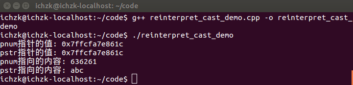

第6行定义了一个整型变量num，并初始化为0x00636261（十六进制表示），然后取num的地址用来初始化整型指针变量pnum。接着到了关键的地方，使用reinterpret_cast运算符把pnum从int*转变成char*类型并用于初始化pstr。

将pnum和pstr两个指针的值输出，对比发现，两个指针的值是完全相同的，这是因为**“reinterpret_cast 运算符并不会改变括号中运算对象的值，而是对该对象从位模式上进行重新解释”**。如何理解位模式上的重新解释呢？通过推敲代码11行和12行的输出内容，就可见一斑。

很显然，按照十六进制输出pnum指向的内容，得到636261；但是输出pstr指向的内容，为什么会得到”abc”呢？

在回答这个问题之前，先套用《深度探索C++对象模型》中的一段话，“一个指向字符串的指针是如何地与一个指向整数的指针或一个指向其他自定义类型对象的指针有所不同呢？从内存需求的观点来说，没有什么不同！它们三个都需要足够的内存（并且是相同大小的内存）来放置一个机器地址。指向不同类型之各指针间的差异，既不在其指针表示法不同，也不在其内容（代表一个地址）不同，而是在其所寻址出来的对象类型不同。也就是说，指针类型会教导编译器如何解释某个特定地址中的内存内容及其大小。”参考这段话和下面的内存示意图，答案已经呼之欲出了。

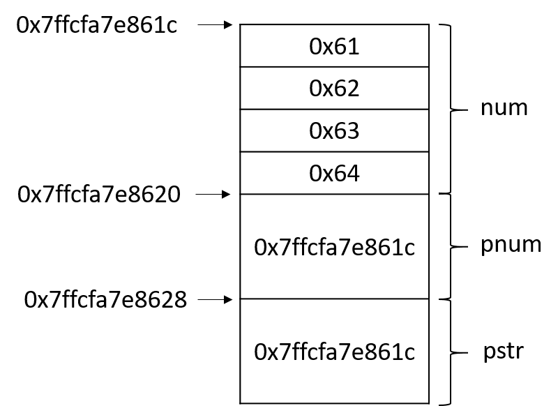

使用reinterpret_cast运算符把pnum从int*转变成char*类型并用于初始化pstr后，pstr也指向num的内存区域，但是由于pstr是char类型的，通过pstr读写num内存区域将不再按照整型变量的规则，而是按照char型变量规则。一个char型变量占用一个Byte，对pstr解引用得到的将是一个字符，也就是’a’。而在使用输出流输出pstr时，将输出pstr指向的内存区域的字符，那pstr指向的是一个的字符，那为什么输出三个字符呢？这是由于在输出char指针时，输出流会把它当做输出一个字符串来处理，直至遇到’\0’才表示字符串结束。对代码稍做改动，就会得到不一样的输出结果，例如将num的值改为0x63006261,输出的字符串就变为”ab”。

上面的例子融合了一些巧妙的设计，我们在pstr指向的内存区域中故意地设置了结束符’\0’。假如将num的值改为0x64636261，运行结果会是怎样的呢？

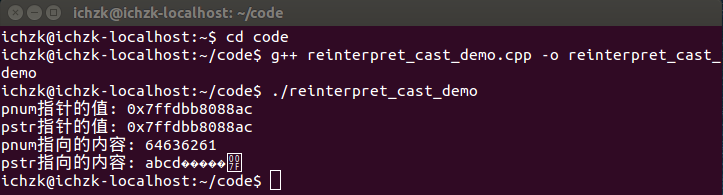

上面是我测试的截图，大家可以思考一下为什么在输出”abcd”之后又输出了6个字符才结束呢（提示：参考上面的内存示意图）？

但是在有些情况下，就不会这么幸运了，迎接我们的很可能是运行崩溃。例如我们直接将num（而不是pnum）转型为char*，再运行程序的截图如下

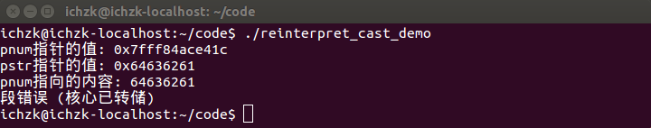

可以分析出，程序在输出pstr时崩溃了，这是为什么呢？pstr指向的内存区域的地址是0x64636261，而这片内存区域很有可能并不在操作系统为当前进程分配的虚拟内存空间中，从而导致段错误。

##### 2.reinterpret_cast转换

reinterpret_cast 用于进行各种不同类型的指针之间、不同类型的引用之间以及指针和能容纳指针的整数类型之间的转换。转换时，执行的是逐个比特复制的操作。

这种转换提供了很强的灵活性，但转换的安全性只能由程序员的细心来保证了。例如，程序员执意要把一个 int* 指针、函数指针或其他类型的指针转换成 string* 类型的指针也是可以的，至于以后用转换后的指针调用 string 类的成员函数引发错误，程序员也只能自行承担查找错误的烦琐工作：（C++ 标准不允许将函数指针转换成对象指针，但有些编译器，如 Visual Studio 2010，则支持这种转换）。

reinterpret_cast 用法示例如下：

```c++
#include <iostream>
using namespace std;
class A{
    public:   
    int i;    int j;   
        A(int n):i(n),j(n) { }
};
int main(){    
           A a(100);    
           int &r = reinterpret_cast<int&>(a); //强行让 r 引用 a   
           r = 200;  //把 a.i 变成了 200    
           cout << a.i << "," << a.j << endl;  // 输出 200,100    
           int n = 300;    A *pa = reinterpret_cast<A*> ( & n); //强行让 pa 指向 n    
           pa->i = 400;  // n 变成 400    
           pa->j = 500;  //此条语句不安全，很可能导致程序崩溃    
           cout << n << endl;  // 输出 400    
           long long la = 0x12345678abcdLL;    
           pa = reinterpret_cast<A*>(la); //la太长，只取低32位0x5678abcd拷贝给pa    
           unsigned int u = reinterpret_cast<unsigned int>(pa);//pa逐个比特拷贝到u    
           cout << hex << u << endl;  //输出 5678abcd    
           typedef void (* PF1) (int);    
           typedef int (* PF2) (int,char *);   
           PF1 pf1;  PF2 pf2;    
           pf2 = reinterpret_cast<PF2>(pf1); //两个不同类型的函数指针之间可以互相转换
          }
```

程序的输出结果是：

```c++
200, 100
400
5678abed
```

第 19 行的代码不安全，因为在编译器看来，pa->j 的存放位置就是 n 后面的 4 个字节。 本条语句会向这 4 个字节中写入 500。但这 4 个字节不知道是用来存放什么的，贸然向其中写入可能会导致程序错误甚至崩溃。

上面程序中的各种转换都没有实际意义，只是为了演示 reinteipret_cast 的用法而已。在编写黑客程序、病毒或反病毒程序时，也许会用到这样怪异的转换。

reinterpret_cast体现了 C++ 语言的设计思想：**用户可以做任何操作，但要为自己的行为负责。**

#### 3）const_cast

const_cast 运算符仅用于进行去除 const 属性的转换，它也是四个强制类型转换运算符中唯一能够去除 const 属性的运算符。

将 const 引用转换为同类型的非 const 引用，将 const 指针转换为同类型的非 const 指针时可以使用 const_cast 运算符。例如：

```c++
const string s = "Inception";
string& p = const_cast <string&> (s);
string* ps = const_cast <string*> (&s);  // &s 的类型是 const string*
```

#### 4）dynamic_cast

用 reinterpret_cast 可以将多态基类（包含虚函数的基类）的指针强制转换为派生类的指针，但是这种转换不检查安全性，即不检查转换后的指针是否确实指向一个派生类对象。dynamic_cast专门用于将多态基类的指针或引用强制转换为派生类的指针或引用，而且能够检查转换的安全性。对于不安全的指针转换，转换结果返回 NULL 指针。

dynamic_cast 是通过“运行时类型检查”来保证安全性的。dynamic_cast 不能用于将非多态基类的指针或引用强制转换为派生类的指针或引用——这种转换没法保证安全性，只好用 reinterpret_cast 来完成。

dynamic_cast 示例程序如下：

```c++
#include <iostream>
#include <string>
using namespace std;
class Base{  //有虚函数，因此是多态基类
    public:    
    virtual ~Base() {}
};
class Derived : public Base { };
int main(){    
    Base b;    
    Derived d;    
    Derived* pd;    
    pd = reinterpret_cast <Derived*> (&b);    
    if (pd == NULL)        
        //此处pd不会为 NULL。reinterpret_cast不检查安全性，总是进行转换        
        cout << "unsafe reinterpret_cast" << endl; //不会执行    
    pd = dynamic_cast <Derived*> (&b);   
    if (pd == NULL)  //结果会是NULL，因为 &b 不指向派生类对象，此转换不安全        
        cout << "unsafe dynamic_cast1" << endl;  //会执行   
    pd = dynamic_cast <Derived*> (&d);  //安全的转换    
    if (pd == NULL)  //此处 pd 不会为 NULL        
        cout << "unsafe dynamic_cast2" << endl;  //不会执行    
    return 0;
}
```

程序的输出结果是：

```c++
unsafe dynamic_cast1
```

第 20 行，通过判断 pd 的值是否为 NULL，就能知道第 19 行进行的转换是否是安全的。第 23 行同理。

如果上面的程序中出现了下面的语句：

```c++
Derived & r = dynamic_cast <Derived &> (b);
```

那该如何判断该转换是否安全呢？不存在空引用，因此不能通过返回值来判断转换是否安全。C++ 的解决办法是：dynamic_cast 在进行引用的强制转换时，如果发现转换不安全，就会拋出一个异常，通过处理异常，就能发现不安全的转换。


### (二) 基于 IP 的可扩展的面向服务的中间件 (SOME/IP)

#### 1）概述

SOME/IP 是一种汽车中间件解决方案，可用于控制消息。它从一开始就被设计为完美适应不同尺寸和不同操作系统的设备。这包括小型设备，如相机、AUTOSAR 设备，以及最高主机或远程信息处理设备。还确保 SOME/IP 支持信息娱乐域以及车辆中其他域的功能，允许 SOME/IP 用于 MOST 替换场景以及更传统的 CAN 场景。

虽然 IT 解决方案通常只支持单个中间件功能（例如 RPC 或发布/订阅），但 SOME/IP 支持广泛的中间件功能：

- **序列化**——在线表示的转换和转换。
- **远程过程调用 (RPC) 和消息传递**——实现函数和其他消息的远程调用。
- **服务发现 (SD)** – 动态查找和功能并配置其访问。
- **发布/订阅 (Pub/Sub)** – 动态配置需要哪些数据并将其发送给客户端。
- **UDP 消息分段**——允许通过**UDP**传输大型 SOME/IP 消息，而无需分段。

####  2）序列化

SOME/IP 序列化被设计为非常高效；即它使用最少的 RAM 和 CPU 资源。这是通过使用二进制和非描述性格式来实现的。基本上所有参数都写在彼此后面。消息的格式与消息的内存表示（打包结构）非常相似或在许多情况下完全相同。

SOME/IP 可以序列化以下基本数据类型（数据类型默认以网络字节顺序/大端编码，但也可以以小端编码）：

- **布尔值：**一个 8 位字段，编码 False (0) 或 True (1)。不允许使用所有其他值。
- **uint8：** 8 位大小的无符号整数。
- **uint16：** 16 位大小的无符号整数。
- **uint32：** 32 位大小的无符号整数。
- **uint64：** 64 位大小的无符号整数。
- **sint8：** 8 位大小的有符号整数。
- **sint16：** 16 位大小的有符号整数。
- **sint32：** 32 位大小的有符号整数。
- **sint64：** 64 位大小的有符号整数。
- **float32：** 32 位大小的浮点数。
- **float64：** 64 位大小的浮点数。

SOME/IP 可以序列化以下复杂数据类型：

- **struct：**组合了预定义参数列表的参数。一个结构可以从一个可选的长度字段开始，该字段计算长度字段之后结构的所有字节。
- **string：**固定长度或动态长度的字符串，用于传输 ascii、UTF-8 或 UTF-16 字符。对于动态长度字符串，该字符串以一个 big-endian 编码的长度字段开始，计算字符串字符使用的字节数。
- **数组：**包含相同参数类型的重复的参数。这可以是预定义数量或动态数量的参数。对于具有动态长度的数组，使用长度字段。
- **枚举：**具有命名不同值的选项的 uint。
- **位域：** 8、16 或 32 位参数，每一位代表一个布尔值。每个布尔值都可以有一个名称以及每个 True 和 False 值的名称。
- **union：**一个参数，可以携带一个预定义的参数类型的参数，在运行时确定。序列化使用长度字段、类型字段和参数的数据。

长度和类型字段的大小为 32 位（默认），可配置为 0、8、16 或 32 位。所有长度和类型字段都以网络字节顺序/大端编码。

#### 3）远程过程调用 (RPC) 和消息传递

某些/IP 服务支持以下消息：

- 请求/响应方法：从客户端发送到服务器的请求和从服务器发送回客户端的响应。此外，SOME/IP 允许将错误响应从服务器发送回客户端，而不是常规响应。此功能可用于在错误情况下实现不同的有效负载格式。
- Fire and Forget 方法：请求从客户端发送到服务器。
- 事件：事件从服务器发送到相关客户端。哪个客户端需要此事件将通过 SOME/IP-SD 确定。
- 字段：一个字段可以有一个选项通知器（循环发送或更改时发送的事件）、一个可选的设置器（更新字段的请求/响应方法）和一个可选的获取器（一个请求/响应方法来读取字段的当前值。）

#### 4）SOME/IP 序列化的专有扩展

SOME/IP 已经在消息序列化方面支持了很大的灵活性，比如稍后向消息或内部结构添加参数。

在后来的 AUTOSAR 版本中，专有扩展（最初被错误地称为 TLV 扩展）被添加到 SOME/IP 中，以支持更大的灵活性。基本上参数和/或结构成员可以以数据 ID 和长度指示作为前缀。虽然这会降低序列化的效率，但它增加了灵活性，例如从消息中删除参数或稍后重新排序参数。要使用此功能，API 和应用程序也需要支持此功能。

由于有限的灵活性和高开销，这个扩展目前没有被广泛使用。

请记住，并非所有 SOME/IP 实现都支持此扩展，因为它不是原始 SOME/IP 的一部分。

#### 5）AUTOSAR 支持

SOME/IP 是唯一已知的旨在集成到 AUTOSAR 4.x 版本中的中间件：

- **AUTOSAR 4.0** – 对已经存在的 SOME/IP 消息的基本支持。
- **AUTOSAR 4.1** – 添加了对 SOME/IP-SD 和发布/订阅的支持。
- **AUTOSAR 4.2** – 添加了转换器以进行序列化以及其他优化。
- **AUTOSAR 4.3** – 修复了一些转换器错误，添加了对带有 SOME/IP-TP 的大型 UDP 消息的支持以及 SOME/IP-SD 优化。

有关 AUTOSAR 规范，请参阅[出版物](http://www.some-ip.com/papers.shtml)。

#### 6）开源工具支持

由于 Wireshark 3.2 SOME/IP 支持是公开的！去[Wireshark](https://www.wireshark.org/)获取它。Wireshark 支持 SOME/IP、SOME/IP-SD、SOME/IP-TP 和可配置的 SOME/IP 有效载荷剖析。在接下来的版本中，添加了一些重要的改进，比如 TECMP 支持，如果你在打开的情况下进行捕获。

可以在[github](https://github.com/LarsVoelker/FibexConverter)上找到有效载荷剖析配置的生成器。

目前，Wireshark（3.6 版？）和配置生成器中添加了一些更令人兴奋的功能。敬请关注。 
